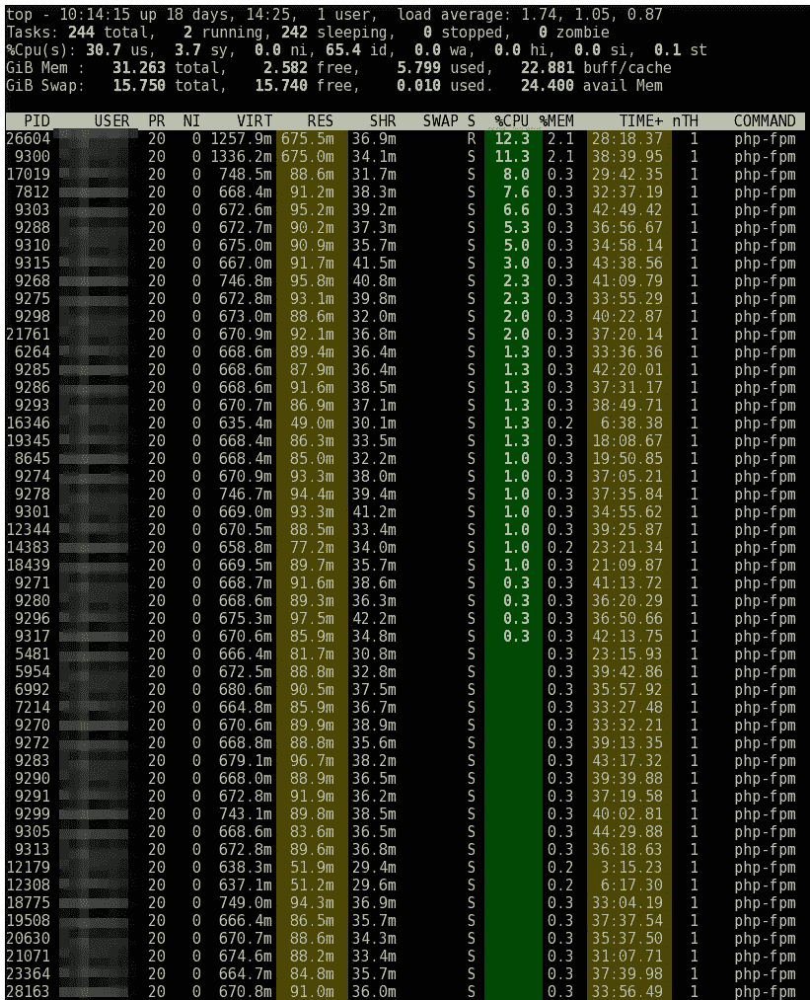
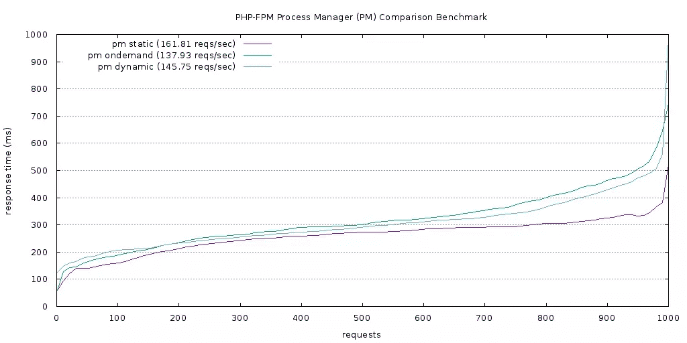

# PHP-FPM 调优:使用“pm static”获得最佳性能

> 原文：<https://www.sitepoint.com/php-fpm-tuning-using-pm-static-max-performance/>

本文未经编辑的版本最初发表在 [HaydenJames.io](https://haydenjames.io/php-fpm-tuning-using-pm-static-max-performance/) 网站，经作者允许在此重新发布。

**让我们快速看一下如何最好地设置 PHP-FPM，以获得高吞吐量、低延迟和更稳定的 CPU 和内存使用。默认情况下，大多数设置都将 PHP-FPM 的 PM(进程管理器)字符串设置为动态，如果您遇到可用内存问题，也可以使用`ondemand`。然而，让我们基于 php.net 的文档比较这两个管理选项，并比较我最喜欢的高流量设置——静态 pm:**

*   **pm =动态**:根据以下指令动态设置子进程的数量:`pm.max_children`、`pm.start_servers`、`pm.min_spare_servers`、`pm.max_spare_servers`。

*   **pm = ondemand** :流程在请求时按需生成，与动态相反，在动态情况下`pm.start_servers`在服务启动时启动。

*   **pm =静态**:子进程的数量由`pm.max_children`固定。

*详见全局`php-fpm.conf`指令的[完整列表](http://php.net/manual/en/install.fpm.configuration.php)。*

## PHP-FPM 进程管理器(PM)与 CPUFreq 调控器相似

现在，这可能看起来有点跑题，但是我希望把它联系到我们的 PHP-FPM 调优主题中。好吧，无论是笔记本电脑、虚拟机还是专用服务器，我们都曾遇到过 CPU 速度缓慢的问题。还记得 CPU 频率缩放吗？( [CPUFreq 调控器](https://www.kernel.org/doc/Documentation/cpu-freq/governors.txt))。)这些设置，在两个& ast 上都可用；nix 和 Windows，可以通过将 CPU 调控器设置从 *ondemand* 改为 *performance* 来提高性能和系统响应能力。这一次，让我们比较这些描述，寻找相似之处:

*   **Governor = ondemand** :根据当前负载动态调整 CPU 频率。跳到最高频率，然后随着空闲时间的增加而降低。

*   **调速器=保守**:根据当前负载动态调整频率。比按需更缓慢地调整频率。

*   **调速器=性能**:始终以最大频率运行 CPU。

*详见[CPUFreq 调速器选项的完整列表](https://www.kernel.org/doc/Documentation/cpu-freq/governors.txt)。*

注意到相似之处了吗？我想首先使用这个比较，目的是找到写一篇推荐使用 PHP-FPM 的 pm static 作为首选的文章的最佳方式。

使用 CPU governor，性能设置是一个非常安全的性能提升，因为它几乎完全取决于服务器 CPU 的限制。唯一的其他因素将是诸如热量，电池寿命(笔记本电脑)和其他的副作用时钟你的 CPU 频率为 100%永久。一旦设置为性能，它确实是你的 CPU 最快的设置。例如，阅读 Raspberry Pi 上的[‘force _ turbo’](https://haydenjames.io/raspberry-pi-3-overclock/)设置，它强制您的 RPi 板使用性能调控器，由于 CPU 时钟速度较低，性能改善更明显。

## 使用“pm static”实现服务器的最高性能

PHP-FPM pm 静态设置很大程度上取决于你的服务器有多少空闲内存。基本上，如果服务器内存不足，那么 pm ondemand 或 dynamic 可能是更好的选择。另一方面，如果您有可用的内存，您可以通过将 pm static 设置为服务器的最大容量来避免 PHP 进程管理器(PM)的大部分开销。换句话说，当您计算时，`pm.static`应该被设置为在不产生内存可用性或缓存压力问题的情况下可以运行的 PHP-FPM 进程的最大数量。此外，不要高到让 CPU 不堪重负，有一堆 PHP-FPM 操作等待处理。



在上面的截图中，该服务器有`pm = static`和`pm.max_children = 100`，它们使用了安装的 32GB 中的大约 10GB。请注意不言自明的突出显示的列。在那张截图中，谷歌分析有大约 200 名“活跃用户”(过去 60 秒)。在这个水平上，大约 70%的 PHP-FPM 儿童仍然无所事事。这意味着无论当前流量如何，PHP-FPM 总是被设置为服务器资源的最大容量。空闲进程保持在线，等待流量峰值并立即响应，而不是等待 pm 产生子进程，然后在`x pm.process_idle_timeout`到期后杀死它们。我将`pm.max_requests`设置得非常高，因为这是一个没有 PHP 内存泄漏的生产服务器。如果你对当前和未来的 PHP 脚本有 110%的信心，你可以将`pm.max_requests = 0`和`static`结合使用。然而，建议随着时间的推移重新启动脚本。将请求数量设置为一个较大的数字，因为这样做是为了避免 pm 开销。例如，至少有`pm.max_requests = 1000`取决于你的`pm.max_children`数和每秒请求数。

截图使用了由“u”(用户)选项过滤的 [Linux top](https://haydenjames.io/linux-top-customize-it/) 和 PHP-FPM 用户名。显示的进程数量只有“前”50 个左右(没有计算在内)，但基本上 top 显示了适合您的终端窗口的顶级统计信息——在本例中，按%CPU 排序。要查看所有 100 个 PHP-FPM 进程，您可以使用如下代码:

```
top -bn1 | grep php-fpm 
```

## 何时使用按需预防性维护和动态预防性维护

使用`pm dynamic`,您可能会注意到类似以下的错误:

```
WARNING: [pool xxxx] seems busy (you may need to increase pm.start_servers, or pm.min/max_spare_servers), spawning 32 children, there are 4 idle, and 59 total children 
```

你可以尝试增加/调整设置，但仍然会看到有人[在这篇服务器故障帖子](https://serverfault.com/questions/773216/php-error-pool-www-seems-busy-you-may-need-to-increase-pm-start-servers-or-p)中描述的错误。在这种情况下，`pm.min`太低了，因为 web 流量会随着下降和上升而大幅波动，使用`pm dynamic`可能很难正确调整。常见的[建议是使用按需预防性维护](https://serverfault.com/questions/773216/php-error-pool-www-seems-busy-you-may-need-to-increase-pm-start-servers-or-p)。然而，这甚至更糟，因为 ondemand 会在流量很少或没有流量时将空闲进程关闭到 0，然后您会遇到与流量波动一样多的开销问题——当然，除非您将空闲超时设置得非常高……在这种情况下，您应该只使用`pm.static` +高`pm.max_requests`。

然而，当你有多个 PHP-FPM 池时，PM dynamic 尤其是 ondemand 可以拯救你。例如，在不同的池下托管多个 cPanel 帐户或多个网站。例如，我有一个服务器，有 100 多个 cPanel 帐户和大约 200 多个域，pm.static 甚至 dynamic 都不可能运行良好。只有 ondemand 表现良好，因为超过三分之二的网站几乎没有流量。随着 ondemand，这意味着所有的孩子将被关闭节省服务器内存吨！谢天谢地，cPanel devs 解决了这个问题，现在它默认为 ondemand。以前动态默认使得 PHP-FPM 在繁忙的共享服务器上不可用。许多人会使用 suPHP，因为即使在空闲的 cPanel PHP-FPM 池/帐户上，pm 动态也会消耗内存。很有可能，如果你有很好的流量，你不会被托管在一个有很多 PHP-FPM 池的服务器上(共享托管)。

## 结论

说到 PHP-FPM，一旦你开始服务于严重的流量，PHP-FPM 的按需和动态进程管理器会因为固有的开销而限制吞吐量。了解您的系统，设置您的 PHP-FPM 进程以匹配您的服务器的最大容量。从基于 pm dynamic 或 ondemand 的最大使用量设置的`pm.max_children`开始，然后增加到内存和 CPU 能够处理而不会不堪重负的程度。您将会注意到，使用 pm static，因为您将所有内容都保存在内存中，所以随着时间的推移，流量峰值对 CPU 的影响会更小，并且您的服务器负载和 CPU 平均值会更平稳。PHP-FPM 进程的平均大小会因需要手动调整的 web 服务器而异，这就是为什么更自动化的开销进程管理器——动态的和按需的——更受欢迎的原因。希望这是一篇有用的文章。

***更新:**新增 A/B 基准对比图。让 PHP-FPM 进程驻留在内存中有助于提高性能，但代价是让它们处于等待状态会增加内存使用量。找到你的设置最佳点。*



## 分享这篇文章