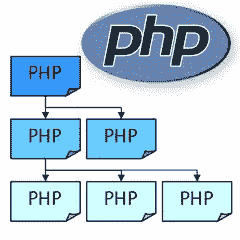

# 如何使用 PHP 名称空间，第 2 部分:导入、别名和名称解析

> 原文：<https://www.sitepoint.com/php-namespaces-import-alias-resolution/>

在[第 1 部分](https://www.sitepoint.com/php-53-namespaces-basics)中，我们讨论了 PHP 名称空间为什么有用以及`namespace`关键字。在本文中，我们研究了`use`命令和 PHP 解析名称空间名称的方式。

出于这个例子的目的，我们将定义两个几乎相同的代码块；唯一的区别是它们的名称空间:

**lib1.php:**

```
 <?php
// application library 1
namespace App\Lib1;

const MYCONST = 'App\Lib1\MYCONST';

function MyFunction() {
	return __FUNCTION__;
}

class MyClass {
	static function WhoAmI() {
		return __METHOD__;
	}
}
?> 
```

**lib2.php:**

```
 <?php
// application library 2
namespace App\Lib2;

const MYCONST = 'App\Lib2\MYCONST';

function MyFunction() {
	return __FUNCTION__;
}

class MyClass {
	static function WhoAmI() {
		return __METHOD__;
	}
}
?> 
```

在我们开始之前，有一些 PHP 术语需要理解…

**全限定名**
任何 PHP 代码都可以引用全限定名——以名称空间反斜杠分隔符开头的标识符，例如 AppLib1MYCONST、AppLib2MyFunction()等。

完全限定名没有歧义。初始反斜杠的操作方式类似于文件路径；它象征着*‘根’*全球空间。如果我们在全局空间中实现了不同的 MyFunction()，那么可以从 lib1.php 或 lib2.php 使用`MyFunction()`调用它。

完全限定名对于一次性函数调用或对象初始化非常有用。然而，当你打很多电话时，它们可能变得不切实际。正如我们将在下面发现的，PHP 提供了其他选项来避免名称空间输入的混乱。

**限定名**
至少有一个名称空间分隔符的标识符，如 Lib1MyFunction()。

**非限定名**
没有名称空间分隔符的标识符，例如 MyFunction()。

## 在相同的名称空间中工作

考虑以下代码:

**myapp1.php:**

```
 <?php
namespace App\Lib1;

require_once('lib1.php');
require_once('lib2.php');

header('Content-type: text/plain');
echo MYCONST . "\n";
echo MyFunction() . "\n";
echo MyClass::WhoAmI() . "\n";
?> 
```

虽然我们包括了 lib1.php 的**和 lib2.php 的**的**，但是标识符 MYCONST、MyFunction 和 MyClass 将只引用 lib1.php 的**中的代码。这是因为**myapp1.php**代码在同一个 AppLib1 名称空间中:****

*结果:*

```
 App\Lib1\MYCONST
App\Lib1\MyFunction
App\Lib1\MyClass::WhoAmI 
```

## 命名空间导入

名称空间可以用`use`操作符导入，例如

**myapp2.php:**

```
 <?php
use App\Lib2;

require_once('lib1.php');
require_once('lib2.php');

header('Content-type: text/plain');
echo Lib2\MYCONST . "\n";
echo Lib2\MyFunction() . "\n";
echo Lib2\MyClass::WhoAmI() . "\n";
?> 
```

可以定义任意数量的`use`语句，也可以用逗号分隔各个名称空间。在本例中，我们导入了 AppLib2 命名空间。我们仍然不能直接引用 MYCONST、MyFunction 或 MyClass，因为我们的代码在全局空间中，PHP 将在那里寻找它们。但是，如果我们加上前缀‘lib 2’，它们就成了限定名；PHP 将搜索导入的名称空间，直到找到匹配的为止。

*结果:*

```
 App\Lib1\MYCONST
App\Lib2\MyFunction
App\Lib2\MyClass::WhoAmI 
```

## 命名空间别名

名称空间别名可能是最有用的构造。别名允许我们使用较短的名称来引用长名称空间。

**myapp3.php:**

```
 <?php
use App\Lib1 as L;
use App\Lib2\MyClass as Obj;

header('Content-type: text/plain');
require_once('lib1.php');
require_once('lib2.php');

echo L\MYCONST . "\n";
echo L\MyFunction() . "\n";
echo L\MyClass::WhoAmI() . "\n";
echo Obj::WhoAmI() . "\n";
?> 
```

第一个`use`语句将 AppLib1 定义为‘L’。任何使用“L”的限定名在编译时都将被翻译成“AppLib1”。因此，我们可以引用 LMYCONST 和 LMyFunction，而不是完全限定名。

第二个`use`语句更有意思。它将‘Obj’定义为 AppLib2 名称空间中的**类**‘my class’的别名。这仅适用于类，不适用于常量或函数。我们现在可以使用`new Obj()`或运行静态方法，如上所示。

*结果:*

```
 App\Lib1\MYCONST
App\Lib1\MyFunction
App\Lib1\MyClass::WhoAmI
App\Lib2\MyClass::WhoAmI 
```

## PHP 名称解析规则

PHP 标识符名称使用以下命名空间规则进行解析。更多信息请参考 [PHP 手册](http://www.php.net/manual/pl/language.namespaces.rules.php)。

1.对全限定函数、类或常数的调用在编译时被解析。

2.根据导入规则翻译非限定名和限定名，例如，如果名称空间 ABC 被导入为 C，则对`CDe()`的调用被翻译为`ABCDe()`。

3.在名称空间内，所有尚未根据导入规则翻译的限定名称都将当前名称空间放在前面，例如，如果在名称空间 AB 内执行对`CDe()`的调用，它将被翻译为`ABCDe()`。

4.不符合条件的类名根据当前的导入规则进行翻译，用全名替换导入的短名，例如，如果命名空间 AB 中的 C 类被导入为 X，`new X()`被翻译为`new ABC()`。

5.命名空间内的非限定函数调用在运行时被解析。例如，如果在名称空间 AB 内调用 MyFunction()，PHP 首先查找函数 ABMyFunction()。如果没有找到，它将在全局空间中查找 MyFunction()。

6.对非限定类名或限定类名的调用在运行时被解析。例如，如果我们在名称空间 AB 中调用`new C()`，PHP 将寻找 ABC 类。如果没有找到，它将尝试自动加载 ABC。

另请参见:

*   [如何使用 PHP 名称空间，第 1 部分:基础知识](https://www.sitepoint.com/php-53-namespaces-basics)
*   [如何使用 PHP 名称空间，第 3 部分:关键字和自动加载](https://www.sitepoint.com/how-to-use-php-namespaces-part-3-keywords-and-autoloading/)
*   [如何在 Windows 上安装 PHP 5.3](https://www.sitepoint.com/install-php53-windows/)

在明天的最后一篇文章中，我们将介绍自动加载和其他高级选项。

## 分享这篇文章