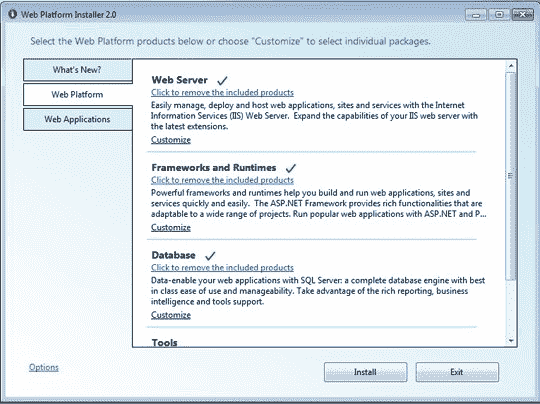
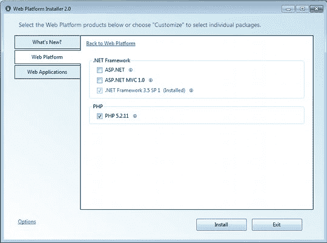
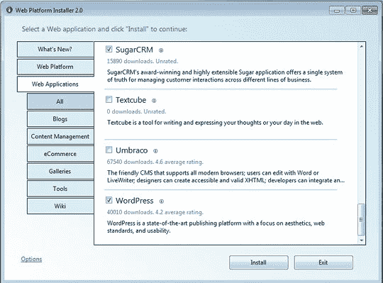
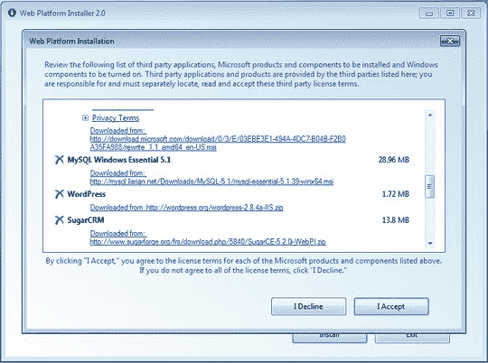
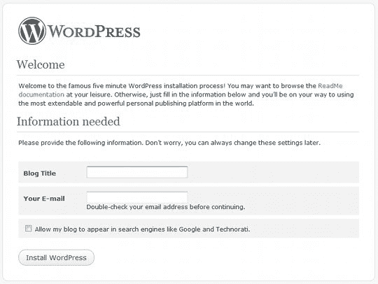

# 在 Windows 上安装 PHP 的简单方法

> 原文：<https://www.sitepoint.com/php-windows-web-platform-installer-2/>

今年早些时候，微软发布了一款名为[网络平台安装程序](https://www.sitepoint.com/blog/) (Web PI)的小软件，这是一种在你的 Windows 电脑上安装一整套网络软件的非常简单的方法。它提供了带有大量扩展的 IIS、SQL Server、ASP.NET、PHP 以及各种免费的 web 应用程序和工具。包含 PHP 可能会让一些人感到惊讶，但微软一直在努力提高 IIS 下的 PHP 性能，全新的 Windows 缓存扩展是该工具可用安装的软件之一。在此基础上，安装程序的 Web 应用程序部分也包含了许多高质量的开源 PHP 应用程序，包括 Drupal、WordPress 和 SugarCRM。

Web Platform Installer 是一种很好的方式来设置基于 Windows 的开发平台，或者为您的小型企业快速启动博客或 CMS。

为了向您展示它使用起来有多简单，并让您了解有哪些可用的软件，我将从头开始介绍带有 Web PI 的 PHP 的安装，以及一些关键的 PHP 应用程序。我还会指出一些您可以尝试的好东西和扩展。

你可能会问自己为什么我们需要这个软件的安装工具。毕竟，反正在网上是免费的，对吧？没错，但是这可能是一个很麻烦的事情，要追踪所有的包，下载每个单独的包，安装所有的包，并配置它们使它们能够很好地一起运行。Web 平台安装程序是为您完成所有工作的好方法。我们很快就会看到，它甚至会为您的应用程序创建数据库和编写配置文件。

一旦你完成了跟随，你可以用我们的[文章测验](https://www.sitepoint.com/quiz/microsoft/php-windows-web-platform-installer)来测试自己，该测验由微软赞助。

## 下载和安装

第一步是[下载网络平台安装程序](https://www.sitepoint.com/blog/)，它只有 2MB 大小，因为它只是下载和安装各种其他软件组件的前端。

出于本教程的目的，我们使用 Windows 7 RC1，但安装过程应该是相同的 Vista。如果您使用的是 IIS 6.0 而不是 7.0 的旧版本 Windows，某些屏幕可能会略有不同，但总体过程应该是相同的。

让我们运行安装程序。

**图一。网络平台安装程序**

请注意，在安装程序屏幕的左侧有三个选项卡，当您第一次运行安装程序时，默认情况下会选择 Web 平台。当你在初始安装后再次运行它，有什么新鲜事？将被选中，突出显示已安装软件的可用更新或新提供的应用程序或组件。如果点击左下方的选项链接，可以添加两个非默认的标签页:媒体平台和开发者工具。这些部分的内容超出了本文的范围，但是可以看看里面有什么(可能感兴趣的是包含在开发者工具部分中的 Expression Web 3 的试用版)。

在 Web 平台部分中有许多子部分: Web 服务器、框架和运行时、数据库和工具。每个小节都有一个安装推荐默认值的快速链接，以及一个自定义将要安装的单个组件的链接。缺省值是相当合理的，但是由于我们刚刚开始熟悉这个平台，所以让我们仔细看看有什么可用的。例如，我们将检查框架和运行时部分包含了什么。

**图二。框架和运行时**

为了这个演练的目的，我们将把重点放在 PHP 和基于 PHP 的应用程序上，所以我将从这一节中获取 PHP，从其他节中获取推荐的默认值。

说到应用程序，是时候进入有趣的部分了:Web 应用程序标签。

**图 3。网络应用**

该选项卡中包含的应用程序按功能分组(博客、内容管理、图库等)，您会发现有很多可用的应用程序。在本教程中，我将介绍一些更流行的基于 PHP 的应用程序:Drupal、WordPress 和 SugarCRM Community Edition。

安装程序中包含的 Drupal 版本是 Acquia Drupal。Acquia 是一家提供商业 Drupal 支持的公司，但他们也推出了一个 Drupal 版本，其中打包了一些更广泛使用的贡献模块(即由 Drupal 社区贡献的模块)。如果您试图快速设置您的站点，并希望避免从 Drupal 站点单独下载所有这些模块，这是非常好的。

当你点击安装时，你会看到一个屏幕，显示将要安装的所有东西。正如我已经提到的，没有必要担心依赖性。如果安装程序检测到您的选择中缺少一个必要的组件，它会为您抓取它。例如，这个惊喜:如果您正在安装一个需要 MySQL 的应用程序(如 Drupal 或 WordPress)，安装程序会自动下载并安装 MySQL。

**图 4。安装确认**

此屏幕还让您有机会查看所有软件组件的许可条款。假设你已经这样做了，让我们点击我接受，看看会发生什么。

如果您正在安装 MySQL(除非已经安装了，否则应该是这种情况)，安装程序将提示您输入 root 用户的密码。如果已经安装了 MySQL，您将需要输入您的密码以允许 Web PI 为您创建应用程序的数据库。

然后，它将开始下载和安装您选择的所有组件和应用程序。各种组件安装程序也可能要求你重启你的机器，所以继续这样做；当 Windows 开始备份时，安装程序将从它停止的地方开始。

下载和安装完成后，会提示您为每个应用程序创建数据库和数据库用户(以及一些 WordPress 的加密密钥短语)。这是一个非常好的方法:不需要手动更新数据库和编辑配置文件，您只需填写一些表单字段，一切都会自动完成。

完成后，点击进入下一个屏幕，您将看到所有已安装内容的摘要。在每个应用程序下都有一个启动链接，它将打开你默认的网络浏览器到应用程序的安装页面(对于 WordPress 或 SugarCRM 是`index.php`，对于 Drupal 是`install.php`)。如果一切顺利，您的应用程序应该已经启动并运行了！让我们启动 WordPress。

**图 5。WordPress 安装页面**

如果您看到此屏幕，这意味着:

*   IIS 正在运行

*   PHP 通过 FastCGI 运行(如果你安装了 Windows 缓存扩展，它会加速运行)

*   您的 MySQL 数据库服务器是活动的，PHP 可以连接到它

*   你的 WordPress 数据库和用户已经创建

*   你的 WordPress 配置文件已经用适当的设置编辑过了

我们省去了相当多的工作要自己做！Drupal 和 SugarCRM 的过程基本相同，所以我将把安装和启动这些应用的任务留给您。

你有它！这就是使用 Web 平台安装程序安装和运行基于 PHP 的应用程序所需要知道的全部内容。让我们更仔细地快速浏览每个组件，向您展示如何管理它。

## 分享这篇文章