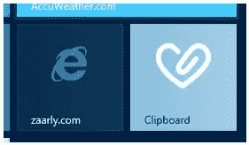
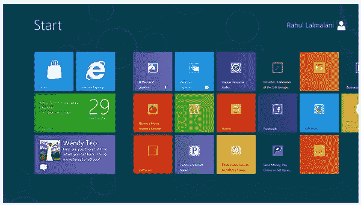
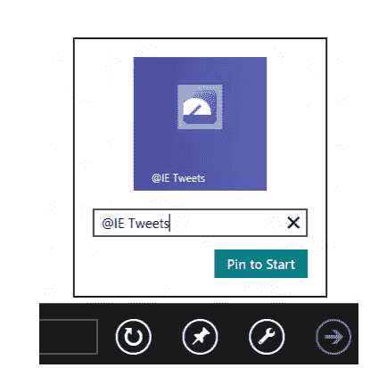
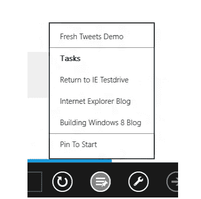

# Windows 8 中的固定站点

> 原文：<https://www.sitepoint.com/pinned-sites-in-windows-8/>

Windows 8 开始屏幕是查找和连接所有您喜爱的应用程序和内容的最佳位置。应用程序磁贴充满活力，向您展示新鲜和定制的内容，让您了解您的世界中有哪些新内容。我们已经写了关于 Windows 8 上 Internet Explorer 10 浏览体验的文章。

这篇文章向您展示了如何将您的网站徽标放在 Windows 8 开始屏幕上的应用程序旁边，并配有以网站为中心的视觉效果和徽章通知，让您知道有新内容。我还将介绍您需要的几行代码，让您的网站从看起来像左边的磁贴…变成右边的磁贴:

## 固定网站–不仅仅是收藏夹

Windows 上的消费者大部分时间都在网上度过，我们从 Windows opt-in telemetry(官方称为[微软客户体验改善计划](http://www.microsoft.com/products/ceip/EN-US/default.mspx))中得知，他们会一次又一次地回到同一个网站。Windows 8 上的固定站点使您能够快速轻松地立即访问您的站点。有了徽章通知，网站磁贴会显示最新信息，并帮助您了解何时有新内容。

开发人员可以利用固定站点更好地将他们的站点与他们的用户联系起来，并直接在 Windows 开始屏幕中推广他们站点的品牌。我们发现，在 Windows 7 上使用 IE9 这一功能的网站在网站访问量方面有 15%到 50%的增长。在 Windows 8 中，即使你没有在浏览器中打开网站，用户也可以通过网站磁贴更新获得更好的体验。

以下两个屏幕截图展示了固定的站点标题和徽章通知。

## 固定网站磁贴上以网站为中心的视觉效果

作为一名 Web 开发人员，您可以提供一个站点图标( [favicon](http://en.wikipedia.org/wiki/Favicon) )，IE10 可以在浏览器中、地址栏、新标签页和开始屏幕上使用它来表示站点。IE10 使用大站点图标(32 x 32 像素)来标识站点，就像 IE9 使用它来标识任务栏一样。

IE10 从图标中提取主色，并自动将其用作开始屏幕磁贴的背景色。

一个创建图标的工具是 [x 图标编辑器](http://www.xiconeditor.com/Default.aspx)。使用它为你的站点创建 32×32 的图标。它还可以将图像转换为图标文件格式(`.ico`)。然后使用传统的 favicon 标记关联`.ico`:

`<link href="testdrive.ico" rel="shortcut icon" />`

## 在后台更新的徽章通知

Windows 8 可以轮询开始屏幕上固定磁贴的更新。这适用于轻量级通知，例如来自其他用户的新消息(电子邮件和社交网络)、购物网站上的新折扣、新闻订阅源上的新文章等。

借助 Internet Explorer 10 和 Windows 8，您可以直接在您的固定站点磁贴上提供徽章通知。这意味着用户无需在浏览器中打开网站就可以获得网站更新。举个例子，在 Windows 8 消费者预览版上用 IE10 钉上[新鲜推文演示](http://ietestdrive2.com/pinnedsites/)。固定的站点磁贴会定期更新，并在有新的 tweets 可用时通知用户。

后台通知需要站点提供的组件。它们是:(1)徽章通知 XML，一种描述 Windows 徽章通知的 XML 响应，以及(2)固定站点元标记，即指向 Windows 应该轮询通知的位置和轮询频率的网页标记。

### 徽章通知 XML

Windows 处理徽章通知的轮询和绘制。Windows 轮询描述固定站点磁贴视觉效果的标记通知 XML。 [badge XML 模式](http://msdn.microsoft.com/en-us/library/windows/apps/br212849.aspx)定义了这个简单的 XML 响应。例如，要用数字“3”更新单幅图块，可以发送以下 XML:

`<?xml version="1.0" encoding="utf-8" ?>`

<badge value="”3″/"></badge>

徽章可以是数字或符号，如“提醒”和“新邮件”指示器。如需徽章可显示内容的完整列表，请参见 MSDN 上的[选择徽章图像](http://msdn.microsoft.com/en-us/library/windows/apps/hh761458.aspx)。

### 固定的站点元标签

下一步是将徽章通知 XML 与网页相关联。IE10 使用 meta 标签“[应用名称](http://msdn.microsoft.com/en-us/library/ie/gg491732%28v=vs.85%29.aspx#application-name)”来确定网页是否支持固定站点功能，如通知和跳转列表。要支持徽章通知，请在您的标记中包含一个新的元标记，其中包含徽章通知 XML 的 URL 以及 Windows 请求它的频率。IE 会检查“msApplication-badge”元标签在锁定时是否出现在页面上，以及在随后从锁定的站点磁贴启动站点时是否出现。

`<meta name="msapplication-badge" value="frequency=360;polling-uri=http://ietestdrive2.com/PinnedSites/TweetCounter/microsoft/360" />` 

value 参数有两部分:`polling-uri`(必选)和`frequency`(可选)。

`polling-uri`是 Windows 向上面定义的简单 XML 文档请求的绝对 URI。

`frequency`是可选的更新间隔分钟数，必须是下列值之一:

*   30 (Windows 将每 30 分钟轮询一次 URI)
*   60 (1 小时)
*   360 (6 小时)
*   720 (12 小时)
*   1440 (1 天。这是默认值。)

如果省略了`frequency`或其值不是上面列出的值，则默认为每日更新(1440 分钟)。

### 用于更新徽章通知的开发人员 API

您还可以直接从网页中清除和刷新站点磁贴标记，以确保站点磁贴是最新的。

当用户通过开始屏幕启动钉住的站点磁贴时，Web 站点在它自己的名为 SiteMode 的会话中运行，并且可以使用下面的 JavaScript 函数来更新徽章。

`window.external.msSiteModeClearBadge()`清除互动程序上的徽章通知。在[的新鲜推文演示](http://ietestdrive2.com/pinnedsites/)中，当用户收到通知并点击磁贴启动浏览器时，网页使用`msSiteModeClearBadge()`从磁贴中清除通知。下一次磁贴显示徽章更新时，用户就知道有新内容了。

使用轮询 URI 调用 Windows 更新站点上的徽章。例如，用户看到一个显示三条未读消息的钉住的站点磁贴，并点击磁贴返回站点。如果他或她只阅读第一次更新，您可以触发更新，以便徽章反映正确的已读/未读计数为 2。

在 Windows 8 消费者预览版中，这两个 API 仅在本地 intranet 或可信站点区域中运行的站点上起作用。这将在下一个预览版中修复。要在您自己的站点上的消费者预览中测试这些 API，请使用 Internet 属性对话框的安全选项卡将其域添加到可信站点列表中。

### 桌面任务栏通知

对于桌面任务栏上固定的站点，显示为[图标覆盖](http://msdn.microsoft.com/en-us/library/ie/gg491744%28v=vs.85%29.aspx)的通知将继续适用于桌面上的 Windows 8 和 IE10。这种通知形式在 Windows 8 开始屏幕的固定站点上不可用。Windows 8 处理开始屏幕上所有磁贴的通知，并以一种电池高效的方式这样做。

## 跳转列表可在网站内快速导航

许多顶级网站，如 NYTimes.com、CNN.com 和 Amazon.com，都支持 IE9 钉住网站功能，如[跳转列表](http://windows.microsoft.com/en-US/internet-explorer/products/ie-9/features/pinned-sites)以访问特定任务或网站的一部分。在 IE10 中，跳转列表可以作为导航栏的一部分，以一种触摸友好的方式浏览网站。

当用户从开始屏幕启动网站时，大头针按钮显示该网站有可用的跳转列表:

显示新推文演示跳转列表的屏幕截图

显示的跳转列表与 IE9 在 Windows 7 任务栏上的显示相同。你可以通过页面标记([了解更多](http://msdn.microsoft.com/en-us/library/gg491725%28v=vs.85%29.aspx))或者基于用户交互的动态方式([了解更多](http://msdn.microsoft.com/en-us/library/gg491724%28v=vs.85%29.aspx))将静态任务添加到站点的跳转列表中。Windows 8 中的徽章和跳转列表是一个以站点为中心的功能。每个完全限定的域名可以有且只有一组轮询数据和跳转列表数据。

## 结论

Internet Explorer 10 通过与 Windows 8 开始屏幕的集成，将网站置于体验的中心。Web 开发人员可以为钉住的站点磁贴创建以站点为中心的视觉效果，在站点有新的更新时进行共享，并提供跳转列表来快速浏览站点。

我们期待您将这些简单的功能添加到您的网站中，以最大限度地发挥它们在 Windows 8 中的影响。

## 分享这篇文章