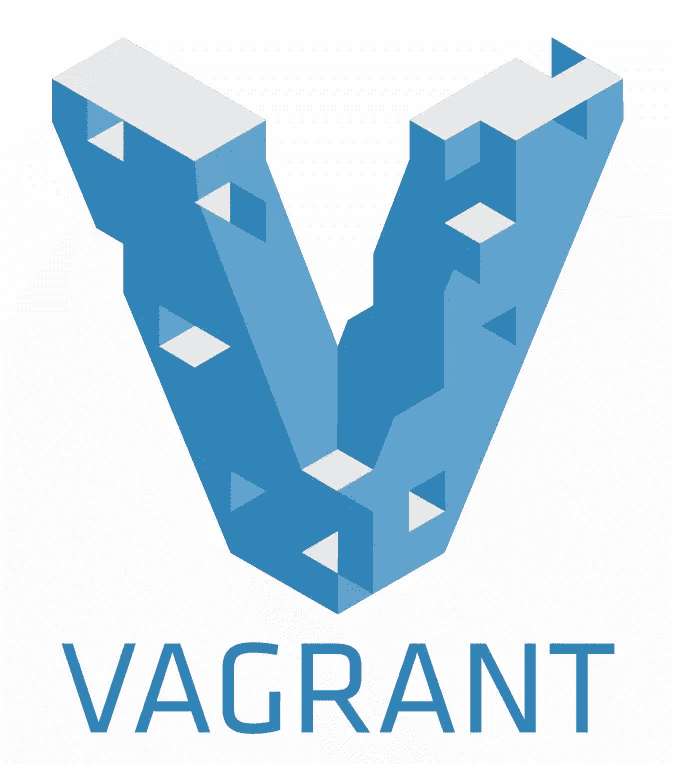
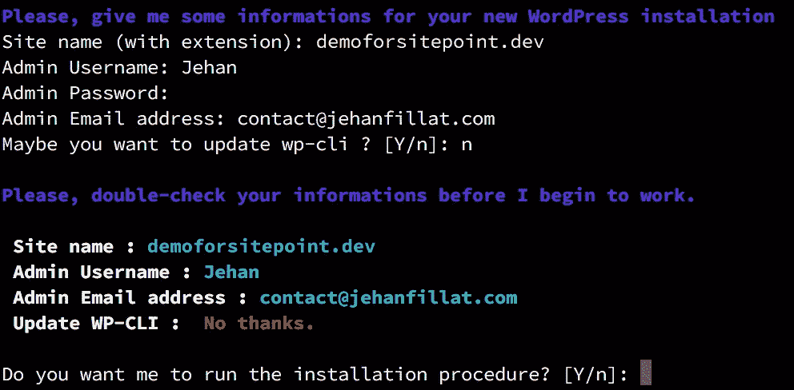

# 请:自动 CMS 和框架安装在流浪者

> 原文：<https://www.sitepoint.com/please-automated-cms-and-framework-installs-in-vagrant/>



如果你是一名 web 开发人员，可能你最无聊和重复的任务之一就是为每个新项目配置基本设置。配置你的`my-project.dev`域，创建数据库，安装 WordPress(或任何其他 CMS/框架):你已经知道怎么做了。如果你能自动化这一切会怎么样？

实际上，你可以。

[Please](https://github.com/jehanf/please) 是一个简单的 bash 脚本，它通过将许多 CMS 和框架自动配置到您的[vagger](https://www.vagrantup.com/)框中，将开发域名添加到您的主机文件中，甚至在需要时添加到数据库中，来帮助自动安装它们。

让我们来看看。

## 重要通知

由于 *Please* 仍处于测试版(0.3)，我建议您不要立即在您的产品中使用它，而是先进行测试——以确保一切按您的要求运行。没有丢失数据等风险——可能发生的最糟糕的事情是它不起作用——但安全总是好的。

## 先决条件

所以，首先，你需要设置一个流浪箱。

如果你是流浪者的新手，我建议你阅读这篇[不错的介绍](https://www.sitepoint.com/re-introducing-vagrant-right-way-start-php/)来了解整个事情，并以正确的方式开始。

这个项目已经创建了一个小小的流浪盒子( [box.scotch.io](https://box.scotch.io) 的一个分支)，命名为 [Please Box](https://github.com/jehanf/please-box) 。

以下是通过命令行进行安装的所有步骤:

```
git clone https://github.com/jehanf/please-box.git please-box
cd please-box
vagrant up 
```

*Please* 还需要[流浪主机更新](https://github.com/cogitatio/vagrant-hostsupdater)插件才能让一切正常工作。安装相当简单；下面是为您节省一些时间的命令:

```
vagrant plugin install vagrant-hostsupdater 
```

就这样，您已经准备好开始使用 *Please* ！

## 请安装

安装 *Please* 所需的步骤非常少，如官方文档中所写:

```
git clone  https://github.com/jehanf/please.git
sudo chmod +x please/please
sudo mv please/please /usr/local/bin/please && sudo rm -R please 
```

`&& sudo rm -R please`部分只是为了保持你的电脑干净；由于`git clone`部分克隆了 repo 的整个文件夹，包括 README 文件，您可能不希望将它们保存在您的计算机上。

## 使用

创建新项目的基本命令是:

```
please create 
```

您也可以键入文档中所写的`please create <name of cms/framework>`。

`please create`将触发一个选择屏幕，如下图所示:


如您所见，目前唯一可用的选项是:

*   一个简单的自定义开发域(+可选的数据库)
*   WordPress
*   symphony
*   Angular2
*   拉勒韦尔
*   页面套件
*   反应堆。

让我们看一个简单的项目创建的例子。我选择了 WordPress，因为它是最常用/最完整的。

### 创建您的项目环境

*请*将询问几个问题来设置您的新环境，然后要求您进行简单的确认，如下所示:



因为 *Please* 使用 [WP-CLI](http://wp-cli.org) 来执行安装，所以您可以选择在安装开始之前更新它。而如果没有安装(在你的流浪汉上)，就会自动安装(即使你说没有)，因为需要。

你现在所需要做的就是键入`Y`或者简单地按下回车键，然后去喝杯咖啡。

同时， *Please* 现在将执行以下操作:

*   创建一个文件夹(根据您之前定义的站点名称命名，此处为`demoforsitepoint.dev`)
*   在你的机器上设置一个虚拟主机(同文件夹:`demoforsitepoint.dev`！)
*   下载 WordPress 的最新版本
*   创建你的 WP 数据库(也叫做`demoforsitepoint.dev`)
*   生成`wp-config.php`并安装 WordPress
*   重启你的流浪盒。

你现在可以访问你的网站(仍然`demoforsitepoint.dev`在这里)，并开始工作。

现在这个创作教程快结束了，也许你想删除这个`demoforsitepoint.dev`？

### 删除项目

一个简单的命令:

```
please delete 
```

会有一小串问题(包括一个确认)，请*请*删除一切，然后重启你的流浪箱。

**警告**:由于项目在流浪者端被删除，所以无法恢复！

## 结论

如你所见， *Please* 还没有这个权力(还没有！)来创建一个启动项目，但是对于某些情况来说这已经足够了。一些自动化产品，如*请*本身，仍处于测试阶段(如 [Angular2](https://angular.io) )，但它足以做一些测试。

[*【请】*](https://github.com/jehanf/please) 目前在 0.3，而且发展很快。如果你能看看并在评论中告诉我你的想法，我会很高兴的。当然，因为它在 GitHub 上，也欢迎你提出改进建议。

## 分享这篇文章