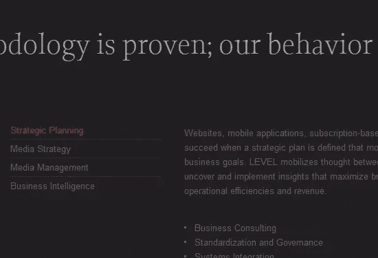
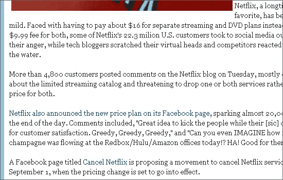
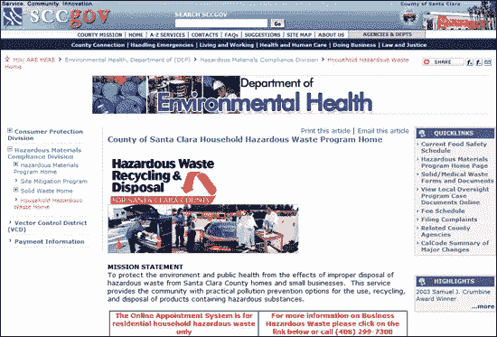
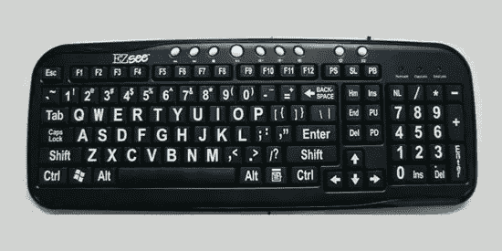
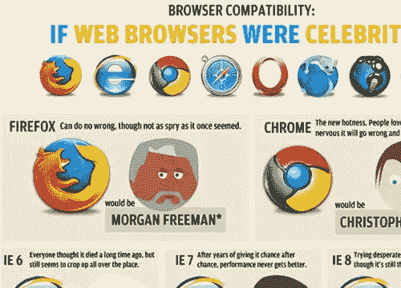

# 通用网页设计中的常见错误

> 原文：<https://www.sitepoint.com/popular-mistakes-in-universal-web-design/>

在当今时髦而竞争激烈的“Web 2.0”和社交媒体世界中，[通用设计](http://en.wikipedia.org/wiki/Universal_design "Wikipedia (EN): Universal Design")被多次遗忘。令人困惑的是，为什么有许多[社会、技术、金融和法律原因](https://www.w3.org/WAI/bcase/ "W3C.org: Developing a Web Accessibility Business Case for Your Organization: Overview")支持通用设计实践。让我们来讨论一些当今网站中比较普遍的问题，以及它们与主要通用设计原则的关系。

## 原则

首先，让我们回顾一下七个通用设计原则，包括一些与网络相关的例子。请记住，这些原则当然适用于计算机和网络之外的许多行业，如土木工程(建筑、人行道)、娱乐(电影院、主题公园)和交通运输(公共汽车、火车)。

1.  **合理使用:**对具有不同能力的人有用且可销售。
    例如:一个地方政府的网站被设计成便于那些使用屏幕阅读器等辅助技术的人访问。
2.  使用灵活:适应广泛的个人喜好和能力。
    例如:一家航空公司网站的设计在不同的计算机显示尺寸下保持了视觉美感。
3.  **简单直观:**易于理解，无论用户的经验、知识、语言能力，还是当前的专注程度。
    示例:web 应用程序的主控件同时标有文本和符号。
4.  **可感知的信息:**有效地向用户传达必要的信息，不管环境条件或用户的感觉能力如何。
    例子:一段带字幕的教学视频除了提供听力外，还提供了阅读对话的选项。
5.  **对错误的容忍度:**最大限度地减少意外或无意行为的危害和不良后果。
    例如:提交表格时出现的技术错误提供了清晰的解释和如何继续的选项。
6.  **低体力:**可以高效、舒适地使用，疲劳度极低。
    例子:网站设计有足够的颜色对比和文本大小，最大限度地减少眼睛疲劳。
7.  **接近和使用的尺寸和空间:**为接近、伸展、操作和使用提供适当的尺寸和空间，而不考虑使用者的身体尺寸、姿势或移动性。
    例如:一个网站的设计使得不能使用鼠标的残障用户仍然可以使用键盘(或屏幕键盘)访问所有内容！).

现在我们已经熟悉了这些原则，让我们来研究几个相关的网页设计问题。

## 难以阅读

通用设计中第一个常见的错误是文本内容，由于其设计，许多人很难阅读。这涉及原则 1，公平使用；6、体力消耗低，特别是眼睛疲劳。请注意，认知阅读困难是一个独立的问题，不在本文的讨论范围之内。良好的[可读性](http://en.wikipedia.org/wiki/Readability "Wikipedia (EN): Readability")让一个网站更有用，更美观。顺便说一句，看看 Readability.com 的[网络应用](http://www.readability.com/)超级简单的阅读。

那么问题是什么呢？小字体和低色彩对比度是导致[网页排版](https://www.sitepoint.com/design-ux/copywriting/ "DesignFestival.com: Typography category")难以阅读的两个关键问题。在下面的例子中，主要的文本内容是黑色背景上的灰色，没有通过*亮度差*和*色差*测试。文本大小设置为 12 像素，这对包括我自己在内的许多用户来说是相当小的。当从 <acronym title="Cascading Style Sheets">CSS</acronym> 中移除文本尺寸时，浏览器显示的默认尺寸稍大，可读性更好！所以不要[设置默认文本](http://www.alistapart.com/articles/howtosizetextincss/ "A List Apart: How to Size Text in CSS")为`12px`或`.75em`，试着高一点像`16px`或`.95em`。

另一个与文本相关的最佳实践是在 <acronym title="Cascading Style Sheets">CSS</acronym> 中使用相对大小(ems 或百分比)而不是固定大小(像素或磅),以帮助确保用户能够根据需要在浏览器中调整文本的大小，并根据文本调整布局比例。其他好的指南包括提供用户友好的标题和足够的行距。

## 难以确定文本链接

默认情况下，超链接文本带有下划线。这是网页浏览中一个由来已久的惯例。取消这种约定不仅会打破用户的期望，还会使色盲或弱视者无法访问该链接。很多时候，当链接在黑色文本中用深色定义时，这个问题就变得更加复杂了。与上述问题类似，这涉及原则 1 和原则 6。

我的验光师告诉我，大约从 40 岁开始，男人的视力开始失去辨别颜色的能力。天哪，她是对的！许多网站都有深蓝色的链接，没有下划线，我肯定要绞尽脑汁才能确定文本链接。下面的例子来自一个新闻故事。你能看到文字链接吗？对我来说挺难的。

新闻网站似乎因使用移除下划线的蓝色链接而臭名昭著，甚至来自著名的英国网站 T2 每日电讯报 T3。要解决这个问题，只需通过返回下划线来移除障碍。[的 Nomensa 博客](http://www.nomensa.com/blog/ "The Humanising Technology blog")就是一个很好的例子。或者，对文本链接使用粗体文本或其他视觉表示，如彩色背景。

## 视觉噪声

分散的布局和超载的内容不仅在视觉上没有吸引力，而且不太有用，也不容易访问。这直接关系到原则 3，简单直观。在下面显示的一个加利福尼亚当地政府的网页中，有许多导航区域，两个大的横幅图片，以及一个杂乱无章的外观。结果，主要内容直到页面“折叠”才开始，这显然是不理想的。此外，没有焦点，没有视觉层次，导致用户更有可能疯狂地在页面上搜索用户需要的东西。

相比之下，看看[澳大利亚政府](http://australia.gov.au/)和[USA.gov](http://www.usa.gov/)网站；更宽敞、更有条理，创造了更实用的体验。

产生“视觉噪音”的更多例子有:

*   导航:一个页面上过多的导航部分(如上例)和过多的导航层级会让人困惑，也是一个设计噩梦。
*   冗余的工具提示:文本链接上的标题属性与链接本身的内容相同，这就产生了一个多余的工具提示。
*   **无意义的图片:**只有在有价值的情况下，才在内容中使用图片；它应该传达对文本内容重要的意义。

## 无键盘访问

[键盘访问](http://webaim.org/techniques/keyboard/)，仅使用键盘导航屏幕并与可聚焦对象交互的能力是必不可少的。可惜很多网站都不提供这个。更准确地说，许多网站[给键盘用户设置了障碍](https://www.w3.org/WAI/EO/2005/Demo/features)，因为<acronym title="HyperText Markup Language">的 HTML</acronym> 天生就是键盘可访问的。如果您为鼠标事件设计，请确保为键盘提供同等的访问权限。这创造了设备独立性；这是好事！这个问题涉及原则 1，公平使用；2、使用灵活。

当编写网站代码时，有几个好的实践可以考虑。在 <acronym title="Cascading Style Sheets">CSS</acronym> 中，如果使用了`:hover`伪类，确保还提供了`:focus`状态。此外，永远不要移除锚元素上的轮廓，例如`a { outline: 0 }`(注意:大多数 <acronym title="Cascading Style Sheets">CSS</acronym> 重置样式表移除锚轮廓——确保稍后将它们添加回您自己的 <acronym title="Cascading Style Sheets">CSS</acronym> 中！).如果绝对有必要，那么某种视觉效果必须代替它。

在 JavaScript 中，不要使用双击处理程序(`onDblClick`)，因为键盘不能执行这种行为。如果使用了`onMouseOver`和`onMouseOut` JavaScript 处理程序，那么还必须实现`onFocus`和`onBlur`事件以允许键盘访问。

## 缺少图像的可选文字

如果图像提供相关内容，它必须伴随着替代文本。当看不到图像时(例如盲人用户、低频段用户和图像链接断开的情况)，仍然需要访问图像的“内容”。这个问题和上面一样，涉及原则 1 和原则 2。提供可选文本的最流行的方法是在图像元素的`alt`属性中输入文本。

网络上的许多图像，如图表、漫画和信息图，并没有在 alt 文本中提供“详细描述”,因此阻止了许多用户访问其内容。Web Axe 博客纠正了其“[修复 Alt](http://webaxe.blogspot.com/search/label/%22fixing%20alt%22) ”系列中的一些例子。关于长描述的更多信息，请查看我的两篇文章 [Longdesc &其他长图像描述解决方案](https://www.sitepoint.com/longdesc-and-other-long-image-description-solutions-part-1-the-issues/)。

以下是替代文本的一些准则:

*   如果图像中嵌入了文本，请将其添加到 alt 属性中。
*   如果图像只是装饰性的，它应该包含一个空的`alt`属性。(如 ``)。
*   对于某些图像，如图表和插图，需要更长的描述。
*   如果带有链接的图像包含内容，那么替代文本应该描述链接的功能，而不是图像本身。

## 外卖

七个通用设计原则是设计网站和其他产品的绝佳资源。人们使用电脑的方式不同，访问网络的方式也不同。记住这一点，网页设计师将会更成功地创建吸引人的、用户友好的、所有人都可以访问的网站。

## 进一步阅读

*   温迪·齐索姆，马特·梅。
*   莎拉·霍顿的在线书籍《普遍可用性》。
*   [通用教学设计](http://www.washington.edu/doit/Faculty/Strategies/Universal/)，华盛顿大学 DO-IT 项目。
*   [通用设计原理](http://www.ncsu.edu/www/ncsu/design/sod5/cud/about_ud/udprinciples.htm)，北卡罗来纳州立大学设计学院。
*   通用设计文件:为所有年龄和能力的人设计。

## 分享这篇文章