# 2022 年最流行的 React UI 组件库

> 原文：<https://www.sitepoint.com/popular-react-ui-component-libraries/>

在本文中，我们将回顾一些最好的 React UI 组件库，以及如何选择适合自己的组件库。本文主要是为初学 React 的开发人员编写的，但是您需要熟悉 React 中的一些特定术语。

React 为全球近[1000 万个网站](https://trends.builtwith.com/javascript/React)的用户界面(UI)提供支持。虽然 React 的基础库是可靠的，但还有多个组件库，其中充满了对 React 应用程序或 web 开发项目有价值的设计元素。

为了帮助你找到最适合你当前项目的 React UI 库，我们来看看 GitHub 上最流行的 React UI 库。我们将分析它们在开发中的应用并给出例子，同时根据 GitHub 和 npm 的使用统计数据来看看它们在开发人员中的受欢迎程度。

让我们从为什么首先应该考虑使用 React UI 库开始。

[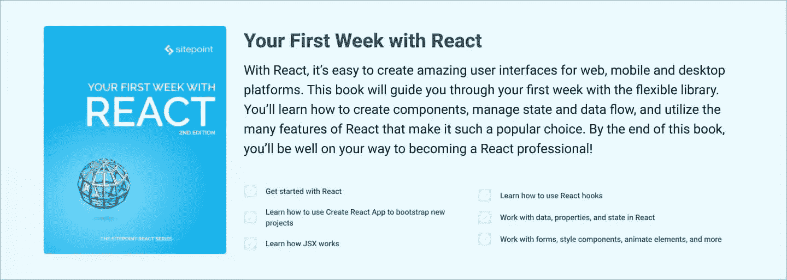](https://www.sitepoint.com/premium/books/your-first-week-with-react-2nd-edition/)

## 我需要一个 React UI 组件库吗？

不同的 React UI 组件库各有利弊，我们将在下面详细讨论。但是一般来说，使用任何组件库都有很多好处，这将在您处理 React 项目时对您有所帮助:

*   **初学者友好型**。UI 库由预先构建的组件组成，如按钮、表单域等。所以，作为一个初学者，你不需要弄清楚如何从头开始创建任何必要的元素。相反，您可以在文档的帮助下专注于实现和定制。
*   **更快的原型制作**。有了现成的 React 组件，您可以快速创建几个功能原型。这意味着你可以证明设计概念是可行的，而不必在任何细节上花费太多时间。
*   **节省时间**。使用组件库不仅在原型制作时节省时间，而且在已经在 React 项目上工作时也节省时间。它使您能够编写更少的代码，因为您不必自己编写所有的样式。
*   **用户可识别的组件**。创新在一定程度上帮助你的项目脱颖而出。但是在设计 UX/用户界面时过多的创新会让用户却步。由于库中的 UI 元素被设计成通用的，它们不会给你的用户带来任何摩擦。
*   **可定制组件**。尽管是通用的，但大多数元素至少在某种程度上是可以定制的。每个库都给你不同程度的定制控制，但是你可以确保你的网站看起来不像其他网站。
*   **经验证的跨设备兼容性**。默认情况下，大多数预构建的 UI 组件都是移动响应的，这意味着您不必付出太多额外的努力来确保您的 React 项目可以在不同类型的设备上工作。
*   **默认可访问**。大多数流行的 React UI 组件库都有内置的可访问性特性，甚至完全符合 WCAG 或其他标准和最佳实践。由于这一点，你将不必担心自我编码的语义标签或键盘导航。
*   **众包**。UI 组件库通常有以 GitHub 为中心的社区。这意味着用户可以提出问题，请求特性，也很容易成为库的贡献者。

尽管有这么多优点，即使是最好的 React UI 组件库也有一些缺点，您应该在使用之前考虑一下:

*   **定制组件可能很困难**。根据您选择的特定库，自定义组件的难易程度会有所不同。对于一些 React 库，您可以获得由开发人员大量定制的原始组件，但是对于其他库，获得您想要的结果可能很棘手。
*   **与其他网站类似的网页设计**。每个 React UI 库都有自己的设计系统，所以如果你选择使用一个流行的库，但没有足够地定制组件或主题，你的站点可能最终看起来与使用相同库的其他站点非常相似——在某些情况下，甚至没有独创性。然而，根据您的项目，这可能根本不是问题。
*   **支持依靠社区**。大多数 React UI 库不提供官方支持，而是引导用户使用 Stack Overflow、GitHub、Discord 或其他类似的渠道。不太受欢迎的图书馆，社区更小，获得帮助可能更复杂。

所以，抛开这些重要的考虑，让我们看看基于 GitHub 统计的最流行的库。我们根据它们在 GitHub 上的活动项目数量列出了这些库，从最流行的开始。

在这篇文章结束时，你将有希望为你的 web 或移动应用程序开发项目找到最好的基于 React 的 UI 组件库。

## 1.MUI(以前的材质-UI)

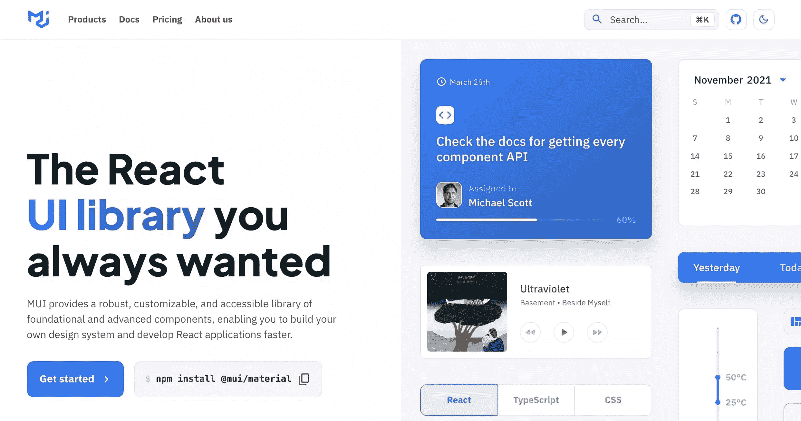

GitHub 上有超过 745，000 个项目在使用， [MUI](https://mui.com/) 是一个基于 Google Material Design 的简单且可定制的 React 组件库。因此，MUI 不仅仅是一个组件库，而是一个完整的设计系统。它有一套完整的指南、设计原则和 UI 设计的最佳实践。MUI 构建在 63.9%的 JavaScript 和 36.1%的 TypeScript 之上。

您可以使用 MUI 及其大量组件在 React 应用程序中轻松创建用户界面。使用现有的材料设计组件，对其进行自定义，或创建自己的设计系统。由于 MUI 的现成组件和深入的文档，您可以快速创建干净漂亮的移动或 web 应用程序——即使以前没有什么设计经验。

由于 MUI 所基于的 Material-UI 设计系统是由 Google 创建的，所以它也在 Google 自己的平台上使用。因此，MUI 组件可以具有明显类似 Google 的外观和感觉。一方面，这意味着 MUI 可能是构建 Android 应用程序的特别好的选择，因为应用程序的视觉效果将与操作系统非常匹配。

但另一方面，用这个库创建的任何网站或应用程序——如果没有足够的定制——都可能很容易与谷歌联系起来。

尽管如此，看看 MUI 的使用量和 GitHub stars 的数量，它是最好的 React UI 组件库之一。它提供了大量的 React 组件，适用于各种各样的通用开发项目。MUI 被 medium.com、Scale AI 和优衣库等公司使用。

下图显示了 MUI [评级变量](https://mui.com/components/rating/)的示例。

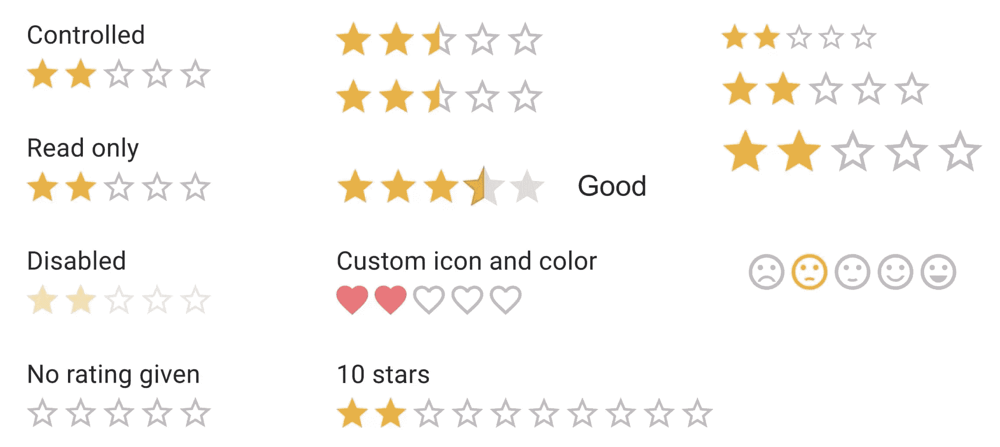

您可以使用 npm 安装 MUI 组件库:

```
npm install @mui/material @emotion/react @emotion/styled 
```

或纱线:

```
yarn add @mui/material @emotion/react @emotion/styled 
```

## 2.反应引导

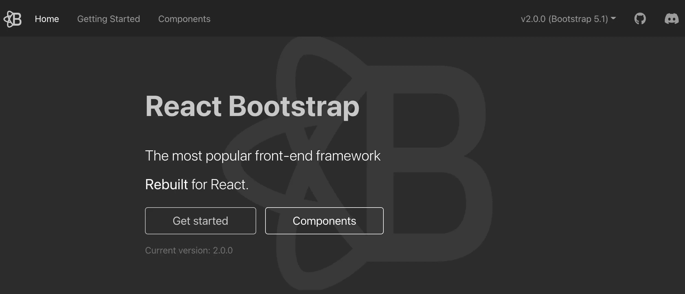

被 GitHub 上的 605，000 多个项目使用， [React-Bootstrap](https://react-bootstrap.github.io/) 是最古老的 React UI 组件库之一。简而言之，它是在 React 中完全重建的流行前端框架引导程序。该库由可完全响应和访问的现成组件组成。所有的设计元素也是高度可定制的。

React-Bootstrap 可用于 UI 基础、网站和设计应用程序。该库构建于 59.4%的 JavaScript、38.3%的 TypeScript 和 2.3%的 SCSS 之上，最新版本与最新的 Bootstrap 版本 5.1 兼容。

使用 React-Bootstrap 的一个重要好处是，它与成千上万的 Bootstrap 主题兼容。此外，当您记住 Bootstrap 中定义的类和变体时，创建定制主题也很容易。最重要的是，使用 React-Bootstrap，您可以只导入正在使用的单个组件，这有助于最小化代码总量。由于其适当的文档，它也是一个初学者友好的库。

然而，不利的一面是，如果您熟悉 Bootstrap 并决定为您的开发项目选择 React-Bootstrap，您将不得不学习一个新的 API。此外，与其他一些库(如 MUI 或 Ant Design)相比，React-Bootstrap 的组件更少。

最后，React-Bootstrap 的受欢迎程度清楚地表明，它是各种开发项目的绝佳选择。如果你已经熟悉了 Bootstrap，那么使用 React-Bootstrap 也很自然。

下图显示了 React-Bootstrap 的[按钮变体](https://react-bootstrap.netlify.app/components/buttons/)的一个例子。

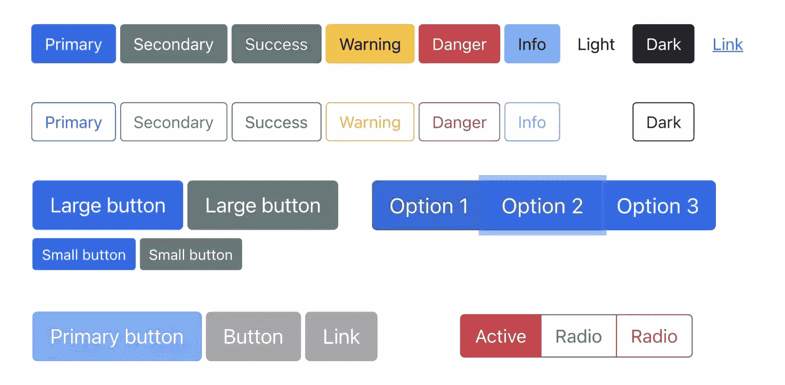

如何安装:

```
npm install react-bootstrap 
```

您可以使用 yarn 安装 React-Bootstrap 组件:

```
yarn add react-bootstrap 
```

## 3.蚂蚁设计

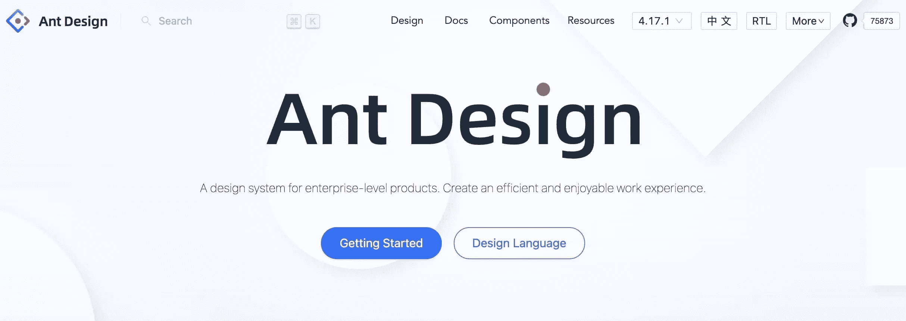

被 GitHub 上超过 255，000 个项目使用， [Ant Design](https://ant.design/) 将自己描述为面向企业级用户的 React UI 库和设计系统，这意味着这些元素是为商业用途而设计的。它是由中国科技巨头阿里巴巴创建的。

Ant Design 提供了大量高质量的组件，非常适合快速构建整个 UI 框架——或者您可以只使用单个组件。该库构建在 43.7%的 TypeScript、31.1%的 JavaScript、少 24.9%和 0.3%的未指定代码之上。

Ant Design 是一个非常棒的 React 组件库，部分原因是它的文档非常棒，包括大量的指南、示例和变体。除此之外，在定制现有组件和主题的细节方面，它也是一个健壮的平台。

此外，Ant Design 的伟大之处在于它与许多第三方 React 库和他们自己的几个产品兼容，如 [AntV 数据可视化](https://antv.vision/en)、 [Ant Design Charts](https://charts.ant.design/en) 和 [Ant Design Mobile](https://mobile.ant.design/) 。这些有助于扩展您可以用它们的库覆盖的用例的数量。

与其他 React 库相比，Ant Design 的一个缺点是其庞大的包大小(1.2 MB)，而其他 React 库通常在几百千字节左右。如果您没有从事具有相当大业务需求的开发项目，那么这个库可能有点多余。

除了阿里巴巴，Ant Design 也被联想和丰田这样的公司使用，所以它是高级业务项目的一个很好的选择。和彻底的资源仍然可以使它成为初学者的一个伟大的选择。最重要的是，它在 GitHub 上的明星甚至比 MUI 还多，这更证明了它的伟大。

下图显示了 Ant 设计中的[图标变体](https://ant.design/components/icon/)的一个例子。

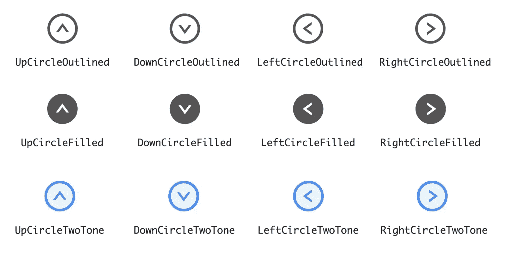

您可以使用 npm 安装 Ant 设计组件:

```
npm install antd 
```

或纱线:

```
yarn add antd 
```

## 4.反应阱

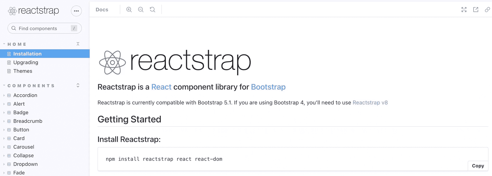

被 GitHub 上的 241，000 多个项目使用， [Reactstrap](https://reactstrap.github.io/) 为 Bootstrap 5.1 提供了简单明了的独立组件。UI 元素响应迅速，设计简单，适用于各种项目。Reactstrap 构建在 74.7%的 JavaScript、24.9%的 TypeScript 和 0.4%的 Shell 之上。

您可以使用 Reactstrap 进行完整的 UI 开发，也可以只使用单个组件。它提供了极大的灵活性和预构建的验证，这对于快速构建具有良好用户体验的漂亮表单非常有用。

由于 Reactstrap 是一个比列表中提到的其他组件库更年轻的组件库，所以它的可用组件确实要少一些。不过，如果你的目标是简单的设计，并且不想被太多的选项淹没，这可能是一件好事。

官方的 Reactstrap 文档很全面，但主要由代码组成，没有很多解释。然而，由于它是一个非常简单的库，所以它仍然很容易理解和使用——即使对于初学者来说也是如此。最重要的是，Reactstrap 周围有一个不错的社区，由于有许多免费和高级的 Reactstrap 主题，您可以加快开发速度。

总而言之，Reactstrap 类似于 React-Bootstrap，有一些小的不同。如果您喜欢使用 Bootstrap，您可以很容易地为您的项目选择任何一种。

下图显示了 Reactstrap 中[按钮下拉变量](https://reactstrap.github.io/?path=/docs/components-button--button-dropdown)的一个例子。


要使用 Reactstrap，首先需要安装 Bootstrap:

```
npm install bootstrap 
```

或者:

```
yarn add bootstrap 
```

然后，您可以使用 npm 安装 Reactstrap:

```
npm install reactstrap react react-dom 
```

或者使用纱线:

```
yarn add reactstrap 
```

## 5.语义 UI 反应

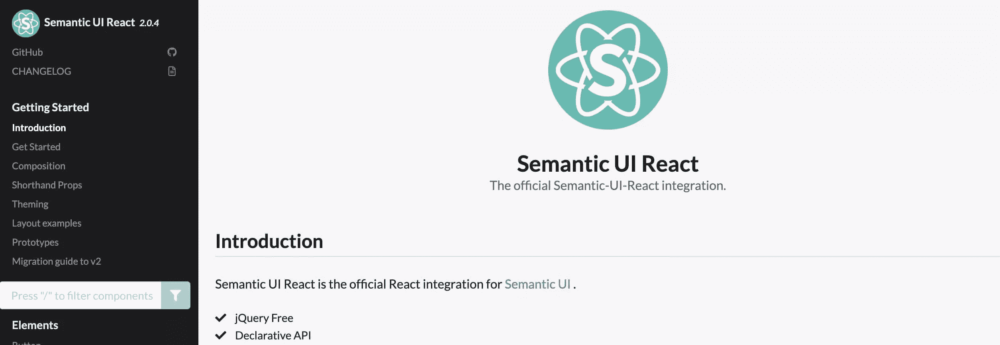

被 GitHub 上超过 132，000 个项目使用， [Semantic UI React](https://react.semantic-ui.com/) 是现成的、移动响应解决方案的前端组件库。顾名思义，它是语义 UI 开发框架的官方 React 集成，以其响应迅速、人性化的 HTML 代码而闻名。语义 UI React 建立在 99.9%的 JavaScript 和 0.1%的 TypeScript 之上。

在语义 UI React 库中，每个组件都有多种变体，因此您很可能能够找到适合您的用例的现有组件，并避免在定制组件上花费太多时间。不过，您可以通过修改 SCSS 样式表来确保每个组件都符合您的设计。您可以为整个项目使用语义 UI React 库，也可以只安装单个元素。

由于语义 UI——语义 UI React 所基于的框架——是为 web 开发而创建的，它的 React 等价物也比移动应用程序更适合 web 开发项目。

然而，如果您为您的项目选择语义 UI React，您应该记住，您必须做一些额外的工作，因为不是所有的组件在默认情况下都是完全可访问的。除此之外，不再维护原来的语义 UI 框架。

尽管如此，语义 UI React 变得越来越强大，总的来说，对于希望构建响应式 web 应用程序的初学者来说，这是一个不错的选择。它有对人友好的代码、包含大量示例的优秀文档，以及用于测试每个组件的代码沙箱。

下图是语义 UI React 中[标签组件](https://react.semantic-ui.com/elements/label/)的一个例子。

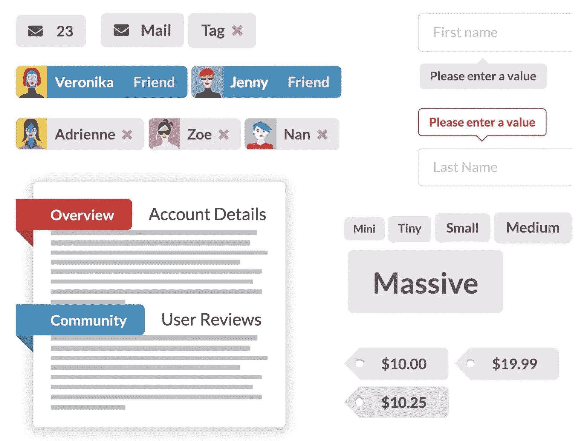

您可以使用 npm 安装语义 UI React 组件:

```
npm install semantic-ui-react semantic-ui-css 
```

或纱线:

```
yarn add semantic-ui-react semantic-ui-css 
```

## 6.Chakra UI

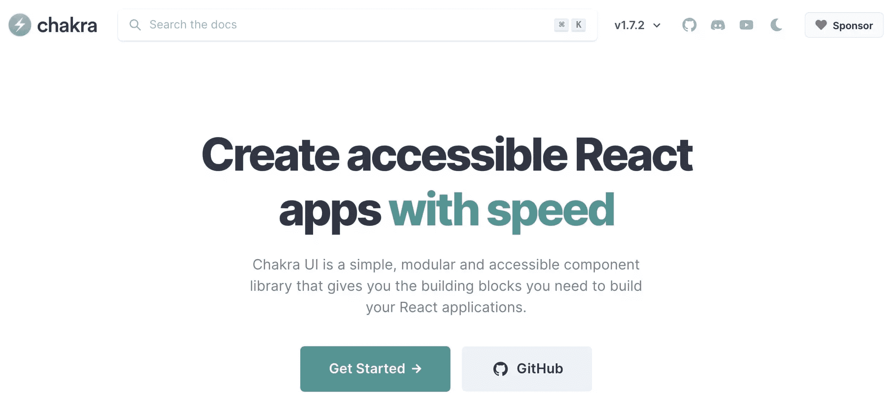

被 GitHub 上的 20，000 多个项目使用， [Chakra UI](https://chakra-ui.com/) 提供了简单、模块化和可定制的 React 组件来支持应用程序和 web 开发。所有元素也为黑暗模式进行了优化，与其他一些 UI 组件库不同，Chakra UI 完全符合 WAI-ARIA 可访问性标准。Chakra UI 构建在 97.5%的 TypeScript、1.9%的 JavaScript 和 0.6%的未指定代码之上。

您可以使用 Chakra UI 轻松创建自己的设计系统，也可以只安装它的部分组件。由于使用了风格道具，定制组件和主题非常容易。

在描述 Chakra UI 时，简单的确是一个关键词。它的库也非常关注开发过程，承诺您将花费更少的时间编写代码，而将更多的时间用于构建出色的用户体验。体面的文档肯定会有所帮助。

然而，与更流行的 React UI 组件库相比，Chakra UI 相对较新，它仍然缺少一些功能和组件。因此，它最适合用于不需要大量组件或高级特性的中小型开发项目。

下图显示了 Chakra UI 中[复选框变体](https://chakra-ui.com/docs/form/checkbox)的示例。

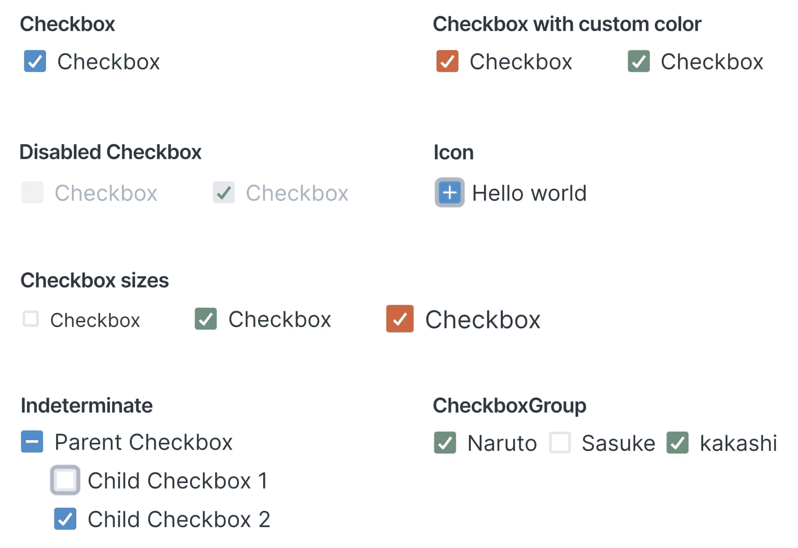

您可以使用 npm 安装 Chakra UI 及其组件:

```
npm install @chakra-ui/react @emotion/react@^11 @emotion/styled@^11 framer-motion@^4 
```

或纱线:

```
yarn add @chakra-ui/react @emotion/react@^11 @emotion/styled@^11 framer-motion@^4 
```

## 7.主题用户界面

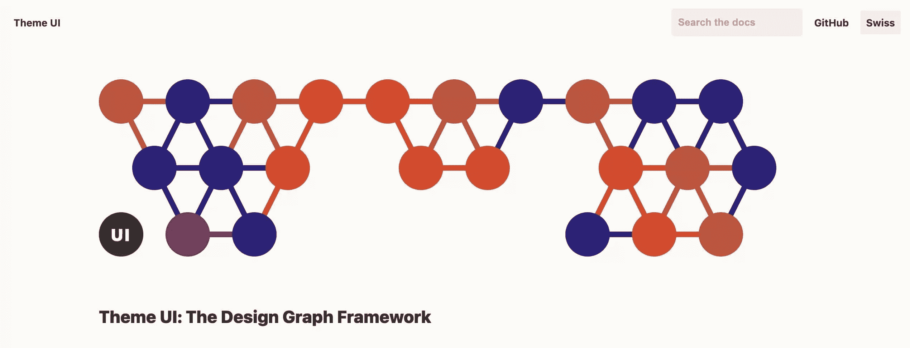

被 GitHub 上超过 15，000 个项目使用， [Theme UI](https://theme-ui.com/) 主要是一个用于构建 React UI 主题的库，拥有超过 30 个原始 UI 组件。主题 UI 的核心概念依赖于基于约束的设计原则。主题 UI 构建在 74.9%的 TypeScript、24.9%的 JavaScript 和 0.2%的未指定代码之上。

您可以使用主题用户界面自定义基本组件、创建主题或开发您自己的设计系统。由于快速的工作流程，真正易于使用的样式和主题化功能，以及对变化的支持，它在用户中受到高度重视。

主题 UI 还提供了一些很棒的特性，比如内置的黑暗模式和移动优先的响应风格。最重要的是，如果你是静态站点生成器的粉丝，你将能够充分享受主题 UI 带来的好处。多亏了他们的 Gatsby 插件，主题用户界面可以用于任何 Gatsby 网站和主题，而且它被用于官方的 Gatsby 主题。

主题 UI React 组件库可以很容易地用于构建 web 应用程序。但是因为它是一个非常年轻的库，它还没有那么多的基础组件或活跃的社区成员，并且默认情况下它不完全符合可访问性标准。它也没有像这个列表中的其他 UI 库一样聚集那么多 GitHub 明星。

幸运的是，尽管主题用户界面变得越来越流行，更多的组件和特性必然会被添加进来。除此之外，现有的文档还不错，包括了大量的例子、工具和扩展来简化您的工作。

下图显示了主题 UI 中的[表单选项](https://theme-ui.com/components/forms)的示例。

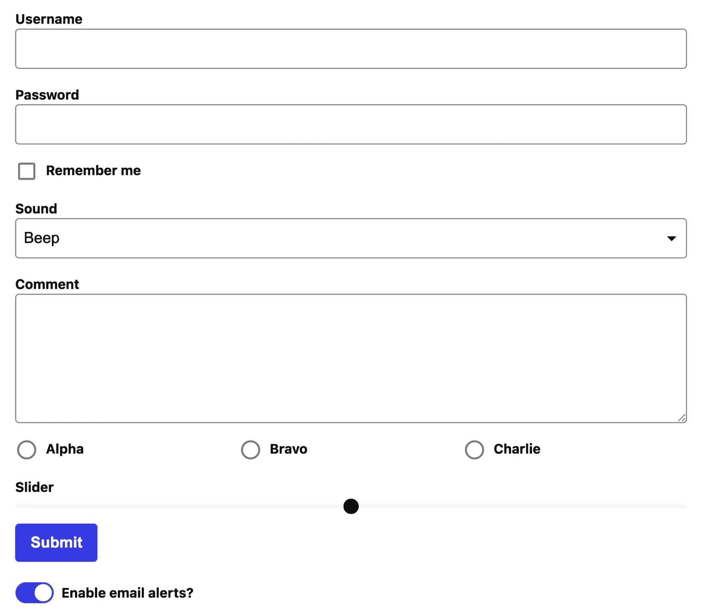

您可以使用 npm 安装主题 UI 组件:

```
npm install theme-ui 
```

或者用纱线:

```
yarn add theme-ui 
```

## 8.雷巴斯

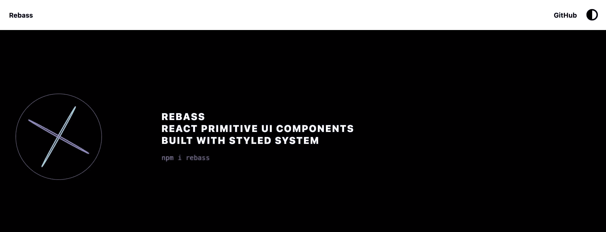

被 GitHub 上的 10，000 多个项目使用， [Rebass](https://rebassjs.org/) 具有原始的 React UI 组件和用于进一步设计的简单系统。这些组件反应灵敏、简约且灵活。最重要的是，它是一个真正轻量级的库，只有 43kB 的包大小。Rebass 是 100%基于 JavaScript 构建的。

您可以使用 Rebass 创建一个简约的设计风格，并根据自己的意愿定制基本组件。在其核心使用 Styled System 减少了在应用程序中编写自定义 CSS 的需要，这意味着您可以更快地构建您的项目。

Rebass 支持主题化，尽管它没有预建主题，但它为创建你自己的主题提供了足够的灵活性和定制性。Rebass 库也完全兼容主题用户界面，所以如果你愿意，你可以把这两者结合起来。

如果您对最终的组件或主题不感兴趣，而是喜欢创建自己的设计系统，而不必从头开始，Rebass 是一个很好的选择。使用可用的基本组件，您可以快速创建高度定制的设计。

但是请记住，Rebass 也是一个较新的库，社区仍然相对较小 GitHub 上的项目数量较少就证明了这一点。文档就在那里，甚至包括一些指南，但总的来说，它不是很全面。此外，使用 Rebass，您应该记住，虽然默认情况下支持一些可访问性特性，但是这个库并不正式遵守任何标准。

下图显示了 Rebass 中的[表单组件](https://rebassjs.org/forms)的示例。

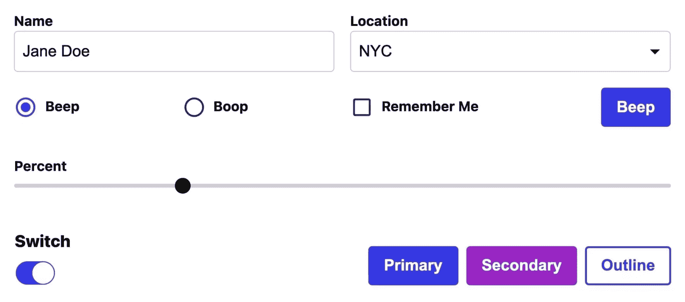

您可以使用 npm 安装 Rebass 的组件:

```
npm install rebass 
```

或者用纱线:

```
yarn add rebass 
```

## 9.蓝图


GitHub 上的 9800 多个项目使用了 [Blueprint](https://blueprintjs.com/) 的库中有 40 多个现代组件。主要重点是为复杂的数据密集型桌面应用程序构建一个 React UI，因此它不是完全移动响应的。Blueprint 建立在 88.9%的 TypeScript、8.2%的 SCSS、2.2%的 JavaScript 和 0.7%的未指定代码之上。

您可以安装包含所有基本组件的 Blueprint 核心包，并根据您的特定需求添加任何附加组件包。例如，有单独的日期时间、图标和表格包，提供了更高级的组件。或者，您可以只导入您需要的单个组件。

Blueprint 没有提供任何预构建的主题，除了默认的 light 主题和 dark mode 主题。尽管如此，还是有足够的空间来定制和构建你自己的主题。您可以自定义类别、颜色主题和版式，这使您可以个性化您的设计外观。

如果您想用漂亮的预制组件构建数据密集型桌面应用程序，Blueprint 可能是您最好的 React 组件库。它有很好的深度文档，但是类似于主题 UI 和 Rebass，社区还不是很大，这意味着寻找帮助可能很有挑战性。当然，它不太适合移动应用程序。

下图显示了蓝图中[图标变体](https://blueprintjs.com/docs/#icons)的示例。


您可以从 Blueprint 的核心组件开始，并使用 npm 安装它们:

```
npm install @blueprintjs/core 
```

或者，使用纱线:

```
yarn add @blueprintjs/core 
```

## 使用 React UI 组件库创建独特的设计

如果使用现成的 React UI 组件，构建应用程序会简单得多。通过根据您的特定需求定制组件，您不必从头开始，并且可以快速创建独特的设计。

下面是这篇文章中涵盖的库的合适用例的快速总结:

*   对于大量的预构建组件和优秀的文档，你应该研究一下 MUI、Ant 设计、语义 UI React 和 Blueprint。
*   如果你正在寻找一个用于**移动应用开发**的库，那么试试 MUI、React-Bootstrap 和 Ant Design。虽然 MUI 更适合 Android，但你可以在 Android 和 iOS 应用程序中使用它们。
*   Blueprint 特别适合于**数据密集型桌面应用**。
*   如果开箱即用的**可访问性**在您的 React 项目中很重要，那么您应该考虑 MUI、React-Bootstrap、Chakra UI 或 Blueprint。
*   React-Bootstrap 和 Reactstrap 对 Bootstrap 主题和主题 UI 与 Gatsby 主题的兼容性很好。
*   对于**原语组件**，看一下主题 UI 和 Rebass。

我们建议您探索这篇文章中涉及的最流行的 React UI 组件库。他们将帮助你启动 React 应用程序或网络开发项目。

您使用过哪些 React UI 组件库，您会在下一个项目中使用列表中的哪一个？在 Twitter 上分享你的想法，并标记 [@sitepointdotcom](https://twitter.com/sitepointdotcom) 。

## 分享这篇文章