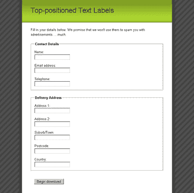
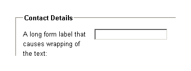
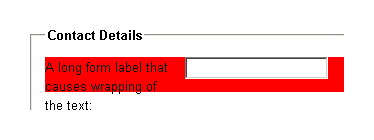
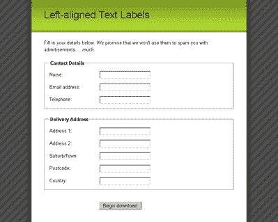
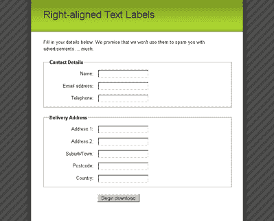

# 使用 CSS 在表单上定位文本标签

> 原文：<https://www.sitepoint.com/position-text-labels-on-forms-using-css/>

在这篇文章中，我将解释使用 CSS 在 web 表单上定位文本标签的三种常用方法:

1.  顶部放置的文本标签
2.  左对齐文本标签
3.  右对齐文本标签

**使用顶端文本标签**

将标签放置在表单元素的顶部可能是最容易实现的布局，因为我们只需要告诉`label`占据其父元素的整个宽度。

因为我们的表单元素/标签在有序列表项(块元素)中，所以每一对都会自然地换行，如图 9 所示。我们所要做的就是将表单元素和标签放到不同的行上。

这个练习很容易通过将`label`元素变成块元素来完成，这样它们将占据一整行:

`label {
display: block;
}`

这是一个简单的改变，但是它使表单更加整洁，如下所示。

 **

**左对齐文本标签**

当我们在表单元素的左侧创建一列文本标签时，我们需要做的不仅仅是将它们放在顶部。一旦我们开始浮动元素，所有的地狱打破松散！

为了将标签放置在表单元素旁边，我们将`float`元素放在左边，并给它们一个明确的`width`:

`label {
float: left;
width: 10em;
margin-right: 1em;
}`

我们还对每个`label`应用了一点点`margin-right`，这样`label`的文本永远不会紧靠表单元素。我们必须在浮动元素上定义一个显式的`width`,这样所有的表单元素将排列成一个整齐的垂直列。我们应用的确切宽度将取决于表单标签的长度。如果可能的话，最长的表单标签应该不换行，但是不应该有太大的间隙，以至于最小的标签看起来像是没有连接到它的表单元素。在后一种情况下，可以让`label`的宽度小于最长的`label`，因为文本无论如何都会自然换行，如下图所示。

 **

然而，一旦我们浮动了`label`，我们就遇到了它所包含的列表项的问题——列表项将不会扩展以匹配被浮动元素的高度。这个问题在下面的图片中非常明显，我们已经对列表项应用了一个`background-color`。

确保父节点包含其浮动子节点的一个无标记解决方案是浮动父节点，这就是我们要做的:

`left-aligned-labels.css (excerpt)
fieldset li {
float: left;
clear: left;
width: 100%;
padding-bottom: 1em;
}`

如果列表项是浮动的，它将包含所有浮动的子元素，但是它的`width`必须设置为`100%`，因为浮动的元素试图收缩到最小的宽度。将列表项的`width`设置为`100%`意味着它的行为仍然像一个非浮动的块元素。我们还在其中加入了一个`clear :left`属性声明，以确保我们不会在`form`元素周围发现任何不必要的列表项浮动。意味着列表项将总是出现在任何先前的左浮动元素的下面，而不是在它们的旁边。

然而，一旦我们浮动了列表项，我们会在`fieldset`上发现同样不需要的行为——它不会扩展到包含浮动的列表项。所以，我们必须让`fieldset`浮动。这是我们之前从`fieldset`中移除`padding`的主要原因——当我们将`width`设置为`100%`时，任何`padding`都会抛出我们的尺寸:

`left-aligned-labels.css (excerpt)
fieldset {
float: left;
clear: left;
width: 100%;
margin: 0 0 1.5em 0;
padding: 0;
}`

这种浮动的疯狂会在哪里结束？保持冷静。它在这里结束，提交`fieldset`。因为它是表单中的最后一个`fieldset`，并且因为它不像其他`fieldset`那样需要太多特殊的 CSS 样式，我们可以永远关闭浮动行为:

`left-aligned-labels.css (excerpt)
fieldset.submit {
float: none;
width: auto;
border: 0 none #FFF;
padding-left: 12em;
}`

通过关闭浮动并将`width`设置回`auto`，最终提交`fieldset`成为一个清除所有其他浮动的普通块元素。这意味着表单将增长到包含所有的`fieldset`元素，我们又回到了文档的正常流程中。

submit `fieldset`中没有任何元素是浮动的，但是我们希望按钮与所有其他表单元素对齐。为了实现这个结果，我们将`padding`应用到`fieldset`本身，这个动作推动提交按钮来排列所有的文本字段。最好让按钮与表单元素对齐，因为它形成了一个直接的线性路径，当用户完成表单时，他或她的眼睛可以跟随这个路径。

在所有这些浮动之后，我们现在有了如下所示的布局——一个表单，其中一列用于表单标签，一列用于表单元素。

***右对齐文本标签***

 *随着所有困难的安全浮动，将`input`标签向右对齐变得轻而易举；只需在`label`元素上设置文本对齐，即可获得如下图所示的表单:

`right-aligned-labels.css (excerpt)
label {
float: left;
width: 10em;
margin-right: 1em;
text-align: right;
}`

我们完事了。现在您可以选择最适合您的页面的表单布局，只需更改一点 CSS！

你更喜欢哪个选项，为什么？请在评论中告诉我们。* 

## *分享这篇文章*