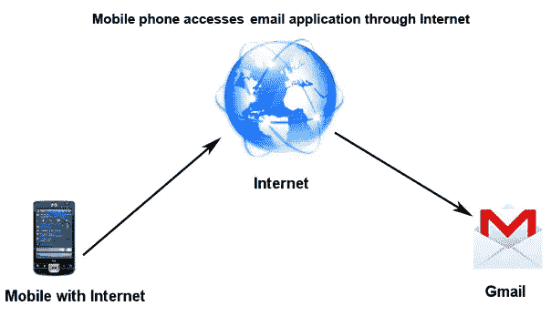
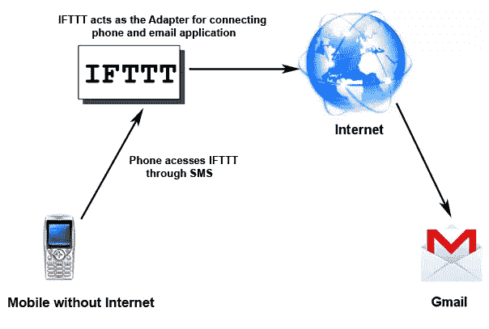
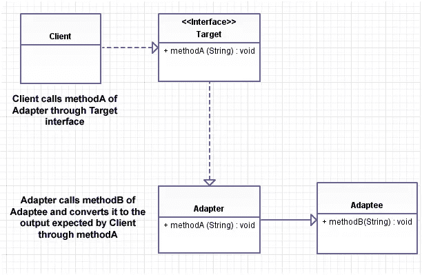

# 适配器模式的实际方面

> 原文：<https://www.sitepoint.com/practical-aspects-of-the-adapter-pattern/>

软件开发每天都在被新的概念、方法和高质量的库和框架所改进。但是即使有了这些改进，我们也不能阻止软件开发的变化。你可能认为你的系统被完美地设计来迎合它的所有需求，但是总会有一个变更请求来破坏你的完美设计。作为开发人员，我们必须为所有可能的变化做好准备。

适配器模式是一种设计模式，通常用于管理开发中的变更。在整篇文章中，我们将使用真实世界的应用程序来研究模式的用法和好处。

## 什么是适配器模式？

适配器设计模式通过适应现有功能的变化以及构建新功能来简化问题。简而言之，我们可以将适配器定义为帮助集成不兼容组件的接口。

假设我们有一部手机，用来访问电子邮件帐户发送电子邮件。电话和电子邮件应用程序是通过互联网连接的独立组件。



现在假设我们旅行到一个地方，在那里手机不能上网。在这种情况下，我们如何访问电子邮件？我们需要一个适配器来连接我们的手机和电子邮件应用程序。让我们来看看这种适配器应该具备的特性:

*   启用移动电话和电子邮件应用程序之间的互联网连接。
*   访问电子邮件应用程序 API 来发送电子邮件。

考虑到需求，我们可以选择 IFTTT 作为适配器。IFTTT 是一个支持用流行的 API 自动完成任务的服务。因此，我们可以使用 IFTTT 作为适配器，如下图所示。



在这个解决方案中，我们向 IFTTT 服务发送包含电子邮件文本的 SMS。向国际号码发送短信不需要互联网连接。然后，IFTTT 服务获取消息内容并初始化配方(配方需要预先配置)，以便使用电子邮件应用程序的 API 发送电子邮件。

IFTTT 可以访问电子邮件 API 以及电子邮件应用程序的互联网连接，完成了适配器的两个要求。IFTTT 充当适配器来集成我们的电话和电子邮件应用程序，该应用程序由于互联网不可用而处于不兼容状态。

我想现在您应该对适配器模式在现实世界中的功能有了清晰的理解。不过，在我们进一步讨论实现之前，让我们先看看 Wikipedia 给出的[模式的定义:](http://en.wikipedia.org/wiki/Adapter_pattern "Adapter pattern - Wikipedia, the free encyclopedia")

> 在计算机编程中，适配器模式是一种将类的一个接口转换成兼容接口的设计模式。适配器通过在使用原始接口的同时向客户端提供其接口，允许类一起工作，而这通常是因为接口不兼容而无法实现的。

## 理解适配器模式实现

利用实际场景来理解适配器模式的过程和组件是理想的，所以假设我们的网站有一个电子邮件订阅的公共接口。以下代码包含电子邮件订阅接口的实现。

```
<?php
interface EmailSubscribe
{
    public function subscribe($email);
    public function unsubscribe($email);
    public function sendUpdates();
}
```

开发者和电子邮件服务提供商可以实现这个接口，为每个电子邮件提供商(如 Feedburner、Mailchimp 等)提供电子邮件订阅类。下面的代码包含一个服务的示例实现和`sendUpdates()`方法的初始化。

```
<?php
class FeedburnerEmail implements EmailSubscribe
{
    public function subscribe($email) { }
    public function unsubscribe($email) { }

    public function sendUpdates() {
   	 // Get Available Subscribers
   	 // Get Website Updates
   	 // Send Emails
    }
}

$feedburner_email = new FeedburnerEmail();
$feedburner_email->sendUpdates();
```

现在假设 Feedburner 决定用最新版本改变它的库。

```
<?php
class FeedburnerEmailVersion2
{
    public function subscribe($email) { }
    public function unsubscribe($email) { }

    public function getSubscribers() {
   	 // Return Subscribers
    }

    public function sendEmails($subscribers) {
   	 // Get Website Updates
   	 // Send Emails
   	 echo "emails sent today";
    }
}

$feedburner_email = new FeedburnerEmailVersion2();
$subscribers = $feedburner_email->getSubscribers();
$feedburner_email->sendEmails($subscribers);
```

根据前面的代码，在新版本的库中添加了新方法并修改了现有功能。初始化代码已更改，最新版本的 Feedburner 与`EmailSubscribe`界面不兼容。

我们不能实现公共接口，因此我们需要一个适配器来使库与原始接口兼容，以保持代码的一致性。由于当前版本没有实现接口，我们别无选择，只能基于接口创建适配器。

```
<?php
class FeedburnerAdapter implements EmailSubscribe
{
    public function subscribe($email) { }
    public function unsubscribe($email) { }

    public function sendUpdates() {
   	 $feedburner = new FeedburnerEmailVersion2();
   	 $subscribers = $feedburner->getSubscribers();
   	 $feedburner->sendEmails($subscribers);
    }
}

$feedburner_email = new FeedburnerAdapter();
$feedburner_email->sendUpdates();
```

`FeedburnerAdapter`适配器在其`sendUpdates()`方法中初始化 Feedburner 电子邮件库，并通过调用最新版本库中的新方法来重建之前的实现。现在我们的应用程序和 Feedburner 库通过`FeedburnerAdapter`的标准接口进行通信。我们的应用程序不知道实现已经改变，适配器正在代替原来的库类工作。开发人员可以调用标准的方法集，而无需对他们的原始代码进行任何更改。

现在是时候使用类图来理解适配器模式的理论方面了。



通常我们的应用中有一个`Client`、`Target`、`Adaptee`，`Adaptee`类实现了`Target`接口。在`Client`和`Adaptee`变得不兼容的情况下，我们创建一个名为`Adapter`的新类，并将其放在`Target`和`Adaptee`之间，以使组件相互兼容。

上图包含了在最佳情况下使用的适配器模式的原始设计。接口在 PHP 项目中没有广泛使用，但这并不意味着您不能使用适配器模式。只要某个组件集成了不兼容的接口，它就可以被认为是适配器。

在我关于 Opauth 的上一篇文章中，我们讨论了在 Opauth 库中使用策略类。它还充当适配器，尽管它没有实现任何接口。策略适配器使开放身份验证库与核心 Opauth 库兼容。

## 谁开发适配器类？

当我们需要一个适配器时，我们可以作为开发人员创建它，也可以要求供应商提供适配器。这取决于我们正在进行的项目的情况和类型。如果我们使用公共第三方库开发应用程序，那么我们将负责创建适配器来满足需求。另一方面，我们可能正在开发一个大规模的应用程序，并期望供应商专门为我们的应用程序开发库。在这种情况下，如果供应商改变了他们的库，那么他们也应该提供适配器。

## 适配器模式–错误的方式

许多有经验的开发人员认为适配器模式是用来修复设计糟糕的系统的。视情况而定，我们可能不得不同意这一点。但是，让我们考虑我们之前讨论的电子邮件订阅示例的一个稍微修改的版本。

假设有两个团队被指派基于我们之前使用的原始接口分别开发 Feedburner 和 Mailchimp 类。

```
<?php
class FeedburnerEmail implements EmailSubscribe
{
    public function subscribe($email) { }
    public function unsubscribe($email) { }

    public function getSubscribers() {
   	 // Returns list of subscribers
    }

    public function sendUpdates() {
   	 $this->getSubscribers();
   	 // Get Website Updates
   	 // Send Emails
    }
}
```

```
<?php
class MailchimpEmail implements EmailSubscribe
{
    public $subscribers;

    public function subscribe($email) { }
    public function unsubscribe($email) { }

    public function getSubscribers() {
   	 $this->subscribers = "List of subscribers";
    }

    public function sendUpdates() {
   	 $subscribers = $this->subscribers;
   	 // Get Website Updates
   	 // Send Emails
    }
}
```

尽管这两个类都与目标接口兼容，但是在客户端和这两个类之间存在不兼容性。为了更好地理解这一点，请考虑初始化代码:

```
<?php
$email = FeedburnerEmail();
$email->sendUpdates();

$email = MailchimpEmail();
$email->getSubscribers();
$email->sendUpdates();
```

团队 2 的代码与客户端初始化代码不匹配，因此变得不兼容。我们需要一个适配器来解决 Mailchimp 类的问题。这被认为是适配器模式的一个不好的用法，因为我们可以适当地计划接口以避免这样的不兼容问题。

## 适配器模式–正确的方式

适配器主要用于我们使用第三方库或者创建一个与原始需求有很大不同的新功能的情况。因此，让我们考虑以下有效使用适配器的场景。

电子邮件订阅在我们的网站上运行良好。由于订阅的成功，管理层正计划为该网站实施 Twitter 订阅。目前，当用户通过电子邮件订阅时，他或她会收到关于网站内容更新的电子邮件通知。根据新的要求，基本上用户通过认证他们的 Twitter 账户来订阅我们的网站。每当网站更新时，新的推文将在他们的推文流中创建。

下面的代码包含了这个实现的 Twitter 库。

```
<?php
class TwitterService
{
    public function authenticate($username) {}
    public function deauthenticate($username) {}

    public function tweet($message,$user) {
        // Update  wall with new tweet
    }

    public function getUpdates() {
        // Return Updates
    }

    public function getFollowers() {
        // Return followers
    }
}
```

我们无法让`TwitterService`与目标接口或客户端的原始实现兼容。但是我们可以看到类的逻辑和`EmailSubscription`类似。因此，我们可以在这种情况下有效地使用一个适配器类，使`TwitterService`与客户端兼容，而无需更改客户端代码。

让我们看看`TwitterAdapter`类的实现。

```
<?php
class TwitterAdapter implements EmailSubscribe
{
    public function subscribe($username) { }
    public function unsubscribe($username) { }

    public function sendUpdates() {
        $tw_service = new TwitterService();
        $updates = $tw_service->getUpdates();
        $subscribers = $tw_service->getFollowers();
        $tw_service->tweet($updates,$subscribers);
    }
}

$twitter_subscribe = new TwitterAdapter();
$twitter_subscribe->sendUpdates();
```

`TwitterAdapter`类用原始的电子邮件订阅相关功能实现了我们的目标接口。在内部，它创建了一个对象`TwitterService`，并通过调用必要的函数和返回客户端期望的输出，使 tweet 函数与`sendUpdates()`兼容。

初始化代码似乎类似于前面的代码。因此，客户端类不知道 Twitter 服务在更新时发送 tweet 而不是电子邮件。客户端类一直为所有服务调用`sendUpdate()`方法，相应的更新技术将通过适配器执行。

## 摘要

在整篇文章中，我们研究了适配器模式，并试图通过一些实际例子来理解它的有效使用。我们了解到适配器模式有好有坏，现在由您来决定何时使用适配器。

请在下面的评论中告诉我你在应用程序开发中遇到的实际情况，以及你是如何通过适配器提供解决方案的。

<small>图片 via[Fotolia](http://us.fotolia.com/?utm_source=sitepoint&utm_medium=website_link&utm=campaign=sitepoint "Royalty Free Stock Photos at Fotolia.com")</small>

## 分享这篇文章