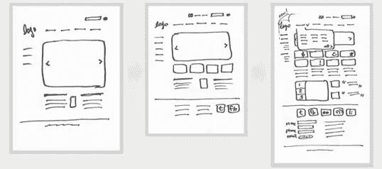

# 防止主页臃肿

> 原文：<https://www.sitepoint.com/preventing-a-bloated-homepage/>

主页是许多内部拉锯战的目标。在机构或公司中，不同的部门都想分一杯羹。在较小的公司里，产品或服务倡导者为他们的宠物项目游说，以获得“聚光灯”的空间。即使在你自己的个人网站上，在主页上给每样东西至少一点关注也是很诱人的，因为你不想遗漏任何东西。

无论你是在更新一个现有的网站还是从头开始，不可避免的压力总会在某个时候到来。

## 

## 主页到底有多重要？

每一次关于主页的对话都应该根据其目的来组织。您的分析数据可以帮助您解决这个问题:

*   人们在什么时候进入你的网站？
*   大多数访问者是在搜索特定的术语并通过内部页面进入的吗？
*   对于通过你的主页进入的人来说，他们是通过电子邮件活动、直接通过输入 URL 还是通过推荐网站进入的？
*   人们是在什么时候访问主页的？他们在那里呆多久？他们下一步去哪里？

例如，你和你的利益相关者可能会惊讶地发现，你主页的大部分流量都来自于某种类型的推荐人。或者，大多数完成重要转换(比如注册服务)的访问者甚至从来没有看过主页。如果你能找到这种类型的信息，这将有助于消除主页之争中的情绪。它还会帮助你缩小主页上真正需要的内容。

## 这里谁负责？

毫不奇怪，决策者擅长做决定。他们也倾向于尊重权威。这就是为什么从第一天开始，通过赢得他们的尊重来建立你的权威是很重要的。如果你这样做了，他们会重视并寻求你的指导(注意:这不同于总是同意你)。如果你不这样做，他们会替你做决定，你将失去对项目的控制。当你的意见受到尊重时，你可以安全地进入对话，挑战假设，而不会有防御性。

即使你有权威，如果你不知道内容的目的和层次，你也不能保持主页的健康整洁。询问利益相关者、经理或所有者什么内容是最重要的，这真的很有诱惑力，因为它看起来非常有效。不幸的是，这很容易导致一个专为首席执行官和经理制作的主页，但你的目标受众几乎无法理解。让你与他们的对话成为围绕你的核心受众的研究和规划过程的一部分。

## 对吱吱响的轮子有个计划。

似乎有一个规律是，一旦你对你的网站做了最后的润色，有人就会变得不正常:“XYZ 计划怎么样了？！它将在两周内发布，并且需要放在主页上。我们需要更多的社交媒体链接，任何人都可以告诉你。这比你提到的 A、B、C 更重要。”这导致内容被塞进一个没有空间的完整设计中。

通常，那些在最后一刻提出批评或危机的人并没有参与计划过程。这可能是一个棘手的情况，但有几件事可以帮助你:

*   通常，这是内部问题的外部症状。如果这是一个需要在组织内部解决的问题，那么不要试图自己解决。
*   将他们所说的内容从他们的情绪背景中抽离出来，并对其进行评估。他们可能有一个被忽视的合理担忧。
*   帮助教育他们主页可用性[指南](http://www.useit.com/homepageusability/guidelines.html)。
*   您的文档、签署的协议和变更单是您的朋友。理想情况下，您可以引用以前的文档，在该文档中，团队批准了您的主页计划。如果您与一家公司签订合同，如果当前网站被签署，并且这些编辑需要变更单，问题可能会突然变得不那么紧急。

如果不符合项目的最大利益，就不要让吱吱响的轮子得到润滑油！这给其他人传递了一个失败的信息，对你的网站访问者没有帮助。

## 分享这篇文章