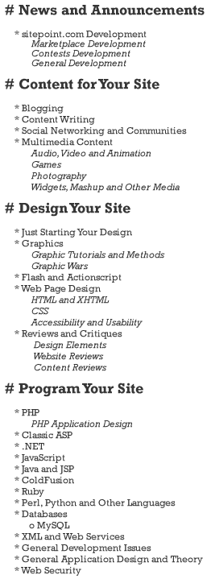
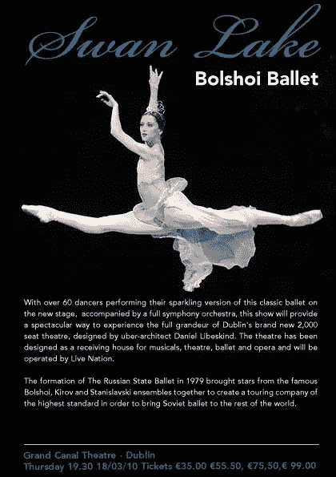

# 设计原则:接近

> 原文：<https://www.sitepoint.com/principles-of-design-proximity/>

设计中的接近仅仅意味着彼此靠近的物体被视为一个整体。这真的很简单，而且是你每天都能看到的。在你的网页或名片上，相关信息紧密地放在一起，形成一个视觉单元。

通常，当人们开始设计时，会有一种诱惑，那就是把页面上的所有东西都扔掉，用文字和图像填满每一平方厘米的空间。但是，它使信息难以消化，真的不好看。

利用邻近原则，你会发现当你把那些有共同点的条目分组，把那些没有共同点的条目分开时，一个清晰的视觉层次就会在页面上显现出来。这就是接近的意义所在。我们来看几个例子。

一个实际的例子是列表，例如博客中的侧边栏。博客边栏通常由类别、链接和最近发表的文章等列表组成。

下图显示了相同项目的两个列表。在左边，很难涉水通过所有的项目，因为他们同样密切在一起，而在右边，你立即看到某些项目符合逻辑。

我们可以根据邻近定律进一步扩展我们的列表，创建更多的逻辑分组，并在不应该分组的项目之间留出空间。

您现在可以很容易地看到，列表的每个部分都有子部分。即使你对这个列表的内容一无所知，你也可以看到一些条目彼此非常接近，这意味着它们以某种方式相关联。

我应用了另一个设计原则，对比，以使标题突出并吸引眼球。即使从这个简单的例子中，你也可以看到邻近性使页面变得更有组织性。各部分之间的空白也是设计和组织的一部分。

为了给你另一个如何改进设计的例子，让我们来看看莫斯科大剧院芭蕾舞团自制的传单。我们都见过看起来有点像这个的传单。

页面上有很多文字，有些糟糕的剪贴画真的没什么用，还有一些文字在底部斜上方浮动，拼命想抓住眼球。很难一目了然地看到信息，例如它在哪里，它是关于什么的，小图像是令人分心的东西，而不是有用的设计元素。

为了改进这个设计，我首先把信息分成逻辑组。
1。活动名称和艺术家
2。事件的一般信息
3。在哪里上演，多少钱？

然后，我寻找一个合适的醒目的图像添加到设计中。没有一个设计原则是单独起作用的，在这里我应用了对齐原则，所以所有的文本从左到右与芭蕾舞演员伸出的腿一样宽。传单的两边都有很大的空白。《天鹅湖》中的深蓝色和门票信息是从芭蕾舞演员的礼服上取样的。

芭蕾舞女演员图片来源:[Ballet.co.uk](http://www.ballet.co.uk)

这张传单不会点燃设计界，但它是对原始传单的改进，使用了接近度、对齐度和对比度。很容易找到信息，当然也更吸引人。

综上所述，接近的主要目的是组织信息。您应该在文本和其他元素周围留出足够的空白，这样您才能真正看到将项目组合在一起的效果。当你阅读杂志、传单和网站时，睁大你的眼睛，看看其他设计师是如何使用接近度的，请随意分享你喜欢的设计的链接。

## 分享这篇文章