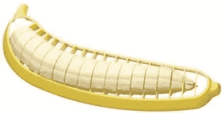
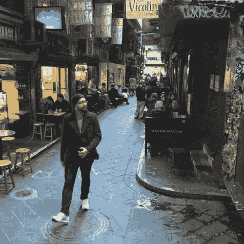
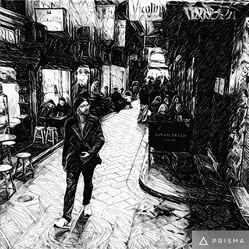
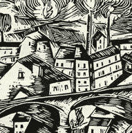
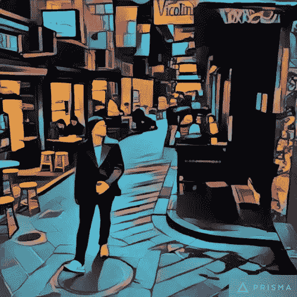
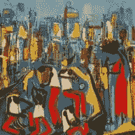
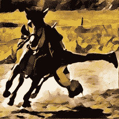

# Prisma:一招小马过滤器的兴衰

> 原文：<https://www.sitepoint.com/prisma-the-rise-and-fall-and-rise-of-the-one-trick-pony/>

回到 Photoshop 的早期——姑且称之为“BC”…“T0”在 CS 之前——第三方图像滤镜被认为非常重要。如果没有[凯的电动工具](https://en.wikipedia.org/wiki/Kai%27s_Power_Tools)和[外星人皮肤眼睛糖](http://www.alienskin.com/eyecandy/)的拷贝，你的 Photoshop 安装被认为几乎是赤裸裸的。

但这是 ***也是*** 的黄金时代，我将称之为‘一招-小马’滤镜。这些是 photoshop 滤镜，用来以一种非常特殊的方式 呈现 ***一种非常特殊的效果*** 。一招过滤器的经典示例包括:

*   页面卷曲过滤器
*   拼图玩具过滤器
*   色调分离滤镜

Page Curl, Jigsaw and Posterize. ‘One-Trick-Pony’ Filters

这些过滤器有时很有趣——但它们有真正的、实际的商业用途吗？

不，不是真的。

由于很少控制输出，结果是不灵活的。更重要的是，对拼图效果和页面卷曲的设计需求并不比今天高——接近于零。我喜欢将这些一招小马过滤器与这个小美人进行比较——它被称为 [Fox Run 香蕉切片器](https://www.amazon.com/Fox-Run-4069-Banana-Slicer/dp/B00600JMV2)。

如果你需要将一定大小的香蕉切成精确的 10 毫米切片，男孩，这个宝贝可以帮你节省 ***字面秒*** ！**警告**:如果你需要更薄或更厚的切片，或者坚持用劣质、非标准的香蕉，我的朋友，Fox Run 可能不适合你！

像香蕉切片器一样，一招过滤器从未真正在设计界流行起来。正如没有一个职业厨师 会被香蕉切片器抓到一样，没有一个有自尊的*设计师会使用一招一式的过滤器。永远不会。*

 *或者……那是我一直相信的，直到 Prisma 出现——现在我不太确定了。

#### 那么，什么是 Prisma？

[Prisma](http://prisma-ai.com/) 是一款手机应用程序——[iOS](https://itunes.apple.com/au/app/prisma-art-filters-photo-effects/id1122649984?mt=8)和[Android](https://play.google.com/store/apps/details?id=com.neuralprisma&hl=en)——旨在为你的照片应用图像滤镜。它基本上是一个美化的 Instagram 过滤器。

它提供很少的调节控制。几乎没有什么技巧或真正的艺术表达。你选择一个过滤器，然后点击“开始”。从任何合理的角度来看，Prisma 都是一套*一技之长的*过滤器。

我*应该*讨厌 Prisma。我想。但我没有。

让我们看看它能做什么。首先，Prisma 是免费的，它提供了 29 种不同的滤镜效果，有着艺术的名字，如海森堡，导线，哥特式，马赛克，非法美丽和红头。

我将从我最近拍摄的一张照片开始，演示两个滤镜。你可以在那之后做决定。

The original photo

这第一个棱镜过滤器被称为“海森堡”,它有一个坚硬的，几乎木刻印刷外观。

Heisenberg

传统木刻设计

传统上，木刻版画是用雕刻工具制作的，这些工具往往会在木材表面挖出不完美的曲线。海森堡过滤器回应这些凹槽。

它粗糙而坚硬，但也有一种手工的，人文主义的优势，可以用在建筑，城市社会工作或小说作家的主题上。

这是用棱镜滤镜处理过的同一张照片，叫做“构图”。这是一个与海森堡非常不同的外观，但是，一个新鲜和强大的图像本身的权利。我不能声称创造了它，但我真的很喜欢它。

Composition

伊斯顿·戴维—鹿特丹爵士博物馆

“构图”赋予了这幅图像一种超级时髦的 50 年代爵士乐的感觉。我可以看到这种处理方法被用在音乐或活动杂志上，以形成一种非常强烈的视觉信号。

看看井盖上的边缘和脚上的形状。我觉得印象深刻。

## 它是如何工作的？

虽然 Prisma 通过手机应用程序 UI 工作，但图像处理似乎是在 Prisma 的服务器上进行的。这也需要一段时间——有时需要 20-30 秒才能返回一张照片，如果服务器超负荷的话，通常根本不需要。不管是不是一招一式，Prisma 似乎需要大量的计算能力来完成这些图像翻译。

这些过滤器大多参考一种艺术风格(漫画或钢笔画)或特定的艺术家(列支敦士登或毕加索)，但它们不是盲目的复制。

仔细看看上面的例子，你会发现 Prisma 已经做出了一些非常聪明的颜色和线条决定——哪些线条要去掉，哪些线条要强调，哪些颜色要对比。Prisma 背后驱动算法的思维是聪明而微妙的。

Prisma 中的哥特式效果

我也不想这么说，但是 Prisma 很酷。它可能不会让你的坏照片变好，但它能把你的好照片带到一个新的引人注目的地方。

是的，说到底，Prisma 是一匹只会一招的小马。

但是哎呀，这是一个很好的把戏。* 

## *分享这篇文章*