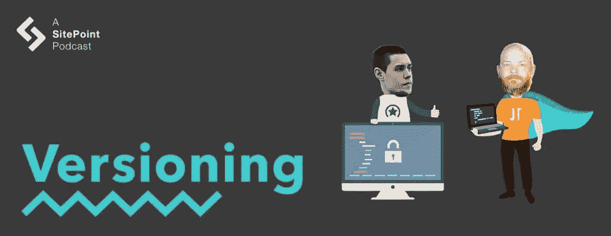

# 成为一名高效软件工程师的三个关键

> 原文：<https://www.sitepoint.com/productive-software-engineer/>

在版本控制节目的这一集中，David 和 Tim 将会看到成为一名高效的软件工程师意味着什么。他们讨论了相关性的关键因素(关注重要的事情)、质量(确保你的代码做它需要做的事情)和时间(拥有不受干扰地编码的空间)，以及支持性文化、审查代码、避免(太多)会议、翻鸟和 La-Z-Boys。

[https://w.soundcloud.com/player/?url=https%3A//api.soundcloud.com/tracks/320597510&color=ff5500&auto_play=false&hide_related=false&show_comments=true&show_user=true&show_reposts=false](https://w.soundcloud.com/player/?url=https%3A//api.soundcloud.com/tracks/320597510&color=ff5500&auto_play=false&hide_related=false&show_comments=true&show_user=true&show_reposts=false)

[访问版本控制展示主页](https://www.sitepoint.com/versioning-show/)

**[在 iTunes 上订阅](https://itunes.apple.com/us/podcast/the-versioning-show/id1135300597) | [在 Stitcher 上订阅](http://www.stitcher.com/podcast/sitepoint/the-versioning-show) | [查看所有剧集](https://www.sitepoint.com/blog/)**

## 显示注释

*   第 20 集的#holidaycode 标签
*   第 26 集，有阿扎特·马尔丹
*   *[深功](https://www.amazon.com/Deep-Work-Focused-Success-Distracted/dp/1455586692)*
*   [触发习惯，来自第 17 集](https://www.sitepoint.com/versioning-show-episode-17-what-makes-a-good-engineer/)
*   在推特上打招呼:[@ mdavid green](https://twitter.com/mdavidgreen)|[@ tevko](https://twitter.com/tevko)|[@ versioningshow](https://twitter.com/versioningshow)|[@ sitepointdotcom](https://twitter.com/sitepointdotcom)

## 谈话要点

> 你可以把效率定义为在短时间内完成很多事情，但这似乎并没有真正包含什么是高效的，因为我可以做很多工作，而且这些工作可能很糟糕。

* * *

> 你需要确保你正在做的工作与一组特定的任务特别相关。

* * *

> 一个巨大的好生产力是一种支持它的文化。如果每次我被拉去开会，都没有会议议程，我就无法高效工作。我们都需要支持来确保我们的生产力。一个没有生产力的组织不会产生有生产力的个人。

* * *

> 如果你在一家公司工作，你很难完成工作，这可能是一个组织问题，在这种情况下，坐在这里试图写下生产力的教训不会有太大的帮助。在这种情况下，有意义的做法是找个人谈谈，找一个更高层的人谈谈。

* * *

> 如果我专注于提高工作效率，我会投资于工作的质量方面。富有成效不一定总是与速度有关。

* * *

> 如果你正在做的事情会破坏代码库并在未来导致技术债务，那么就你正在构建的产品而言，它与产品无关，即使它与满足特定的截止日期有关。

* * *

> 在某些情况下，在某些场景下，根本不可能高效。

* * *

> 如果你被迫在很短的时间内做大量的快速工作，并且你正在做的工作不是临时的，这意味着没有人会去关注它以确保它被重构或迭代，但是它已经融入到你的生产应用程序中，这很可能是一个你不可能有生产力的场景。

* * *

> 对我来说，问题是很多这样的会议是临时召开的，它们是随机出现的，它们出现得很快，它们是由没有权力组织会议的人组织的。

* * *

> 我认为一次好的会议可以避免十次糟糕的会议。

* * *

> 拥有不受干扰的工作时间是工程师最喜欢的。

* * *

> 最近，我决定快速浏览社交媒体，因为我发现自己有这样一种倾向:在 Twitter 和脸书上随意查看一下，看看外面发生了什么，从而打断自己的一天。

* * *

> 当然，那些如今如此流行的开放式平面工作空间，对许多人来说是另一个生产力问题。

## 副本

David:

嘿，大家好吗？这是大卫·格林先生…

Tim:

…这位是蒂姆·埃夫科…

David:

…您正在收听的是版本控制播客第 28 集。

Tim:

这是一个我们聚在一起讨论 web 行业的地方，从开发到设计，一些人今天正在实现它，并计划它在下一个版本中的发展方向。

David:

今天，Tim 和我将谈谈作为一名工程师的生产力——它意味着什么，它对我们意味着什么，我们见过的有效的东西，以及我们见过的*无效的东西。所以，让我们开始这个版本吧。*

Tim:

大卫，我们需要问自己一个哲学问题。

David:

我认为一个非常好的哲学问题是生产力意味着什么？

Tim:

哦，这个不错。你知道吗，在我们准备这一集之前，我就在想这件事了。

David:

好吧，既然我们同意做一集关于生产力的节目，我很高兴你能考虑一下。

Tim:

因此是多产的。我想你可以把效率定义为在短时间内完成很多事情，但这似乎并没有真正包含什么是高效，因为我可以做很多工作，而且这些工作可能很糟糕。

David:

绝对的。或者你可以做很多实际上没有任何价值的工作，就像一个老笑话，按照工程师每天写的代码行数来支付报酬。

Tim:

是的，那是非常真实的。也许我们可以说，高效就是在你分配给自己的时间内完成高质量和相关的工作。

David:

那对我有用。这给了我们三个可以利用的因素。我们有质量，有相关性，还有时间因素。

Tim:

我试图提出一个铁一般的法律定义，一个我们无法提出警告的定义。

David:

*【笑】*先从这个开始吧，看看会不会遇到什么问题。

Tim:

好吧。首先，我认为是相关性。

David:

好的，相关性是什么是生产力的一个因素？

Tim:

当我想到相关性时，我曾在一些公司工作过，在那里我看到同事们总是非常忙碌，无论是被拉去参加附带会议，还是回复一堆电子邮件，或者志愿参加即兴任务。大多数工作中的人总是很忙，但我真的觉得如果你想完成工作并富有成效，那么你需要确保你正在做的工作与一组特定的任务特别相关。也就是说，我不能在周一走进工作间告诉自己，“我今天要完成很多事情。”我想去，周一走进工作间说，“我今天要把 X 做完。”这意味着我想做的工作不是回复电子邮件，也不是审查一大堆拉动请求，或者被拉去参加一千个不同的会议，或者自愿去吃团队午餐。我想确保我正在做的富有成效的工作与特定的任务相关。

David:

想出一些与团队实际需要相关的东西肯定会是其中的一部分，因为我同意，你不能只是进去，开始到处扔文件，然后觉得自己很有效率。如果你对每个人想要什么没有一致的意见，每个人都在前进，如果你对一个产品将会是什么没有共同的共识，你真的不知道什么是有生产力的。因为你可能在你个人认为非常重要的事情上非常有成效，但这对你的团队或公司没有任何价值。如果你在为自己工作，就像你在为一个更大的组织工作一样，这可能是真的，因为你可能会掉进一个兔子洞，在引起你注意的事情上很有成效，但在你想要实现的整体愿景方面却没有成效。

Tim:

我认为这意味着定义相关的工作就是建立具体的任务。如果我想富有成效，我认为第一步是列出一组具体的任务，如果完成了，就意味着手头的工作完成了。

David [3:57]:

我认为任务可能太超前了，因为一旦你分解了愿景和目标，任务就是。我认为，也许生产力必须从拥有共同的愿景和目标开始，生产力的一部分可以是定义这些任务。

我曾是一名敏捷教练，我喜欢帮助团队弄清楚如何定义他们试图完成的目标，然后如何将其分解成他们可以设法完成的事情，并弄清楚他们如何进行评估。对我来说，当产品所有者开始思考“我们产品的下一个迭代会是什么？”时，生产力就开始了然后，通过不同的阶段，直到团队真正提出任务，定义它们，评估它们，然后开始工作。所有这些作品对我来说都是富有成效的。

Tim:

我认为这是有道理的。那么，我们该如何定义我们需要完成的工作呢？

David:

我想这是一种权威。有人需要有权力来决定什么是相关的，什么是不相关的，因为相关性是我们在这一点上谈论的，你必须能够有这样的人，他可以说，“这在我们需要工作的范围之内，这在范围之外。”然后你需要在这种情况下达成普遍共识，这样我们需要做的工作就可以更清楚地定义，然后分发给人们，这样他们就可以将其分解为他们可以开始工作的单个任务——他们已经做好准备，他们有资源，他们理解，他们已经充分估计，他们有时间完成的任务。

Tim:

我很高兴我们谈到了这一点，因为我真的相信一个巨大的好的生产力是一种支持它的文化。如果每次我被拉去开会，都没有会议议程，我就无法高效工作。我们都需要支持来确保我们的生产力。一个没有生产力的组织不会产生有生产力的个人。

David:

当然，我同意。你提出会议。作为一个做过敏捷教练的人，我为自己组织的会议多得你都数不过来而感到内疚，但我强调要确保这些会议是富有成效的。你提到了制定议程的问题:会议必须有一些结果，人们可以带着这些结果离开，每个人都必须同意，参加这些会议是对他们时间的一种很好的投资。否则，整个文化必须决定这些会议不再有价值。

Tim:

我想说的第一点也是最重要的一点是，如果你在听，并且你在一个效率低下的组织中工作，如果你发现你自己在工作中效率低下，不要责备自己。如果你是自由职业者，那么我不会对此说什么！*【笑声】*如果你在一家公司工作，你很难把事情做好，这可能是一个组织问题，在这种情况下，坐在这里试图写下生产力的经验教训不会有太大的帮助。在这种情况下，有意义的做法是找个人谈谈，找一个更高层的人谈谈。与你组织中的任何人交谈，概述“嘿，听着，我们没有生产力。这是公司固有的，我们需要解决这个问题。”

David:

那是极好的建议。当我开始从事敏捷教练时，我是一个团队的工程师。我的正式角色不是 scrum 大师、教练或类似的角色。我看到了我周围的苦难，我看到工程师们在一种环境中以一种非生产性的方式工作，在这种环境中，他们被推倒和压制，无法完成他们的工作。我和其他一些人合作——一名设计师，几名工程师——我们只是推进议程——这是需要改变的事情。这需要很大的努力，因为有一个根深蒂固的制度，但这是可能的。

当管理层认识到召开生产力会议的价值，并有能力了解人们正在做什么，并有一个共同的愿景时，你可以将这作为一种文化传播到组织中。

Tim [7:50]:

是的，我觉得很有道理。首先，雇佣大卫，这样你的组织可以更有效率。这是我们学到的一课。*【咯咯地笑】*

其次，假设我们在一个高效的组织中工作，我们有既定的任务。现在，转到个人，我正看着我的 JIRA 板，或白板，或其他东西，上面有为我概述的任务。比方说，我有五个。我如何变得富有成效？我周一早上走路，我有这五个任务，然后呢？

David:

那么，当你有这五项任务时，是什么阻碍了你的工作效率呢？为什么你有五个而不是一个？

Tim:

这是一个很好的例子，因为现在我在工作中有大约五项任务，所以我是我目前工作的组织的首席前端工程师，这意味着我有几项责任。第一，我需要检查所有涉及前端代码的拉请求。我需要确保不违反林挺规则，代码有意义，并且对于下一个进入并查看它的工程师是可读的，我们使用通用的设计模式，并且在编写新的方法或类或类似性质的东西时，我们不会太频繁地重复自己。然后，我需要建立实际的功能。例如，我最近一直在做的一件事是国际化，我不得不从我们当前的应用程序中取出每一个面向用户的字符串，这很糟糕。

David:

我去过那里。

Tim:

根据我的职责，我有几个不同的任务，但它们都是我需要完成的任务。所以，如果我想尽可能高效地完成这些任务，我会说我的第一个倾向是按照完成它们所花的时间来排序。

David:

这是一个有趣的方法。让我用一种稍微不同的方式来理解它。让我问你，这听起来像是你的任务之一——你在这里为我定义的实际上听起来像是两个任务。一个是代码质量，一个是实际的代码开发。

Tim:

是的。

David:

在我看来，就检查其他人的代码而言，作为首席前端工程师，你所负责的所有事情都归结于代码质量。这是从代码审查和与人的配对会议中产生的一种东西。除此之外，你还有一些你负责从头开始开发的任务，这些任务需要其他人来审核，因为你总是需要第二双眼睛来看事情。

Tim:

当然了。

David:

除非你已经在结对编程环境中做过了，这也是我强烈推荐的。但是我很好奇，当你说生产力的时候，关于这一点，当你花时间审查别人的代码的时候，你觉得你不是生产力吗？

Tim:

哦，我认为这绝对是非常高效的事情——原因有很多。回顾别人的代码，第一，我总是能学到东西。当我看别人的代码时，我总是能学到东西。第二，我可以对写单行语句的人大喊大叫。

David:

对人大喊大叫总是很有趣。

Tim:

不，但我真正的意思是当我看到可能导致糟糕代码库的代码模式时，例如，编写嵌套的`if`语句。我现在在这个`if`语句主题上，我不知道为什么，但是例如，如果我看到 if 条件，和 if 条件 2，然后在 if 条件 1 和条件 2，而不是条件 3，我会看着它说，“嘿，我们可能有更好的方法可以做到这一点”。我这么说的原因并不是因为我迂腐。这是因为，如果这种模式在代码库的其余部分继续存在，最终有人会看到这种情况，但不知道发生了什么，并且会有一段艰难的时间——可能会多花 15 分钟——来消化它，而他们本可以看到三个独立的、未嵌入的 if 语句，并清楚地理解发生了什么。因此，我看到了它的许多好处，但我认为最重要的是确保一个干净简洁的代码库保持这种方式，即使很多人都在工作。

David [12:02]:

你对三元运算符有什么看法？

Tim:

事实上，我今天留了一条评论，要求一位同事做出改变。有一个可变的任务。我们让变量 X 等于 Y，然后在它下面，是<q>如果其他条件为真，让变量 X 等于 Z 而不是 Y</q> 。我说，“这是一个三元运算符的完美例子，因为我们不需要有条件地重新分配那个变量，我们可以在一行中完成，然后说，‘这个变量或者等于 X，或者取决于 N 的值，它等于 y’。”

David:

太棒了。我喜欢的是，你强烈反对这些嵌套的条件，但你认识到三元运算符的价值，因为它们实际上增加了代码的清晰度。我认为很多人把这两者混为一谈。

Tim:

是啊。不要跑题，但我认为代码清晰极其重要，比代码简洁更重要。我写过强调简洁的代码，但第二天看完之后，我会把它全部删除，然后重新开始……不止一次。

David:

嗯，这很有意思。某种程度上，我们已经改变了。我们已经从相关性到质量，这是我们生产力的第二个标准。

Tim:

哦，是的。

David:

我们在那里是有意义的，因为我们正在讨论什么是生产力，正如你提到的，审查他人代码的过程是生产力的一部分。这并不意味着你不工作只是因为你不工作在你自己的代码上。

Tim:

是的，就质量而言，我认为它是高效的基础，因为我可以在一小时内完成六件事情。我可以关闭我所有的票，最终以这样一种方式完成这六件事，要么是我，要么希望不是，但我的另一个队友将不得不进去重做。然后，我们花了两倍的时间来完成一件事，实际上将我们的生产力减半。

David:

是的，这可能是事实的一半，这也是结对编程最终在团队中如此有价值的原因之一，因为你错过了那些问题。你可以在你的代码中获得更好的一致性，虽然你有两个工程师同时工作在同一段代码上，并且可以说他们不会比他们单独工作时更快地产生那段特定的代码，但在创建这段代码时的来回讨论的数量，以及两个人都从他们所做的事情中学到了一些东西的感觉，从而有了共享的知识，最终提高了整个团队的生产率和代码库的质量。

Tim:

所以我认为重要的是要记住，即使我可能有堆积如山的工作要做，重要的是集中精力不要很快完成它。重要的是专注于存在或行动。不同之处在于，如果我专注于提高工作效率，我会投资于工作的质量方面。富有成效不一定总是与速度有关。而是把事情做好。我想我们可以就此打住。它是关于把事情做好，其中一部分意味着及时完成。另一部分意味着彻底完成，不走捷径。

David:

有很多潜在的捷径，我认为工程师经常被鼓励使用这些捷径，特别是当人们被期望满足最后期限的时候。“本周将有一个版本发布，所以我们绝对必须把它发布出去，所以现在不要担心质量，只是把它发布出去。然后，我们就可以回过头来彻底解决这个问题。”

Tim:

我认为我们应该花几分钟来谈谈这个问题，因为无论你在职业生涯的哪个阶段，你要么已经经历过这样的情况，要么你将会经历这样的情况。不管你是不是个体户，它都会发生。就像我说的，我们总是会遇到这种情况。困难的是有时候没有其他选择。如果我的经理走过来对我说，“嘿，这件事明天必须完成。你以前从未见过它，它是新的，有点令人困惑，但它必须在明天完成，祝你好运。”我可能没有办法摆脱它。这可能是一次消防演习和一些必须发生的事情。会很糟糕的。它很可能会马上变成技术债务，并且它可能是也可能不是你以后要重构的东西。

David [16:34]:

这是我最欣赏敏捷过程的地方之一，当类似的事情发生时，有一个 scrum 大师会说，“这是否足够紧急，我们需要中断 sprint 并开始一个新的 sprint 来支持它，或者我们正在失去资源，所以我们在这个特定的 sprint 上丢分，因此，我们降低了团队的整体速度？”这是一个做出权衡和决定的问题。它发生的频率成为需要在定期回顾会上讨论的事情，因为如果它开始定期发生，那么它就是一个问题。

当你有一个团队，他们在如何管理他们的时间，什么是允许的，什么是不允许的方面没有任何协议，就把工程师从一项任务中带走，打断他们的流程，以便处理一些紧急的事情，你没有机会做出这些决定，看看发生了什么。

Tim:

大卫，我想提出一个想法，并告诉我你对此的看法。我要说的是，在这种情况下，你被拉到一边，给了一件绝对必须在不可能的时间内完成的事情——而且你没有办法推回去，我认为生产力这个概念本身就过时了。

David:

实际上，我对此表示支持，因为你已经立即摆脱了生产力中的质量因素。我们一致认为，为了富有成效，你正在做的工作必须是高质量的。你正在做的事情是否相关是有争议的，因为如果你正在做的事情会破坏代码库并在未来导致技术债务，那么就你正在构建的产品而言，它与产品无关，即使它与满足特定的截止日期相关。

Tim:

我认为我们已经取得了非常重要的突破。这就是说，在某些情况下，在某些场景下，根本不可能富有成效。这在很大程度上取决于工作场所的文化。例如，如果你在一家初创公司工作，有一天，董事会说，“我们需要这项功能，我们现在就需要，让它实现，”出于某种原因，它只是落在你的肩上，这不是一个你可以富有成效的场景。这可能意味着你一直工作到午夜，而这个特性必须被淘汰，而且很有可能在几周或几个月后被重写。在这种情况下，你不应该对自己说，“我怎样才能最有效率地完成这件事？”因为你是被陷害的，基本上；你得到的东西，本质上是一种非生产性的东西。

David:

我喜欢这个，我要把这个扔给你，因为你提出了一个有趣的场景，因为你说，“如果你在一家初创公司工作。”有一种情况是完全有效和高效的，在这种情况下，编写混乱、糟糕的代码会将技术债务引入到产品质量环境中，这与编写混乱、糟糕的代码不同，这种代码允许您进行一些用户体验测试，评估一些东西，然后迭代一些东西，这样您就可以决定将来编写什么样的代码是高效的。在这种情况下，我认为这是可能的——编写我们之前称之为#holidaycode 的 hashtag，以便完成一些事情，然后出门，这样人们就可以开始使用它，这样你就可以开始获得关于它的反馈——实际上是富有成效的，不是在构建你的生产代码库方面，而是在推动公司前进到他们知道你应该在未来编写什么作为生产质量代码方面。

Tim [20:02]:

所以我会说，我的对位是这样的。这是一场赌博，因为你实际上不知道你正在编写的假日代码是否不会破坏一个核心功能，或者它不会导致严重的用户体验问题，从而使用户远离你的产品。这种行为经常发生吗？用户是否经常登录你的产品，发现一些没有经过深思熟虑的新决策，导致他们的 UX 发生冲突，并使他们远离你作为企业为他们(用户)设定的目标。我认为有很多因素可以决定这种假日代码流程的成败。现在，如果是像这样的事情，“嘿，让我们把电子邮件地址捕获的东西变成一个工具提示，而不是一个模态”，你写一些乱七八糟的代码来做到这一点，那么也许，是的。也许在这种情况下，已经开始的过程不会慢慢变成某种技术债务。但是，如果它确实渗透到技术债务中，而不是某种迭代和逐渐变好的过程，那么我会说它仍然处于非生产状态。

我再次认为，取决于它是如何呈现的，就它是否真的有益而言，这是一场赌博。

David:

在我看来，我们要做的是，如果你将不得不编写非生产性代码——我们定义为非生产性代码，一些暂时的、紧急的代码——关键是你要有一个系统，允许你将这些代码与你的代码库的其余部分隔离开来， 因此，如果需要的话，它可以独立地回滚到以前的状态，这样它就可以放在一个金丝雀服务器上，这样它就可以提供给 10%的观众，看看他们对它的反应，看看是否有问题出现。 但是，如果您是针对已经有用户群并且已经具备产品质量的代码进行测试，那么这个测试过程是必不可少的。

Tim:

我认为你触及了一些关键的东西，那就是它是暂时的。我认为，如果这是暂时的，它仍然可以肯定是富有成效的。例如，如果你的截止日期突然提前了，你需要在三天内完成 75%的申请，这不是暂时的。因此，我会说这是没有成效的。

David:

老实说，我可以说早在 2008 年就有我编写的临时代码在生产中，并且仍然存在。您可以转到该域，单击 URL，就可以在浏览器中看到代码。<q>暂时的</q>很难定义。一旦你有了某样东西，它就会一直留在那里，直到有东西来取代它，除非有人负责确保临时的东西被永久和强大的东西取代。在我看来，拥有所有权是生产力的一部分。

Tim:

我想我们可以同意，存在着一种不可能富有成效的情况，但这种情况本身可以有所不同。我们所知道的是，如果你被迫在很短的时间内做大量的快速工作，并且你正在做的工作不会是临时的，这意味着没有人会照顾它以确保它被重构或迭代，但它会融入到你的生产应用程序中，这很可能是一种你不可能有生产力的场景。

David:

我同意。有趣的是，我注意到我们已经设法不谈论生产力的一个方面，我认为这是我们两人在一开始就提到的第一个方面，那就是组织你的时间以提高生产力。在最开始的时候，我们开始谈论一些关于会议的事情，以及当我们试图作为工程师工作时，会议是如何打断我们的工作流程的。我认为这是我们需要更具体提出的东西，因为生产力的第三个组成部分，我们有质量，我们有相关性，然后我们有时间来完成事情。这意味着给工程师集中精力和时间不间断地工作。

Tim [24:16]:

我有一些东西要分享，它可能是坏的，也可能是好的——大卫，我将不得不依靠你来告诉我它是坏的。开始了。我曾经共事过的每个人，过去的和现在的，都知道我在内心深处讨厌开会。我允许这个关于我的趣闻持续下去，因为这意味着我至少被邀请参加会议是可选的，这意味着如果有人想让我参加会议，他们会说，“这是可选的，你不必来，”或者它来自更高的位置，我没有借口，我必须去。但这是一个对我有效的策略。这是一种策略，确保我不会被要求参加很多会议，只参加真正重要的会议，通常我没有参加或不参加的选择。但这也让我有更多的时间去做实际的工作。

David:

明年，Tim Evko 将出版一本关于如何避免被邀请参加会议的书*。*

Tim:

甚至会有插图。大部分插图都是我翻桌子。

*【笑声】*

David:

或者翻鸟。

Tim:

好吧，我们走着瞧。我真的画不了手，但我们会试试。

*【笑声】*

David:

很有意思。我认为你对会议的感觉就像许多工程师对会议的感觉一样。我自己也有这种感觉。问题是，这个会议是否有议程，是否相关，我想我可以增加它的价值。当我被邀请参加一个会议时，我只是在那里做一个占位符，并确保房间里的每个人都听到那个人所说的话，这个人可能已经被某人总结并在事后通过电子邮件发送给每个人，这是一个我不需要参加的会议。另一方面，如果我在一个会议上，需要我的专业知识来对正在讨论的事情提供反馈，如果在那个会议上做出的决定没有我的意见，它可能会影响我和我以后的工作，那么我非常想参加那个会议。

Tim:

是啊，这是真的。这是一种微妙的平衡。我很内向，所以我不经常尝试进入这样的情况:我在一个房间里呆三个小时，每个人都在谈论一些事情。我尽量把它保持在最低限度。但是很多时候，我确实觉得我可能应该在这个房间里，因为我们正在谈论一个前端开发人员将不得不构建的功能，它将影响许多用户。而且，我不知道，我想确保我们不会把一半的页面固定在窗口上，这样当有人滚动时，就会像滑坡一样发生。你知道，诸如此类。

David:

对我来说，问题是很多这样的会议是临时召开的，它们是随机出现的，它们出现得很快，它们是由没有权力组织会议的人组织的。这也是——我要说的是——为什么我一直被敏捷所吸引，因为我是那些召集整个工程团队在一个房间里坐下来讨论事情的人之一，这让当时房间里所有内向的人都很恼火。但是那次会议有一个议程，它有一个非常明确的目的，它向前推进。它以这样一种方式组织事情，以至于许多随机出现的会打断工程师工作的其他会议被取消了——因为我们每周一次、每两周一次、每次冲刺一次这样的会议，每个人都去参加，每个人都有机会参与并表达他们的关注。

Tim:

是的，我同意。我认为一次好的会议可以避免十次糟糕的会议。

David:

是的，消除其他会议的会议就是我所说的会议。没有人想参加会议，因为除了那些喜欢听自己说话并把它视为权力游戏的人之外，会议对任何人来说都不是很有成效。拥有不受干扰的工作时间是工程师最喜欢的。我认为——研究表明了什么？—如果你正在做某件事，并且正在全神贯注，但是你被某人打断了，他只是拍拍你的肩膀说，“嘿，你想喝杯咖啡吗？”你将有 20 分钟时间让自己回到被打断前的状态。

Tim [28:20]:

是的，我大概有 20 分钟左右。我从来没有真正喜欢过。我不知道为什么，但这仅仅是轻拍的动作——这让我很不爽，是的。

但不管怎样，这不仅仅是会议。还有其他的事情…好吧，让我们这么说吧，如果我们想非常专注地完成某件事，并把很多注意力放在完成一项特定的任务上，我们想为自己设定，我不知道，几个小时的注意力。我会花两三个小时来做这件事。在那之后，也许我要休息一下，也许吃午饭，或者只是——我不知道——做他们过去常常做的事情，从你的座位上站起来。

David:

从各方面来看，站起来都是一件好事。最近，我决定快速浏览社交媒体，因为我发现自己有这样一种倾向:在 Twitter 和脸书上随意查看一下，看看外面发生了什么，从而打断自己的一天。我意识到我会被这些会把我吸进去的小漩涡困住，之后我的思想会被我所看到的分散，我将无法专注于我正在努力思考的工作。

所以我决定给自己安排一段时间，在这段时间里我不会查看我的社交媒体——你知道，关闭事情通知。电子邮件什么的都可以，但是要花几个小时集中注意力。我很惊讶，因为我以为它会给我带来更多的生产力，但我惊讶于它实际上给我的一天带来了多少生产力。在一天结束的时候，我看着我已经完成的事情，我已经做了比我一周内能够做的还要多的事情，试图在努力工作的同时思考所有这些其他的事情。

Tim:

是啊，说得好。一天下来加起来就是几个小时，真的。当你想一想，有人发了关于政治的微博，我会花 30 分钟思考他们微博的结论，然后突然，一天结束了，我大概做了三件事。

大卫，你提醒了我一件事，那就是不仅仅是社交媒体。例如，我最近意识到的帮助我变得更有效率的事情之一是工作邮件。我一天可能会收到 50 封这样的邮件，出于某种原因，我脑子里一直有这样的想法:一收到工作邮件，我就需要阅读并回复那封工作邮件。

我越想越觉得这说不通。如果我正在编写一些 UI 功能的代码，审查一个拉取请求或我正在做的任何事情，或者如果我正在为自己设定的完成一组特定任务的许多三小时工作冲刺中，我可以让那些工作邮件离开。当我完成这三个小时的时间后，看看我需要的电子邮件，因为如果有人来到我的办公桌前说，“嘿，蒂姆，你没看到我 30 分钟前发给你的电子邮件吗？”我说，“不，对不起。我正在开发这个功能。”这似乎是一个公平的回应，因为我正在做*工作*。

我想我们已经意识到，很多时候有人会走过来对我们说，“你没有回复我的邮件。你是个糟糕的员工。”如果你确实在做一些相关的事情，而你没有回复邮件，你实际上比回复一封邮件做得更好。我认为，如果让你查看那封邮件的人希望你无论什么时候收到邮件都不要工作，他们真的需要重新审视这种行为。

David [31:42]:

我同意。这是另一个文化问题，非常类似于同意什么是值得努力的，团队工作的目标应该是什么。

我所知道的一件事是，我在许多团队中工作过，他们都同意，每个人都将不间断地工作几个小时，但每个人都有空闲的时间在后台运行。每个人都在闲聊一些事情。当然，每当 Slack 上出现一些你需要阅读的东西，或者出现一个你想评论的 GIF，它都会分散你对工作的注意力，你在那里创造了一个很好的社交团队环境。但是你不允许人们有生产性的、不受干扰的时间去做事情。就帮助团队记录和交流的方式而言，我是 Slack 的忠实粉丝，但是让它在后台运行可能会令人难以置信地分心。

我最近采访了一个家伙。他是一名独立承包商，当他开始与客户合作时，他会让客户签署一份协议，承诺他不会回复任何通过电子邮件提出的工作请求。他建立了一个系统，通过这个系统他们可以提交一张票，这张票必须有一定的参数。当那张票进入系统，它将被引导，它将被处理。但是如果有人通过电子邮件给他写信，他不会回复。然后，当他们回来对他说，“嘿，你为什么不回我的邮件，”他指出，“你同意了。这是我们同意的工作方式。”事先达成这样的协议是有意义的。

Tim:

哦，是的，我非常想要那个协议，不是因为我会有另一个系统。只是因为电子邮件不好玩。

David:

嗯，比如说，JIRA 的票。

Tim:

是的，是的，当然。我很高兴你提到了 Slack，因为对于 Slack 是否有助于提高生产力，我还没有定论。因为，就像电子邮件难题一样，Slack 对注意力的要求更高，因为如果有人给我发消息，会发生两件事。如果我没有回复，五分钟后我会在手机上收到通知，然后 10 分钟后可能会收到电子邮件，这意味着每当我收到一条松弛的消息，我都需要立即回复。也许我应该做的是，同样，我有三个小时的概念，其中我只做一件特定的事情。在这段时间里，我可能应该把 Slack 设置成“请勿打扰”模式之类的。

David:

当我发现 Slack 有退出的选项时…这是一个你实际上可以偶尔关闭的应用程序，当我试图工作时，我就开始关闭它。我的生产力猛增。

Tim:

是的，我想是的。我在孵化器里工作，所以我的同事就在我正对面的一张小木桌上。所以没有懈怠不会导致我们公司的崩溃。

David:

确实如此。当然，那些如今如此流行的开放式平面工作空间，对许多人来说是另一个生产力问题。

Tim:

是的，我会说，因为我认为它会把你推向一种奇怪的状态，在这种状态下，如果你想完成工作，你就必须关掉噪音。你听音乐，这对你的注意力不是中性的。

David:

不。我根本不能听有歌词的音乐，也不能集中注意力。我想我最喜欢的事情之一是当我在这样的环境中时，咖啡店的氛围。

Tim:

是的，肯定的。我不确定这背后是否有什么科学依据，但我确实相信，听音乐不一定是见仁见智的事情，但它确实在不同程度上让你的注意力从手头的任务上移开。如果音乐中有歌词，那么它肯定会吸引你更多的注意力。如果是背景音乐或古典音乐，它会减少你的注意力。但我认为它的存在只是在背景中仍然会将你的注意力从你目前正在做的事情上拉出来一点点。

David:

当然可以。如果我在听《冰雪奇缘》的时候哭了，那我就会分心。

Tim:

是的，你绝对不能听《冰雪奇缘》而不分心。这是事实。这背后肯定有科学依据。

David:

好了，我们已经谈了一些关于生产力的因素。那么，我们得出了什么结论？我们说的是相关性，我们说的是质量，我们说的是时间，对吗？

Tim [35:36]:

是的，所以我想总结一下，首先，最重要的是，这不仅仅是完成大量的工作。工作必须是相关的。这不仅仅是回复一千封邮件，然后参加一千个会议。你会觉得自己做了很多，你会觉得很忙，但是当你回过头来看的时候，你会发现很少一部分工作去了手头的实际任务。它太薄了，不会有什么大价值。所以这项工作必须与一个更大的目标相关联。

David:

没错。然后，工作也必须有足够的质量。你必须能够说，你正在做的事情对于你正在从事的工作阶段来说是适当的质量水平。如果你做的东西是为了快速测试，可以拿出来再放回去，那么它可能是草率的，它需要快速地组合在一起，并且是合适的。这仍然是富有成效的。如果它需要是生产质量的代码，那么它需要被审查和测试，它需要经历整个集成过程。为了达到这些质量标准，它需要得到足够的重视。

Tim:

这让我们想到，在某些情况下，是不可能有生产力的，这是一件非常重要的事情，因为如果你试图在给定的任务和场景下有生产力，你肯定是在浪费时间。在这种情况下，你只会给自己压力。

David:

最后，你需要能够有时间以专注的方式工作，你必须让每个人都同意这意味着什么，因为每个人都必须作为一个团队一起工作。所以沟通还是要发生的。这需要有渠道，但这些渠道需要以这样一种方式建立，即每个人都可以分享他们需要分享的东西，而不会打断工程师的工作流程。

Tim:

这意味着分心需要保持在绝对的最低限度——同样，如果可能的话——因为如果那是不可能的，那意味着你不是在一个有可能*变得*高效的环境中工作。

David:

这很有趣。[我们最近采访了阿扎特·马尔丹](https://www.sitepoint.com/online-security-and-being-super-productive-with-azat-mardan/)，他提到的一本书是 *[深度作品](https://www.amazon.com/Deep-Work-Focused-Success-Distracted/dp/1455586692)* ，这是关于这个主题的一部很好的经典，关于这种专注程度以及如何实现这种专注值得一读。

Tim:

是啊，那绝对是我应该看看的。但话虽如此，我认为公平地说，在某些情况下，生产力是一种特权。这在很大程度上取决于你工作的环境。如果你发现自己处在一个糟糕的工作环境中，你只是不断地进行微观管理，或者你没有真正的敏捷过程，你很可能在一个在你目前的情况下不可能有生产力的环境中工作。在这种情况下听生产力播客只会告诉你，当你开始变得没有生产力时，你对生产力无能为力。

David:

至少你知道这不是你的错。但是你可以做一些事情来帮助鼓励一个有生产力的环境，并且在头脑中有一些定义，并且有一些你可以向人们推荐的资源，这是一个好的开始。

Tim:

是的，我会这么说。这可能意味着寻找一个新的地方。我们都被困在不可能有生产力的地方。这很令人沮丧。当你知道你正在建立一个烂摊子时，它不允许你对你的工作感到非常自豪。

David:

有时当你独自工作时，那个地方也可以。

Tim:

是的，这就是为什么我不单独行动。

*【笑声】*

David:

嗯，这就是为什么我用看板来记录我自己的任务，这样我自己就不会陷入那种情况。

Tim:

非常正确，非常正确，这些非常有帮助。再说一次，如果你处在一个有可能提高生产率的环境中，生产率会很高。这并不总是一个自力更生的场景。

David [39:50]:

而且生产力并不总是感觉有生产力，特别是当你在做一些可能感觉不到我在写很多原始代码的事情的时候。像 Tim 一样，你说你是如何为其他人进行代码评审的，但是认识到哪里是有成效的，为什么是有成效的，然后关注这些方面会有所帮助。

Tim:

这是一个非常非常好的观点。因为，再一次，我认为当我们提到生产力时，每个人总是想，“哦，我要在 10 秒钟内完成一百万件事情。”不一定是这样。

所以我认为我们今天讨论的是我们已经解释了什么是高效。我们讨论了伟大生产力的三个品质。嗯，我们谈到了不能高效工作意味着什么。有些情况下，生产率实际上是不可能的。

所以，我们稍后想要做的是，我们想要分享个人的生产力秘诀，也就是说，现在我们已经了解了什么是生产力，我们如何才能真正地让*变得*更有生产力？我们能做些什么……有哪些习惯——就像[大卫之前提到的触发习惯](https://www.sitepoint.com/versioning-show-episode-17-what-makes-a-good-engineer/)——我们能养成哪些习惯，让我们最大限度地提高生产力？

David:

你知道吗，蒂姆，这听起来像是一个很好的节目主题。

Tim:

我想是的。我觉得应该找个专家，因为很明显不是我。我今天在家工作，没有离开我的沙发。我想这并不意味着我没有效率，但是…

David:

这当然不意味着你没有效率。我今天也在家工作，坐在我的懒人椅上，非常舒服地写了很多代码。不是很多伟大的代码，但它是我不会产生的代码，我可以回去，我可以完善它。

Tim:

嗯，很明显我们需要有人来帮我解释一下我对生产力的定义，但是说实话，我们绝对应该在节目中有人来告诉我们关于生产力的习惯。我将开始称之为<q>个人生产力</q>，而不是我们今天讨论的，它更符合组织生产力。

David:

所以我们需要找一个生产率专家，他可以来和我们谈谈。如果有任何人知道谁可以在这个问题上给我们提供他们的专业知识，请发推特给我们@VersioningShow 并向我们推荐他们。

Tim:

或者给我们发邮件。给我们写封亲笔信。

David:

确实如此。我们也接受礼物。

Tim:

是的，我们接受礼物。我们实际上还没谈过这个。*【笑声】*礼物的种类！我们应该开一个亚马逊愿望清单。

David:

我们需要一个完整的展览来展示我们想要的礼物类型，但我想我们可以下次再处理这个问题。

Tim:

是的，下次吧。

*【音乐插曲】*

David:

非常感谢大家的倾听。我们一直很高兴能与大家谈论技术。

Tim:

我们还要感谢 sitepoint.com 和我们的制片人 Adam Roberts 和奥菲利·勒沙特，拉尔夫·梅森为我们提供了制作帮助。请随时在 Twitter @VersioningShow 上向我们发送您的评论，并在 iTunes 上给我们评分，让我们知道我们做得如何。

David:

我们下次再见，希望你喜欢这个版本。

## 分享这篇文章