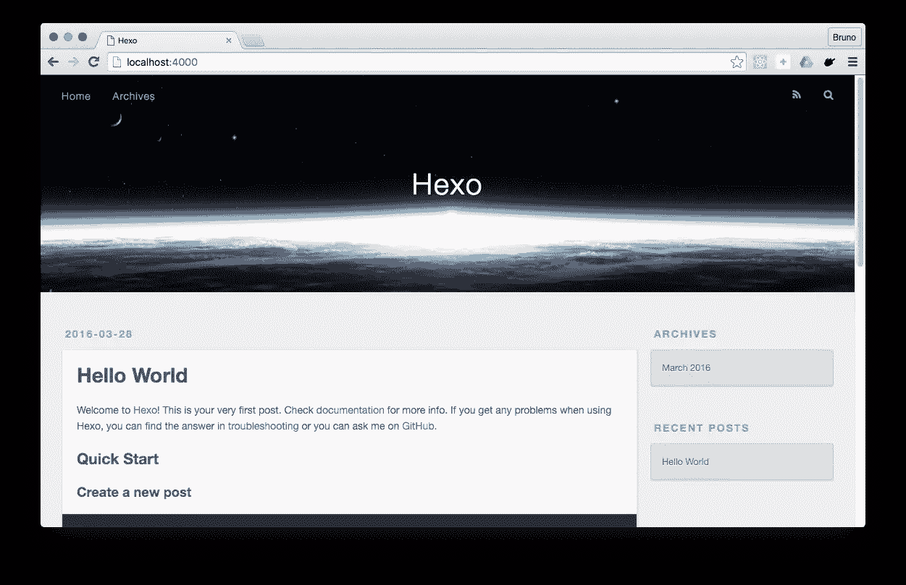
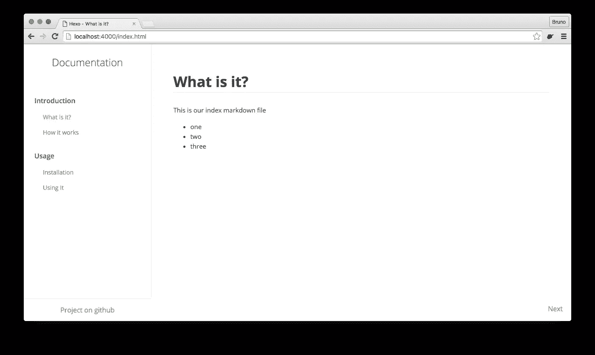

# Hexo 静态站点生成器的项目文档

> 原文：<https://www.sitepoint.com/project-documentation-hexo/>

*本文由 [Panayiotis Velisarakos](https://www.sitepoint.com/author/pvelisarakos/) 、 [Dan Prince](https://www.sitepoint.com/author/dprince/) 和 [Julian Motz](https://www.sitepoint.com/author/jmotz/) 进行同行评审。感谢 SitePoint 的所有同行评审员使 SitePoint 的内容尽可能做到最好！*

当开始一个开源项目时，最重要的事情之一就是创建项目文档。如果我们想让其他人使用我们的项目，文档是必不可少的，这可以通过许多方式实现:

*   [**GitHub Wiki**](https://help.github.com/articles/about-github-wikis/)——GitHub 让我们制作一个与每个项目相关的 Wiki。它由使用 markdown 编写的页面组成，绝对是构建文档时需要考虑的工具。然而，它确实有一些限制:对维基的贡献不会出现在项目贡献中；仅限于严格的结构和布局；您必须在其他位置托管资产。
*   **README**–我们可以创建一个 README.md，它将显示在 GitHub 项目页面上。如果文档非常短，这可能是一个好的解决方案，否则它会有一大页的信息。通常这是为了介绍项目，而不是展示文件。
*   **自托管**–我们可以为我们的文档创建一个自定义网站。这给了我们完全的自由去创造我们想要的东西，但是它阻止了对我们文档的可能贡献。它也伴随着托管的价格。
*   [**GitHub Pages**](https://pages.github.com/)–GitHub 还为每个项目提供了一种托管静态站点的方式。通过在项目的 repo 中创建一个名为 gh-pages 的分支，GitHub 会将其内容作为网站发布。放置一个文档站点是很好的，尽管在一个单独的分支中维护文档并不是最佳选择:文档文件很难被贡献者找到，贡献也不会出现在主分支中。

幸运的是，有一种方法可以结合上述选项的最佳部分。

## exo 简介

[Hexo](https://hexo.io/) 是用 [Node.js](https://nodejs.org/en/) 构建的静态站点生成器。它主要用作博客框架，但是它有一个针对 GitHub 的部署集成，这使得它非常适合为 GitHub 项目构建文档站点。

使用 Hexo，我们可以创建 markdown 文件和 HTML 布局，它们在部署时将被转换为静态 HTML 文件。Hexo 提供了一个部署配置，将我们的静态文件构建到 GitHub 分支中。这意味着我们可以在项目的主分支中以 markdown 的形式维护我们的文档，并使用一个命令将其部署到 gh-pages。

## 安装 exo

Hexo 是用 Node.js 构建的，所以要安装和使用它，我们需要在系统中安装 Node.js。我们还需要 [Git](https://git-scm.com/) ，Hexo 将使用它将我们的文档站点部署到 gh-pages。

### 安装 Node.js

要安装 Node，我建议使用版本管理器，比如 [nvm](https://www.sitepoint.com/quick-tip-multiple-versions-node-nvm/) 。您还可以使用其他版本管理器，但是它们都使 Node.js 版本之间的安装和切换变得更加容易。

使用 nvm，让我们运行以下程序:

```
nvm install 4 
```

这将安装 Node.js 4.x 的最新版本，它也附带了随时可用的 npm。

### 安装 Git

我们还需要在系统中安装 Git。如果您不确定您已经拥有它，请运行以下命令:

```
git --version 
```

如果结果是 Git 版本，您可以跳过这一节。如果你看到一个错误，你必须先安装它。

#### Windows 操作系统

在 windows 系统上，我们可以运行 Git 提供的[安装程序。](https://git-scm.com/download/win)

#### OS X

在 OS X 上，我们可以用三种不同的方式安装它:

*   使用[安装器](https://sourceforge.net/projects/git-osx-installer/)。
*   通过运行`brew install git`使用[自制](http://brew.sh/)。
*   通过运行`sudo port install git +doc +bash_completion +gitweb`使用 [MacPorts](https://www.macports.org/) 。

通常情况下，我更喜欢使用自制软件来安装这种类型的软件，但如果你更熟悉 MacPorts 或只想使用安装程序，这也没什么错。

#### Linux——Ubuntu 或 Debian

在基于 Ubuntu 或 Debian 的系统上，我们可以用 apt 安装 Git:

```
sudo apt-get install git-core 
```

#### Linux–Fedora、Red Hat 或 CentOS

在 Fedora、Red Hat 或 CentOS 系统上，我们可以用 yum 安装 Git:

```
sudo yum install git-core 
```

### 安装 Hexo CLI

安装 Node.js 和 Git 之后，我们现在可以通过运行以下命令来安装 Hexo 了:

```
npm install -g hexo-cli 
```

要确保一切都已设置好，请键入以下内容:

```
hexo --version 
```

如果你看到一个版本列表，好消息是:你已经为使用 Hexo 做好了一切准备！

## 安装

现在我们已经安装了 Hexo，我们现在可以开始在 GitHub 主分支上创建文档了。要阅读本文，您可以:

*   为您现有的 GitHub 项目之一创建文档
*   在此创建一个新的回购

为了简单起见，我假设您正在创建一个名为 hexo-documentation 的新项目，但是您可以使用一个现有的项目来完成本文。

让我们通过运行以下命令在本地克隆 GitHub repo:

```
git clone https://github.com/USERNAME/REPOSITORY.git 
```

将`USERNAME`替换为您的用户名，将`REPOSITORY`替换为您为回购提供的名称。在我的例子中，命令应该是:

```
git clone https://github.com/sitepoint-editors/hexo-documentation.git 
```

现在让我们`cd`进入它并创建一个名为`docs`的文件夹:

```
cd hexo-documentation
mkdir docs 
```

docs 文件夹是我们的文档站点所在的位置，也是我们通过运行以下命令来初始化 Hexo 的位置:

```
hexo init docs 
```

上面的命令所做的是添加一堆 Hexo 的配置和依赖设置。但是我们仍然需要安装那些依赖项，它们被定义在 docs 文件夹中的一个`package.json`文件中。为此，让我们运行以下命令:

```
cd docs
npm install 
```

如果没有发生错误，我们现在已经安装了 Hexo 的依赖项，以及 docs 文件夹中的以下结构:

*   **_ config . yml**–我们的站点配置数据。
*   **package . JSON**–node . js 依赖关系。
*   **支架**——用于博客文章(在本文中，我们不会涉及 Hexo 博客功能)。
*   **source**–我们将把我们的降价文件，以及任何我们想要公开的东西，比如图片，放在这里。
*   **主题**–放置我们正在使用的主题的地方。

我们已经可以通过执行以下命令来检查我们的站点运行情况:

```
hexo generate
hexo server 
```

第一个命令将使用选定的主题，从我们的源文件生成我们的静态站点。第二个将启动一个提供这些静态文件的服务器。我们现在可以访问 [http://localhost:4000/](http://localhost:4000/) ，它将显示如下内容:



目前，它看起来更像一个博客，而不是一个文档网站，但我们会谈到这一点。

## 创建主题

要改变网站的当前外观，我们需要创建一个 Hexo 主题。主题定义了站点的外观和布局。有很多为 Hexo 创建的[主题可以免费使用。但是在本文中，我们将从头开始创建一个简单的。](https://hexo.io/themes/)

Hexo 默认自带主题，你可以在`docs/themes`文件夹里面看到。你可以有多个主题，但是一次只能有一个是活跃的。所以，让我们自己创造吧。在主题文件夹中，让我们为主题创建一个目录。让我们把它命名为“文档”。

现在，一个 Hexo 主题应该有如下结构:

*   **_ config . yml**–主题的额外配置。
*   **语言**–国际化支持(i18n)。
*   **布局**–主题布局(为页面提供结构)。
*   **脚本**–放置 Hexo 插件脚本的地方。
*   **来源**–放置在此的任何资产将由 Hexo 处理并公开。以`_`(下划线)开头的文件被忽略。

我们将创建一个简单的静态主题，所以我们不需要脚本文件夹。我们将只写英文，所以我们也可以丢弃语言文件夹。

我们要做的是为我们的页面创建一个布局，和一些 CSS 来把所有的东西都整理好。我们将使用 [Sass](http://sass-lang.com/) 来生成 CSS，这样我们就可以定义一些变量并将 CSS 划分成模块。Hexo 不能自己处理 Sass，但幸运的是有一个插件可以处理它， [hexo-renderer-sass](https://github.com/knksmith57/hexo-renderer-sass) ，我们可以用 npm 安装它。

所以终端在`./docs` ( **注意**它不在主题里面)，让我们运行:

```
npm install --save hexo-renderer-sass 
```

现在，回到主题。还是配置 Sass 吧，不然用不上。因此，在`docs/themes/documentation/_config.yml`中，我们添加以下内容:

```
node_sass:
  outputStyle: nested
  precision: 4
  sourceComments: false 
```

您可以在这里看到 Sass [可用配置属性的完整列表。](https://github.com/sass/node-sass#options)

太好了！现在我们可以开始使用 Sass 了。我们不会详细讨论 Sass 样式的编写，因为这与本文的范围无关，而且内容相当广泛。在任何情况下，你都可以在这里找到它们，你可以将这些文件复制到你的项目中或者创建你自己的风格。

让我们继续布局。这是构建主题时最重要的部分。它用模板语言定义了页面的布局。虽然你可以使用其他的，默认情况下，Hexo 提供了 [Swig](http://paularmstrong.github.io/swig/) 作为模板引擎，这就是我们要使用的。因此，让我们用以下内容创建一个文件`docs/themes/documentation/layout/default.swig`:

```
<!DOCTYPE html>
<html>
<head>
  <meta charSet='utf-8' />
  <title>{{config.title + ' - ' + page.title}}</title>
  <link href='https://cdnjs.cloudflare.com/ajax/libs/normalize/4.0.0/normalize.min.css' rel='stylesheet' type='text/css'>
  <link href='https://fonts.googleapis.com/css?family=Open+Sans:400,600,300,700' rel='stylesheet' type='text/css'>
  <link href='{{ url_for("css/docs.css") }}' rel='stylesheet'>
</head>
<body>
  <div class='menu'>
    <div class='logo'>
      Documentation
    </div>
    <nav class='menu-nav'>
      
        <ul class='nav'>
          <span>{{ section.title }}</span>
          <ul class='nav'>
            
              <li>
                <a href='{{item.href || url_for(item.id + ".html") }}' class='active'>{{item.title}}</a>
              </li>
            
          </ul>
        </ul>
      
    </nav>
    <a class='footer' href='https://github.com/sitepoint-editors/hexo-documentation'>
      Project on github
    </a>
  </div>
  <div class='page'>
    <div class='page-content'>
      <h1>{{page.title}}</h1>
      {{page.content}}
    </div>
  </div>
  <div class='switch-page'>
    
      <a class='previous' href='{{ url_for(page.prev) }}'>Previous</a>
    
    
      <a class='next' href='{{ url_for(page.next) }}'>Next</a>
    
  </div>
</body>
</html> 
```

让我们分解一下，看看我们在这里做什么。

```
<head>
  <meta charSet='utf-8' />
  <title>{{config.title + ' - ' + page.title}}</title>
  <link href='https://cdnjs.cloudflare.com/ajax/libs/normalize/4.0.0/normalize.min.css' rel='stylesheet' type='text/css'>
  <link href='https://fonts.googleapis.com/css?family=Open+Sans:400,600,300,700' rel='stylesheet' type='text/css'>
  <link href='{{ url_for("css/docs.css") }}' rel='stylesheet'>
</head> 
```

在我们设置的标题中:

*   标题–[Hexo 提供了变量](https://hexo.io/docs/variables.html)，我们可以用它们来构建一个智能标题。在我们的例子中，我们连接了在配置文件中设置的站点标题和在每个页面中定义的页面标题。
*   **链接**——我们包括:标准化 CSS 样式表，这样我们网站的基本样式在不同浏览器之间是一致的；打开谷歌字体的 Sans 字体系列，让文本看起来更好；最后是从 Sass 文件中生成的样式。注意，对于最后一个，我们调用了一个 [Hexo 助手函数](https://hexo.io/docs/helpers.html#url-for) `url_for`，因为我们不知道站点将位于何处。这基本上是将根 URL 与作为参数传递的 URL 连接起来。

接下来是身体。它大部分是普通的 HTML，除了一些我将详细解释的部分。

```

  <ul class='nav'>
    <span>{{ section.title }}</span>
    <ul class='nav'>
      
        <li>
          <a href='{{item.href || url_for(item.id + ".html") }}' class='active'>{{item.title}}</a>
        </li>
      
    </ul>
  </ul>
 
```

这就是我们菜单的来源。它通过一个结构`site.data.nav`进行迭代，稍后我们将在我们站点的`_data`文件夹中设置这个结构。它期望`site.data.nav`中的每一项都有一个`title`和一个包含实际导航链接的`items`数组。它遍历这些项目，并为每个项目生成链接。

我们在这个文件中设置的下一个重要部分是内容区域:

```
<div class='page-content'>
  <h1>{{page.title}}</h1>
  {{page.content}}
</div> 
```

这里我们包括当前的页面标题，后面是页面的内容。在我们的例子中，这里的页面内容将是从我们将要编写的 markdown 文件中生成的 HTML。

最后，作为一个额外的功能，我们包括了上一页和下一页按钮:

```

  <a class='previous' href='{{ url_for(page.prev) }}'>Previous</a>


  <a class='next' href='{{ url_for(page.next) }}'>Next</a>
 
```

在上面的代码中，我们假设每个页面都应该有一个`prev`和一个`next`属性。我们稍后会看到如何定义它。这将根据每个链接是否可用来呈现链接。

就是这样！不仅是我们的布局文件，也是我们的主题。最后缺失的部分是改变你希望 Hexo 为你的网站使用的主题。为此，在`docs/_config.yml`中，您需要将`theme`属性改为:

```
theme: documentation 
```

全部完成！我们现在可以开始实际创建我们的内容。

## 创建内容

现在我们已经到达了过程中最重要的部分，为我们的项目创建实际的文档。为此，我们将在`docs/source`文件夹中工作。这是所有页面的位置，也是我们菜单数据结构的位置。

让我们从菜单数据开始。Hexo 为我们提供了一种定义数据结构的方法，这将在`site.data`中可用。为此，在`docs/source`中，让我们创建一个名为`_data`的新文件夹。如果该文件夹存在，Hexo 将遍历该文件夹，并将其中的[支持文件](https://hexo.io/docs/data-files.html)处理到`site.data`变量中，以文件名命名。

因为我们的主题希望在`site.data.nav`中找到我们的菜单数据，所以我们将创建一个`nav.yml`文件。我们把以下内容放进去吧:

```
- title: Introduction
  items:
  - id: index
    title: What is it
  - id: how-it-works
    title: How it works
- title: Usage
  items:
  - id: installation
    title: Installation
  - id: using
    title: Using It 
```

这里我们包括两个部分，每个部分有两页。就这样，我们的菜单都准备好了。我们现在只需要创建页面。因为我们要在 markdown 中编写它们，所以让我们创建以下文件:

*   `index.md`
*   `how-it-works.md`
*   `installation.md`
*   `using.md`

现在让我们在它们里面放一些内容。当创建一个新的内容文件时，要做的第一件事是编写[前置](https://hexo.io/docs/front-matter.html)，这是您定义页面设置的地方。这是一个以三个破折号为前缀和后缀的块，通常以 [YAML](http://yaml.org/) 的格式书写。

那么让我们从`index.md`文件开始。

```
---
layout: default
id: index
title: What is it?
next: how-it-works.html
---

This is our index markdown file

- one
- two
- three 
```

我们在本页首页设置了四个值:

*   **布局**–用于此页面的布局。
*   **id**–页面的唯一标识符。
*   **标题**–页面标题，将在`page.title`中提供。
*   **下一页**–表示下一页的变量。

我们遵循一些降价内容的设置。当网站建成后，这些内容将被转换成 HTML，并放入一个静态 HTML 文件中，使用我们之前为主题创建的布局。

其他文件遵循完全相同的规则，所以我们不会在这里讨论它们。

我们现在可以通过运行以下命令来检查我们的站点:

```
hexo generate
hexo server 
```

当访问 [http://localhost:4000/](http://localhost:4000/) 时，如果包含样式，它应该看起来像下图:



## 部署到 GitHub 页面

现在我们已经完成了文档站点，我们需要能够将它部署到 GitHub 页面。如果我们手动操作，我们必须创建一个 gh-pages 分支，在本地生成我们的 Hexo 站点，将生成的静态文件复制粘贴到我们的 gh-pages 本地工作副本分支中，提交并推送它，然后才意识到我们有一个打字错误，所以我们需要重新做一遍。

幸运的是，Hexo 提供了一种更好的方法来部署到 gh-pages。为此，我们需要 [hexo-deployer-git](https://github.com/hexojs/hexo-deployer-git) 包，我们可以通过在`docs/`中运行以下命令来安装它:

```
npm install --save hexo-deployer-git 
```

我们现在要做的就是在`docs/_config.yml`文件中设置配置。让我们打开它，转到部署部分，它应该一直在底部，并添加以下内容:

```
deploy:
  type: git
  repo: https://github.com/sitepoint-editors/hexo-documentation
  branch: gh-pages
  message: "Docs updated: {{ now('YYYY-MM-DD HH:mm:ss') }})" 
```

就是这样！在部署之前，让我们也为站点更改一些最终配置:

```
# Site
title: Hexo documentation
subtitle: Hexo documentation article
description: Hexo documentation article
author: Bruno Mota
language: en
timezone: GMT

# URL
url: http://sitepoint-editors.github.io/hexo-documentation
root: /hexo-documentation/ 
```

太好了，剩下要做的就是实际部署了！在终端中，运行以下命令:

```
hexo generate
hexo deploy 
```

Hexo 现在会为我们将生成的输出部署到 gh-pages 分支。完工后，我们可以参观位于[http://sitepoint-editors.github.io/hexo-documentation/](http://sitepoint-editors.github.io/hexo-documentation/)的最终场地。

## 结论

如果你想让别人使用你的作品，文档是必不可少的。在 GitHub 上创建项目文档有一些简单的方法，但它们并不总是有助于获得最佳结果。对于大中型项目，通常需要一个文档站点来保存所有信息。Hexo 不仅实现了这一点，还提供了一个快速的设置和部署过程，使这个框架成为一个很好的工具。谢谢，[陈彦博](https://github.com/tommy351)在 Hexo 上的出色工作！

如果你决定尝试 Hexo，请在评论中告诉我，我很想听听你的进展！

## 分享这篇文章