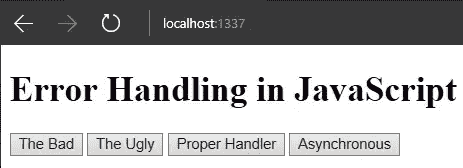
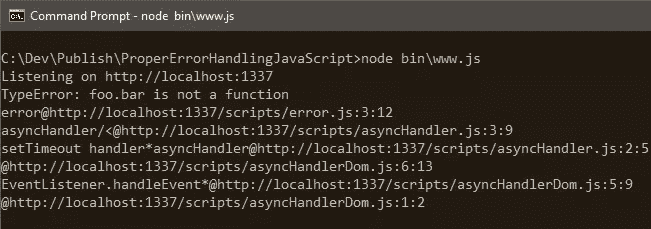

# JavaScript 中正确的错误处理指南

> 原文：<https://www.sitepoint.com/proper-error-handling-javascript/>

啊，JavaScript 中错误处理的危险。如果你相信墨菲定律，任何可能出错的事情都会出错。在本文中，我将探索 JavaScript 中的错误处理。我将介绍陷阱、好的实践，并以异步代码和 Ajax 结束。

> 这篇受欢迎的文章于 2017 年 6 月 8 日更新，以解决读者反馈。具体来说，文件名被添加到代码片段中，单元测试被清理，包装模式被添加到`uglyHandler`，关于 CORS 和第三方错误处理程序的部分被添加。

我觉得 JavaScript 的事件驱动范式增加了语言的丰富性。我喜欢把浏览器想象成这种事件驱动的机器，错误也不例外。当错误发生时，会在某个时候抛出一个事件。理论上，有人可能会认为错误是 JavaScript 中的简单事件。

如果这听起来对你来说是陌生的，系好安全带，因为你将会有一段相当长的旅程。对于本文，我将只关注客户端 JavaScript。

本主题建立在 JavaScript 中的[异常处理中解释的概念之上。如果你不熟悉的话，我建议你阅读基础知识。本文还假设读者具备中级 JavaScript 知识。如果你想升级，为什么不注册 SitePoint Premium 并观看我们的课程](https://www.sitepoint.com/exceptional-exception-handling-in-javascript/) [JavaScript:下一步](https://www.sitepoint.com/premium/courses/javascript-next-steps-2921)。第一课是免费的。

无论是哪种情况，我的目标都是探索处理异常的基本必要性。阅读这篇文章会让你下次看到好看的`try...catch`街区时三思。

## 演示

我们将在本文中使用的演示可在 [GitHub](https://github.com/sitepoint-editors/ProperErrorHandlingJavaScript) 上获得，并呈现如下页面:



所有按钮被点击时都会引爆一枚“炸弹”。这个炸弹模拟了一个作为`TypeError`抛出的异常。下面是这种模块的定义:

```
// scripts/error.js

function error() {
  var foo = {};
  return foo.bar();
} 
```

首先，这个函数声明一个名为`foo`的空对象。注意`bar()`没有在任何地方得到定义。让我们用一个好的单元测试来验证这将引爆一颗炸弹:

```
// tests/scripts/errorTest.js

it('throws a TypeError', function () {
  should.throws(error, TypeError);
}); 
```

这个单元测试在 [Mocha](http://mochajs.org/) 中，测试断言在 [Should.js](http://shouldjs.github.io/) 中。Mocha 是测试运行程序，而 Should.js 是断言库。如果您还不熟悉测试 API，请随意探索。测试以`it('description')`开始，以`should`中的通过/失败结束。单元测试在节点上运行，不需要浏览器。我建议关注测试，因为它们用普通的 JavaScript 证明了关键概念。

> 一旦您克隆了 repo 并安装了依赖项，您就可以使用`npm t`运行测试。或者，您可以像这样运行这个单独的测试:`./node_modules/mocha/bin/mocha tests/scripts/errorTest.js`。

如图所示，`error()`定义了一个空对象，然后它试图访问一个方法。因为`bar()`在对象内不存在，所以抛出异常。相信我，对于像 JavaScript 这样的动态语言，这种情况会发生在每个人身上！

## 坏事

一些糟糕的错误处理。我已经从实现中抽象出了按钮上的处理程序。下面是处理程序的样子:

```
// scripts/badHandler.js

function badHandler(fn) {
  try {
    return fn();
  } catch (e) { }
  return null;
} 
```

这个处理程序接收一个`fn`回调作为参数。然后在处理函数内部调用这个回调函数。单元测试展示了它的用处:

```
// tests/scripts/badHandlerTest.js

it('returns a value without errors', function() {
  var fn = function() {
    return 1;
  };

  var result = badHandler(fn);

  result.should.equal(1);
});

it('returns a null with errors', function() {
  var fn = function() {
    throw new Error('random error');
  };

  var result = badHandler(fn);

  should(result).equal(null);
}); 
```

如您所见，如果出现问题，这个错误处理程序会返回`null`。回调`fn()`可以指向一个合法的方法或者一个炸弹。

下面的 click 事件处理程序讲述了故事的其余部分:

```
// scripts/badHandlerDom.js

(function (handler, bomb) {
  var badButton = document.getElementById('bad');

  if (badButton) {
    badButton.addEventListener('click', function () {
      handler(bomb);
      console.log('Imagine, getting promoted for hiding mistakes');
    });
  }
}(badHandler, error)); 
```

糟糕的是我只得到一个`null`。这让我在试图找出问题所在时变得盲目。这种故障静默策略可以从糟糕的 UX 一直到数据损坏。令人沮丧的是，我可以花几个小时调试症状，但却错过了 try-catch 块。这个邪恶的处理程序吞下代码中的错误，假装一切正常。对于不注重代码质量的组织来说，这可能没问题。但是，隐藏错误会让你在将来调试几个小时。在具有深层调用堆栈的多层解决方案中，不可能找出问题出在哪里。就错误处理而言，这是相当糟糕的。

失败沉默策略会让你渴望更好的错误处理。JavaScript 提供了一种更优雅的处理异常的方式。

## 丑陋的

是时候调查一个丑陋的经理人了。我将跳过与 DOM 紧密耦合的部分。这里和你看到的糟糕的处理程序没有区别。

```
// scripts/uglyHandler.js

function uglyHandler(fn) {
  try {
    return fn();
  } catch (e) {
    throw new Error('a new error');
  }
} 
```

重要的是它处理异常的方式，如下所示:

```
// tests/scripts/uglyHandlerTest.js

it('returns a new error with errors', function () {
  var fn = function () {
    throw new TypeError('type error');
  };

  should.throws(function () {
    uglyHandler(fn);
  }, Error);
}); 
```

一个明显的改进。这里，异常通过调用堆栈冒泡。我喜欢的是现在错误将会展开堆栈，这对调试非常有帮助。除了一个例外，解释器沿着堆栈向上移动，寻找另一个处理程序。这为处理调用堆栈顶部的错误提供了许多机会。不幸的是，由于它是一个丑陋的处理程序，我失去了原来的错误。所以我被迫遍历堆栈，找出最初的异常。至少我知道有什么地方出错了，这就是你抛出异常的原因。

另一种方法是，用一个自定义错误来结束这个难看的处理程序。当你给一个错误添加更多的细节时，它就不再难看而是有用的了。关键是附加关于错误的具体信息。

例如:

```
// scripts/specifiedError.js

// Create a custom error
var SpecifiedError = function SpecifiedError(message) {
  this.name = 'SpecifiedError';
  this.message = message || '';
  this.stack = (new Error()).stack;
};

SpecifiedError.prototype = new Error();
SpecifiedError.prototype.constructor = SpecifiedError; 
```

```
// scripts/uglyHandlerImproved.js

function uglyHandlerImproved(fn) {
  try {
    return fn();
  } catch (e) {
    throw new SpecifiedError(e.message);
  }
} 
```

```
// tests/scripts/uglyHandlerImprovedTest.js

it('returns a specified error with errors', function () {
  var fn = function () {
    throw new TypeError('type error');
  };

  should.throws(function () {
    uglyHandlerImproved(fn);
  }, SpecifiedError);
}); 
```

指定的错误会添加更多详细信息，并保留原始错误信息。有了这个改进，它不再是一个丑陋的处理程序，而是干净和有用的。

使用这些处理程序，我仍然会得到一个未处理的异常。让我们看看浏览器是否有应对这种情况的锦囊妙计。

## 展开堆叠

因此，展开异常的一种方法是在调用堆栈的顶部放置一个`try...catch`。

比如说:

```
function main(bomb) {
  try {
    bomb();
  } catch (e) {
    // Handle all the error things
  }
} 
```

但是，还记得我说过浏览器是事件驱动的吗？是的，JavaScript 中的异常只不过是一个事件。解释器在执行上下文中停止执行并退卷。原来，我们可以使用一个 [onerror 全局事件处理程序](https://developer.mozilla.org/en/docs/Web/API/GlobalEventHandlers/onerror)。

大概是这样的:

```
// scripts/errorHandlerDom.js

window.addEventListener('error', function (e) {
  var error = e.error;
  console.log(error);
}); 
```

该事件处理程序捕捉任何执行上下文中的错误。对于任何类型的错误，都会从各种目标中触发错误事件。最根本的是这个事件处理程序将错误处理集中在代码中。与任何其他事件一样，您可以通过菊花链处理程序来处理特定的错误。如果你遵循[坚实的](https://en.wikipedia.org/wiki/SOLID_ "object-oriented_design")原则，这允许错误处理器有一个单一的目的。这些处理程序可以在任何时候注册。解释器将根据需要循环处理尽可能多的处理程序。代码库从遍布的`try...catch`块中解放出来，这使得调试变得容易。关键是像 JavaScript 中的事件处理一样处理错误。

现在有了一种用全局处理程序展开堆栈的方法，我们能用它做什么呢？

毕竟愿调用栈与你同在。

## 捕获堆栈

调用堆栈在解决问题时非常有用。好消息是浏览器提供了现成的信息。堆栈属性不是标准的一部分，但是它在最新的浏览器上一直可用。

例如，您现在可以在服务器上记录错误:

```
// scripts/errorAjaxHandlerDom.js

window.addEventListener('error', function (e) {
  var stack = e.error.stack;
  var message = e.error.toString();

  if (stack) {
    message += '\n' + stack;
  }

  var xhr = new XMLHttpRequest();
  xhr.open('POST', '/log', true);
  // Fire an Ajax request with error details
  xhr.send(message);
}); 
```

从这个例子中可能看不出来，但这将与前面的例子同时发生。每个错误处理器都有一个目的，那就是保持代码[干燥](https://en.wikipedia.org/wiki/Don%27t_repeat_yourself)。

在浏览器中，事件处理程序将*添加到 DOM 的*中。这意味着如果您正在构建第三方库，您的事件将与客户端代码共存。`window.addEventListener()`会为你处理这些，它不会删除已有的事件。

下面是该日志在服务器上的截图:


这个日志存在于命令提示符中，是的，它运行在 Windows 上是无可厚非的。

这条消息来自火狐开发者版 54。有了适当的错误处理程序，问题就一目了然了。不需要隐藏错误，通过浏览这个，我可以看到是什么抛出了异常，在哪里抛出的。这种级别的透明性有利于调试前端代码。您可以分析日志，了解哪些条件触发了哪些错误。

调用堆栈有助于调试，永远不要低估调用堆栈的力量。

一个问题是，如果你有一个来自不同域的脚本，并且[启用 CORS](https://developer.mozilla.org/en-US/docs/Web/HTTP/Access_control_CORS) ，你将看不到任何错误细节。例如，当您将脚本放在 CDN 上以利用每个域六个请求的限制时，就会出现这种情况。`e.message`只会说“脚本错误”，这是不好的。在 JavaScript 中，错误信息只适用于单个域。

一种解决方案是在保留错误消息的同时重新抛出错误:

```
try {
  return fn();
} catch (e) {
  throw new Error(e.message);
} 
```

一旦您再次抛出错误，您的全局错误处理程序将完成剩下的工作。只需确保您的错误处理程序在同一个域中。您甚至可以用特定的错误信息来包装自定义错误。这将保留原始消息、堆栈和自定义错误对象。

## 异步处理

啊，异步的危险。JavaScript 将异步代码从执行上下文中剥离出来。这意味着像下面这样的异常处理程序有问题:

```
// scripts/asyncHandler.js

function asyncHandler(fn) {
  try {
    // This rips the potential bomb from the current context
    setTimeout(function () {
      fn();
    }, 1);
  } catch (e) { }
} 
```

单元测试讲述了故事的其余部分:

```
// tests/scripts/asyncHandlerTest.js

it('does not catch exceptions with errors', function () {
  // The bomb
  var fn = function () {
    throw new TypeError('type error');
  };

  // Check that the exception is not caught
  should.doesNotThrow(function () {
    asyncHandler(fn);
  });
}); 
```

异常没有被捕获，我可以用这个单元测试来验证这一点。请注意，虽然我将代码包装在一个漂亮的`try...catch`中，但还是会发生一个未处理的异常。是的，`try...catch`语句只在单个执行上下文中工作。当抛出异常时，解释器已经离开了`try...catch`。Ajax 调用也会出现同样的行为。

因此，一种替代方法是在异步回调中捕捉异常:

```
setTimeout(function () {
  try {
    fn();
  } catch (e) {
    // Handle this async error
  }
}, 1); 
```

这种方法可行，但还有很大的改进空间。首先，`try...catch`积木被弄得到处都是。事实上，20 世纪 70 年代糟糕的编程打来电话，他们想要回他们的代码。另外，V8 引擎不鼓励在函数中使用 [try…catch 块。V8 是 Chrome 浏览器和节点中使用的 JavaScript 引擎。一种想法是将块移动到调用堆栈的顶部，但这对于异步代码不起作用。](https://github.com/nodejs/node-v0.x-archive/wiki/Best-practices-and-gotchas-with-v8)

那么，这将把我们引向何方？我说全局错误处理程序在任何执行上下文中运行是有原因的。如果你给窗口对象添加一个错误处理程序，就这样，完成了！保持干爽和坚实的决定得到了回报，这很好。一个全局错误处理程序将保持你的异步代码整洁。

下面是这个异常处理程序在服务器上报告的内容。请注意，如果您继续操作，您看到的输出将会有所不同，这取决于您使用的浏览器。



这个处理程序甚至告诉我错误来自异步代码。它说它来自一个`setTimeout()`函数。太酷了！

## 结论

在错误处理领域，至少有两种方法。一种是失败静默方法，忽略代码中的错误。另一种是故障快速恢复方法，在这种方法中，错误会使世界停止并倒带。我觉得这两个我赞成哪个，为什么，都很清楚了。我的观点是:不要隐藏问题。没有人会因为程序中可能发生的意外而羞辱你。停下来，倒带，再给用户一次尝试，都是可以接受的。

在一个远非完美的世界里，允许第二次机会是很重要的。错误是不可避免的，重要的是你做了什么。

*这篇文章由[蒂姆·塞韦里恩](https://www.sitepoint.com/author/tseverien/)和[莫里茨·克罗格](https://www.sitepoint.com/author/morkro/)进行了同行评审。感谢 SitePoint 的所有同行评审员使 SitePoint 的内容尽可能做到最好！*

## 分享这篇文章