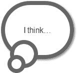

# 如何创建没有图像的 CSS3 语音气泡

> 原文：<https://www.sitepoint.com/pure-css3-speech-bubbles/>

我记得很多年前我创造了我的第一个无图像的演讲泡泡。它需要一个冗长的 JavaScript 函数将元素注入 DOM，一些可怕的 CSS，看起来相当糟糕，并且在 IE5 中不能很好地工作。

CSS3 开始让我们的生活变得更好。现在可以创建一个好看的语音泡泡，它可以在所有浏览器中工作，使用一个 HTML 元素，几行 CSS3 代码，没有图像，没有任何 JavaScript


为了让你更容易理解，让我们来看看 HTML。需要一个元素，所以我使用了一个`P`标签:

```
<p class="speech">SitePoint Rocks!</p>
```

首先，我们将设计外盒的样式:

```
p.speech {
  position: relative;
  width: 200px;
  height: 100px;
  text-align: center;
  line-height: 100px;
  background-color: #fff;
  border: 8px solid #666;
  -webkit-border-radius: 30px;
  -moz-border-radius: 30px;
  border-radius: 30px;
  -webkit-box-shadow: 2px 2px 4px #888;
  -moz-box-shadow: 2px 2px 4px #888;
  box-shadow: 2px 2px 4px #888;
}
```

没什么太复杂的。唯一重要的属性是`position: relative`,这是语音气泡指针所必需的。我们还要求 Mozilla 和 Webkit 厂商为 border-radius 和 box-shadow 添加前缀，以确保它们能在所有 CSS3 浏览器中工作。IE8 及以下版本将显示方形角，没有阴影，但框仍将可见。


现在我们需要创建三角形气泡指针。我们可以使用 CSS 边框来创建任何类型的三角形，而不是求助于图像。简单来说，检查一个具有不同颜色的宽边框的元素:


如果我们将元素的宽度和高度减少到 0px，并使用不同大小的边框，我们可以看到不同的三角形正在形成:


因此，对于我们的语音气泡指针，我们可以使用实心的顶部和左侧边框以及透明的右侧和底部边框:


但是我们把这些边界属性分配给什么呢？幸运的是，我们可以使用 CSS `:before`和`:after`伪元素再生成两个内容项。因此:

```
p.speech:before {
  content: ' ';
  position: absolute;
  width: 0;
  height: 0;
  left: 30px;
  top: 100px;
  border: 25px solid;
  border-color: #666 transparent transparent #666;
}
```

三角形位于我们气泡的底部。顺便说一句，不要试图给这个元素添加阴影——它将显示在透明的边框周围，而不是可见的三角形。


我们现在必须*移除*这个三角形的一部分。我们可以在灰色三角形上放置一个较小的白色三角形来达到这种效果:

```
p.speech:after {
  content: ' ';
  position: absolute;
  width: 0;
  height: 0;
  left: 38px;
  top: 100px;
  border: 15px solid;
  border-color: #fff transparent transparent #fff;
}
```

我们的纯 CSS3 无图像语音泡泡完成了。


本质上，我们可以利用:before 和:after 伪元素来创建许多不同的效果。例如，可以用两个内容项围成圆圈来创建思想气泡:

```
p.thought {
  position: relative;
  width: 130px;
  height: 100px;
  text-align: center;
  line-height: 100px;
  background-color: #fff;
  border: 8px solid #666;
  -webkit-border-radius: 58px;
  -moz-border-radius: 58px;
  border-radius: 58px;
  -webkit-box-shadow: 2px 2px 4px #888;
  -moz-box-shadow: 2px 2px 4px #888;
  box-shadow: 2px 2px 4px #888;
}

p.thought:before, p.thought:after {
  left: 10px;
  top: 70px;
  width: 40px;
  height: 40px;
  background-color: #fff;
  border: 8px solid #666;
  -webkit-border-radius: 28px;
  -moz-border-radius: 28px;
  border-radius: 28px;
}

p.thought:after {
  width: 20px;
  height: 20px;
  left: 5px;
  top: 100px;
  -webkit-border-radius: 18px;
  -moz-border-radius: 18px;
  border-radius: 18px;
}
```

[****](https://blogs.sitepointstatic.com/examples/tech/css3-speech-bubbles/index.html)

 **[**请参见演示页面**](https://blogs.sitepointstatic.com/examples/tech/css3-speech-bubbles/index.html) 中使用这些技术的示例。所有的 CSS 代码都包含在 HTML 源代码中。

你使用过类似的技术来创造其他效果吗？

如果你喜欢读这篇文章，你会爱上[可学的](https://learnable.com?utm_source=sitepoint&utm_medium=link&utm_campaign=learnablelink)；向大师们学习新技能和技术的地方。会员可以即时访问 SitePoint 的所有电子书和互动在线课程，如 [Learn CSS3](https://learnable.com/courses/learn-css3-203?utm_source=sitepoint&utm_medium=link&utm_campaign=learnablelink) 。

对这篇文章的评论已经关闭。对 CSS3 有疑问？为什么不在我们的[论坛](https://www.sitepoint.com/forums/forumdisplay.php?53-CSS-amp-Page-Layout?utm_source=sitepoint&utm_medium=link&utm_campaign=forumlink)上问呢？** 

## **分享这篇文章**