# 用 Pusher 和 Vue.js 搭建一个实时聊天 App

> 原文：<https://www.sitepoint.com/pusher-vue-real-time-chat-app/>

如今，实时交流的应用程序变得越来越流行，因为它们带来了更流畅、更自然的用户体验。

在本教程中，我们将使用 Vue.js 构建一个实时聊天应用程序，该应用程序由 [ChatKit](https://pusher.com/chatkit) 提供，是由 [Pusher](https://pusher.com) 提供的服务。聊天工具服务将为我们提供在任何设备上构建聊天应用程序所需的完整后端，让我们专注于构建前端用户界面，通过[聊天工具客户端包](https://www.npmjs.com/package/@pusher/chatkit-client)连接到聊天工具服务。

*想从头学起 Vue.js？使用 SitePoint Premium 获得涵盖基础知识、项目、技巧和工具&的 Vue 书籍全集。[现在就加入，每月仅需 9 美元](https://www.sitepoint.com/premium/products/Z2lkOi8vbGVhcm5hYmxlL1Byb2R1Y3QvMzA3?utm_source=blog&utm_medium=articles)。*

## 先决条件

这是一个中级到高级的教程。您需要熟悉以下概念:

*   vue . js basics(视图. js 基础)
*   Vuex 基础
*   使用 CSS 框架

您还需要在机器上安装 Node。你可以从[官方网站](https://nodejs.org/)下载二进制文件，或者使用[版本管理器](https://www.sitepoint.com/quick-tip-multiple-versions-node-nvm/)来完成。这可能是最简单的方法，因为它允许您在同一台机器上管理 Node 的多个版本。

最后，您需要使用以下命令全局安装 Vue CLI:

```
npm install -g @vue/cli 
```

在撰写本文时，Node 10.14.1 和 Vue CLI 3.2.1 是最新版本。

## 关于项目

我们将构建一个类似 Slack 或 Discord 的基本聊天应用程序。该应用程序将执行以下操作:

*   拥有多个频道和房间
*   列出房间成员并检测在线状态
*   检测其他用户何时开始键入

如前所述，我们只是在构建前端。ChatKit 服务有一个后端界面，允许我们管理用户、权限和房间。

你可以在 [GitHub](https://github.com/sitepoint-editors/vue-chatkit) 上找到这个项目的完整代码。

## 设置 ChatKit 实例

让我们创建我们的 ChatKit 实例，如果您熟悉 Discord，它类似于服务器实例。

进入 Pusher 网站的[聊天工具](https://pusher.com/chatkit)页面，点击*注册*按钮。系统会提示您输入电子邮件地址和密码，以及登录 GitHub 或 Google 的选项。

选择最适合您的选项，然后在下一个屏幕上填写一些详细信息，如*姓名*、*账户类型*、*用户角色*等。

点击*完成入职*，您将被带到主推进仪表板。在这里，您应该单击聊天工具产品。

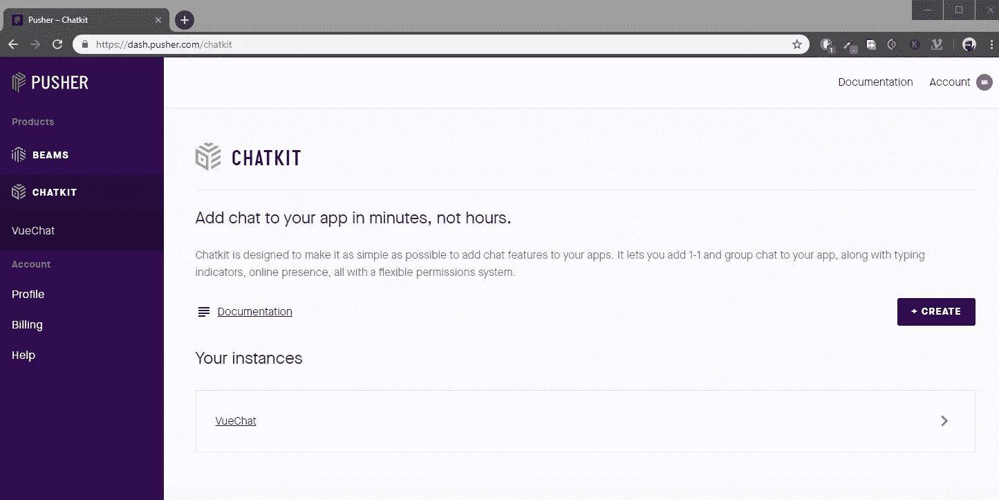

单击“创建”按钮创建新的 ChatKit 实例。我要叫我的`VueChatTut`。


在本教程中，我们将使用免费计划。它支持多达 1，000 个独立用户，这对我们的需求来说绰绰有余。前往*控制台*标签。您需要创建一个新用户来开始。继续点击*创建用户*按钮。

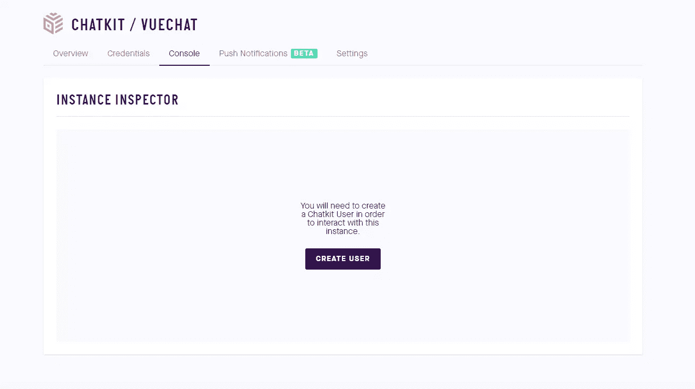

我将把我的命名为“约翰”(*用户标识符*)和“疾速追杀”(*显示名称*)，但是你可以随意命名你的。下一部分很简单:创建两个或更多用户。例如:

*   盐，伊夫林·盐
*   伊森·亨特·亨特

创建三个或更多房间并分配用户。例如:

*   将军(约翰、绍特、亨特)
*   武器(约翰，盐)
*   战斗(约翰，亨特)

这里有一张你的*控制台*界面的快照。

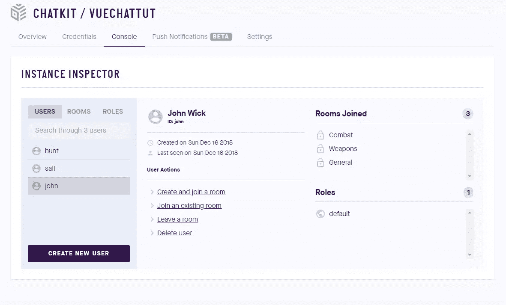

接下来，您可以转到*房间*选项卡，使用为每个房间选择的用户创建一条消息。这是为了测试目的。然后转到*凭证*选项卡，记下*实例定位器*。我们将需要激活*测试令牌提供者*，它用于生成我们的 HTTP 端点，并记录下来。

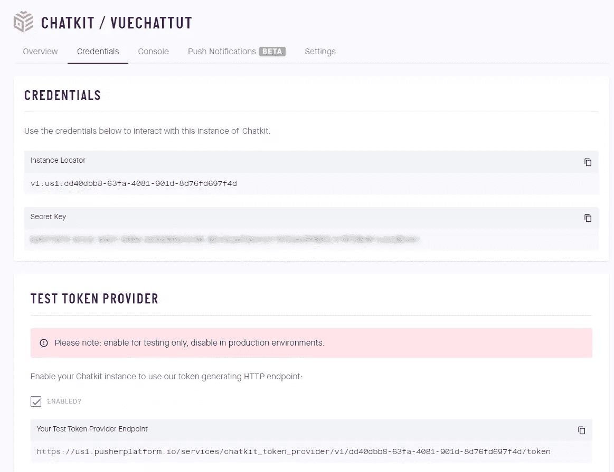

我们的聊天工具后端现在已经准备好了。让我们开始构建我们的 Vue.js 前端。

## 搭建 Vue.js 项目

打开终端并创建项目，如下所示:

```
vue create vue-chatkit 
```

选择*手动选择功能*并回答如下所示的问题。

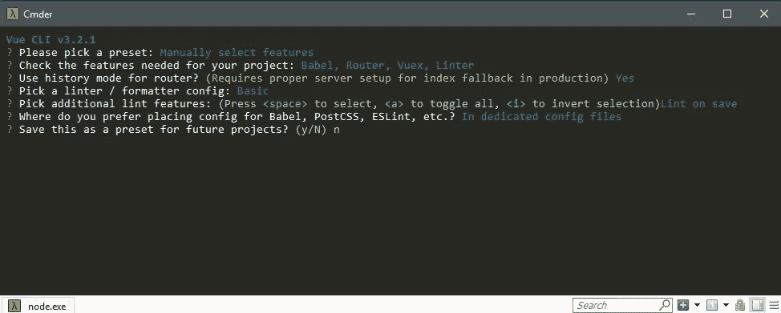

确保你已经选择了 Babel，Vuex 和 Vue 路由器作为附加功能。接下来，创建以下文件夹和文件，如下所示:

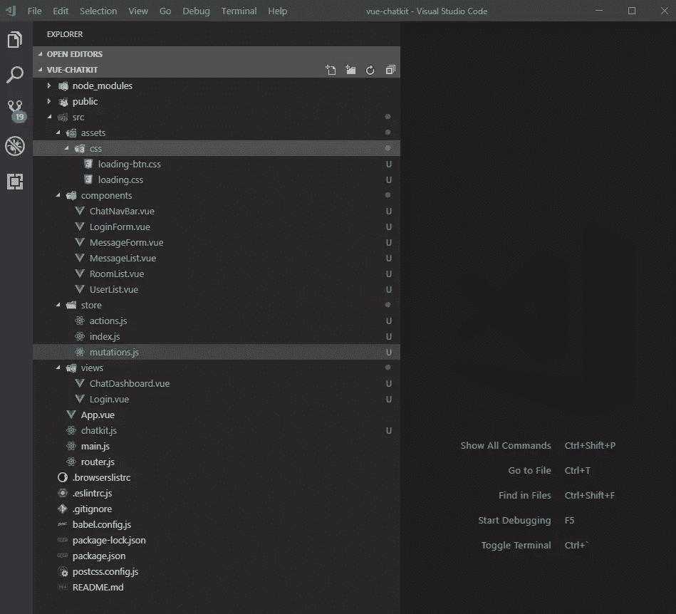

确保按照演示创建所有文件夹和文件。删除上图中没有出现的任何不必要的文件。

对于那些熟悉控制台的人来说，下面是完成所有这些操作的命令:

```
mkdir src/assets/css
mkdir src/store

touch src/assets/css/{loading.css,loading-btn.css}
touch src/components/{ChatNavBar.vue,LoginForm.vue,MessageForm.vue,MessageList.vue,RoomList.vue,UserList.vue}
touch src/store/{actions.js,index.js,mutations.js}
touch src/views/{ChatDashboard.vue,Login.vue}
touch src/chatkit.js

rm src/components/HelloWorld.vue
rm src/views/{About.vue,Home.vue}
rm src/store.js 
```

完成后，`src`文件夹的内容应该是这样的:

```
.
├── App.vue
├── assets
│   ├── css
│   │   ├── loading-btn.css
│   │   └── loading.css
│   └── logo.png
├── chatkit.js
├── components
│   ├── ChatNavBar.vue
│   ├── LoginForm.vue
│   ├── MessageForm.vue
│   ├── MessageList.vue
│   ├── RoomList.vue
│   └── UserList.vue
├── main.js
├── router.js
├── store
│   ├── actions.js
│   ├── index.js
│   └── mutations.js
└── views
    ├── ChatDashboard.vue
    └── Login.vue 
```

对于 [loading-btn.css](https://loading.io/css/loading-btn.css) 和 [loading.css](https://loading.io/css/loading.css) 文件，可以在 [loading.io](https://loading.io/button/) 网站上找到。这些文件在 npm 存储库中不可用，因此您需要手动下载它们并将其放在您的项目中。务必阅读文档，了解它们是什么以及如何使用可定制的加载器。

接下来，我们将安装以下依赖项:

*   [@pusher/chatkit-client](https://docs.pusher.com/chatkit/reference/javascript) ，chatkit 服务的实时客户端接口
*   CSS 框架 bootstrap-vue
*   [时刻](https://momentjs.com/)，一个日期和时间格式化工具
*   [vue-chat-scroll](https://www.npmjs.com/package/vue-chat-scroll) ，新增内容时自动滚动到底部
*   [vuex-persist](https://www.npmjs.com/package/vuex-persist) ，保存浏览器本地存储的 vuex 状态

```
npm i @pusher/chatkit-client bootstrap-vue moment vue-chat-scroll vuex-persist 
```

请查看这些链接，了解每个包的功能以及如何配置。

现在，让我们配置我们的 Vue.js 项目。打开`src/main.js`并更新代码，如下所示:

```
import Vue from 'vue'
import BootstrapVue from 'bootstrap-vue'
import VueChatScroll from 'vue-chat-scroll'

import App from './App.vue'
import router from './router'
import store from './store/index'

import 'bootstrap/dist/css/bootstrap.css'
import 'bootstrap-vue/dist/bootstrap-vue.css'
import './assets/css/loading.css'
import './assets/css/loading-btn.css'

Vue.config.productionTip = false
Vue.use(BootstrapVue)
Vue.use(VueChatScroll)

new Vue({
  router,
  store,
  render: h => h(App)
}).$mount('#app') 
```

更新`src/router.js`如下:

```
import Vue from 'vue'
import Router from 'vue-router'
import Login from './views/Login.vue'
import ChatDashboard from './views/ChatDashboard.vue'

Vue.use(Router)

export default new Router({
  mode: 'history',
  base: process.env.BASE_URL,
  routes: [
    {
      path: '/',
      name: 'login',
      component: Login
    },
    {
      path: '/chat',
      name: 'chat',
      component: ChatDashboard,
    }
  ]
}) 
```

更新`src/store/index.js`:

```
import Vue from 'vue'
import Vuex from 'vuex'
import VuexPersistence from 'vuex-persist'
import mutations from './mutations'
import actions from './actions'

Vue.use(Vuex)

const debug = process.env.NODE_ENV !== 'production'

const vuexLocal = new VuexPersistence({
  storage: window.localStorage
})

export default new Vuex.Store({
  state: {
  },
  mutations,
  actions,
  getters: {
  },
  plugins: [vuexLocal.plugin],
  strict: debug
}) 
```

`vuex-persist`包确保我们的 Vuex 状态在页面重新加载或刷新之间被保存。

我们的项目现在应该能够编译没有错误。但是，现在还不要运行它，因为我们需要构建用户界面。

## 构建用户界面

让我们从如下更新`src/App.vue`开始:

```
<template>
  <div id="app">
    <router-view/>
  </div>
</template> 
```

接下来，我们需要定义我们的 Vuex 存储状态，因为我们的 UI 组件需要它们来工作。我们将前往位于`src/store/index.js`的 Vuex 商店。只需更新`state`和`getters`部分，如下所示:

```
state: {
  loading: false,
  sending: false,
  error: null,
  user: [],
  reconnect: false,
  activeRoom: null,
  rooms: [],
  users: [],
  messages: [],
  userTyping: null
},
getters: {
  hasError: state => state.error ? true : false
}, 
```

这些都是我们的聊天应用程序需要的状态变量。UI 使用`loading`状态来决定是否应该运行 CSS 加载器。`error`状态用于存储刚刚发生的错误的信息。当我们跨过它们的桥时，我们将讨论其余的状态变量。

接下来打开`src/view/Login.vue`并更新如下:

```
<template>
  <div class="login">
    <b-jumbotron  header="Vue.js Chat"
                  lead="Powered by Chatkit SDK and Bootstrap-Vue"
                  bg-variant="info"
                  text-variant="white">
      <p>For more information visit website</p>
      <b-btn target="_blank" href="https://pusher.com/chatkit">More Info</b-btn>
    </b-jumbotron>
    <b-container>
      <b-row>
        <b-col lg="4" md="3"></b-col>
        <b-col lg="4" md="6">
          <LoginForm />
        </b-col>
        <b-col lg="4" md="3"></b-col>
      </b-row>
    </b-container>
  </div>
</template>

<script>
import LoginForm from '@/components/LoginForm.vue'

export default {
  name: 'login',
  components: {
    LoginForm
  }
}
</script> 
```

接下来，插入`src/components/LoginForm.vue`的代码，如下所示:

```
<template>
  <div class="login-form">
    <h5 class="text-center">Chat Login</h5>
    <hr>
    <b-form @submit.prevent="onSubmit">
       <b-alert variant="danger" :show="hasError">{{ error }} </b-alert>

      <b-form-group id="userInputGroup"
                    label="User Name"
                    label-for="userInput">
        <b-form-input id="userInput"
                      type="text"
                      placeholder="Enter user name"
                      v-model="userId"
                      autocomplete="off"
                      :disabled="loading"
                      required>
        </b-form-input>
      </b-form-group>

      <b-button type="submit"
                variant="primary"
                class="ld-ext-right"
                v-bind:class="{ running: loading }"
                :disabled="isValid">
                Login <div class="ld ld-ring ld-spin"></div>
      </b-button>
    </b-form>
  </div>
</template>

<script>
import { mapState, mapGetters } from 'vuex'

export default {
  name: 'login-form',
  data() {
    return {
      userId: '',
    }
  },
  computed: {
    isValid: function() {
      const result = this.userId.length < 3;
      return result ? result : this.loading
    },
    ...mapState([
      'loading',
      'error'
    ]),
    ...mapGetters([
      'hasError'
    ])
  }
}
</script> 
```

如前所述，这是一个高级教程。如果您在理解这里的任何代码时有困难，请参阅先决条件或项目依赖项以获取信息。

我们现在可以通过`npm run serve`启动 Vue dev 服务器，以确保我们的应用程序在没有任何编译问题的情况下运行。

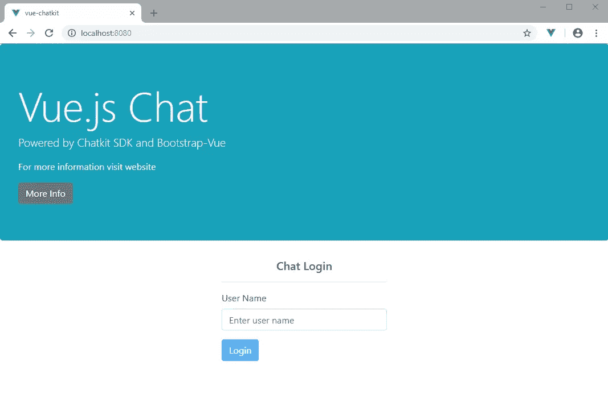

您可以通过输入用户名来确认验证正在进行。输入三个字符后，您应该看到*登录*按钮被激活。*登录*按钮现在不起作用，因为我们还没有对那部分进行编码。我们以后会调查的。现在，让我们继续构建我们的聊天用户界面。

转到`src/view/ChatDashboard.vue`并插入如下代码:

```
<template>
  <div class="chat-dashboard">
    <ChatNavBar />
    <b-container fluid class="ld-over" v-bind:class="{ running: loading }">
      <div class="ld ld-ring ld-spin"></div>
      <b-row>
        <b-col cols="2">
          <RoomList />
        </b-col>

        <b-col cols="8">
          <b-row>
            <b-col id="chat-content">
              <MessageList />
            </b-col>
          </b-row>
          <b-row>
            <b-col>
              <MessageForm />
            </b-col>
          </b-row>
        </b-col>

        <b-col cols="2">
          <UserList />
        </b-col>
      </b-row>
    </b-container>
  </div>
</template>

<script>
import ChatNavBar from '@/components/ChatNavBar.vue'
import RoomList from '@/components/RoomList.vue'
import MessageList from '@/components/MessageList.vue'
import MessageForm from '@/components/MessageForm.vue'
import UserList from '@/components/UserList.vue'
import { mapState } from 'vuex';

export default {
  name: 'Chat',
  components: {
    ChatNavBar,
    RoomList,
    UserList,
    MessageList,
    MessageForm
  },
  computed: {
    ...mapState([
      'loading'
    ])
  }
}
</script> 
```

`ChatDashboard`将作为以下子组件的布局父组件:

*   `ChatNavBar`，一个基本的导航栏
*   `RoomList`，列出登录用户有权访问的房间，也是一个房间选择器
*   `UserList`，列出所选房间的成员
*   `MessageList`，显示所选房间发布的消息
*   `MessageForm`，向所选房间发送消息的表单

让我们在每个组件中放一些样板代码，以确保所有内容都能显示出来。

插入`src/components/ChatNavBar.vue`的样板代码，如下所示:

```
<template>
  <b-navbar id="chat-navbar" toggleable="md" type="dark" variant="info">
    <b-navbar-brand href="#">
      Vue Chat
    </b-navbar-brand>
    <b-navbar-nav class="ml-auto">
      <b-nav-text>{{ user.name }} | </b-nav-text>
      <b-nav-item href="#" active>Logout</b-nav-item>
    </b-navbar-nav>
  </b-navbar>
</template>

<script>
import { mapState } from 'vuex'

export default {
  name: 'ChatNavBar',
  computed: {
    ...mapState([
      'user',
    ])
  },
}
</script>

<style>
  #chat-navbar {
    margin-bottom: 15px;
  }
</style> 
```

插入`src/components/RoomList.vue`的样板代码，如下所示:

```
<template>
  <div class="room-list">
    <h4>Channels</h4>
    <hr>
    <b-list-group v-if="activeRoom">
      <b-list-group-item v-for="room in rooms"
                        :key="room.name"
                        :active="activeRoom.id === room.id"
                        href="#"
                        @click="onChange(room)">
        # {{ room.name }}
      </b-list-group-item>
    </b-list-group>
  </div>
</template>

<script>
import { mapState } from 'vuex'

export default {
  name: 'RoomList',
  computed: {
    ...mapState([
      'rooms',
      'activeRoom'
    ]),
  }
}
</script> 
```

插入`src/components/UserList.vue`的样板代码，如下所示:

```
<template>
  <div class="user-list">
    <h4>Members</h4>
    <hr>
    <b-list-group>
      <b-list-group-item v-for="user in users" :key="user.username">
        {{ user.name }}
        <b-badge v-if="user.presence"
        :variant="statusColor(user.presence)"
        pill>
        {{ user.presence }}</b-badge>
      </b-list-group-item>
    </b-list-group>
  </div>
</template>

<script>
import { mapState } from 'vuex'

export default {
  name: 'user-list',
  computed: {
    ...mapState([
      'loading',
      'users'
    ])
  },
  methods: {
    statusColor(status) {
      return status === 'online' ? 'success' : 'warning'
    }
  }
}
</script> 
```

插入`src/components/MessageList.vue`的样板代码，如下所示:

```
<template>
  <div class="message-list">
    <h4>Messages</h4>
    <hr>
    <div id="chat-messages" class="message-group" v-chat-scroll="{smooth: true}">
      <div class="message" v-for="(message, index) in messages" :key="index">
        <div class="clearfix">
          <h4 class="message-title">{{ message.name }}</h4>
          @{{ message.username }}
        </div>
        <p class="message-text">
          {{ message.text }}
        </p>
        <div class="clearfix">
          {{ message.date }}
        </div>
      </div>
    </div>
  </div>
</template>

<script>
import { mapState } from 'vuex'

export default {
  name: 'message-list',
  computed: {
    ...mapState([
      'messages',
    ])
  }
}
</script>

<style>
.message-list {
  margin-bottom: 15px;
  padding-right: 15px;
}
.message-group {
  height: 65vh !important;
  overflow-y: scroll;
}
.message {
  border: 1px solid lightblue;
  border-radius: 4px;
  padding: 10px;
  margin-bottom: 15px;
}
.message-title {
  font-size: 1rem;
  display:inline;
}
.message-text {
  color: gray;
  margin-bottom: 0;
}
.user-typing {
  height: 1rem;
}
</style> 
```

插入`src/components/MessageForm.vue`的样板代码，如下所示:

```
<template>
  <div class="message-form ld-over">
    @{{ user.username }}
    <b-form @submit.prevent="onSubmit" class="ld-over" v-bind:class="{ running: sending }">
      <div class="ld ld-ring ld-spin"></div>
      <b-alert variant="danger" :show="hasError">{{ error }} </b-alert>
      <b-form-group>
        <b-form-input id="message-input"
                      type="text"
                      v-model="message"
                      placeholder="Enter Message"
                      autocomplete="off"
                      required>
        </b-form-input>
      </b-form-group>
      <div class="clearfix">
        <b-button type="submit" variant="primary" class="float-right">
          Send
        </b-button>
      </div>
    </b-form>
  </div>
</template>

<script>
import { mapState, mapGetters } from 'vuex'

export default {
  name: 'message-form',
  data() {
    return {
      message: ''
    }
  },
  computed: {
    ...mapState([
      'user',
      'sending',
      'error',
      'activeRoom'
    ]),
    ...mapGetters([
      'hasError'
    ])
  }
}
</script> 
```

仔细检查代码，确保对你来说没有什么是神秘的。导航到[http://localhost:8080/chat](http://localhost:8080/chat)检查是否一切都在运行。检查终端和浏览器控制台，确保此时没有错误。您现在应该有以下视图。

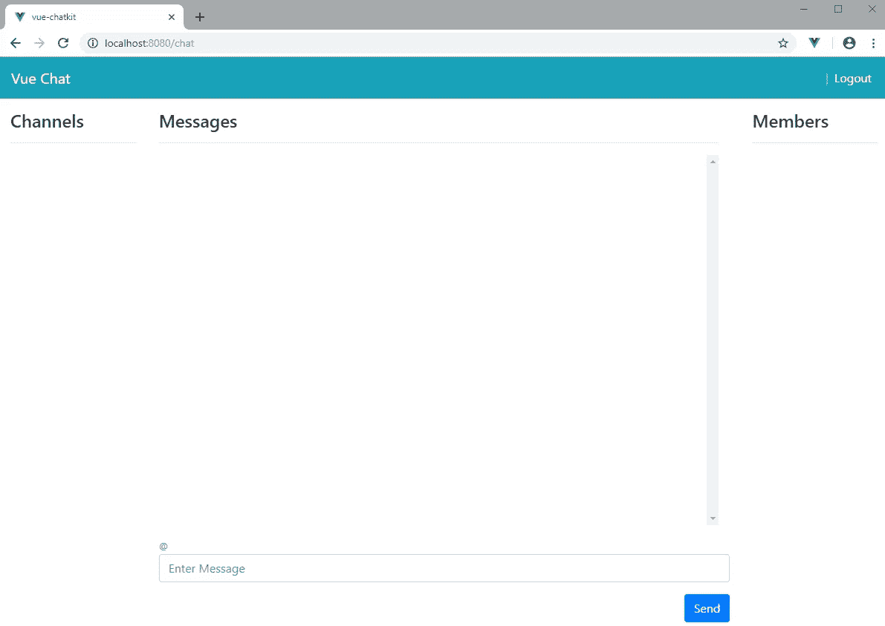

很空，对吧？让我们转到`src/store/index.js`并在 state 中插入一些模拟数据:

```
state: {
  loading: false,
  sending: false,
  error: 'Relax! This is just a drill error message',
  user: {
    username: 'Jack',
    name: 'Jack Sparrow'
  },
  reconnect: false,
  activeRoom: {
    id: '124'
  },
  rooms: [
    {
      id: '123',
      name: 'Ships'
    },
    {
      id: '124',
      name: 'Treasure'
    }
  ],
  users: [
    {
      username: 'Jack',
      name: 'Jack Sparrow',
      presence: 'online'
    },
    {
      username: 'Barbossa',
      name: 'Hector Barbossa',
      presence: 'offline'
    }
  ],
  messages: [
    {
      username: 'Jack',
      date: '11/12/1644',
      text: 'Not all treasure is silver and gold mate'
    },
    {
      username: 'Jack',
      date: '12/12/1644',
      text: 'If you were waiting for the opportune moment, that was it'
    },
    {
      username: 'Hector',
      date: '12/12/1644',
      text: 'You know Jack, I thought I had you figured out'
    }
  ],
  userTyping: null
}, 
```

保存文件后，您的视图应该与下图相匹配。

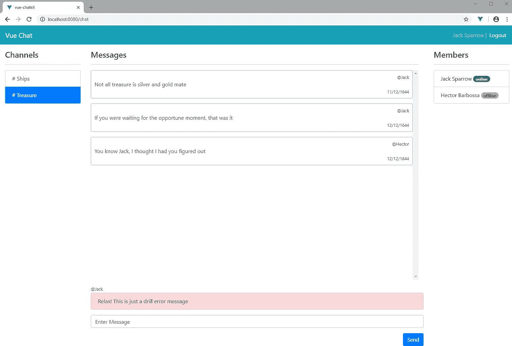

这个简单的测试确保所有组件和状态都很好地结合在一起。现在，您可以将州代码恢复为其原始形式:

```
state: {
  loading: false,
  sending: false,
  error: null,
  user: null,
  reconnect: false,
  activeRoom: null,
  rooms: [],
  users: [],
  messages: [],
  userTyping: null
} 
```

让我们从登录表单开始实现具体的特性。

## 无密码认证

对于本教程，我们将采用无密码的非安全认证系统。一个合适的、安全的认证系统超出了本教程的范围。首先，我们需要开始构建自己的接口，该接口将通过`@pusher/chatkit-client`包与 ChatKit 服务进行交互。

回到 ChatKit 仪表板，复制*实例*和*测试令牌*参数。将它们保存在项目根目录下的文件`.env.local`中，如下所示:

```
VUE_APP_INSTANCE_LOCATOR=
VUE_APP_TOKEN_URL=
VUE_APP_MESSAGE_LIMIT=10 
```

我还添加了一个`MESSAGE_LIMIT`参数。这个值只是限制了我们的聊天应用程序可以获取的消息数量。确保填写“凭据”选项卡中的其他参数。

接下来，转到`src/chatkit.js`开始构建我们的聊天应用基础:

```
import { ChatManager, TokenProvider } from '@pusher/chatkit-client'

const INSTANCE_LOCATOR = process.env.VUE_APP_INSTANCE_LOCATOR;
const TOKEN_URL = process.env.VUE_APP_TOKEN_URL;
const MESSAGE_LIMIT = Number(process.env.VUE_APP_MESSAGE_LIMIT) || 10;

let currentUser = null;
let activeRoom = null;

async function connectUser(userId) {
  const chatManager = new ChatManager({
    instanceLocator: INSTANCE_LOCATOR,
    tokenProvider: new TokenProvider({ url: TOKEN_URL }),
    userId
  });
  currentUser = await chatManager.connect();
  return currentUser;
}

export default {
  connectUser
} 
```

注意，我们将`MESSAGE_LIMIT`常量转换为一个数字，因为默认情况下,`process.env`对象强制其所有属性为 string 类型。

为`src/store/mutations`插入以下代码:

```
export default {
  setError(state, error) {
    state.error = error;
  },
  setLoading(state, loading) {
    state.loading = loading;
  },
  setUser(state, user) {
    state.user = user;
  },
  setReconnect(state, reconnect) {
    state.reconnect = reconnect;
  },
  setActiveRoom(state, roomId) {
    state.activeRoom = roomId;
  },
  setRooms(state, rooms) {
    state.rooms = rooms
  },
  setUsers(state, users) {
    state.users = users
  },
 clearChatRoom(state) {
    state.users = [];
    state.messages = [];
  },
  setMessages(state, messages) {
    state.messages = messages
  },
  addMessage(state, message) {
    state.messages.push(message)
  },
  setSending(state, status) {
    state.sending = status
  },
  setUserTyping(state, userId) {
    state.userTyping = userId
  },
  reset(state) {
    state.error = null;
    state.users = [];
    state.messages = [];
    state.rooms = [];
    state.user = null
  }
} 
```

突变的代码非常简单——只是一堆 setters。在后面的章节中，您将很快理解每个突变函数的用途。接下来，用以下代码更新`src/store/actions.js`:

```
import chatkit from '../chatkit';

// Helper function for displaying error messages
function handleError(commit, error) {
  const message = error.message || error.info.error_description;
  commit('setError', message);
}

export default {
  async login({ commit, state }, userId) {
    try {
      commit('setError', '');
      commit('setLoading', true);
      // Connect user to ChatKit service
      const currentUser = await chatkit.connectUser(userId);
      commit('setUser', {
        username: currentUser.id,
        name: currentUser.name
      });
      commit('setReconnect', false);

      // Test state.user
      console.log(state.user);
    } catch (error) {
      handleError(commit, error)
    } finally {
      commit('setLoading', false);
    }
  }
} 
```

接下来，更新`src/components/LoginForm.vue`如下:

```
import { mapState, mapGetters, mapActions } from 'vuex'

//...
export default {
  //...
  methods: {
    ...mapActions([
      'login'
    ]),
    async onSubmit() {
      const result = await this.login(this.userId);
      if(result) {
        this.$router.push('chat');
      }
    }
  }
} 
```

您必须重启 Vue.js 服务器才能加载`env.local`数据。如果您看到任何关于未使用变量的错误，现在忽略它们。完成后，导航到 [http://localhost:8080/](http://localhost:8080/) 并测试登录功能:

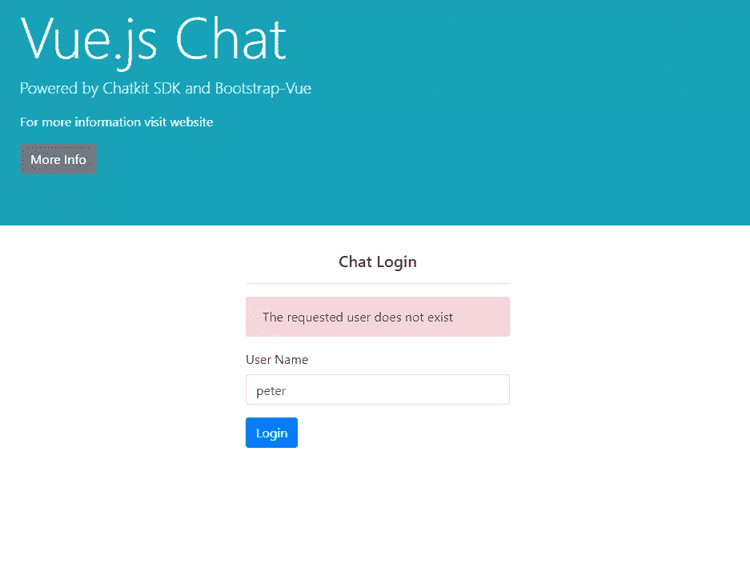

在上面的例子中，我使用了一个不正确的用户名，只是为了确保错误处理功能正常工作。

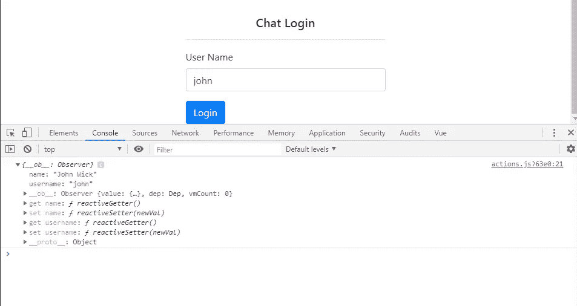

在这个截图中，我使用了正确的用户名。我还打开了浏览器控制台选项卡，以确保已经填充了`user`对象。更好的是，如果你已经在 Chrome 或 [Firefox](https://addons.mozilla.org/en-US/firefox/addon/vue-js-devtools/) 中安装了 [Vue.js 开发工具，你应该能看到更详细的信息。](https://chrome.google.com/webstore/detail/vuejs-devtools/nhdogjmejiglipccpnnnanhbledajbpd)

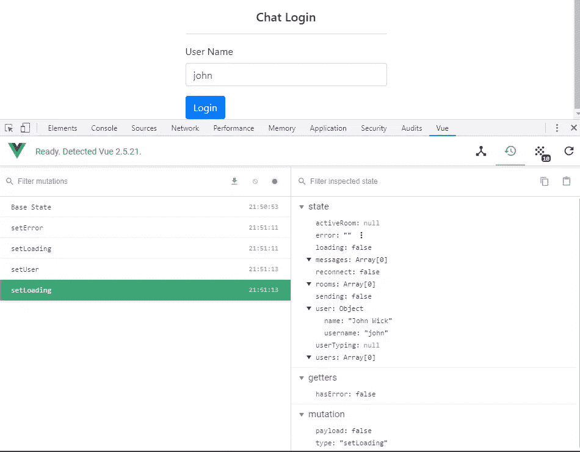

如果在这一点上一切正常，那么继续下一步。

## 预订房间

既然我们已经成功地验证了登录功能可以工作，我们需要将用户重定向到`ChatDashboard`视图。代码`this.$router.push('chat');`为我们做了这件事。然而，我们的动作`login`需要返回一个布尔值来确定何时可以导航到`ChatDashboard`视图。我们还需要用来自 ChatKit 服务的实际数据填充`RoomList`和`UserList`组件。

更新`src/chatkit.js`如下:

```
//...
import moment from 'moment'
import store from './store/index'

//...
function setMembers() {
  const members = activeRoom.users.map(user => ({
    username: user.id,
    name: user.name,
    presence: user.presence.state
  }));
  store.commit('setUsers', members);
}

async function subscribeToRoom(roomId) {
  store.commit('clearChatRoom');
  activeRoom = await currentUser.subscribeToRoom({
    roomId,
    messageLimit: MESSAGE_LIMIT,
    hooks: {
      onMessage: message => {
        store.commit('addMessage', {
          name: message.sender.name,
          username: message.senderId,
          text: message.text,
          date: moment(message.createdAt).format('h:mm:ss a D-MM-YYYY')
        });
      },
      onPresenceChanged: () => {
        setMembers();
      },
      onUserStartedTyping: user => {
        store.commit('setUserTyping', user.id)
      },
      onUserStoppedTyping: () => {
        store.commit('setUserTyping', null)
      }
    }
  });
  setMembers();
  return activeRoom;
}

export default {
  connectUser,
  subscribeToRoom
} 
```

如果您看一下`hooks`部分，我们有 ChatKit 服务使用的事件处理程序来与我们的客户端应用程序通信。你可以在这里找到完整的文档[。我将快速总结每个挂钩方法的用途:](https://docs.pusher.com/chatkit/reference/javascript)

*   `onMessage`接收消息
*   `onPresenceChanged`当用户登录或注销时接收事件
*   `onUserStartedTyping`接收用户正在键入的事件
*   `onUserStoppedTyping`接收用户停止输入的事件

为了让`onUserStartedTyping`工作，我们需要在用户输入时从我们的`MessageForm`发出一个输入事件。我们将在下一节研究这个问题。

用以下代码更新`src/store/actions.js`中的`login`函数:

```
//...
try {
  //... (place right after the `setUser` commit statement)
  // Save list of user's rooms in store
  const rooms = currentUser.rooms.map(room => ({
    id: room.id,
    name: room.name
  }))
  commit('setRooms', rooms);

  // Subscribe user to a room
  const activeRoom = state.activeRoom || rooms[0]; // pick last used room, or the first one
  commit('setActiveRoom', {
    id: activeRoom.id,
    name: activeRoom.name
  });
  await chatkit.subscribeToRoom(activeRoom.id);

  return true;
} catch (error) {
  //...
} 
```

保存代码后，返回登录屏幕并输入正确的用户名。您将进入以下屏幕。

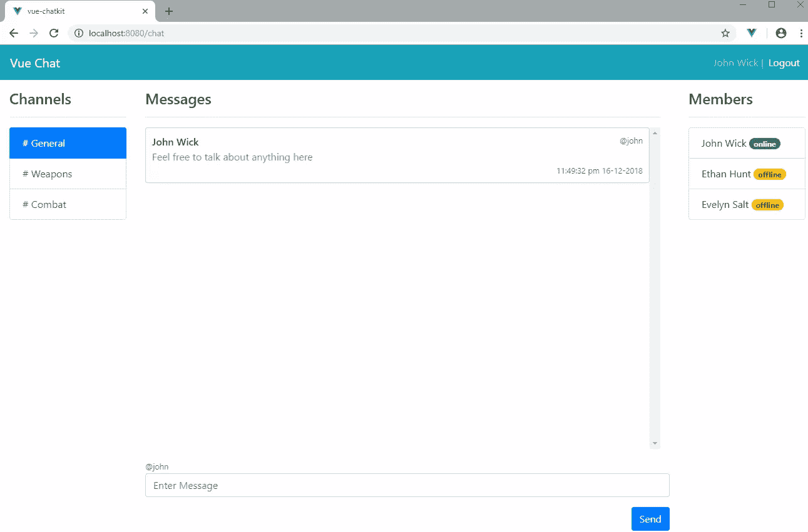

不错！几乎所有的组件都可以正常工作，因为我们将它们正确连接到了 Vuex 商店。尝试通过 ChatKit 的仪表板控制台界面发送消息。创建一条消息并张贴到`General`房间。您应该看到新消息在`MessageList`组件中自动弹出。很快，我们将实现从 Vue.js 应用程序发送消息的逻辑。

### 如果您遇到问题

如果您遇到问题，请尝试以下方法:

*   重新启动 Vue.js 服务器
*   清除您的浏览器缓存
*   进行硬重置/刷新(如果*控制台*标签打开并且按住*重新加载*按钮五秒钟，则在 Chrome 中可用)
*   使用浏览器控制台清除本地存储

如果到目前为止一切都运行良好，请继续下一部分，我们将实现更衣室的逻辑。

## 更衣室

这一部分非常简单，因为我们已经奠定了基础。首先，我们将创建一个允许用户换房间的`action`。转到`src/store/actions.js`并在`login`动作处理器后添加该功能:

```
async changeRoom({ commit }, roomId) {
  try {
    const { id, name } = await chatkit.subscribeToRoom(roomId);
    commit('setActiveRoom', { id, name });
  } catch (error) {
    handleError(commit, error)
  }
}, 
```

接下来，转到`src/componenents/RoomList.vue`并更新脚本部分，如下所示:

```
import { mapState, mapActions } from 'vuex'
//...
export default {
  //...
  methods: {
    ...mapActions([
      'changeRoom'
    ]),
    onChange(room) {
      this.changeRoom(room.id)
    }
  }
} 
```

如果您还记得，我们已经在`b-list-group-item`元素中定义了`@click="onChange(room)"`。让我们通过点击`RoomList`组件中的项目来测试这个新特性。

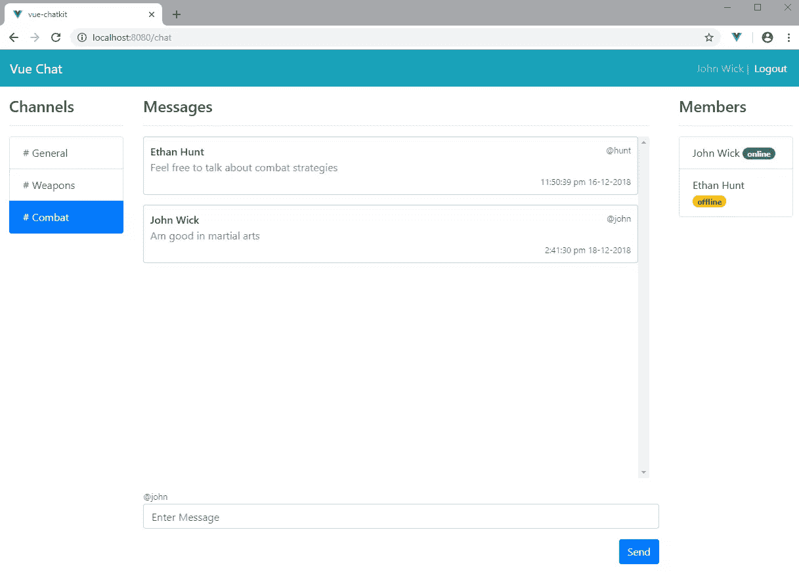

您的 UI 应该随着房间的每次点击而更新。`MessageList`和`UserList`组件应该显示所选房间的正确信息。在下一节中，我们将一次实现多个特性。

## 页面刷新后重新连接用户

您可能已经注意到，当您对`store/index.js`进行一些更改，或者进行页面刷新时，您会得到以下错误:`Cannot read property 'subscribeToRoom' of null`。这是因为应用程序的状态被重置。幸运的是，`vuex-persist`包通过保存在浏览器的本地存储器中，在页面重新加载之间维护我们的 Vuex 状态。

不幸的是，将我们的应用程序连接到 ChatKit 服务器的引用被重置回 null。要解决这个问题，我们需要执行重新连接操作。我们还需要一种方法来告诉我们的应用程序刚刚发生了页面重新加载，我们的应用程序需要重新连接才能继续正常运行。我们将在`src/components/ChatNavbar.vue`中实现这段代码。按如下方式更新脚本部分:

```
<script>
import { mapState, mapActions, mapMutations } from 'vuex'

export default {
  name: 'ChatNavBar',
  computed: {
    ...mapState([
      'user',
       'reconnect'
    ])
  },
  methods: {
    ...mapActions([
      'logout',
      'login'
    ]),
    ...mapMutations([
      'setReconnect'
    ]),
    onLogout() {
      this.$router.push({ path: '/' });
      this.logout();
    },
    unload() {
      if(this.user.username) { // User hasn't logged out
        this.setReconnect(true);
      }
    }
  },
  mounted() {
    window.addEventListener('beforeunload', this.unload);
    if(this.reconnect) {
      this.login(this.user.username);
    }
  }
}
</script> 
```

让我来分解事件的顺序，以便您能够理解重新连接到 ChatKit 服务背后的逻辑:

1.  `unload`。当发生页面刷新时，会调用此方法。它首先检查状态`user.username`是否已被设置。如果有，则表示用户尚未注销。状态`reconnect`被设置为真。
2.  `mounted`。每当`ChatNavbar.vue`刚刚完成渲染时，这个方法就会被调用。它首先为事件侦听器分配一个处理程序，该事件侦听器在页面卸载之前被调用。它还检查`state.reconnect`是否被设置为真。如果是，则执行登录过程，从而将我们的聊天应用程序重新连接到我们的 ChatKit 服务。

我还添加了一个`Logout`特性，我们将在后面研究它。

完成这些更改后，尝试刷新页面。您将看到页面在后台重新连接的过程中自动更新。当你换房间的时候，它应该可以完美的工作。

## 发送消息，检测用户输入和注销

让我们通过添加以下代码开始在`src/chatkit.js`中实现这些特性:

```
//...
async function sendMessage(text) {
  const messageId = await currentUser.sendMessage({
    text,
    roomId: activeRoom.id
  });
  return messageId;
}

export function isTyping(roomId) {
  currentUser.isTypingIn({ roomId });
}

function disconnectUser() {
  currentUser.disconnect();
}

export default {
  connectUser,
  subscribeToRoom,
  sendMessage,
  disconnectUser
} 
```

虽然功能`sendMessage`和`disconnectUser`会捆绑在 ChatKit 的模块导出中，但是`isTyping`功能会单独导出。这是为了让`MessageForm`直接发送打字事件，而不涉及 Vuex 商店。

对于`sendMessage`和`disconnectUser`，我们需要更新存储，以便处理错误和加载状态通知。转到`src/store/actions.js`，在`changeRoom`函数后插入以下代码:

```
async sendMessage({ commit }, message) {
  try {
    commit('setError', '');
    commit('setSending', true);
    const messageId = await chatkit.sendMessage(message);
    return messageId;
  } catch (error) {
    handleError(commit, error)
  } finally {
    commit('setSending', false);
  }
},
async logout({ commit }) {
  commit('reset');
  chatkit.disconnectUser();
  window.localStorage.clear();
} 
```

对于`logout`函数，我们调用`commit('reset')`将我们的存储重置回其初始状态。这是从浏览器缓存中删除用户信息和消息的基本安全功能。

让我们从更新`src/components/MessageForm.vue`中的表单输入开始，通过添加`@input`指令来发出输入事件:

```
<b-form-input id="message-input"
              type="text"
              v-model="message"
              @input="isTyping"
              placeholder="Enter Message"
              autocomplete="off"
              required>
</b-form-input> 
```

现在让我们更新`src/components/MessageForm.vue`的脚本部分，以处理消息发送和类型化事件的发出。更新如下:

```
<script>
import { mapActions, mapState, mapGetters } from 'vuex'
import { isTyping } from '../chatkit.js'

export default {
  name: 'message-form',
  data() {
    return {
      message: ''
    }
  },
  computed: {
    ...mapState([
      'user',
      'sending',
      'error',
      'activeRoom'
    ]),
    ...mapGetters([
      'hasError'
    ])
  },
  methods: {
    ...mapActions([
      'sendMessage',
    ]),
    async onSubmit() {
      const result = await this.sendMessage(this.message);
      if(result) {
        this.message = '';
      }
    },
     async isTyping() {
      await isTyping(this.activeRoom.id);
    }
  }
}
</script> 
```

而在`src/MessageList.vue`:

```
import { mapState } from 'vuex'

export default {
  name: 'message-list',
  computed: {
    ...mapState([
      'messages',
      'userTyping'
    ])
  }
} 
```

发送消息功能现在应该可以工作了。为了显示另一个用户正在输入的通知，我们需要添加一个元素来显示该信息。在`src/components/MessageList.vue`的模板部分中，在`message-group` div 之后添加以下代码片段:

```
<div class="user-typing">
  @{{ userTyping }} is typing....
</div> 
```

要测试这个特性，只需使用不同的浏览器作为另一个用户登录并开始输入。您应该会在其他用户的聊天窗口中看到一个通知。

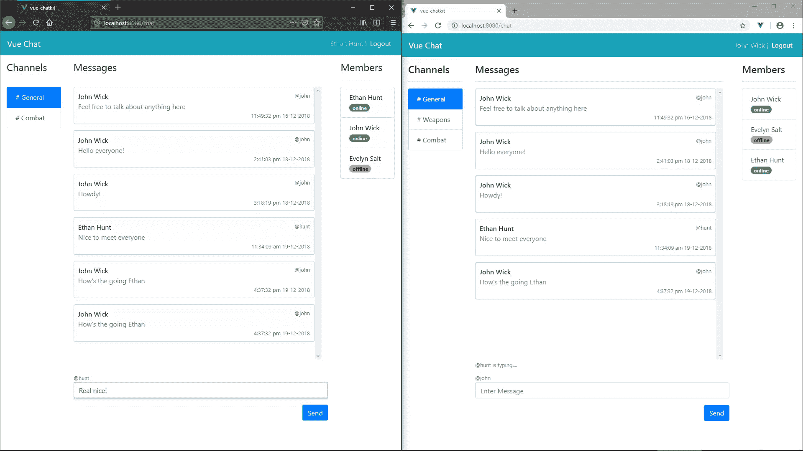

让我们通过实现最后一个特性`logout`来结束本教程。我们的 Vuex 存储已经有了处理注销过程的必要代码。我们只需要更新`src/components/ChatNavBar.vue`。只需将`Logout`按钮与我们之前指定的函数处理程序`onLogout`链接起来:

```
 <b-nav-item href="#" @click="onLogout" active>Logout</b-nav-item> 
```

就是这样。您现在可以注销，然后以另一个用户的身份再次登录。

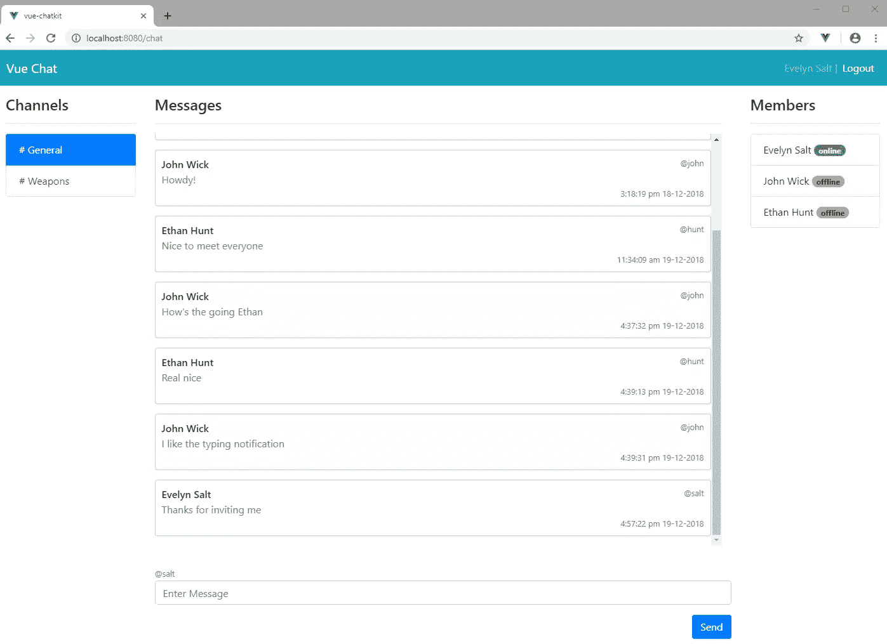

## 摘要

我们现在已经到了教程的结尾。ChatKit API 使我们能够在短时间内快速构建一个聊天应用程序。如果我们要从头开始构建一个类似的应用程序，这将花费我们几个星期的时间，因为我们还必须充实后端。这个解决方案的伟大之处在于，我们不必处理托管、管理数据库和其他基础设施问题。我们可以简单地构建前端代码，并将其部署到 web、Android 和 IOS 平台上的客户端设备。

请务必看一下文档，因为有很多后端特性我无法在本教程中向您展示。假以时日，你可以轻松构建一个功能齐全的聊天应用程序，与 Slack 和 Discord 等流行的聊天产品相媲美。

## 分享这篇文章