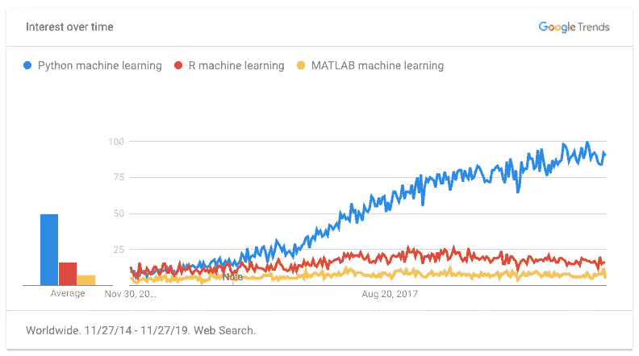
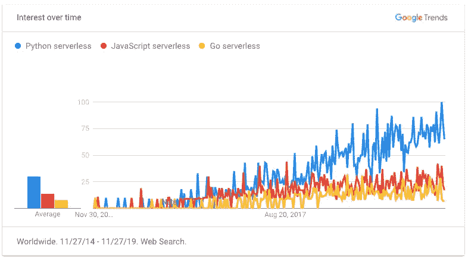
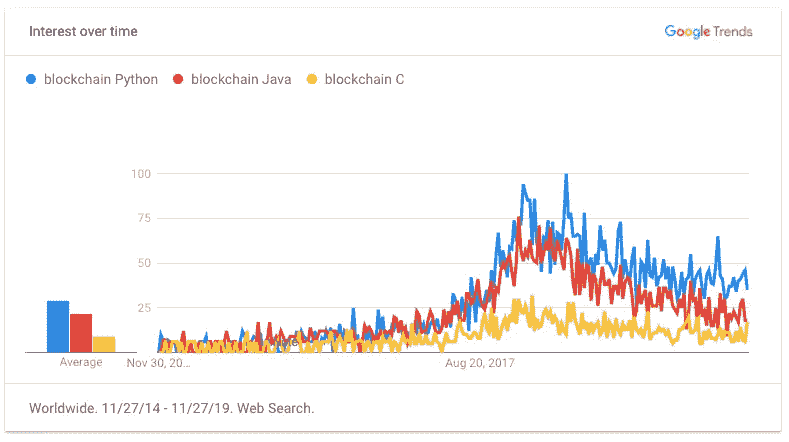
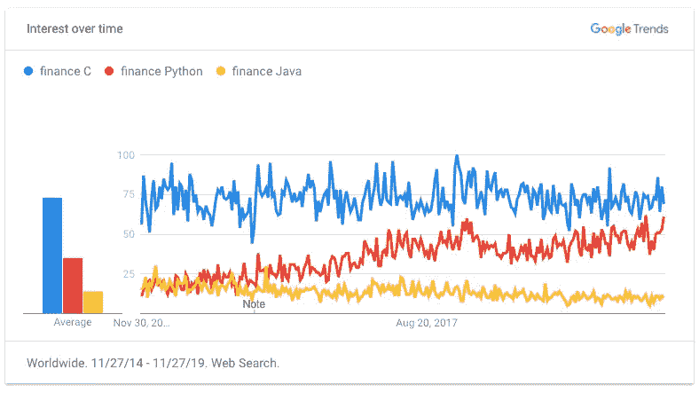
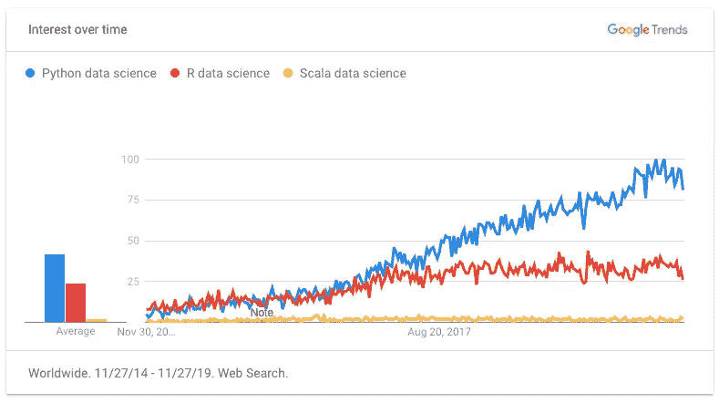
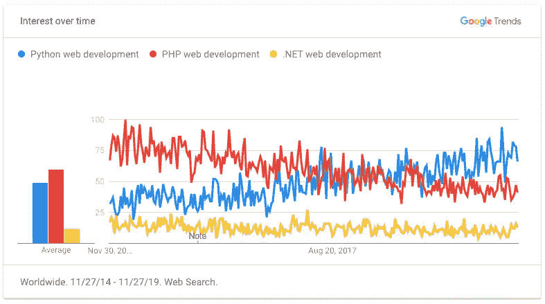

# 如何参与蓬勃发展的 Python 就业市场

> 原文：<https://www.sitepoint.com/python-job-market/>

从金融到人工智能，从数据科学到 web 开发，没有一个领域不巩固和发展 Python。因此，让我们来讨论实际工资、受欢迎的技能、市场以及如何保持竞争力。

*在 [SitePoint Remote](https://www.sitepoint.com/jobs?utm_source=blog&utm_medium=articles) 上寻找远程技术工作，包括 Python。*

## 今天的就业市场

信息技术创造了一个极其多样和活跃的市场，现在单单说“计算机科学”就有点像一个总括术语。几乎所有的东西在某种程度上都有它的元素——从推荐你应该看哪部电视剧的算法，到这个页面上的代码，甚至是将你的家用电器与你的手机集成在一起的软件。

从这些广泛的领域中——所有这些领域都有自己的职业生涯——我们将挑选一小部分。所有这些都属于 2020 年特别热门的价值数百万/十亿美元的行业，并且在可预见的未来很可能仍然活跃。

我们谈论的是:

*   人工智能
*   云开发
*   加密货币和金融
*   数据科学
*   web 开发和移动应用

*在一个激动人心、不断发展且有利可图的行业中，几乎任何职位都需要精通 Python*。堆栈溢出趋势非常雄辩地向[展示了 Python 是如何从 2008 年开始成为最受关注的编程语言](https://insights.stackoverflow.com/trends?tags=python%2Cjavascript%2Cjava%2Cc%2B%2B%2Cr%2C.net%2Cgo%2Cscala)。

但是光靠编程是不够的。在你被考虑这个职位之前，你还需要扎实的行业知识。

让我们在 [Google Trends](https://trends.google.com/) 上看看 Python 在过去五年中在各个领域与其他语言的对比，并讨论你还需要掌握哪些知识。

## 统计分析和深度学习

[机器学习:Python 对比 R 和 MATLAB](https://trends.google.com/trends/explore?date=today%205-y&q=Python%20machine%20learning,R%20machine%20learning,MATLAB%20machine%20learning) 。

大概没必要解释为什么**人工智能** (AI)现在很火。事实上，过去十年金融成功的公式似乎是:

1.  资助一家人工智能初创公司
2.  成功开发出[概念验证](https://en.wikipedia.org/wiki/Proof_of_concept)
3.  被资助或收购
4.  收取利润。

[机器学习](https://en.wikipedia.org/wiki/Machine_learning)仍在继续，但这些天游戏的名字是[深度学习](https://en.wikipedia.org/wiki/Deep_learning)。如果你想挖得更深，看看[卷积神经网络](https://en.wikipedia.org/wiki/Convolutional_neural_network)。

**额外的**:参见[机器学习的 5 种入门方式](https://www.sitepoint.com/5-ways-get-started-machine-learning/)以获得关于该主题的一些资源。

### 数学

但是我们不要把它留在 AI 上。输入数学。

听说过乐器的[定律吗？亚伯拉罕·马斯洛有句名言:*“如果你唯一的工具是一把锤子，我想把一切都当成钉子是很有诱惑力的。”*](https://en.wikipedia.org/wiki/Law_of_the_instrument)

在我们目前的情况下，这意味着如果我们只知道人工智能，无论我们面临什么问题，我们都将试图找到数据集并为其训练算法，而令人惊讶的是，我们经常需要的只是一个简单的概率模型，以便能够做出快速预测。换句话说——数学。

如果你想更进一步，补充你的人工智能知识，看看:

*   描述统计学
*   概率论
*   推理
*   线性代数(也不会有坏处)

### 薪水

在过去的五年里，需要人工智能技能的工作份额增长了 4.5 倍，截至 2018 年，四分之一的北美公司在至少一个企业职能中嵌入了人工智能。此外，苹果、脸书和谷歌正在投资[深度强化学习](https://en.wikipedia.org/wiki/Deep_reinforcement_learning) (DRL)，人工智能工具预计到 2021 年将产生近 3 万亿美元的商业价值，仅自然语言处理(NLP)市场预计到 2025 年将达到 220 亿美元。

有了这一切，顶级人工智能专家获得 30-50 万美元的薪水就不足为奇了。

## 微服务和无服务器计算

[无服务器架构:Python 对比 JavaScript 和 Go](https://trends.google.com/trends/explore?date=today%205-y&q=Python%20serverless,JavaScript%20serverless,Go%20serverless) 。

这是另一种说法*将服务与云*集成在一起——然而，这是另一个你可以肯定会持续增长的领域。

在“无服务器”执行模式中，公司能够减少维护，节约成本，并跨所有平台有效地交换信息。

### 什么和哪里

云基础设施提供商有很多，但为了保持竞争力，您可以专注于处理这三家提供商的事情:

*   **[亚马逊网络服务](https://aws.amazon.com/)** (AWS)
*   [谷歌云平台](https://cloud.google.com/) (GCP)
*   [微软 Azure](https://azure.microsoft.com/)

特别是，你希望能够用 [AWS Lambda](https://aws.amazon.com/lambda/) 和 [Amazon API Gateway](https://aws.amazon.com/api-gateway/) 实现和部署 API——或者它们在谷歌[云功能](https://cloud.google.com/functions/)和微软 [Azure 功能](https://azure.microsoft.com/services/functions/)中的对等物。

**Extra** :参见[共享托管和云托管的比较，以及如何选择](https://www.sitepoint.com/shared-vs-cloud-hosting-how-to-choose/)，进一步了解这些云提供商如何构建他们的服务。

### 薪水

自 2015 年以来，与 DevOps 相关的职位翻了一番，仅在美国就有超过 5 万个云计算职位

在美国，云专家的平均工资是 14.6 万美元。

## 区块链和定量分析

[区块链:Python 对比 C++和 Java](https://trends.google.com/trends/explore?date=today%205-y&q=blockchain%20Python,blockchain%20Java,blockchain%20C%2B%2B) 。

最初我不打算把区块链包括在这个列表中，因为在我看事情的方式(有限且肯定有偏见)中，我不太清楚加密货币在几年后是否仍然是一个东西。

但是，嘿，现在这是一个相当活跃的领域，到处都有工作机会！

[金融:Python 对比 C++和 Java](https://trends.google.com/trends/explore?date=today%205-y&q=finance%20C%2B%2B,finance%20Python,finance%20Java) 。

如果你收集了足够的知识来理解加密货币的金融方面，再加上对 Python 的精通，这可能会为一些投资银行和金融科技初创公司的 IT 部门打开许多大门。

区块链不仅是加密货币的基础，还可以用于建立具有多种应用的[分布式账本](https://en.wikipedia.org/wiki/Distributed_ledger)。

### 薪水

正如我们提到的，区块链需求正在蓬勃发展，预计市场将以每年超过 60%的速度增长。

区块链工程师正在[制造](https://www.cnbc.com/2018/10/21/how-much-do-blockchain-engineers-make.html) **在 15 万美元到 17.5 万美元**之间。

## 大数据和数据分析

[数据科学:Python 对比 R 和 Scala](https://trends.google.com/trends/explore?date=today%205-y&q=Python%20data%20science,R%20data%20science,Scala%20data%20science) 。

**数据科学**的研究领域越来越多:

*   [数据分析](https://en.wikipedia.org/wiki/Data_analysis)(以及[探索性数据分析](https://en.wikipedia.org/wiki/Exploratory_data_analysis))
*   [数据管理](https://en.wikipedia.org/wiki/Data_management)
*   [数据挖掘](https://en.wikipedia.org/wiki/Data_mining)
*   [数据可视化](https://en.wikipedia.org/wiki/Data_visualization)(以及[交互式数据可视化](https://en.wikipedia.org/wiki/Interactive_data_visualization))
*   [数据仓库](https://en.wikipedia.org/wiki/Data_warehouse)

它还有数不清的配套做法和工具，如[清理](https://en.wikipedia.org/wiki/Data_cleansing "Data cleansing")、[收集](https://en.wikipedia.org/wiki/Data_collection "Data collection")、[压缩](https://en.wikipedia.org/wiki/Data_compression "Data compression")、[熟化](https://en.wikipedia.org/wiki/Data_curation "Data curation")、[养殖](https://en.wikipedia.org/wiki/Data_farming "Data farming")、[整合](https://en.wikipedia.org/wiki/Data_integration "Data integration")、[迁移](https://en.wikipedia.org/wiki/Data_migration "Data migration")、[保存](https://en.wikipedia.org/wiki/Data_preservation "Data preservation")、[恢复](https://en.wikipedia.org/wiki/Data_recovery "Data recovery")、[保留](https://en.wikipedia.org/wiki/Data_retention "Data retention")、[刮除](https://en.wikipedia.org/wiki/Data_scraping "Data scraping")、[扯皮](https://en.wikipedia.org/wiki/Data_wrangling "Data wrangling")

### 还有更多

希望 Python 仅仅是一个工具这一点变得越来越明显，关于使用它的各种不同方式，还有很多东西需要学习。但是，如果你真的想成为一名数据科学家，*你还需要了解你将应用它的领域*——可能是生物学、金融、社会现象或其他。

### 薪水

对数据驱动流程的投资在 5 年内翻了一番，到 2018 年达到 1 万亿美元，超过一半的公司计划增加需要数据分析技能的职位。

在美国，一名数据工程师的平均基本工资为 11.5 万美元。

## 后端开发

[Web 开发:Python 对比 PHP 和。网](https://trends.google.com/trends/explore?date=today%205-y&q=Python%20web%20development,PHP%20web%20development,.NET%20web%20development)。

这可以说是这个列表中最不热门的话题。但事实是，即使有了上述微服务的兴起，web 开发也不会很快有任何进展。web 和移动应用程序仍然需要大量的后端编程来处理来自 web 浏览器或移动用户界面的输入。

过去，熟悉 Linux 是“加分项”。如今，作为后端开发人员，这被认为是理所当然的:“好处”是*您应该能够协调云基础设施，并且至少在某种程度上熟悉 DevOps 实践*，例如部署管道和处理[软件容器](https://www.sitepoint.com/docker-containers-software-delivery/)。

**Extra** :参见[devo PS by Example:devo PS 文化的工具、利与弊](https://www.sitepoint.com/devops-by-example-tools-pros-and-cons-of-a-devops-culture/)以获得关于该主题的初级读本。

### 全程数据库

为了恰当地管理后端开发，你还需要在不同的 RDBMS 之间游刃有余，比如 PostgreSQL 和 MySQL。您还应该知道，*数据管理也已经在 NoSQL* 运行了一段时间，并且 [MongoDB](https://www.mongodb.com/) 和 [Redis](https://redis.io/) 已经证明了时间的考验是可靠的实现。

### 薪水

美国劳工统计局预计未来五年网络开发人员的就业增长将超过 15%。

在美国，一名后端开发人员的工资数字可能相差很大，中位数为 7.2 万美元，T2 从 3.4 万美元到 9.8 万美元不等。

## 市场

希望 Python 已经成为技术堆栈的关键部分，所以假设你想成为某个大公司的一部分，并申请一个全职职位。或者，您可能想轻松一下，在享受生活和/或补充收入的同时做一些兼职 Python 编程。

那就继续读吧。如果你能使用 Python，你有很多选择。

### 搜索 Python 全职工作

LinkedIn 不仅是一个社交平台，也是最大的招聘网站之一。当然，拥有一份人脉广泛的个人资料会有所帮助，因为这会帮你省下一些求职信。但是即使你是 LinkedIn 的新手，你仍然可以[搜索 Python 职位](https://www.linkedin.com/jobs/python-jobs)和*按国家和州进行过滤*。

你是一名开发人员，不花时间在 **[堆栈溢出](https://stackoverflow.com/)** 上是不可能的。除了 Q & As，Stack Overflow 还有精心策划的工作列表，在那里你可以**筛选渴望引进外国人才的“签证担保”公司**。[使用 Python](https://stackoverflow.com/jobs/developer-jobs-using-python) 搜索开发人员职位。

现在，更具体地说，你一定要看看 Python 官方网站上的**[【PythonJobs.com】](https://www.pythonjobs.com/)**和 **[工作板](https://www.python.org/jobs/)** 。它们远不如这些平台全面，但却是你所能得到的最准确的。

如果你特别想要一份远程工作， [SitePoint Remote](https://www.sitepoint.com/jobs/) 为 Python 工程师提供了许多列表。

最后，**[【Angel.co】](https://angel.co/)**是为*连接开发者、创业者和投资人*而创建的创业社区。如果你想为一家令人兴奋的新成立的创业公司工作，这可能是一个值得一去的地方。

### 用 Python 做自由职业

自由职业本身就是一头野兽，是一个需要一系列文章来讨论的话题。现在，我们将只指出哪些平台可能是感兴趣的。

2013 年 Elance 和 oDesk 合并后， [Upwork](https://www.upwork.com/) 成为自由职业者的主要市场，每年发布数百万份工作。这意味着从[软件开发](https://www.upwork.com/?ee=development)到[数据科学和分析](https://www.upwork.com/?ee=data-science)等领域的大量潜在雇员(当然，别忘了[浏览 Python 自由职业者职位](https://www.upwork.com/freelance-jobs/python/))。另一个好主意可能是查看其他 [Python 开发者简介](https://www.upwork.com/freelance-jobs/python/)，看看他们提供什么以及收费多少。

Upwork 的不利之处不仅在于大海捞针可能相当乏味，而且与 1200 万其他自由职业者竞争可能很艰难。另外，升级费用是你必须支付的最高费用！

自由职业者是另一个市场，规模较小，但仍然相当大而且活跃，[用户报告说体验很好](https://www.trustpilot.com/review/www.freelancer.com)，还有**一个有吸引力的[无佣金项目](https://www.freelancer.com/no-commission/no-commission-invitation.php)** (与 Upwork 的 20%提成非常不同)。确保您检查了 [Python 作业列表](https://www.freelancer.com/jobs/python/)。

你还可以查看其他网站:Guru ( [Python jobs](https://www.guru.com/d/jobs/c/programming-development/skill/python/) )和**people per hour**([Python services](https://www.peopleperhour.com/services/python?ref=search)， [Python jobs](https://www.peopleperhour.com/freelance-python-jobs) )。

### 总面积

如果你已经有了一个 Python 开发者的综合档案，你可以考虑申请 [Toptal](https://www.toptal.com#amass-nothing-but-credible-web-developers) ，这是一个声称可以管理*顶尖 3%自由职业人才*的平台。

基本上，Toptal 将筛选你的个人资料，如果符合他们的标准*，你将被列入不介意向那些已经证明他们可以多做一点的人支付额外费用的客户名单*。全职和兼职都可以，甚至包括小时分配。

## 包裹

老实说，在解决问题时，编程语言本身有时是次要的，真正需要的是对手头情况的理解和开放的心态。如果你不太了解你想从事的领域，你的潜在雇主不会太在意你对 Python 的来龙去脉掌握得有多好。现在的情况是，这些细节经常变化和扩展。

这意味着*你需要不断学习*，因为无论你现在有什么优势，几年后你都不会拥有。

就我个人而言，我不太喜欢不请自来的建议，因为这有点学究气。但是，如果我可以的话，只是为了总结这篇文章:**积极主动，保持好奇心，多走一步，适应新环境，不要满足于你已经知道的东西**。最后，你的编程语言是什么并不重要，因为你总是有需求的。

想要提高您的 Python 技能并在快速增长的市场中脱颖而出吗？查看 [SitePoint Premium](https://www.sitepoint.com/premium/library) ！你会找到一些书籍来帮助你入门(比如《Python 学徒】中的[)和发展工作技能(比如《Python 中的前端测试](https://www.sitepoint.com/premium/books/the-python-apprentice/)】)。使用 Python 大师[提高您的技能，并访问超过 400 本关于 web 设计和开发的书籍和课程的不断增长的图书馆。](https://www.sitepoint.com/premium/books/the-python-master/)

## 分享这篇文章