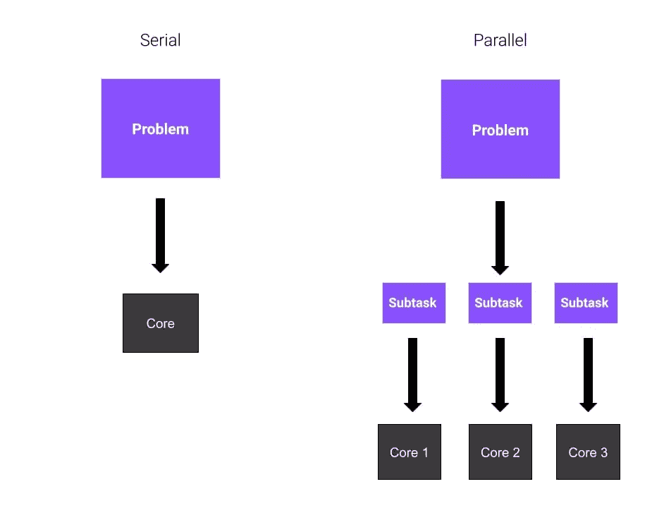

# Python 多重处理和并行编程指南

> 原文：<https://www.sitepoint.com/python-multiprocessing-parallel-programming/>

加速计算是每个人都想达到的目标。如果您有一个运行速度比当前运行速度快 10 倍的脚本会怎么样？在本文中，我们将研究 Python 多重处理和一个名为`multiprocessing`的库。我们将讨论什么是多重处理，它的优点，以及如何通过使用并行编程来提高 Python 程序的运行时间。

好吧，我们走吧！

## 并行性介绍

在深入研究 Python 代码之前，我们不得不说一下**并行计算**，这是计算机科学中的一个重要概念。

通常，当你运行一个 Python 脚本时，你的代码在某个时候会变成一个进程，而这个进程运行在你的 CPU 的一个单核上。但是现代计算机有不止一个内核，那么如果你可以使用更多的内核来进行计算呢？结果是你的计算会更快。

现在让我们把这作为一个普遍的原则，但是稍后，在本文中，我们会看到这并不是普遍适用的。

不涉及太多细节，并行性背后的想法是以这样一种方式编写代码，它可以使用 CPU 的多个内核。

为了使事情变得简单，让我们看一个例子。

## 并行和串行计算

想象你有一个巨大的问题要解决，而你是一个人。你需要计算八个不同数字的平方根。你是做什么的？你没有太多选择。你从第一个数字开始，然后计算结果。然后，你和其他人继续。

如果你有三个擅长数学的朋友愿意帮助你呢？他们每个人都会计算两个数的平方根，你的工作会更轻松，因为工作量在你的朋友之间平均分配。这意味着你的问题会得到更快的解决。

好了，都清楚了吗？在这些例子中，每个朋友代表 CPU 的一个核心。在第一个例子中，整个任务由你按顺序解决。这叫做**串行计算**。在第二个例子中，因为您总共使用了四个内核，所以您使用了**并行计算**。并行计算涉及并行进程的使用，或者在处理器中的多个内核之间划分的进程。



## 并行编程模型

我们已经确定了什么是并行编程，但是我们如何使用它呢？我们之前说过，并行计算涉及在处理器的多个内核中执行多个任务，这意味着这些任务是同时执行的。在进行并行化之前，您应该考虑几个问题。例如，有没有其他优化可以加快我们的计算速度？

现在，让我们理所当然地认为并行化是您的最佳解决方案。并行计算中主要有三种[模型](https://en.wikipedia.org/wiki/Parallel_programming_model):

*   完全平行。任务可以独立运行，不需要相互通信。
*   **共享内存并行**。进程(或线程)需要通信，因此它们共享一个全局地址空间。
*   **消息传递**。需要时，进程需要共享消息。

在本文中，我们将说明第一个模型，这也是最简单的。

## Python 多重处理:Python 中基于进程的并行性

在 Python 中实现并行的一种方法是使用[多处理模块](https://github.com/python/cpython/tree/3.10/Lib/multiprocessing/)。`multiprocessing`模块允许您创建多个流程，每个流程都有自己的 Python 解释器。因此，Python 多处理实现了基于进程的并行性。

你可能听说过其他的库，比如`threading`，它也是 Python 内置的，但是它们之间有很大的区别。模块`multiprocessing`创建新的进程，而`threading`创建新的线程。

在下一节中，我们将看看使用多处理的优点。

## 使用多重处理的好处

以下是多重处理的一些好处:

*   在处理高 CPU 密集型任务时，更好地利用 CPU
*   与线程相比，对孩子的控制更多
*   易于编码

第一个优势与性能有关。由于多重处理创建了新的进程，所以通过将任务分配给其他内核，可以更好地利用 CPU 的计算能力。如今，大多数处理器都是多核处理器，如果您优化代码，就可以通过并行计算来节省时间。

第二个优点是寻找多处理的替代方法，即多线程。但是线程不是进程，这有它的后果。如果你创建了一个线程，杀死它甚至中断它是很危险的，就像你对一个正常进程所做的那样。由于多处理和多线程之间的比较不在本文的范围之内，我鼓励您做一些进一步的阅读。

多重处理的第三个优点是它很容易实现，因为你要处理的任务适合并行编程。

## Python 多处理入门

我们终于准备好编写一些 Python 代码了！

我们将从一个非常基本的例子开始，并用它来说明 Python 多处理的核心方面。在本例中，我们有两个流程:

*   `parent`过程。只有一个父进程，它可以有多个子进程。
*   `child`过程。这是由父代产生的。每个孩子也可以有新的孩子。

我们将使用`child`进程来执行某个功能。这样，`parent`就可以继续执行。

### 一个简单的 Python 多重处理示例

以下是我们将在本例中使用的代码:

```
from multiprocessing import Process

def bubble_sort(array):
    check = True
    while check == True:
      check = False
      for i in range(0, len(array)-1):
        if array[i] > array[i+1]:
          check = True
          temp = array[i]
          array[i] = array[i+1]
          array[i+1] = temp
    print("Array sorted: ", array)

if __name__ == '__main__':
    p = Process(target=bubble_sort, args=([1,9,4,5,2,6,8,4],))
    p.start()
    p.join() 
```

在这个代码片段中，我们定义了一个名为`bubble_sort(array)`的函数。这个函数是冒泡排序算法的一个非常简单的实现。如果你不知道它是什么，不要担心，因为它没那么重要。重要的是要知道这是一个做了一些工作的函数。

### 流程类

从`multiprocessing`开始，我们导入类`Process`。此类表示将在单独的进程中运行的活动。事实上，你可以看到我们已经通过了几个论证:

*   `target=bubble_sort`，这意味着我们的新进程将运行`bubble_sort`函数
*   `args=([1,9,4,52,6,8,4],)`，作为参数传递给目标函数的数组

一旦我们为流程类创建了一个实例，我们只需要启动流程。这是通过写`p.start()`来完成的。此时，流程开始。

在退出之前，我们需要等待子进程完成计算。`join()`方法等待进程终止。

在本例中，我们只创建了一个子流程。正如您可能猜到的，我们可以通过在`Process`类中创建更多的实例来创建更多的子流程。

### 台球课

如果我们需要创建多个进程来处理更多 CPU 密集型任务，该怎么办？我们总是需要开始并明确地等待终止吗？这里的解决方案是使用`Pool`类。

`Pool`类允许你创建一个工作进程池，在下面的例子中，我们将看看如何使用它。这是我们的新例子:

```
from multiprocessing import Pool
import time
import math

N = 5000000

def cube(x):
    return math.sqrt(x)

if __name__ == "__main__":
    with Pool() as pool:
      result = pool.map(cube, range(10,N))
    print("Program finished!") 
```

在这个代码片段中，我们有一个`cube(x)`函数，它只接受一个整数并返回它的平方根。很简单，对吧？

然后，我们创建了一个`Pool`类的实例，没有指定任何属性。默认情况下，pool 类为每个 CPU 内核创建一个进程。接下来，我们运行带有几个参数的`map`方法。

`map`方法将`cube`函数应用于我们提供的 iterable 的每个元素——在本例中，iterable 是从`10`到`N`的每个数字的列表。

这样做的巨大好处是，列表上的计算是并行完成的！

## 充分利用 Python 多重处理

创建多个进程并进行并行计算并不一定比串行计算更有效。对于低 CPU 密集型任务，串行计算比并行计算更快。因此，了解何时应该使用多处理非常重要，这取决于您正在执行的任务。

为了让你相信这一点，让我们看一个简单的例子:

```
from multiprocessing import Pool
import time
import math

N = 5000000

def cube(x):
    return math.sqrt(x)

if __name__ == "__main__":
    # first way, using multiprocessing
    start_time = time.perf_counter()
    with Pool() as pool:
      result = pool.map(cube, range(10,N))
    finish_time = time.perf_counter()
    print("Program finished in {} seconds - using multiprocessing".format(finish_time-start_time))
    print("---")
    # second way, serial computation
    start_time = time.perf_counter()
    result = []
    for x in range(10,N):
      result.append(cube(x))
    finish_time = time.perf_counter()
    print("Program finished in {} seconds".format(finish_time-start_time)) 
```

这个片段基于前面的例子。我们正在解决同一个问题，即计算`N`数的平方根，但是有两种方法。第一个涉及到 Python 多处理的使用，而第二个则没有。我们使用来自`time`库的`perf_counter()`方法来测量时间性能。

在我的笔记本电脑上，我得到了这个结果:

```
> python code.py
Program finished in 1.6385094 seconds - using multiprocessing
---
Program finished in 2.7373942999999996 seconds 
```

如你所见，相差不止一秒。所以在这种情况下，多处理更好。

让我们修改一下代码，比如`N`的值。让我们把它降低到`N=10000`看看会发生什么。

这是我现在得到的:

```
> python code.py
Program finished in 0.3756742 seconds - using multiprocessing
---
Program finished in 0.005098400000000003 seconds 
```

发生了什么事？现在看来，多重处理是一个糟糕的选择。为什么？

与所解决的任务相比，在进程之间分割计算带来的开销太大了。你可以看到在时间性能方面有多大的差异。

## 结论

在本文中，我们讨论了通过使用 Python 多重处理来优化 Python 代码的性能。

首先，我们简要介绍了什么是并行计算以及使用它的主要模型。然后，我们开始谈论多处理及其优势。最后，我们看到并行化计算并不总是最好的选择，应该使用`multiprocessing`模块来并行化 CPU 受限的任务。一如既往，这是一个考虑你所面临的具体问题并评估不同解决方案的利弊的问题。

我希望您和我一样发现学习 Python 多处理非常有用。

## 分享这篇文章