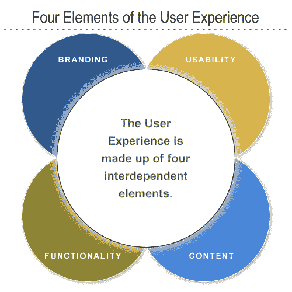
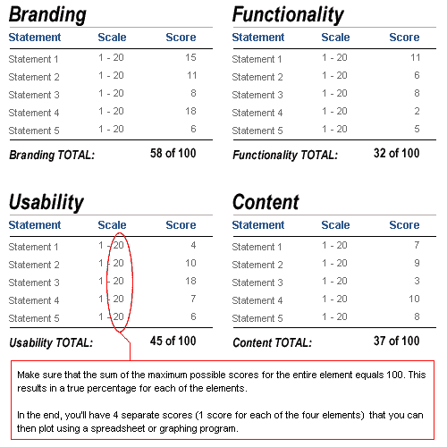
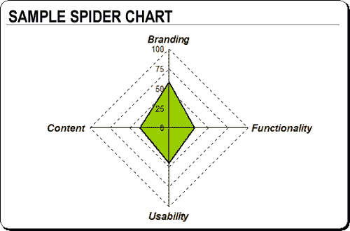
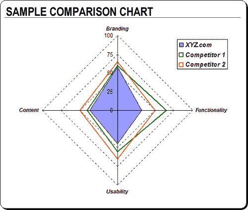

# 如何量化用户体验

> 原文：<https://www.sitepoint.com/quantify-user-experience/>

许多人把用户体验作为网站成功的一个整体指标。分析一个网站如何有效地提供正面的用户体验常常会变成一件主观的事情，充斥着各种观点，缺乏客观性。

这篇文章概述了量化用户体验的一种快速而简单的方法，我发现这种方法非常有用，可以快速、客观、直观地向客户展示他们的网站相对于竞争对手或过去开发工作的情况。

##### 用户体验如何？

术语“用户体验”指的是将最终用户置于设计和开发工作的焦点的概念，与系统、其应用或其美学价值相对。它是基于以用户为中心的设计的一般概念。

用户体验主要由四个因素组成:

*   品牌宣传
*   可用性
*   功能
*   内容

独立地说，这些因素都不会带来积极的用户体验；然而，综合起来，这些因素构成了网站成功的主要因素。

举个例子，一个精心设计的网站经常出现服务器错误或超时。或者想象一个奇妙的、数据库驱动的应用程序，由于这样或那样的原因，从未被使用过，因为它被深埋在站点信息架构的内部。在这两种情况下，我们看到品牌，可用性，功能和内容结构的独立元素并不一定表明一个网站的成功。然而，综合起来看，这些核心元素为用户体验提供了基础。

##### 对客观分析工具的需求

假设你有了一个新的线索——他们对他们的网站目前的形式不满意，希望你帮助把网站引向正确的方向。如果你和我一样，你要做的第一件事就是浏览网站，做一些粗略的笔记。那么，你如何把这些想法和笔记传达给客户，而不是简单地把当前的网站拆开？

问题是，我们对一个网站“好”或“坏”的看法，都被我们的个人背景和行业内的专业所扭曲。当被要求评价一个网站的好处和限制时，开发者、可用性专家、设计师或信息架构师可能会给出完全不同的评价。

一个客观的测量和分析工具可以帮助你为你的客户提供基于事实的建议，而不仅仅是猜测和意见。我们将在本文中探索的方法将帮助您:

*   尽可能把你的个人偏好(主观性)从等式中去掉。
*   让不同背景的人(设计师、开发商、客户)分享对网站的共同理解。
*   为网站与竞争对手或过去的开发工作的比较建立基本规则。
*   为你的客户提供一个基于事实的，可视化的网站优势和局限性的展示。

##### 衡量用户体验

如上所述，用户体验由四个相互依赖的元素组成:

*   品牌宣传
*   可用性
*   功能
*   内容

但是，我们如何量化和测量这些看似无形的元素呢？

方法很简单。我们将我们的分析分为四个部分——用户体验的四个元素中的每一个。对于这些元素中的每一个，我们都创建了一系列的陈述或参数来衡量网站。为每个陈述创建 1 到 X 的等级；我们在这个范围内给每条陈述打分。

一旦你完成了分析的第一部分，你应该对四个部分中的每一个陈述都有一个分数。

在本文所附的示例分析中，我们只为每个元素使用了五个语句或参数。因此，我们采用 20 分制，所以网站的最高总分是 100 分。因此，如果我们为每个元素添加额外的五个陈述或参数，我们会以 10 分制对每个进行评分。

下面是对样本分析中使用的每个元素和语句或参数的简要说明。

***烙印***

品牌包括网站中所有美学和设计相关的项目。它需要网站创造性地投射出期望的组织形象和信息。用于衡量品牌的陈述包括:

*   该网站为访问者提供了引人入胜的难忘体验。
*   网站的视觉冲击与品牌标识相一致。
*   图形、宣传材料和多媒体增加了体验的价值。
*   该网站传递了品牌的预期承诺。
*   该网站利用媒体的能力来增强或扩展品牌。

***功能***

功能包括所有技术和“幕后”流程和应用程序。它要求网站向所有最终用户提供交互式服务，需要注意的是，这有时既指公众，也指管理员。用于衡量站点功能的陈述包括:

*   用户会及时收到对其查询或提交的回复。
*   明确传达任务进度(例如，成功页面或电子邮件更新)。
*   网站和应用程序遵循通用的安全和隐私标准。
*   在线功能与离线业务流程相集成。
*   该网站包含提高管理员效率的管理工具。

 *可用性意味着所有网站组件和功能的易用性。可用性横幅下的子主题可以包括导航和可访问性。用于衡量可用性的陈述可能包括:

*   该网站防止错误并帮助用户从错误中恢复。
*   整体页面权重针对主要目标受众进行了优化。
*   该网站帮助其访问者完成共同的目标和任务。
*   该网站坚持自己的一致性和标准。
*   该网站为残疾用户提供内容。

***内容***

内容是指网站的实际内容(文本、多媒体、图像)以及它的结构或信息架构。我们着眼于了解信息和内容是如何根据定义的用户需求和客户业务需求进行组织的。用于衡量内容的陈述可以包括:

*   链接密度提供了清晰和方便的导航。
*   内容的组织方式有助于实现用户目标。
*   内容是最新的和准确的。
*   内容适合客户需求和业务目标。
*   多种语言的内容非常全面。

在大多数情况下，我对这四个要素中的每一个都使用 10-20 个独立的陈述。我建议你使用上面的陈述作为基础来创建你自己的分析。请记住，如果您添加更多的陈述，您还必须细化 20 分的评分标准，以便每个元素的总分为 100 分。例如，如果您为每个元素使用 10 条陈述，那么您的评分标准将是 1-10。如果你为每个元素使用 20 条语句，你的评分标准是 1-5 分。

下载这个[样本 Excel 文件](https://www.sitepoint.com/examples/quantifyusability/quantifyusabilitysample.zip)作为这种分析风格的例子。

##### 显示您的结果

一旦您完成了分析，并获得了每个语句或参数的值，就该将这些数据转换成清晰的交流格式了。

我们要做的第一件事是将每个元素的所有值相加。因为我们已经设置了评分标准，为每个元素提供最高 100 分，所以我们实际上得到的是一个百分比分数。一旦我们有了这些百分比值，我发现最好的方法是创建一个蜘蛛图来直观地表示它们。微软的 Excel 或 Open Office Calc 在这里都能很好地工作，尽管任何具有绘图功能的电子表格程序都可以。

使用电子表格程序，您可以生成大量数据的可视化表示。有关更多示例，请参见上面下载的示例文件。

##### 让你的分析更有创意

本文中描述的分析和方法的伟大之处在于，它们可以满足您特定的客户或项目需求。

没有理由不在分析中添加第五个类别来描述可访问性或业务度量。例如，假设您有一个政府客户需要遵守第 508 条法规(针对美国)。您可以轻松地创建一组专门处理可访问性元素的语句或参数，修改您的图表以相应地显示。同样，创建一个专门处理客户重要业务指标的类别也非常容易，例如 ROI、点击率、转化率或回头客。

或者，这个分析平台可以让你对你选择的特定元素增加更大的权重。假设你有一个客户是奢侈品制造商，非常注重品牌和外观。没有理由为什么你不能创建一个改进的测量系统，给予品牌元素更大的权重，减少可用性元素的权重。

##### 实际用途

我已经将这种分析融入到我参与的许多不同的项目中。通常，我会在新客户提案的附录中附上一份“快速而粗略”的分析，让潜在客户对他们的网站在竞争中的地位有一个大概的了解。

提供这样的评论也给了你一个展示自己专业水平的绝佳机会。有可能其他投标 RFP 的公司不会包括这种“免费”的咨询服务——而你在你的提案中包括这份报告可能是对你有利的决定性因素。

在其他情况下，我也有客户付费购买他们网站的深度分析和推荐。对于每个语句或参数，这种类型的报告包括几个带有示例或屏幕截图的描述性段落。如果我最终被聘用来贯彻我的建议，我通常会在网站上线六个月后安排另一次评估，以此来显示我的进步，同时强化我的服务价值。

这种类型的分析也可以作为一个门户项目，导致进一步的业务。如果你对分析定价合理，它会是一个很好的工具，让你有机会向新客户展示你的服务的好处。* 

## *分享这篇文章*