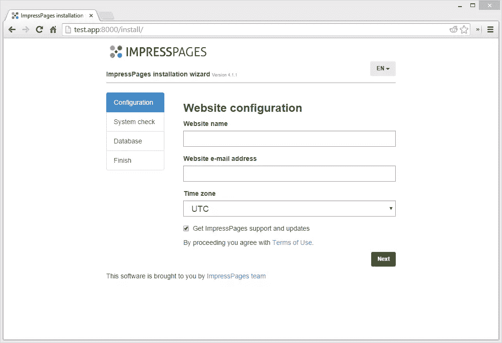

# 快速提示:在家园上留下深刻印象

> 原文：<https://www.sitepoint.com/quick-tip-impresspages4-homestead/>

在经历了与另一个 CMS 的特别痛苦的遭遇后，我觉得是时候尝试另一个了。在这个快速技巧中，我们将安装 impression pages——这是一个 CMS，最近已经升级到版本 4，其教程很快将在 [PHP 频道](http://phpmaster.com)上发布。

## 第一步:改善家园

像往常一样，让你的[家园升级版](https://www.sitepoint.com/quick-tip-get-homestead-vagrant-vm-running/)实例启动并运行。如果您做了`vagrant up`来查看它是否工作，那么做`vagrant destroy`以便我们可以配置它。

## 步骤 2:站点和文件夹

添加新网站:

```
 - map: test.app
      to:  /home/vagrant/Code/imp
```

需要注意的一点是，IP 没有使用(现在)传统的方法来安全访问服务器上的文件夹(将 vhost 根目录指向/public，并将其他所有内容都放在它外面)——所有内容(甚至是它的逻辑)都在公共 web 根目录中。这是一种非常不安全的做法——要小心。我要说的是:**impression pages 在 Nginx** 上默认是高度不安全的。我将很快发布另一个关于如何**确保 Nginx** 上的印象页面的快速提示。

编辑:IP 团队已经在 Nginx [这里](http://www.impresspages.org/help/nginx)发布了关于保护应用的说明。

用`vagrant up`启动虚拟机，用`vagrant ssh`进入

## 第三步:下载 ImpressPages

```
cd Code wget http://sourceforge.net/projects/impresspages/files/latest/download -O imp.zip tar xvf imp.zip
mv ImpressPages imp
```

## 步骤 4:创建数据库

```
mysql -u homestead -psecret
```

一旦进入 mysql，执行:

```
CREATE SCHEMA `imp` DEFAULT CHARACTER SET utf8 COLLATE utf8_general_ci ;  exit
```

## 步骤 5:运行向导

在主机浏览器中，访问应用程序的 URL，但在末尾添加`/install`。我的情况是`test.app:8000/install`。



遵循指示。

## [可选]步骤 6:从 URL 中删除 index.php

使用 Nginx 上的重写规则从 URL 中删除`index.php`:

```
sudo vim /etc/nginx/sites-available/test.app
```

favicon 的字符集和“位置”之间的部分应改为:

```
 rewrite ^/index\.php/(.*)$ /$1 permanent; location /  { index index.php; try_files $uri $uri/  /index.php$args;  }
```

由于 ImpressPages 没有为 Nginx 配置，我们需要告诉它“mod_rewrite”(这是一个用于 URL 重写的 Apache 模块)实际上是启用的(尽管它没有启用)。在根文件夹的文件`config.php`中，删除 mod_rewrite 被禁用的那一行。

用`sudo service nginx restart`重启 Nginx。

## 就是这样！

如你所见，ImpressPages 非常容易设置。甚至一个非开发人员也可以通过简单的解压很容易地将它安装到一个共享的主机服务器上——在这种情况下，我们做了额外的工作，将它放在 Homestead 上，以方便黑客和 Linux 测试。

希望这有所帮助！

## 分享这篇文章