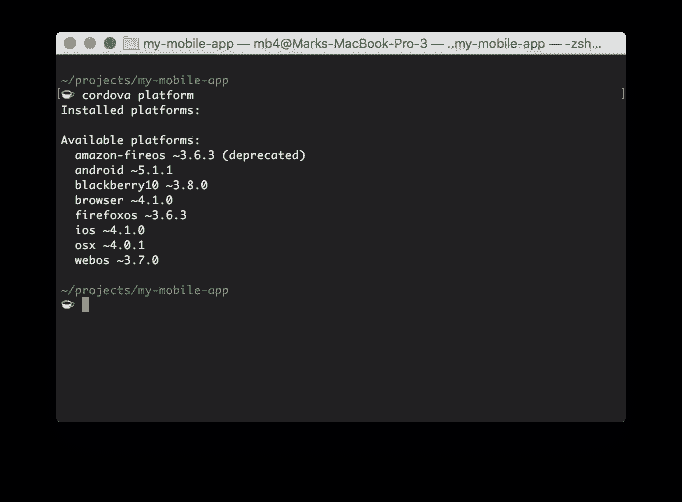
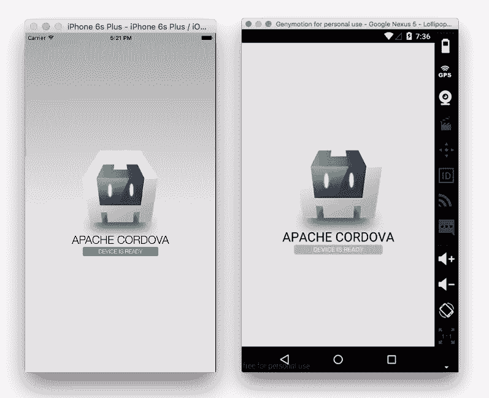
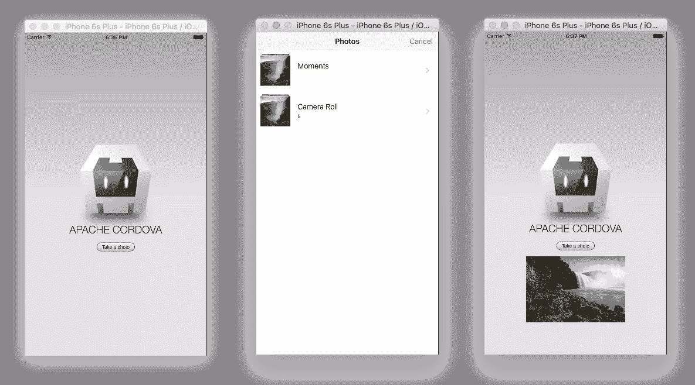

# 快速提示-使用和安装科尔多瓦

> 原文：<https://www.sitepoint.com/quick-tip-installing-and-getting-started-with-cordova/>

Cordova 是一个非凡的工具，它允许你使用你熟悉和喜爱的网络技术来构建本地移动应用。它提供了一些在普通 HTML5 中无法获得的硬件功能，最重要的是，应用商店的营销潜力。Cordova 允许您用 HTML5 和 JavaScript 编写一次应用程序代码，并使用相同的代码部署到多个目标。在这个快速技巧中，我将介绍基本用法和安装 Cordova。

## 安装

首先从他们的官方包中安装 [Node.js](https://nodejs.org/en/download/) ，[家酿](http://brew.sh/) (Mac)，[巧克力](https://chocolatey.org/)或者[勺子](http://scoop.sh/) (Windows)。Cordova 使用 Node.js 的包管理器 [npm](https://www.npmjs.com/) 进行安装。

在 OSX 和 Linux 上，打开您的终端并运行:

```
sudo npm install -g cordova 
```

在 Windows 上打开命令提示符运行:

```
C:\>npm install -g cordova 
```

这将全局安装 Cordova 包，并可在任何项目中访问。

## 创建项目

用`cordova create <name>`创建一个新项目，例如

```
cordova create my-mobile-app
cd my-mobile-app 
```

## 添加平台

键入`cordova platform`查看可用平台列表。根据操作系统的不同，你会看到不同的选项，这是在 Mac 上的结果。



添加带有`cordova platform add <platform>`的平台，例如

```
cordova platform add ios
cordova platform add android 
```

为了构建和运行，您需要为您想要安装的每个平台提供 SDK。我们有一个安装 Android 的便捷的[快速提示，对于 iOS，你将需要](https://www.sitepoint.com/quick-tip-installing-the-android-sdk/) [XCode](https://developer.apple.com/xcode/) 。

要检查添加平台所需的一切，请运行:

```
cordova requirements 
```

## 建设

使用`cordova build <platform>`构建您的应用程序，例如

```
cordova build ios
cordova build android 
```

您还可以运行`cordova build`来构建添加到项目中的所有平台。

## 奔跑

使用`cordova run <platform>`运行应用程序，例如

```
cordova run ios
cordova run android 
```



**注意**:在 Mac 上`cordova run ios`会打开 iOS 模拟器。模拟 android 设备的一个很好的选择是使用 [GenyMotion](https://www.sitepoint.com/improved-android-emulation-genymotion/) ，它可以让你将流行的 android 设备作为虚拟机(VM)来安装和运行。一旦虚拟机运行，`cordova run android`将安装并运行应用程序。

## 插件

插件是对 Cordova 的补充，允许你从 JavaScript 访问硬件特性。

要安装插件，运行`cordova plugin add <plugin>`。例如，安装相机插件。

```
cordova plugin add cordova-plugin-camera 
```

## 添加应用程序

你的应用程序的定制代码位于 *www* 目录中。您可以编辑这些文件，*构建*和*运行*来查看模拟器中反映的变化。例如，添加一个按钮，它将从库中获取一张照片，并在视图中显示。

将*index.html*中的`#deviceready` div 替换为:

```
<div id="deviceready">
  <p>
    <button id="get-picture">Take a photo</button>
  </p>
  <p>
    
  </p>
</div> 
```

将以下内容添加到 *js/index.js* 的末尾:

```
document.getElementById('get-picture').addEventListener('click', getPicture, false);

function getPicture() {
  navigator.camera.getPicture(onSuccess, onFail, {
    quality: 50,
    sourceType: Camera.PictureSourceType.PHOTOLIBRARY,
    destinationType: Camera.DestinationType.FILE_URI
  });
}

function onSuccess(imageURI) {
  var image = document.getElementById('my-photo');
  image.src = imageURI;
}

function onFail(message) {
  alert('Failed because: ' + message);
} 
```

*构建*然后*运行*，你应该能够测试出你的第一个“原生”特性。



您正在构建优秀的应用:)

## 后续步骤

阅读 [Cordova 概述](http://cordova.apache.org/docs/en/latest/guide/overview/index.html)以了解 Cordova 如何工作，并搜索[插件](http://cordova.apache.org/plugins/)以查看不同平台上可用的内容。

如果你想直接进入更多的教程，SitePoint 有很多与 Cordova 相关的[文章。](https://www.sitepoint.com/quick-tip-installing-and-getting-started-with-cordova/)

## 分享这篇文章