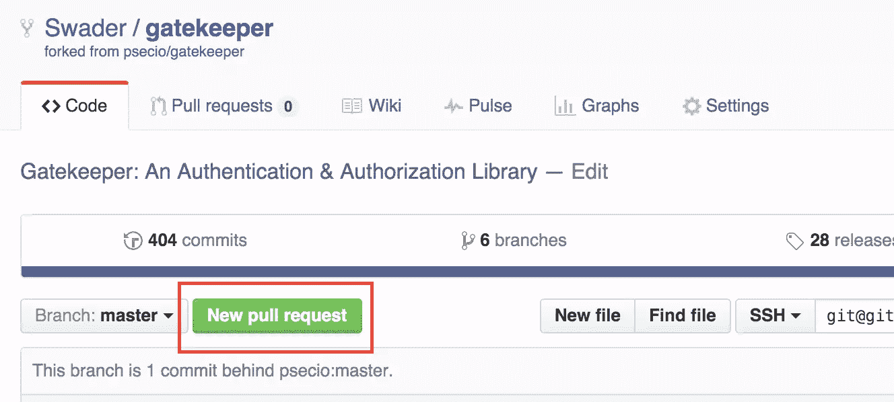
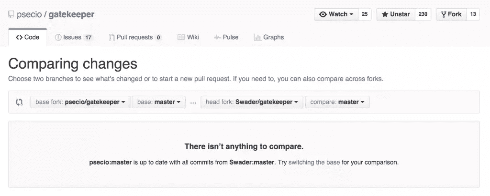
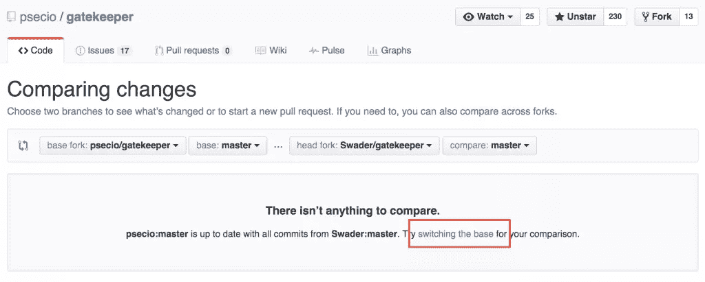
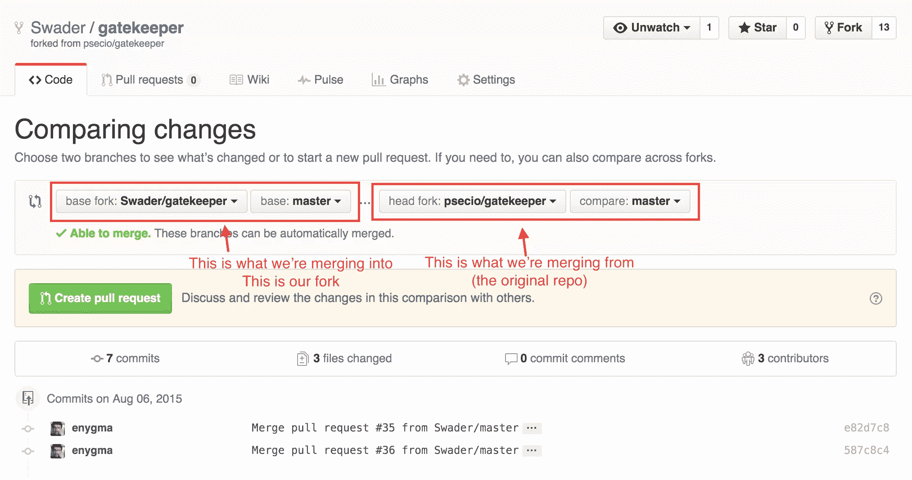
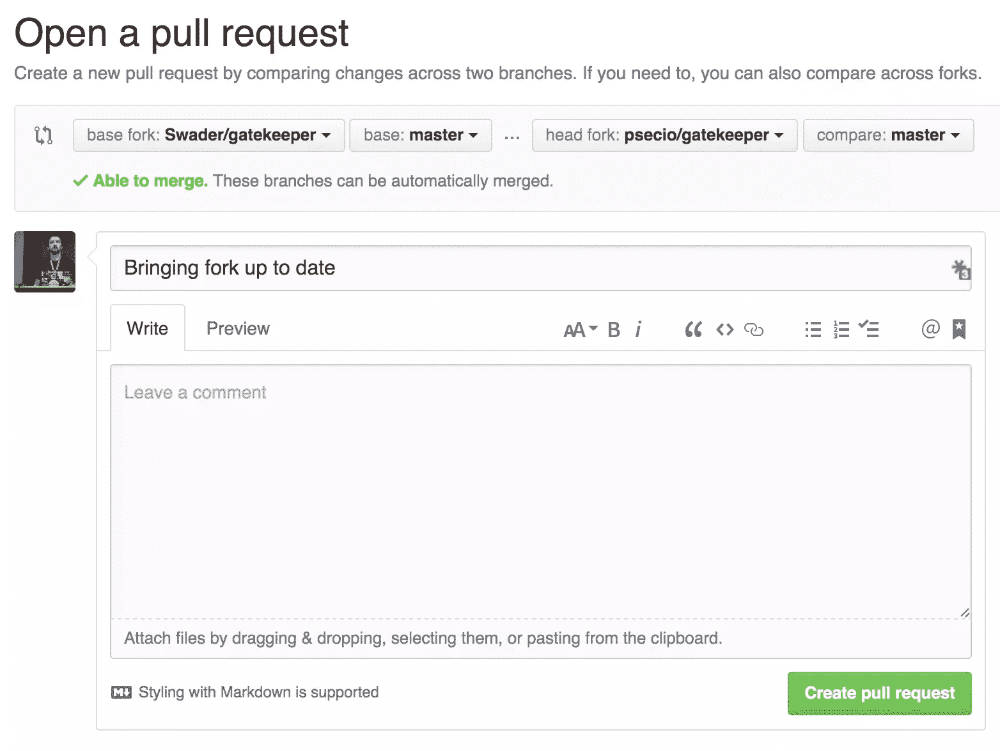
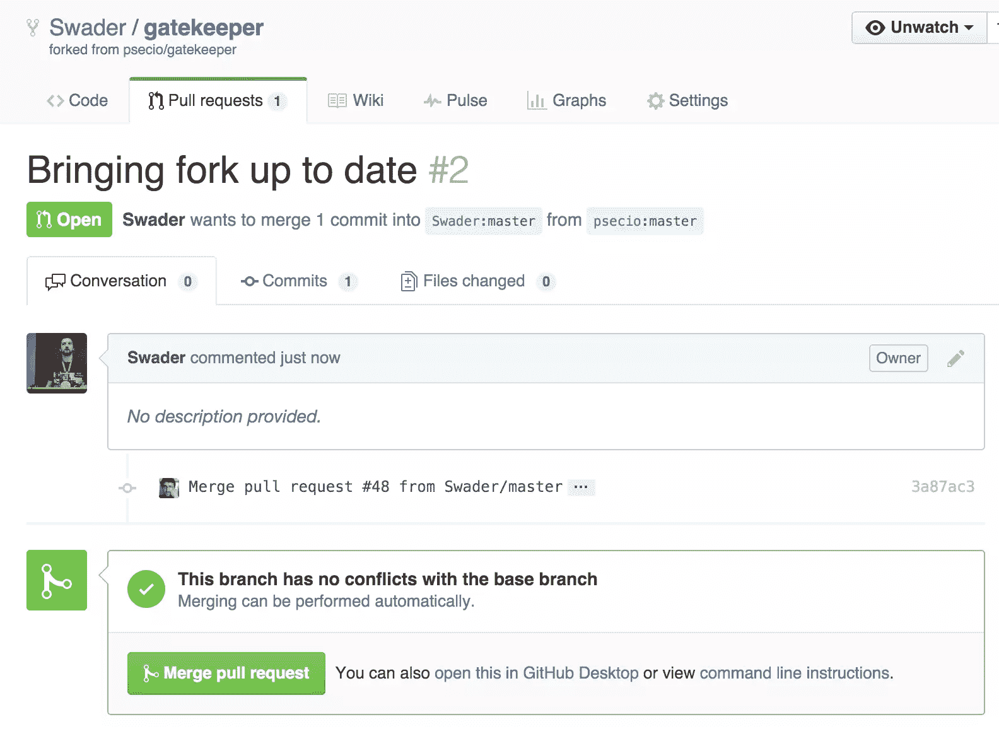

# 快速提示:通过 GitHub 的 Web 用户界面将叉子与原叉子同步

> 原文：<https://www.sitepoint.com/quick-tip-sync-your-fork-with-the-original-without-the-cli/>

当你在 GitHub 上派生某人的库时，你会希望用对原始库所做的任何改变来更新你的派生库。有各种方法可以做到这一点。在这个快速技巧中，Bruno 描述了如何通过 GitHub 网站更新 fork。另一个选择是[通过命令行](https://www.sitepoint.com/quick-tip-synch-a-github-fork-via-the-command-line/)更新您的 fork。

* * *

我经常发现自己不得不更新别人回购的 fork，以包含 fork 之后对原始回购所做的更改。事实上，我们也经常在 SitePoint 的[同行评审系统](https://www.sitepoint.com/introduction-to-sitepoints-peer-review/)中使用这种方法。

纯属偶然，我最近发现了一种方法，可以通过 GitHub web UI 快速轻松地将 fork 与原始 repo 同步，因此无需 *go 突击队*(使用命令行)。

 *请注意，下面的方法是合并提交，而不是适当的重定基础。如果你明白这意味着什么，这将是对你很重要的事情。简而言之，历史看起来与通过命令行同步时不同，如根据 Github docs 同步[。没有真正的效果，但只是一个提醒！](https://help.github.com/articles/syncing-a-fork/)

这里有一个循序渐进的指南，适用于我的过时分支[看门人](https://github.com/psecio/gatekeeper):

## 第一步:新公关

转到您自己的 fork 的 UI，并单击“New Pull Request”按钮:

这将把你带到一个和这个没有太大区别的屏幕:

## 第二步:基本开关

如果有尝试“切换底座”的选项，请单击该选项。

如果选项不存在，使用提供的下拉菜单手动切换底座，并设置它们，以便您的叉子在左边，原始的在右边，如下所示:

## 步骤 3:发送并合并

点击绿色的“创建拉动式请求”按钮。在出现的输入栏中，给它起一个标题，如“从原件同步”。或者，添加描述。

再次单击“创建拉动式请求”按钮，实际发送请购单。结果应该是一个典型的 PR 屏幕:

随意用“合并拉取请求”按钮合并(以及之后的“确认合并”)，就大功告成了！

## 搞定了。

就这样——您的 fork 现在与对原始版本所做的更改保持同步，您可以开始工作了，而不用担心冲突。

## 分享这篇文章*