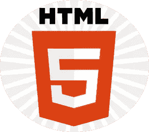

# 本周我们关注的是:聚合物、图案和程序员

> 原文：<https://www.sitepoint.com/radar-week-polymer-patterns-programmers/>

欢迎来到《在我们的雷达上》,这是一个来自 web 开发世界的新闻、趋势和其他酷东西的每周综述。

本周，iOS 8 发布了，它展示了过多的新功能。这里是对苹果最新移动操作系统的(非常)彻底的回顾，这里是 T2 的 TL；DR 版，这里有一些[你可能不知道的关于](http://www.theverge.com/2014/9/17/6237271/best-ios-8-features-you-may-not-know-about)的最好的特性。

拉里·佩奇不满足于无人驾驶汽车、气球携带的互联网或治愈死亡，他现在显然正在计划一个将建造城市和机场的谷歌 2.0。

同样在新闻中，亚马逊发布了六款新的平板电脑和电子阅读器，英特尔发布了 T2 新的双屏笔记本电脑，微软以 25 亿美元收购了 Mojang(创造了《我的世界》的公司)。

## HTML5 的时候到了

HTML5 最近势头越来越猛。本周[它获得了 W3C 的推荐地位](https://www.w3.org/TR/2014/PR-html5-20140916/)，也让[得到了苹果](http://www.sencha.com/blog/apple-shows-love-for-html5-with-ios-8)的喜爱，因为很明显，iOS 8 的新功能将进一步推动它的发展。

HTML5 引入了许多新的标签，帮助我们编写更多的语义标记。这里有一个正确使用新的<时间>元素的指南。为什么就此打住？您还可以[使用日期输入创建一个日期选择器](http://demosthenes.info/blog/923/Using-The-HTML5-Date-Input)，这在以前只能用 JavaScript 实现。

<picture>元素为[提供了一种声明性的方法来加载图像资源](http://www.html5rocks.com/en/tutorials/responsive/picture-element/)，而< progress >元素为[提供了一条全新的途径来为长期运行的任务](http://www.htmlgoodies.com/html5/javascript/adding-patterns-and-animations-to-html5-progress-bars.html#fbid=ZsYpaAuUjXS)提供视觉反馈。</picture>

不确定哪些浏览器支持哪些 HTML5 功能？查看[caniuse.com](http://caniuse.com/)的综合列表。你也可以参考这篇(有点老的)文章来阅读 W3C 的 HTML5 交付计划[。](https://www.sitepoint.com/w3c-html5-2014-plan/)

## 模式，到处都是模式

CodePen 最近引入了一个包含设计模式管理组的区域，为你的下一个项目提供灵感。太棒了。

这里列出了手机的[热门内容设计模式，以及手机导航菜单](http://blog.uxpin.com/5318/data-content-innovation-5-design-patterns-mobile-ui/)的[五种模式。](https://www.sitepoint.com/5-examples-patterns-mobile-navigation-menus/)

谈到编程类的设计模式，马塞罗·拉罗卡最近关注了 JavaScript 事件处理中的新兴模式，并回顾了每种方法的优缺点。在其他地方，先生(？)0a 为我们提供了一个简单易懂的关于 JavaScript 闭包和设计模式的[解释](http://0ar.ch/0a-explains-javascript-closure-and-design-patterns)。

最后，这里是示例解释的工厂设计模式[，使用 PHP 作为语言选择。](http://www.binpress.com/tutorial/the-factory-design-pattern-explained-by-example/142)

## 本周流行语:Web 组件

Web 组件是 W3C 引入的一组规范，允许在网页和 web 应用程序中创建可重用的小部件(或组件)。尽管浏览器支持目前还不完善，但许多开发者相信 web 组件将从根本上改变我们构建 web 的方式。

渴望了解更多信息？很好！这里有一个让你入门的教程。

[Polymer](https://www.polymer-project.org/) 是一组聚合填充，使我们能够在不兼容的浏览器中使用 web 组件。这里是[由一个聚合物开发者写的 web 组件指南](http://css-tricks.com/modular-future-web-components/)。同样的家伙也已经[发布了 YOLOmer！](http://www.youtube.com/watch?v=INH_OW4lFSs)–用于聚合物项目的约曼发电机。

Web 组件让 Jeremy Keith 既兴奋又紧张。阅读[他的博客文章](https://adactio.com/journal/7431)找出原因。

TJ VanToll 是另一个在这个问题上直言不讳的开发者。最近他宣布 [web 组件还没有为生产](http://developer.telerik.com/featured/web-components-arent-ready-production-yet/)做好准备，然后回来兜售并宣布[事实上他们是](http://developer.telerik.com/featured/web-components-ready-production/)。两篇文章读起来都很有趣。

## 程序员之角

总是很难知道要跟上哪些技术，学习什么来推进你的职业生涯。嗯，这家伙可不这么认为，他声称所有的软件工程师都应该学习 JavaScript。

当我们在谈论软件工程师应该做什么的时候，这里有一些关于浮点运算你们应该知道的事情……你说 0.1 + 0.2 不完全等于 0.3 是什么意思？？？

最近有人在 SitePoint 的论坛上，有人问“[哪种编程语言的报酬更好？](https://community.sitepoint.com/t/which-programming-language-pays-better/96316)”。虽然答案显然是“只学 JavaScript”，但这里有一个有趣的列表，列出了[不受欢迎但仍然有利可图的编程语言](http://news.dice.com/2014/09/08/unpopular-programming-languages-prove-lucrative/)。

我不知道是否有利可图，但根据 Tiobe 指数，这里有[个热门。](http://www.infoworld.com/article/2608845/java/java-java-c-slip-in-popularity-as-domain-specific-languages-spread.html)

解释复杂代码的注释有什么问题？这个 [StackExchange 线程](http://programmers.stackexchange.com/questions/254978/whats-wrong-with-comments-that-explain-complex-code)告诉你。

最后，这是 GitHub 如何将他们过时的 Rails 2.x fork 升级到 Rails 3，并且没有停机时间。

这就是这周的全部内容。感谢加入我们。

我将留给你一些我在旅行中偶然遇到的事情:消息称[IE 的下一个版本，代号为“斯巴达”，可能支持扩展](http://www.zdnet.com/how-the-next-version-of-ie-codenamed-spartan-might-support-extensions-7000033685/) (Madness？这是斯巴达！)、[一个麻痹机器人的道德陷阱](http://www.newscientist.com/article/mg22329863.700-ethical-trap-robot-paralysed-by-choice-of-who-to-save.html)以及《洋葱》中的 [fartscroll.js](http://theonion.github.io/fartscroll.js/) (这样你的页面可以在你滚动时放屁)。

那么哪些链接引起了你的注意呢？你对 HTML5 有什么看法？web 组件可以投入生产了吗？学习哪种编程语言最赚钱？我们很想听听你的想法。

此外，如果你在实现这里所涉及的任何东西时有任何问题，或者只是想就此进行更多的讨论， [SitePoint 的论坛](https://www.sitepoint.com/forums/)是一个值得访问的好地方。

## 分享这篇文章