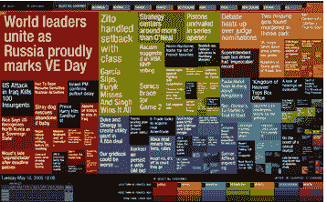
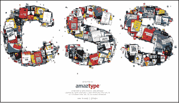

# 激进的界面方法

> 原文：<https://www.sitepoint.com/radical-interface-approaches/>

改进通常是一个渐进的过程。

看看你最后的两辆车。你最后两部手机。聪明的人会采用某样东西当前最好的版本，并对它做一点小小的调整——保留所有其他以前有效的好东西。婴儿和洗澡水。

但并不总是如此。有时，当竞争环境发生变化时，激进的发明会略微占上风。

网页界面设计在过去的 5 年里没有太大的变化。当然，它背后的编码技术已经发展了，但是视觉结构是非常相似的——页眉、页脚、分栏布局、导致更长文章的“挑逗性”内容，等等。

然而，我们的界面所处的环境已经发生了变化。用户变得更加成熟，拥有更快的连接、更快的计算机和更智能的浏览器(相对而言)——所有这些都提供了尝试 5 年前不可能实现的界面的机会。

下面的两个例子已经存在了一段时间，但是我认为值得一提。

[案例 1:新闻地图](http://www.marumushi.com/apps/newsmap/newsmap.cfm):新闻地图是一种通过谷歌新闻了解世界现状的激进方法。

同一主题的故事被分组，并根据其流行程度进行“加权”——广泛报道的故事有较大的方框。故事还按一般类别(世界新闻、体育、健康、国家等)、货币(旧故事颜色较深)和国家(标签)进行颜色编码。我可以花 6 段时间详细解释它，但你使用它几秒钟就会有感觉。

该系统是活的，并且在几分钟内更新。惊人的工作。

案例 2: Amaztype :我第一次看到 Amaztype 时，我觉得它只是一个展示亚马逊网络服务的巧妙小花招。你输入一个搜索词(比如说“CSS”)，应用程序使用 Flash 下拉相关的封面图像，并将它们随机堆叠成你的搜索词的形状。

是啊，很可爱，但是有用吗？

奇怪的是，这里的每个人似乎都觉得这是一种非常有效和令人满意的浏览书籍的方式。点击任何封面都会立即弹出一个框，下拉标题、作者、销售排名和价格的详细信息。更多信息只需点击一下——毫无疑问，会员代码已锁定。

依我看，这个界面很酷的一点是，很幸运的是，它给人的感觉就像一种“实体”书籍浏览体验。没有导航，没有 crumbtrails，没有搜索框，没有类别。你只要拿起吸引你眼球的封面。这就像在讨价还价的桌子上想象一样！

在这两种情况下，这些例子可能打破了 10 条传统的 web 界面规则中的 9 条——但是仍然很有用，甚至非常有用。

我当然不是说网络，正如我们所知，即将被革命点燃，..但令人惊奇的是，只要有一点点想象力，一切都是可能的。

## 分享这篇文章