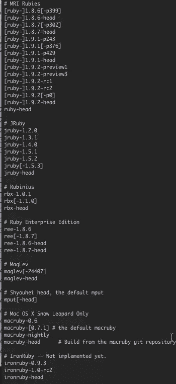

# Rails 简介，深度探讨:RVM

> 原文：<https://www.sitepoint.com/rails-development-101-rvm/>

这篇文章是帮助您从零开始并以一个 Rails 应用程序结束的系列文章的第一篇。虽然有很多关于这个主题的帖子/系列，但我觉得基本的 Rails 教程，尤其是在 Rails 3.1 更改之后，属于更有趣的类别。尽管如此，本系列将着重于以适当的方式设置东西(对于那些支持它的系统),并将比许多教程中典型的 50，000 英尺水平飞行稍低。在本系列结束时，您将会学到以下内容:

*   设置 Ruby 版本管理器(RVM)来维护[沙盒](http://en.wikipedia.org/wiki/Sandbox_%28software_development%29)开发环境
*   安装 Ruby 1.9.2
*   安装导轨 3.1
*   创建 rails 应用程序
*   有哪些 Rails IDEs，以及它们的优缺点
*   为您的应用程序创建资源以创建/检索/更新/删除
*   修改视图样板
*   下一步做什么

这一系列文章在许多单篇文章结束的地方结束，但我的目标是确保当你结束时，你有更多的信息。此外，虽然 Rails 经常被吹捧为一个很好的初学者 web 开发框架，但在社区中有传言说 Rails 已经超越了这个绰号，并且 Rails 3.1 中的变化是社区更加成熟并且需要更高级的 web 框架的结果。

我们将把重点放在 Rails 3.1(目前是 RC4)上，并会重点介绍 3.1 中的一些变化。同样，按照之前链接的 Intridea 文章的思路，我将假设您对命令行很熟悉，也就是说,‘curl’不仅仅是一个加拿大动词。别担心，我知道你能坚持这个系列。

让我们开始第一步。RVM 对 Ruby 和 Rails 的发展有多么重要，我怎么强调都不为过。简而言之，RVM 基本上允许你创建尽可能多的 Ruby 沙盒，只要你需要开发或项目或其他任何东西。你可以把 Ruby 的版本和 gems 的集合(有趣的叫做“gemsets”)分开，这样你就可以在不改动你的基本 Ruby 或 gems 的情况下完成本教程。然后，你可以删除 gemset 和/或 Ruby 版本，或者创建一个新的 Rails 3.0.8 应用程序，这样你就可以活在当下。Ruby 开发从 RVM 开始，所以学习如何使用它是你现在应该掌握的最佳实践。对我的 Windows 朋友来说不幸的是，你没有 RVM。有 [Pik](https://github.com/vertiginous/pik) ，但是它没有宝石组，这大概是 RVM 如此值钱的特点。

## 安装 RVM

首先，让我们弄清楚一些术语。RVM 将不同的解释者称为“红宝石”。每颗红宝石都有一个或多个相关的宝石组。您不能将一个宝石集用于两种不同的红宝石，但您可以在红宝石之间导入/导出或复制宝石集。这里，我们将使用 RVM 安装最新的 1.9.2 rubie，并为我们的 Rails 应用程序创建一个 gemset。

既然我们说的是同一种语言，那就让我们安装 RVM 吧。唉，RVM 的安装有点复杂。看看[先决条件](https://rvm.beginrescueend.com/rvm/prerequisites/)，你需要的大部分东西都是 Mac OSX 和 Linux 的核心。如果你还没有安装 git，那么你应该[现在就安装](http://book.git-scm.com/2_installing_git.html)，因为 git 是大多数开源和 Rails 开发者的源代码控制。此外，您将需要`gcc`编译器来允许 RVM 在您的环境中编译不同的 Ruby 解释器。对于 Mac 用户来说，这意味着安装 XCode(你可以免费安装 [Xcode 3](http://developer.apple.com/devcenter/mac/) 或者在 Mac App Store 支付 5 美元购买 Xcode 4。RVM 觉得哪一个都好。).在 Linux 上，确保您有 make 和 C 编译器，您可以使用

```
sudo apt-get install build-essential
```

和卷曲

```
sudo apt-get install curl
```

好了，这应该解决了先决条件。

有几种方法可以安装 RVM，无论是单用户还是多用户。我们将以单用户方式安装它，这是开发人员应该走的路。RVM 的多用户安装更适合服务器管理员，允许在系统范围内安装红宝石和宝石。

安装 RVM 只是在命令行运行一个 bash 脚本。因此，启动您的终端并键入:

```
bash < <(curl -s https://rvm.beginrescueend.com/install/rvm)
```

这将在您当前的会话中运行 rvm install bash 脚本，安装在您的主目录~/.rvm 中。bashrc(或者。侧写或者。bash_profile)启动脚本。当您打开终端时，RVM 必须加载到您的 shell 环境中，所以将它添加到您的启动脚本的末尾:

```
 [[ -s "$HOME/.rvm/scripts/rvm" ]] && . "$HOME/.rvm/scripts/rvm" 
```

如果你感兴趣的话，这里有一个关于这个语句在启动时做什么的很好的解释。修改启动脚本后，您可以重新加载启动脚本

```
source ~/.bash_profile
```

或者关闭您的终端并打开一个新的。现在打字

```
type rvm | head -1
```

你应该看看

```
rvm is a function
```

现在，我们可以去买些红宝石了。(YAR！这让我觉得自己像个海盗！)

首先，让我们回顾一下我们的选择:

```
rvm list known
```



RVM 知名口译员

哇哦。我不知道有这么多。让我们把它们都安装好..BWAHAHAHAHAHA…不，等等，(抚平后面的头发)我们就装一个吧。我投 1.9.2，我的一票才算数。

```
rvm install 1.9.2
```


安装 Ruby 1.9.2

可以看到，这安装了 MRI (Matz 的 Ruby 解释器)的最新补丁级别，在本例中是 180。有了 RVM，你可以瞄准补丁级别或最新(头)稳定的建设。任何一个都符合我们的目的，所以 p180 就是了。安装完成后，RVM 将安装“默认”的 gemsets，您可以在`~/.rvm/gemsets/default.gems`中定义。目前，我只有 rake，但是你可以根据需要添加其他的。

我们必须告诉 RVM，我们想使用新加载的 1.9.2 Ruby 解释器。这已经结束了

```
rvm use 1.9.2
```

太棒了。现在，如果你输入`gem list`，你应该会看到默认的宝石。在我的情况下，我得到


RVM 宝石清单

这证明了耙子是我当前红宝石中唯一的宝石。显然，我们希望安装 Rails，但是在此之前，让我们为这个教程创建一个名为“rubysource”的 gemset。

```
rvm gemset create rubysource
```

RVM 告诉我们，我们的 gemset 已经创建，现在我们必须使用它。你能猜到这是怎么做到的吗？如果你说，

```
rvm gemset use rubysource
```

那你就是赢家了！所以，在我们工作的时候，我们怎么知道什么是当前的红宝石和宝石组合呢？要是 RVM 有一个简单的方法给我们那种(暗示，暗示)信息就好了。

```
rvm info
```


RVM 关于

这个命令为我们提供了各种各样的重要信息，比如我们正在使用哪个解释器，当前的 gemset，当前 rubie 的二进制文件所在的位置，以及相关的 Ruby 环境变量。值得注意的是，表示红宝石和宝石组的语法是`rubie@gemset`，你也可以在切换红宝石/宝石组时作为快捷方式。例如，如果您键入

```
rvm use 1.9.2@rubysource
```

它会将当前的 ruby 切换到 1.9.2，并将当前的 gemset 切换到`rubysource`。对于家庭作业，去弄清楚如何使用这个快捷方式来自动创建一个还不存在的 gemset。(周五突击测验)

所以，这是 RVM 在一个(相对)快速的职位。在本系列的下一篇文章中，我们将完成安装 Rails 3.1，以及创建我们的 Rails 应用程序。与此同时，请随意使用 RVM，并在您的所有 Ruby 开发中舒适地使用它。

## 分享这篇文章