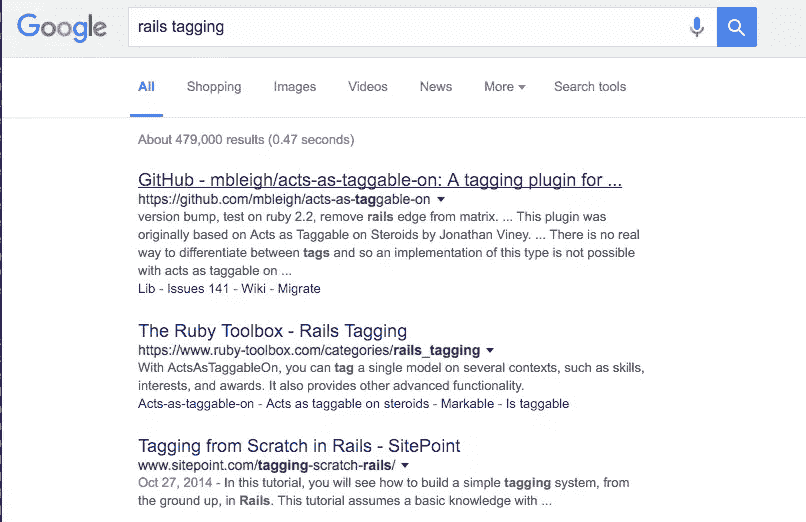
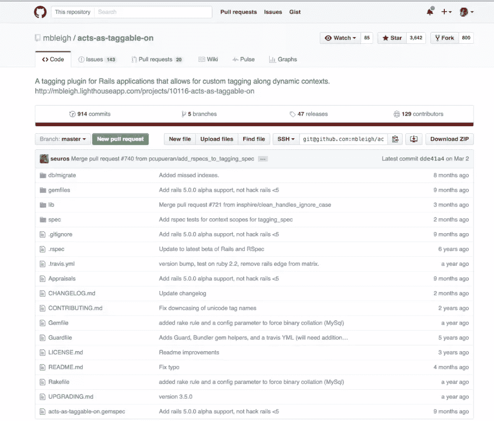
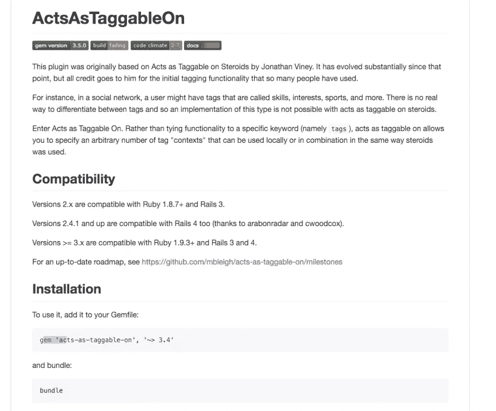
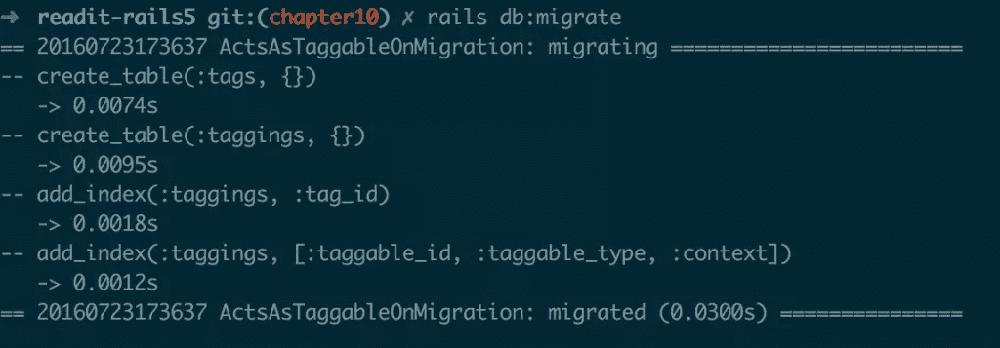

# 从新手到忍者:如何掌握 Rails 插件的使用

> 原文：<https://www.sitepoint.com/rails-novice-to-ninja-plugins/>

以下是我们的书 [Rails:新手到忍者](https://www.sitepoint.com/premium/books/rails-novice-to-ninja)的简短摘录，可供 [SitePoint Premium 会员](https://www.sitepoint.com/premium/join)使用。印刷版在世界各地的商店出售，或者你可以在这里[订购](http://shop.oreilly.com/product/9780994347008.do)。我们希望你喜欢这个摘录，并发现它很有用。

# Rails 插件

虽然这本书无法涵盖 Rails 自带的所有内置功能——在阅读完最后一章之后，还有很多功能可供您发现和尝试——但 Rails 的插件架构值得我们关注。

## 什么是插件？

插件是可以添加到应用程序中以扩展其功能的组件。虽然你当然可以编写自己的[插件，](http://guides.rubyonrails.org/plugins.html)我们将在这里讨论如何使用现有的插件。已经为 Rails 框架的各个部分开发了插件，增加了如下功能:

*   ActiveRecord 功能的扩展
*   助手方法
*   新的模板引擎(用于使用另一种模板语言对视图进行编码)

现有的 Rails 插件数量巨大，并且每天都在增长。Ruby 和 Rails 社区中的程序员非常擅长共享代码和基于他们需要的扩展创建有用的插件。在 [Rubygems 网站](https://rubygems.org/search?utf8=%E2%9C%93&query=Rails)或 [Ruby Toolbox](https://www.ruby-toolbox.com/) 网站上搜索“Rails ”,可以找到现有 Rails 插件的丰富资源。

插件是作为宝石分发的，这一点我们在第 2 章中已经介绍过了。通过将插件添加到`Gemfile`并运行`bundle install`，可以将插件拉入到现有的 Rails 应用程序中。你可能还记得我们在第 4 章中对 Bundler 的讨论，它的工作是管理应用程序的依赖性。Bundler 使得在我们的应用程序中包含现有插件变得轻而易举。

找到一个你需要的插件通常只需要在 Google 或 RubyGems 上搜索一下。如图 10-1 所示，搜索“rails tagging”会出现一些已经被创造出来的宝石，包括一个叫做 [`acts-as-taggable-on`](https://github.com/mbleigh/acts-as-taggable-on) 的。



图 10-1。在“rails 标签”上搜索插件

绝大多数宝石的来源都在 [GitHub](https://github.com) 上，包括我们上面搜索的第一个链接中的`acts-as-taggable-on`。沿着这个链接可以找到 GitHub 上的源代码，如图 10-2 所示。



10-2.GitHub 储存库“可标记的动作”

大多数 GitHub 源代码库都有一个`README`或`README.md`文件，解释 gem 做什么，如何安装和使用它，等等。`acts-as-taggable-on`遵循这一惯例，如图 10-3 所示。它解释了 gem 的对象、支持的 Rails 版本，以及如何安装和配置 gem。



10-3.标准自述文件。

在通读了`README.md`之后，我们现在知道如何将 gem 引入我们的应用程序并使用它的功能。你可能会觉得“如何寻找和学习宝石”这个话题有点乏味，但你会发现自己花了大量的时间来做这件事——所以我认为这种单调是值得的。

> **没时间骂人**
> 
> 有许多方法可以扩展 Rails 例如，通过使用“插件”、“引擎”和“铁路”，仅举几例。虽然这些项目之间存在技术差异，但它们经常(不正确地)互换使用。定义这些术语和它们的区别超出了本书的范围，所以我现在坚持使用“插件”这个词。随着您在 Rails-fu 中的成长，您无疑会希望围绕 Rails 可扩展性做一些研究。嘣——我刚刚把这张钞票变成了额外的学分！

好了，理论到此为止！让我们继续安装我们的第一个插件。

## 添加标签来阅读它

标记是内容创建者将简单的文本标签附加到他们的数据上的过程，无论是照片、链接还是餐馆评论。这些标签的性质差异很大；例如，它们可能与位置或内容相关。这导致每个人似乎都有一个独特的系统来标记数据。目前，标签(#)可能是用元数据标记内容的最流行的形式，这要感谢 Twitter！

标签肯定比类别树更灵活，因为它们允许您为任何数据项分配任意多或任意少的标签。用户在文本字段中输入内容项的标签已经成为一种约定。多个标签之间应该用空格或逗号隔开。

### 介绍`acts-as-taggable-on`宝石

我们将使用一个可用的 Rails 插件来完成这项工作，而不是重新发明轮子并为 Readit 实现我们自己的标记系统，前面提到的`acts-as-taggable-on`。你可能想知道开发者最初为他的插件选择了什么样的名字。在某个时候，David Heinemeier Hansson 自己实际上开发了一个名为`acts_as_taggable`的插件，作为 Rails 的一些新功能的概念证明。它不是为生产使用而设计的，后来被弃用，但又被重新使用，因为标记是当今用户生成内容网站的重要组成部分。

Jonathan Viney 是 Rails 的核心贡献者和全能大师，他继承了 Heinemeier Hansson 的遗志，以`acts_as_taggable_on_steroids`的名字创作了他的作品。然而开发势头减弱了，所以*的另一个*开发者 Michael Bleigh 成立了`acts-as-taggable-on`，并一直开发至今。抛开家族历史不谈，让我们看看这个插件能为我们做些什么。

#### `acts_as_*`的历史

由于这远不是一个插件的明显名称，请允许我解释一下`acts_as_*`命名约定的背景。

在 Rails 自己的插件库中可以找到许多 act，它们是对一个`ActiveRecord`模型的功能扩展。这些行为为模型配备了某些功能，这些功能通常可以通过一行代码来实现。

由于这种功能使模型能够“充当其他东西”，将这些功能添加称为“行为”的惯例出现了，并且支持这种功能的代码`acts_as_something`很快就出现了。

在撰写本文时，Rubygems.org 上提供了许多“行为”宝石:`acts_as_list`、`acts_as_tree`和`acts_as_paranoid`，仅举几例。虽然有些行为比其他行为更复杂，但是这些行为中的每一个都将层次结构应用于一组模型对象。在`acts_as_list`的情况下，对象被定位在平面列表中；使用`acts_as_tree`，产生的层次结构是一个复杂的树形系统，例如在线程论坛中使用的。

但是`acts-as-taggable-on`呢？顾名思义，这个插件提供了一个简单而有效的方法来让你的模型可以被标记。它自带了自己的名为`ActsAsTaggableOn::Tag`的`ActiveRecord`模型类，以及解析一系列标签的功能，这些标签由空格分隔成类`ActsAsTaggableOn::Tag`的独立模型对象。

> **命名空间安全措施**
> 
> 您可能注意到了`Tag`类的命名空间在`ActsAsTaggableOn`下面。gem 中的命名空间类是 Ruby 社区的最佳实践，它基于多年来不同 gem 和库中的类名之间的相互践踏。`Tag`是一个相当常见的名字，所以把它放在`ActsAsTaggableOn`命名空间中可以确保我们避免加载另一个破坏这个类的 gem。

当然，在我们玩这个插件之前，我们需要安装它。

### 安装`acts-as-taggable-on`宝石

要安装 gem，请将目录切换到应用程序根文件夹，并将以下行添加到`Gemfile`:

```
gem "acts-as-taggable-on", "~> 4.0"
```

`~>`告诉 Bundler 我们想要 4.x 系列的任何版本。如果 4.2 是最新的，那就是我们将得到的；然而，如果版本升级到 4.2，然后是 5.0，我们*还是*会升级到 4.2。有道理吗？

现在运行以下命令:

```
$ bundle install
Fetching gem metadata from https://rubygems.org/...........
Fetching version metadata from https://rubygems.org/...
Fetching dependency metadata from https://rubygems.org/..
Resolving dependencies...
Using rake 10.5.0
Using i18n 0.7.0
Using json 1.8.3
Using minitest 5.8.4
...
Installing acts-as-taggable-on 4.0.0.pre
...
Bundle complete! 14 Gemfile dependencies, 56 gems now installed.
Use `bundle show [gemname]` to see where a bundled gem is installed.
Post-install message from acts-as-taggable-on:
When upgrading
```

如你所见，Bundler 贯穿了我们应用程序的所有依赖项，包括将`acts-as-taggable-on`安装到应用程序“bundle”中。甚至还有一条来自`acts-as-taggable-on` gem 的安装后消息告诉我们下一步该做什么。

### 为插件创建迁移

我们的计划是允许应用程序的用户给提交给 Readit 的故事添加标签，所以我们的`Story`模型需要是可标记的。标签本身以及标签和故事之间的关系都需要存储在某个地方，所以我们将使用迁移来创建新的表。虽然这个插件使用了一个新的模型(由`acts-as-taggable-on`插件提供的`ActsAsTaggableOn::Tag`模型)，但是这个模型并不是由`rails generate`命令创建的，所以我们还需要一个移植。幸运的是，该插件提供了一个方便的生成器方法来创建合适的迁移:

```
$ rails acts_as_taggable_on_engine:install:migrations
Running via Spring preloader in process 64781
Copied migration 
201...7_acts_as_taggable_on_migration.acts_as_taggable_on_engine.rb 
from acts_as_taggable_on_engine
Copied migration 
201...8_add_missing_unique_indices.acts_as_taggable_on_engine.rb 
from acts_as_taggable_on_engine
Copied migration 
2_add_taggings_counter_cache_to_tags.acts_as_taggable_on_engine.rb 
from acts_as_taggable_on_engine
Copied migration 
201...0_add_missing_taggable_index.acts_as_taggable_on_engine.rb 
from acts_as_taggable_on_engine
Copied migration 
201...1_change_collation_for_tag_names.acts_as_taggable_on_engine.rb 
from acts_as_taggable_on_engine
Copied migration 
201...2_add_missing_indexes.acts_as_taggable_on_engine.rb 
from acts_as_taggable_on_engine
```

> **耙子和铁轨**
> 
> 我们捆绑后收到的消息指示您使用`rake`而不是`rails`。欢迎来到流血边缘。在以前版本的 Rails 中，`rake`被用来运行这样的任务，但是 Rails 5 增加了`rails`作为别名。这是为了允许开发者使用`rails`来完成所有的生成器和任务。

该任务将五个迁移复制到我们的`db/migrate`目录中。这些文件产生了`acts-as-taggable-on`使用的表，并创建了一些数据库索引和其他数据库工件。`acts-as-taggable-on`插件使用两个表格:

*   `tags`表存储的是`ActsAsTaggableOn::Tag`型号，这只是一个普通的`ActiveRecord`型号。该表包含每个标签的一个条目。因此，例如，如果您用标签`ruby`标记了两个或更多的`Story`模型，那么只有一个`ActsAsTaggableOn::Tag`对象(`ruby`)会被存储在数据库中。这种方法使我们应用程序的用户很容易找到内容；如果用户对寻找关于 Ruby 的故事感兴趣，他们可以浏览所有应用了`ruby`标签的故事。
*   `taggings`表存储了`ActsAsTaggableOn::Tag`模型和那些利用了`acts-as-taggable-on`功能的模型之间的实际映射。

下面是为我们生成的迁移代码。它可以直接使用，并存储在`db/migrate/xxxx_acts_as_taggable_on_migration.rb`文件中:

```
class ActsAsTaggableOnMigration < ActiveRecord::Migration
 def self.up
   create_table :tags do |t| 
   t.string :name
 end

 create_table :taggings do |t|
   t.references :tag

   # You should make sure that the column created is
   # long enough to store the required class names.
   t.references :taggable, polymorphic: true
   t.references :tagger, polymorphic: true

   # Limit is created to prevent MySQL error on index
   # length for MyISAM table type: http://bit.ly/vgW2Ql
   t.string :context, limit: 128

   t.datetime :created_at
 end

 add_index :taggings, :tag_id
add_index :taggings, [:taggable_id, :taggable_type, :context]
 end

 def self.down
   drop_table :taggings
   drop_table :tags
 end
end
```

这种迁移开始时非常简单。它创建只包含一列的`tags`表:`name`(除了属于每个表的`id`列)。

虽然表面上看起来很简单，但是`taggings`表比仅仅列出对象及其标签要复杂一些。如前所述，可以在应用程序中创建多个可标记的模型；然而，`ActsAsTaggableOn::Tag`模型和那些添加了标记功能的模型之间的映射使用一个表。

`acts-as-taggable-on`使用在`taggings`表中创建的每个列，如下所示:

*   `tag_id`由`t.references :tag`创建，存储`ActsAsTaggableOn::Tag`的`id`
*   `taggable_id`由`t.references :taggable, polymorphic: true`创建，存储被标记的*对象的`id`(例如，`Story`的 ID)*
*   `taggable_type`由`t.references :taggable, polymorphic: true`创建，存储被标记对象的类别(例如，`Story`
*   `tagger_id`由`t.references :tagger`创建，存储创建标签的用户的`id`(例如，`User`的 ID)
*   `tagger_type`由`t.references :tagger`创建，存储进行标记的对象的类别(例如，`User`

您可能会问“多态”在我们的迁移中意味着什么。别急，我很快会报道的。

在我们给我们的`Story`模型一点`acts-as-taggable-on`好处之前，我们需要应用刚刚生成的迁移，如下所示。



10-4.应用生成的迁移

太好了！现在我们可以让我们的`Story`模型可标记。我们来聊聊多态联想。

要阅读格伦·古德里奇的《Rails:新手到忍者》一书的全文，请在这里购买这本书。我们还将邀请格伦·古德里奇参加即将举行的 AMA，届时他将回答大家关于 Rails 的所有问题。在这里报名那个[。](https://www.sitepoint.com/community/t/ruby-ama-with-glenn-goodrich-16th-nov-1pm-pst/243160)

[](https://www.sitepoint.com/community/t/ruby-ama-with-glenn-goodrich-16th-nov-1pm-pst/243160)

## 分享这篇文章