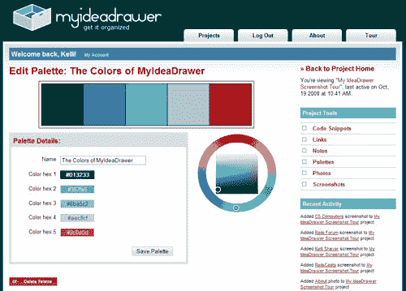
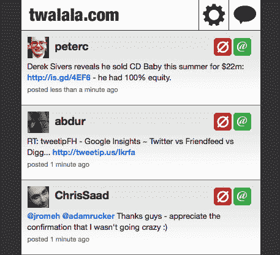

# Rails 隆隆作响:48 小时内 245，000 行代码

> 原文：<https://www.sitepoint.com/rails-rumble-245000-lines-of-code-in-48-hours/>

如何在 48 小时内生成近 25 万行代码？简单:找大约 500 名编码员，把他们锁在世界各地的房间里，挑战他们在 2 天内创建完整的 web 应用程序。简而言之，这就是每年举行的 48 小时编程比赛 [Rails Rumble](http://www.railsrumble.com/) ，它聚集了 Ruby on Rails 的狂热爱好者，让他们在一个周末内创建 web 应用。

上周末标志着隆隆声举办的第二年，共有 231 个、一个、两个、三个和四个人团队的 529 名参与者参加了比赛。与去年不到 350 人参加比赛相比，这是一个巨大的飞跃。在注册的 231 个团队中，大约 57%的人能够在规定的 48 小时内完成申请。去年有 90 支队伍完成了任务。

Rails Rumble 与 [Linode](http://www.linode.com/) 合作，为竞争对手提供统一的托管环境，与 [GitHub](http://www.github.com/) 合作，提供源代码控制，在周末跟踪了总共 14355 个私有 GitHub 库的提交。生成了 12，000 多个文件和 245，257 行代码。

这些数字令人难以置信，但它并没有真正解释*Rails Rumble 为什么存在，以及是什么让参与者如此成功。*

组织者尼克·普朗泰是《实用 Rails 插件 一书的合著者，他告诉我，他从自己参加 [48 小时电影项目](http://www.48hourfilm.com/)的经历中获得了创作《隆隆》的灵感，这是一个虚拟电影节，参与者试图在两天内编写、拍摄和编辑一部完整的电影。普朗泰还想填补早期 Rails 编程竞赛 Rails Day 的空白，该竞赛于 2005 年和 2006 年举办，但最终以失败告终。

他和一群朋友聚在一起，包括布莱恩·特恩布尔(Brian Turnbull)、达西·雷科克(Darcy Laycock)——他是去年的竞争对手，以及艾琳·谢恩(Erin Shine)，讨论细节，寻找赞助商，并找出如何开发举办这样一场比赛的基础设施。今年，该团队已经尽可能地一般化了代码库，并从头开始重写了大部分代码。“各种各样的总体计划是在某个时候开源它，并尽可能交钥匙运行这样的比赛，”普朗泰告诉我。

在一个非常核心的层面上，Rails Rumble 是关于 Ruby on Rails 框架的创建者们提出的一个基本的设计原则:约束是一个促进创新的好东西。“关于隆隆声的最好的事情之一是它迫使你接受约束——团队规模、资源、技术选择(Ruby、Rails、Git、Linux)，当然还有严格的时间框架，”普朗泰告诉我。“团队提出一个基本的想法和实现，他们可以在一个周末内得到第一个版本的 out。”

对于参与者来说，接受这些限制可能会令人紧张，但也是一种解放。第二年的参与者 [Kelli Shaver](http://www.kellishaver.com/) ，她的项目去年获得了第三名，她告诉我，她期待着每年的隆隆声。“看到一款应用在如此短的时间内如此完整地整合在一起，真的很令人兴奋，也很有收获。这是一个巨大的动力，”她告诉我。

她和她的搭档[瑞安·贝茨](http://www.railscasts.com/)虚拟地一起工作，在创建他们的词条 [MyIdeaDrawer](http://www.myideadrawer.com/) 时，利用篝火聊天室相互交流。聊天是团队(其中许多是虚拟的)相互交流的主要方式之一。超过 11，000 条消息在周末通过官方 Rails Rumble IRC 房间从 170 多名参赛者处发出。

Shaver 重复了她去年参与后告诉我的话，把铁轨的隆隆声当作一次学习经历。“我学到了很多。能和像 Ryan 这样有才华的人一起继续磨练我的 Rails 技能真是太棒了，”她告诉我。“不过，大部分的学习都是在这个喧闹的周末结束后进行的，那时我能够坐下来，真正开始把我没有开发过的、在比赛期间没有时间仔细检查的应用程序的各个部分分开。”

强迫自己学习更多关于 Rails 的知识是参与竞赛的明显动机之一。普朗泰告诉我，他很高兴看到竞争团队的人经常从他们自己的应用程序中抽出宝贵的时间来帮助经验较少的程序员解决他们通过 IRC 频道遇到的问题。“如你所知，Rails 社区就是这样的，”他告诉我。

另一个由四名成员组成的 Rails Rumble 团队，[马特·吉洛利](http://www.mattgillooly.com/)、[亚历克斯·泰勒](http://www.bigringdesign.com/)、[史蒂夫·巴比吉安](http://twitter.com/k00k/)和[TJ·桑德曼](http://tsondermann.mp/)一起创建了[特瓦拉拉](http://www.twalala.com/)。Twalala 是一个基于网络的 Twitter 客户端，带有一个“静音”按钮，允许你暂时暂停来自特别吵闹的朋友的 Twitter 流。Sondermann 告诉我，几个月来他一直要求 Twitter 提供这项功能，并告诉每一个愿意听的人，这是第三方应用程序的一个潜在杀手功能。大约一个月前，在当地的一次网络活动中，这个团队偶然想到了这个主意。

与谢弗和贝茨不同，Twalala 团队实际上是聚在一起的，因为他们来自同一个城市。Babigian 告诉我，团队在比赛开始时亲自会面，讨论谁做什么以及应用程序看起来如何的细节，然后回到各自的房子实际编码，主要通过即时消息进行交流。

拥抱约束也是特瓦拉拉男人的一个主题。“艰难的最后期限的幽灵点燃了我们的一把火，”桑德曼告诉我。“然后在周日早上的某个时候，它开始成形了——而且运转得非常好！——我想肾上腺素/兴奋开始起作用了。”

他们会再做一次吗？Babigian 说他们肯定会参加 2009 年的比赛，Sondermann 告诉我他们每个人都因为这次经历而变得更好。“我们每个人都学到了很多，我们都有一个客户，我们很乐意使用，”他说。

131 个团队能够在仅仅一个周末的时间内完成一个完整的应用程序，这在很大程度上证明了参与者的技能。“我总是惊讶于在这样的时间框架内你到底能完成多少工作。今年，大量的参赛作品绝对是令人难以置信的，完美的产品，”普朗泰说，他告诉我，他希望这场喧嚣能激励其他人“站起来，把他们的想法公之于众”

Sondermann 和 Shaver 都告诉我，一旦隆隆声评判完成，他们将继续研究他们的想法。

虽然真正的竞争已经结束，但喧嚣并没有结束。现在，所有 131 份合格的申请都将在 railsrumble.com 进行投票。任何人都可以访问网站，注册并开始投票。许多参赛作品确实是令人印象深刻的作品——甚至在你知道它们是在一个周末创作出来的之前。

***全面披露:**我的站点 [Rails 论坛](http://www.railsforum.com/)和 SitePoint 的 [99designs](http://www.99designs.com/) 都是今年 Rails Rumble 的赞助商。*

## 分享这篇文章