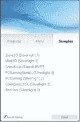
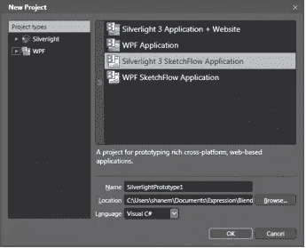
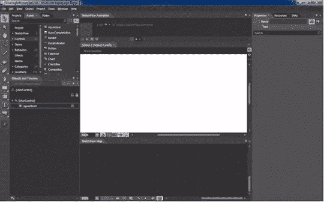
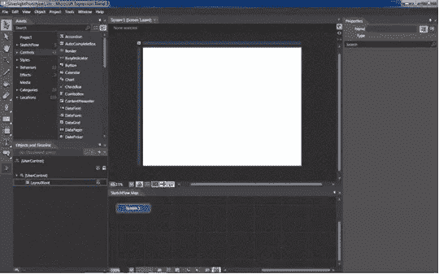
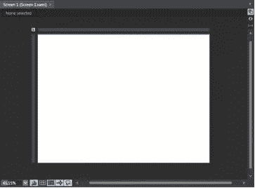
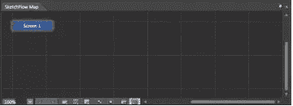
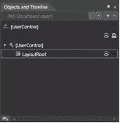
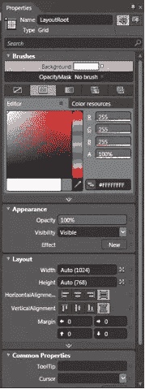
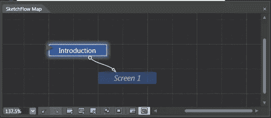

# SketchFlow 快速原型制作

> 原文：<https://www.sitepoint.com/rapid-prototyping-sketchflow/>

我记得在 90 年代中期教用户界面设计课程。在那些课程中，有一张题为“快速原型制作”的幻灯片，在那张幻灯片上有为什么快速原型制作是一个坏主意的所有理由。大部分的推理都集中在原型工具是如此复杂，他们需要由开发人员操作；随后，设计过程往往会受到所有设计工作的影响，这些设计工作需要通过原型能够实际实现的透镜来解释。

快进到 2010 年，人们开始重新思考原型设计。在过去的几年里，出现了一系列新的原型工具，它们很快被交互设计师所采用。我猜这些工具的创造者从来没有参加过我的任何一门课程！

(当你继续读下去的时候，一定要集中注意力，因为在最后有一个测验！)

## 什么变了？

事实上，两件事情的改变使原型工具重新受到青睐:工具本身和它们用来完成的任务。

*   今天的原型工具对设计者来说更加友好。用户界面标记语言(如 HTML、XAML 和 MXML)的采用我们今天构建和运行更复杂软件的能力，使得创建为设计师而不是为开发人员工作的设计工具变得更加容易。

*   同时，我们设计的本质也在改变。当我们从设计一系列相对静态的页面或屏幕转向设计使用更少、更动态页面的应用程序时，使用传统的纸质原型和图表应用程序工具来构建这些体验变得更加困难。

因此，我们具备了新一波原型工具的完美条件:不断增长的需求和不断增强的能力。

## 微软的贡献:Expression Blend SketchFlow

在这种新型的原型工具中，我们发现了 Microsoft Expression Blend SketchFlow(出于本教程的目的，我将其简称为 sketch flow)。SketchFlow 在保持微软超长产品名称传统的同时，采用了一种相当独特的原型制作方法。

### 表情工作室

首先，我想指出 SketchFlow 是微软 Expression Studio 系列设计工具的一部分。在设计工具的黯淡历史之后，微软似乎终于与 Expression Studio 一起行动了(声明:我以前在微软工作过)。Expression Studio 已经发布了第三个版本，包含四到五个产品，具体取决于您如何计算它们:

*   Expression Blend:用于构建 Silverlight、Windows 和 Surface 的用户界面。

*   expression Blend sketch flow(Blend 的一部分):用于原型用户界面。

*   Expression Web:用于为 Web 标准构建用户界面。

*   表情设计:用于为 Web 或 Silverlight、Windows 和 Surface 创建图形资产。

*   Expression Encoder:用于为 Web 或 Silverlight、Windows 和 Surface 准备视频资源。

你可以查看 Raena Jackson Armitage 的文章来了解更多关于 Expression Web 的信息。本系列的后续文章将会更详细地介绍 Expression Blend 和 Expression Web。

### SketchFlow 和表达式混合

注意 SketchFlow 和 Expression Blend 之间的关系很重要。Expression Blend 是 Silverlight、Windows(Windows Presentation Foundation)和 Surface 的制作工具，而 SketchFlow 是建立在 Expression Blend 之上的原型制作工具。

原型工具建立在生产工具之上这一事实引出了一些有趣的可能性——你可能认为这是积极的，也可能认为是消极的，这取决于你的态度:

*   积极的一面是，您可以访问生产工具的所有功能，因此您可以通过访问生产功能(如数据绑定、web 服务、第三方组件，以及，让我们面对现实吧，整个微软)来尽可能深入地开发您的原型。NET 平台。这也意味着如果你愿意，你可以更容易地将你的原型(或者你的原型的一部分)移植到产品中。

*   这种对底层生产工具的访问的缺点是，设计师可能会被隐藏在 SketchFlow 表面下的功能深度所淹没。使用 SketchFlow 提高工作效率确实需要你理解微软平台的一些基本概念，这可能比你在一些页面上绘制方框时所希望的更多。

### 所以 SketchFlow 只是针对微软项目？

如果您正在为 Microsoft Silverlight、Windows (WPF)或 Surface 进行设计，Expression Blend 是首选的制作工具。因此，如果您正在为这些平台进行原型开发，选择 SketchFlow 作为原型开发工具是显而易见的——特别是因为 SketchFlow 在 Expression Studio 套件或许多 MSDN 订阅中免费提供 Expression Blend。

如果你正在为其他平台(包括 HTML/CSS/Ajax)做原型，那么 SketchFlow 肯定是一个选择，尤其是如果你已经有了 Blend 或 SketchFlow 的经验。然而，在这种情况下——与大多数原型工具一样——您将无法将原型移植到生产中。您必须从头开始构建产品版本。

## 让我们试一试

我们现在来看看 SketchFlow 是如何工作的。您可能会发现它与您所熟悉的其他原型工具非常不同。

### 案例研究

为了便于讨论，假设我需要在 www.automaticstudio.com.au 的新网站上添加一个作品集。我在想象一个功能，允许网站访问者以一种动态的、吸引人的方式浏览我的交互设计项目组合。

我认为 Microsoft Silverlight 将是动态元素的一个好选择，因为:

*   作为一名设计师，我可以在 Expression Blend 中用很少或没有代码创建跨平台的交互体验

*   我可以轻松地将 Silverlight 组件与周围的 HTML 页面集成在一起

### 创建您的第一个 SketchFlow 项目

开始使用 SketchFlow 就像启动 Expression Blend 一样简单。你可以[在微软的网站](http://www.microsoft.com/Expression/try-it/default.aspx)上下载 Blend 的评估版(恐怕只有 Windows 版。)

当 Blend 启动时，您将看到一个欢迎屏幕。如果您想看看 SketchFlow 原型是什么样子，请选择“样本”,并打开一个“…Sketch”原型(要运行原型，请在 Blend 中按 **F5** )。

**图一。Expression Blend 包括一些样本 SketchFlow 原型**

当您准备好开始使用我们自己的 SketchFlow 原型时，请返回欢迎屏幕(帮助>欢迎屏幕)，选择项目，然后单击新建项目…您可以为 Silverlight 3 SketchFlow 应用程序选择 WPF。

**图二。要启动自己的 SketchFlow 项目，请选择“新建项目”和 Sliverlight 3 SketchFlow 应用程序**

### SketchFlow/Blend 用户界面

让我们快速浏览一下表达式混合用户界面。您首先会注意到的是，发生了很多事情！不过，没必要惊慌。

**图 3。一开始，Blend UI 的表达会让人不知所措**

Blend 用户界面本身就相当繁忙，SketchFlow 只是增加了更多的功能。我的建议是:帮你自己一个忙，扔掉一些你一开始不需要的面板和工具。

如果要清理混合工作区，请暂时关闭以下内容:

*   SketchFlow 动画面板

*   资源面板

*   数据处理盘

*   国家小组

*   项目面板(如果您是. NET 程序员，请先快速浏览一下——您会看到 SketchFlow 项目是标准的。NET Visual Studio 项目。)

一旦你做到了这一点，用户界面看起来就更容易接近了，如图 4 所示，“稍微整理后的 SketchFlow 用户界面”。

**图 4。稍加整理后的 SketchFlow 用户界面**

让我们四处看看。

#### 画板

画板可能是相当明显的；这是我们布置应用程序屏幕的地方。

**图 5。画板显示应用程序屏幕的内容**

#### 草图流程图

SketchFlow 地图是 SketchFlow 的重要组成部分，它是我们绘制应用程序流程的地方，也是创建 SketchFlow 原型时通常应该开始的地方。

**图 6。SketchFlow 地图是您通常开始 SketchFlow 项目的地方**

#### 对象和时间轴面板

“对象和时间轴”面板显示了屏幕内容的分层视图。(Adobe 用户请注意——默认情况下，它的顺序与你习惯的顺序相反。)

**图 7。对象和时间轴面板显示当前屏幕的内容**

#### 属性面板

另一个您将花费大量时间的面板是 Properties 面板，在这里您可以操作当前所选项目的属性。这是底层平台完整展示自己的第一个地方——有很多属性！

**图 8。属性面板是您设置屏幕项目属性的地方**

### 从屏幕流开始

大多数 SketchFlow 项目的第一步是绘制应用程序的流程。在 SketchFlow 地图面板上，您可以拖出一系列屏幕，并用箭头将它们连接起来，以显示应用程序中的主要用户路径。

**图 9。SketchFlow Map 允许您绘制应用程序的流程图**

SketchFlow 地图可能是我最喜欢的 SketchFlow 功能。使用它鼓励你在考虑单个屏幕的内容之前先考虑流量。最终，它是导致最多可用性问题的流程，并且如果出错，它也是最难(并且最昂贵)修复的。

虽然 SketchFlow 地图是由屏幕组成的，但我的建议是避免一开始就担心什么是屏幕，什么不是屏幕。只需使用 SketchFlow 地图画出用户将采取的主要行动序列。一旦确定了流程，将这些步骤转化为屏幕就容易多了。

## 分享这篇文章