# 重新介绍 PHPUnit:PHP 中的 TDD 入门

> 原文：<https://www.sitepoint.com/re-introducing-phpunit-getting-started-tdd-php/>

我们的网站上已经有很多 PHPUnit 的帖子了(只要看看标签)，但是我们已经有一段时间没有真正向人们介绍它了，从那以后这个工具已经有了很大的发展。

这篇文章旨在以现代的方式，在现代的 PHP 环境中，向现代的观众重新介绍这个工具——如果你不熟悉 PHPUnit 或测试，这篇文章是为你准备的。


这里我们假设你熟悉面向对象的 PHP，并且使用 PHP 版本 7 和更高版本。为了启动并运行预装了 PHP 7 的环境，并且能够不折不扣地遵循本文中的说明，我们建议您使用 [Homestead Improved](https://www.sitepoint.com/quick-tip-get-homestead-vagrant-vm-running/) 。还要注意，将会用到一些命令行，但是您将会被引导完成所有操作。不要害怕它——它是一个比你想象的更强大的工具。

如果你想知道为什么我们推荐每个人使用一个流浪者盒子，我在 [Jump Start PHP Environment](https://www.sitepoint.com/premium/books/jump-start-php-environment/?aref=bskvorc) 中对此进行了深入的探讨，但是这个[对流浪者](https://www.sitepoint.com/re-introducing-vagrant-right-way-start-php/)的介绍也将充分地解释事情。

## 测试驱动开发到底是什么？

测试驱动开发是这样一种思想，你以这样一种方式编写代码，你首先编写另一段代码，其唯一的目的是确保最初打算的代码工作，即使它还没有被编写。

在 TDD-land 中，检查某个东西是否确实是我们期望的东西被称为*断言*。记住这个术语。

比如 2+2=4 的断言是正确的。但是如果我们断言 2+3=4，测试框架(比如 PHPUnit)会将这个断言标记为 false。这被称为“失败的测试”。我们测试的是 2+3 是 4，失败了。显然，在您的应用程序中，您不会测试标量值的总和，相反，语言会在运行时用真实值替换变量并断言，但您会明白这一点。

## PHPUnit 是什么？

PHPUnit 是一个实用程序(PHP 类和可执行文件)的集合，它不仅使编写测试变得容易(编写测试通常需要编写比应用程序实际拥有的更多的代码——但这是值得的)， 而且还允许您在一个漂亮的图表中看到测试过程的输出，让您了解代码质量(例如，一个类中可能有太多的 if——这被标记为质量差，因为改变一个条件通常需要重写与 if 一样多的测试),代码覆盖率(给定类或函数中有多少已经被测试覆盖，还有多少尚未测试),等等。

为了不让过多的文字让你厌烦(太晚？)，让我们实际运用起来，从实例中学习。

> 本教程最后的代码可以从 Github 下载[。](https://github.com/Swader/json-converter)

## 引导示例应用程序

为了更好地理解这些例子，我们将构建一个简单的命令行包，让用户将 JSON 文件转换成 PHP 文件。这个 PHP 文件将包含 JSON 数据，作为一个关联的 PHP 数组。这只是我的一个个人用例——我经常使用 Diffbot，那里的输出可能非常大——太大了以至于无法手工检查，所以用 PHP 进行更简单的处理会非常方便。

从今以后，假设您运行的是一个完全支持 PHP 7 的环境，并且安装了 [Composer](https://www.sitepoint.com/php-dependency-management-with-composer/) ，并且可以跟随。如果你已经启动了[家园改良](https://www.sitepoint.com/quick-tip-get-homestead-vagrant-vm-running/)，现在请用`vagrant ssh`SSH 进入，让我们开始吧。

首先，我们将进入项目所在的文件夹。在[宅基地改良](https://www.sitepoint.com/quick-tip-get-homestead-vagrant-vm-running/)的情况下，那就是`Code`。

```
cd Code 
```

然后，我们将基于 [PDS-Skeleton](https://www.sitepoint.com/pds-skeleton-by-example-a-standard-for-file-and-folder-structure/) 创建一个新项目，并用 [Composer](https://www.sitepoint.com/re-introducing-composer/) 在其中安装 PHPUnit。

```
git clone https://github.com/php-pds/skeleton converter
cd converter
composer require phpunit/phpunit --dev 
```

请注意，我们使用了`--dev`标志，只将 PHPUnit 作为开发依赖项来安装——这意味着在生产中不需要它，从而使我们部署的项目保持轻量级。还要注意，我们从 PDS-Skeleton 开始的事实意味着我们的`tests`文件夹已经为我们创建好了，其中有两个演示文件，我们将删除它们。

接下来，我们需要为我们的应用程序提供一个前端控制器——所有请求都通过这个文件进行路由。在`converter/public`中，用以下内容创建`index.php`:

```
<?php
echo "Hello world"; 
```

以上内容你应该都很熟悉。有了我们的“Hello World”内容，让我们确保可以从浏览器访问它。

*如果你正在使用 [Homestead Improved](https://www.sitepoint.com/quick-tip-get-homestead-vagrant-vm-running/) ，我希望你按照说明设置了一个虚拟主机，或者正在通过虚拟机的 IP 访问应用程序。*

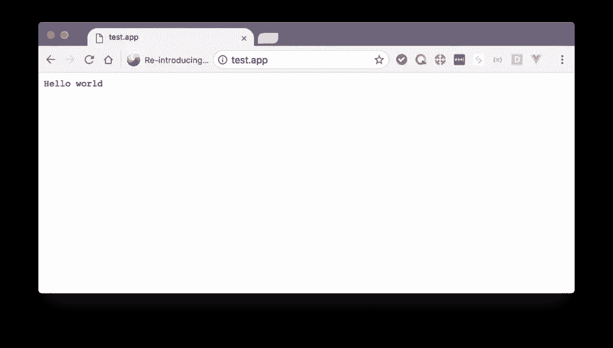

让我们现在删除多余的文件。要么手动执行，要么运行以下命令:

```
rm bin/* src/* docs/* tests/* 
```

你可能想知道为什么我们需要 Hello World 的前端控制器。我们不会在本教程中使用它，但稍后当我们作为人类测试我们的应用程序时，它会派上用场。无论如何，它都不会是我们最终部署的产品包的一部分。

## 套件和配置

我们需要一个 PHPUnit 配置文件，它告诉 PHPUnit 在哪里可以找到测试，在测试之前要做哪些准备工作，以及如何测试。在项目的根目录下，创建包含以下内容的文件`phpunit.xml`:

```
<phpunit bootstrap="tests/autoload.php">
  <testsuites>
    <testsuite name="converter">
      <directory suffix="Test.php">tests</directory>
    </testsuite>
  </testsuites>
</phpunit> 
```

> `phpunit.xml`

根据上下文，一个项目可以有几个测试套件。例如，所有与用户帐户相关的东西都可以归入一个名为“users”的套件，这个套件可以有自己的规则或不同的文件夹来测试该功能。在我们的例子中，项目非常小，所以一个套件就足够了，目标是`tests`目录。我们定义了`suffix`参数——这意味着 PHPUnit 将只运行那些以`Test.php`结尾的文件。当我们想要在`tests`中的一些其他文件，但是不希望它们运行，除非我们从实际的测试文件中调用它们时，这是有用的。

你可以在这里读到其他类似的争论。

`bootstrap`值告诉 PHPUnit 在测试之前加载哪个 PHP 文件。这在配置自动加载或项目范围的测试变量，甚至测试数据库等时非常有用——所有这些都是您在生产模式下不想要或不需要的。让我们创建`tests/autoload.php`:

```
<?php

require_once __DIR__.'/../vendor/autoload.php'; 
```

> `tests/autoload.php`

在这种情况下，我们只是加载 Composer 的默认自动加载程序，因为 PDS-Skeleton 已经在`composer.json`中为我们配置了测试名称空间。如果我们用自己的模板值替换那个文件中的模板值，我们会得到一个类似这样的`composer.json`:

```
{
    "name": "sitepoint/jsonconverter",
    "type": "standard",
    "description": "A converter from JSON files to PHP array files.",
    "homepage": "https://github.com/php-pds/skeleton",
    "license": "MIT",
    "autoload": {
        "psr-4": {
            "SitePoint\\": "src/SitePoint"
        }
    },
    "autoload-dev": {
        "psr-4": {
            "SitePoint\\": "tests/SitePoint"
        }
    },
    "bin": ["bin/converter"],
    "require-dev": {
        "phpunit/phpunit": "^6.2"
    }
} 
```

在这之后，我们运行`composer du`(T1 的简称)来刷新自动加载脚本。

```
composer du 
```

## 第一次测试

记住，TDD 是一门艺术，它首先制造错误，然后对代码进行修改，使它们不再是错误，而不是相反。记住这一点，让我们创建我们的第一个测试。

```
<?php

namespace SitePoint\Converter;

use PHPUnit\Framework\TestCase;

class ConverterTest extends TestCase {

    public function testHello() {
        $this->assertEquals('Hello', 'Hell' . 'o');
    }

} 
```

> `tests/SitePoint/Converter/ConverterTest.php`

如果测试遵循我们期望我们的项目拥有的相同结构，那是最好的。考虑到这一点，我们给它们相同的名称空间和相同的目录树布局。因此，我们的`ConverterTest.php`文件在`tests`，子文件夹`SitePoint`，子文件夹`Converter`。

> 我们正在扩展的文件是 PHPUnit 提供的测试类的最基本版本。在大多数情况下，这就足够了。如果没有，最好进一步扩展它，然后在此基础上进行构建。记住——测试不一定要遵循好的软件设计规则，所以深度继承和代码重复是可以的——只要它们测试需要测试的东西！

这个示例“测试用例”断言[字符串](https://www.sitepoint.com/why-is-a-string-called-a-string/) `Hello`等于`Hell`和`o`的串联。如果我们现在用`php vendor/bin/phpunit`运行这个套件，我们将得到一个积极的结果。


> PHPUnit 运行一个`Test`文件中以`test`开始的每个方法，除非另有说明。这就是为什么我们在运行测试套件时不需要显式说明——这都是自动的。

然而，我们目前的测试既不有用也不现实。我们只是用它来检查我们的设置是否有效。现在写一个合适的吧。像这样重写`ConverterTest.php`文件:

```
<?php

namespace SitePoint\Converter;
use PHPUnit\Framework\TestCase;

class ConverterTest extends TestCase
{

    public function testSimpleConversion()
    {
        $input = '{"key":"value","key2":"value2"}';
        $output = [
            'key' => 'value',
            'key2' => 'value2'
        ];
        $converter = new \SitePoint\Converter\Converter();
        $this->assertEquals($output, $converter->convertString($input));
    }
} 
```

> `tests/SitePoint/Converter/ConverterTest.php`

好吧，这是怎么回事？

我们正在测试一个“简单”的转换。输入是一个 JSON 字符串，一个字符串化的对象，预期的输出是它的 PHP 数组版本。我们的测试断言，当使用`convertString`方法处理`$input`时，我们的转换器类产生了预期的`$output`，正如定义的那样。

重新运行套件。

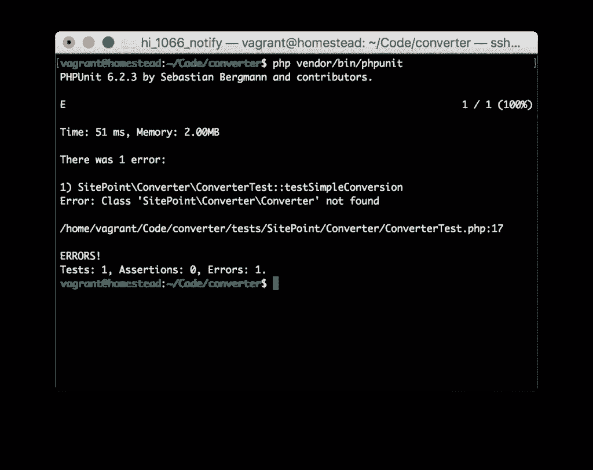

失败的测试！这是意料之中的，因为该类甚至还不存在。

让我们用颜色让事情变得更戏剧化一点！编辑`phpunit.xml`文件，使`<phpunit`标签包含`colors="true"`，如下所示:

```
<phpunit colors="true" bootstrap="tests/autoload.php"> 
```

现在，如果我们运行`php vendor/bin/phpunit`，我们会得到一个更戏剧性的输出:

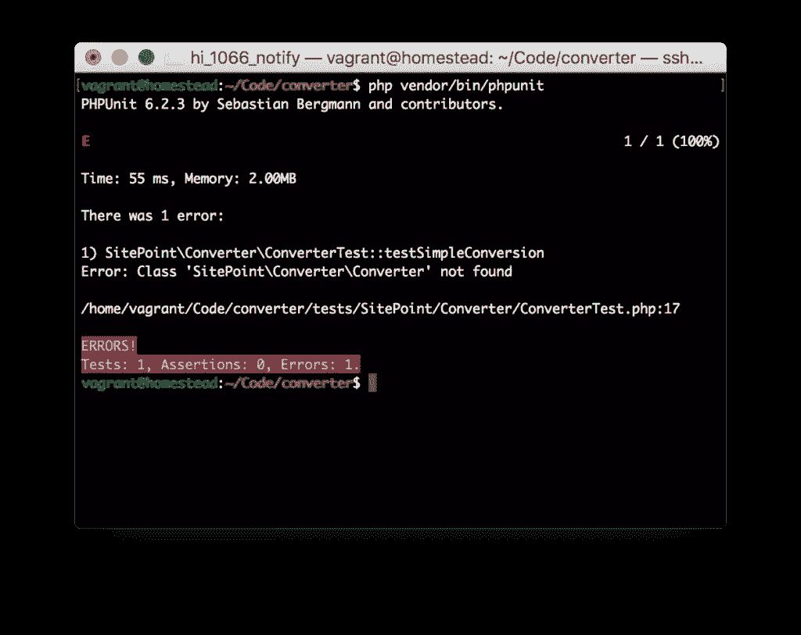

## 通过测试

现在，我们开始通过测试的过程。

我们的第一个错误是:“找不到类‘site point \ Converter \ Converter’”。让我们解决这个问题。

```
<?php

namespace SitePoint\Converter;

class Converter
{

} 
```

> `src/SitePoint/Converter/Converter.php`；

现在，如果我们重新运行该套件…

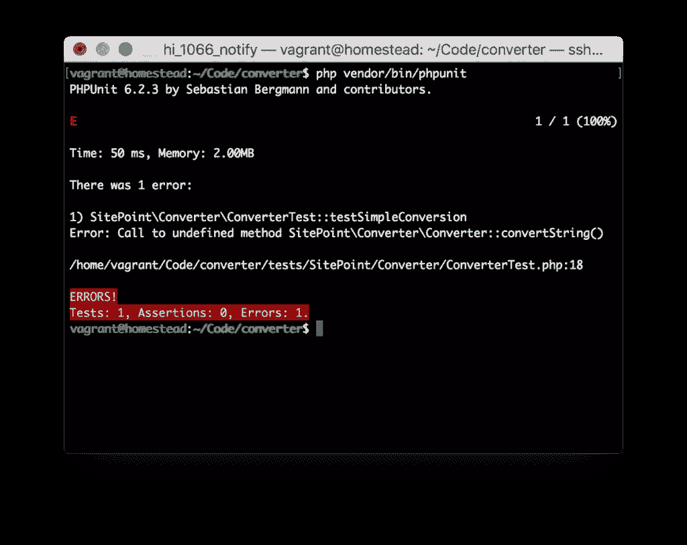

进步！我们现在缺少调用的方法。让我们把它加入到我们的课程中。

```
<?php

namespace SitePoint\Converter;

class Converter
{
    public function convertString(string $input): ?array
    {

    }
} 
```

> `src/SitePoint/Converter/Converter.php`；

我们定义了一个方法，该方法接受字符串类型的输入，如果不成功，则返回数组或 null。如果你不熟悉标量类型(`string $input`)，在这里了解更多[，对于可空返回类型(`?array`，在这里](http://php.net/manual/en/functions.arguments.php#functions.arguments.type-declaration)查看[。](https://www.sitepoint.com/whats-new-and-exciting-in-php-7-1/)

重新运行测试。

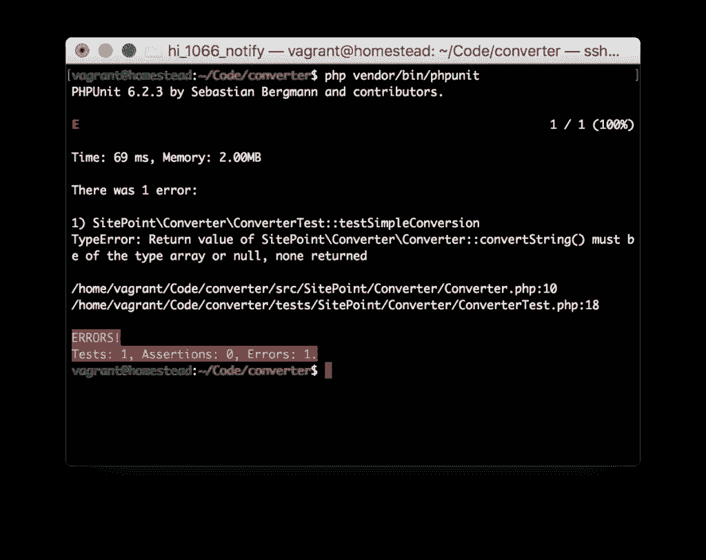

这是一个返回类型错误-函数不返回任何东西(void)-因为它是空的-它应该返回 null 或数组。让我们完成这个方法。我们将使用 PHP 内置的`json_decode`函数来解码一个 JSON 字符串。

```
 public function convertString(string $input): ?array
    {
        $output = json_decode($input);
        return $output;
    } 
```

> `src/SitePoint/Converter/Converter.php`；

让我们看看如果重新运行该套件会发生什么。

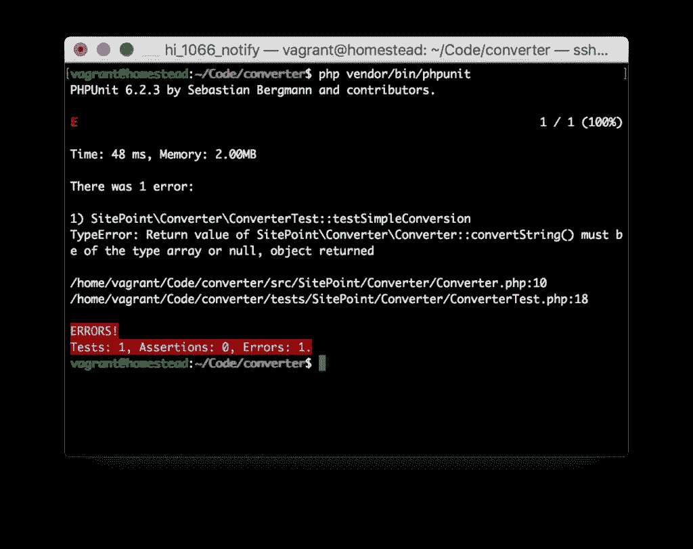

啊哦。函数返回一个对象，而不是一个数组。啊哈！那是因为我们没有在`json_decode`函数上激活“关联数组”模式。默认情况下，该函数将 JSON 数组转换成`stdClass`实例，除非另有说明。像这样改变它:

```
 public function convertString(string $input): ?array
    {
        $output = json_decode($input, true);
        return $output;
    } 
```

> `src/SitePoint/Converter/Converter.php`；

重新运行套件。


万岁。我们的测试现在通过了！它得到的输出和我们在测试中期望的完全一样！

现在让我们添加几个测试用例，以确保我们的方法确实如预期的那样执行。让我们把这些变得比我们开始的简单例子复杂一点。将以下方法添加到`ConverterTest.php`:

```
 {
        $input     = '{"key":"value","key2":"value2","some-array":[1,2,3,4,5]}';
        $output    = [
            'key'        => 'value',
            'key2'       => 'value2',
            'some-array' => [1, 2, 3, 4, 5],
        ];
        $converter = new \SitePoint\Converter\Converter();
        $this->assertEquals($output, $converter->convertString($input));
    }

    public function testMoreComplexConversion()
    {
        $input     = '{"key":"value","key2":"value2","some-array":[1,2,3,4,5],"new-object":{"key":"value","key2":"value2"}}';
        $output    = [
            'key'        => 'value',
            'key2'       => 'value2',
            'some-array' => [1, 2, 3, 4, 5],
            'new-object' => [
                'key'  => 'value',
                'key2' => 'value2',
            ],
        ];
        $converter = new \SitePoint\Converter\Converter();
        $this->assertEquals($output, $converter->convertString($input));
    }

    public function testMostComplexConversion()
    {
        $input     = '[{"key":"value","key2":"value2","some-array":[1,2,3,4,5],"new-object":{"key":"value","key2":"value2"}},{"key":"value","key2":"value2","some-array":[1,2,3,4,5],"new-object":{"key":"value","key2":"value2"}},{"key":"value","key2":"value2","some-array":[1,2,3,4,5],"new-object":{"key":"value","key2":"value2"}}]';
        $output    = [
            [
                'key'        => 'value',
                'key2'       => 'value2',
                'some-array' => [1, 2, 3, 4, 5],
                'new-object' => [
                    'key'  => 'value',
                    'key2' => 'value2',
                ],
            ],
            [
                'key'        => 'value',
                'key2'       => 'value2',
                'some-array' => [1, 2, 3, 4, 5],
                'new-object' => [
                    'key'  => 'value',
                    'key2' => 'value2',
                ],
            ],
            [
                'key'        => 'value',
                'key2'       => 'value2',
                'some-array' => [1, 2, 3, 4, 5],
                'new-object' => [
                    'key'  => 'value',
                    'key2' => 'value2',
                ],
            ],
        ];
        $converter = new \SitePoint\Converter\Converter();
        $this->assertEquals($output, $converter->convertString($input));
    } 
```

> `tests/SitePoint/Converter/ConverterTest.php`

我们让每个测试用例比前一个稍微复杂一点，最后一个用例在一个数组中包含多个对象。重新运行测试套件向我们显示一切正常…


…但感觉有些不对劲，不是吗？这里有太多的重复，如果我们要改变类的 API，我们必须在 4 个地方进行改变(目前)。即使在测试中，DRY 的优势也开始显现。嗯，有一个功能可以帮助解决这个问题。

## 数据提供者

数据提供者是测试类中的特殊函数，它有一个特定的目的:为测试函数提供一组数据，这样你就不需要像我们一样在几个测试函数中重复它的逻辑。最好用一个例子来解释。让我们将我们的`ConverterTest`类重构为:

```
<?php

namespace SitePoint\Converter;

use PHPUnit\Framework\TestCase;

class ConverterTest extends TestCase
{

    public function conversionSuccessfulProvider()
    {
        return [
            [
                '{"key":"value","key2":"value2"}',
                [
                    'key'  => 'value',
                    'key2' => 'value2',
                ],
            ],

            [
                '{"key":"value","key2":"value2","some-array":[1,2,3,4,5]}',
                [
                    'key'        => 'value',
                    'key2'       => 'value2',
                    'some-array' => [1, 2, 3, 4, 5],
                ],
            ],

            [
                '{"key":"value","key2":"value2","some-array":[1,2,3,4,5],"new-object":{"key":"value","key2":"value2"}}',
                [
                    'key'        => 'value',
                    'key2'       => 'value2',
                    'some-array' => [1, 2, 3, 4, 5],
                    'new-object' => [
                        'key'  => 'value',
                        'key2' => 'value2',
                    ],
                ],
            ],

            [
                '[{"key":"value","key2":"value2","some-array":[1,2,3,4,5],"new-object":{"key":"value","key2":"value2"}},{"key":"value","key2":"value2","some-array":[1,2,3,4,5],"new-object":{"key":"value","key2":"value2"}},{"key":"value","key2":"value2","some-array":[1,2,3,4,5],"new-object":{"key":"value","key2":"value2"}}]',
                [
                    [
                        'key'        => 'value',
                        'key2'       => 'value2',
                        'some-array' => [1, 2, 3, 4, 5],
                        'new-object' => [
                            'key'  => 'value',
                            'key2' => 'value2',
                        ],
                    ],
                    [
                        'key'        => 'value',
                        'key2'       => 'value2',
                        'some-array' => [1, 2, 3, 4, 5],
                        'new-object' => [
                            'key'  => 'value',
                            'key2' => 'value2',
                        ],
                    ],
                    [
                        'key'        => 'value',
                        'key2'       => 'value2',
                        'some-array' => [1, 2, 3, 4, 5],
                        'new-object' => [
                            'key'  => 'value',
                            'key2' => 'value2',
                        ],
                    ],
                ],
            ],

        ];
    }

    /**
     * @param $input
     * @param $output
     * @dataProvider conversionSuccessfulProvider
     */
    public function testStringConversionSuccess($input, $output)
    {
        $converter = new \SitePoint\Converter\Converter();
        $this->assertEquals($output, $converter->convertString($input));
    }

} 
```

> `tests/SitePoint/Converter/ConverterTest.php`

我们首先编写了一个名为`conversionSuccessfulProvider`的新方法。这暗示了对所有提供的案例都应该返回肯定结果的期望，因为输出和输入是匹配的。数据提供程序返回数组(这样测试函数就可以自动遍历元素)。这个数组的每个元素都是一个测试用例——在我们的例子中，每个元素都是一个包含两个元素的数组:前者是输入，后者是输出，就像前面一样。

然后，我们将测试函数合并成一个具有更通用名称的函数，以表示我们所期望的:`testStringConversionSuccess`。这个测试方法接受两个参数:输入和输出。其余的逻辑与之前是一样的。此外，为了确保该方法使用 dataprovider，我们用`@dataProvider conversionSuccessfulProvider`在方法的 docblock 中声明了提供者。

这就是全部，我们现在得到完全相同的结果。

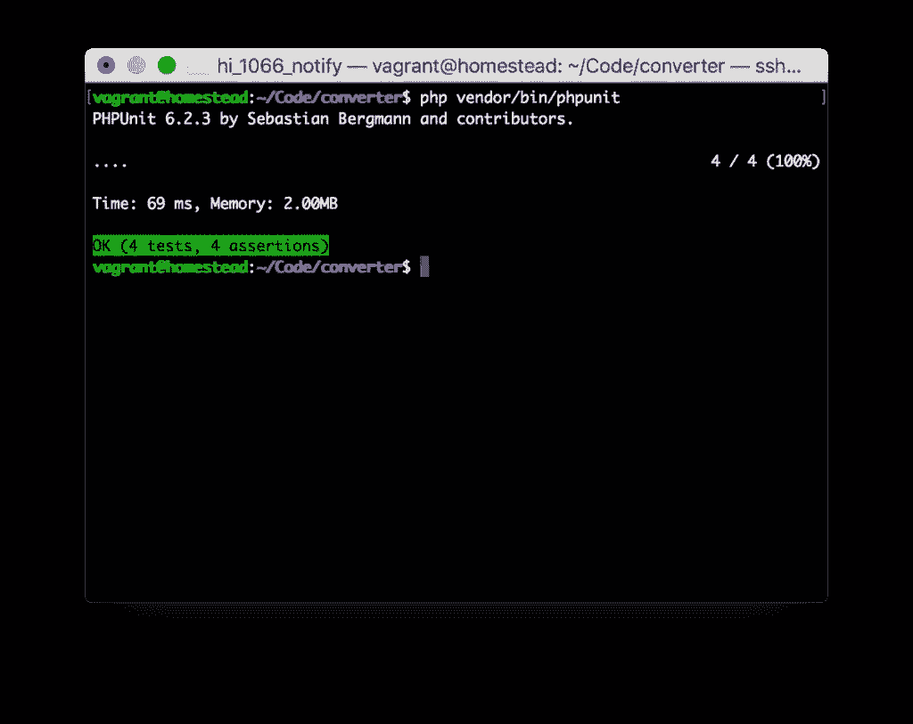

如果我们现在希望添加更多的测试用例，我们只需要向提供者添加更多的输入输出对。无需发明新的方法名称或重复逻辑。方便吧？

## 代码覆盖率介绍

在我们结束这一部分并让您理解我们到目前为止所涵盖的一切之前，让我们简单地讨论一下代码覆盖率。

代码覆盖率是一个度量标准，它告诉我们测试覆盖了多少代码。如果我们的类有两个方法，但是只有一个在测试中被测试过，那么我们的代码覆盖率最多是 50%——取决于有多少逻辑分支(If、switches、loops 等)。)方法有(每个分支都应该被一个单独的测试覆盖)。PHPUnit 能够在运行给定的测试套件后自动生成代码覆盖报告。

让我们快速设置一下。我们将通过添加`<logging>`和`<filter>`部分来扩展`phpunit.xml`，作为紧接在`<phpunit>`内的元素，从而作为 1 级元素(如果`<phpunit>`是 0 级或根):

```
<phpunit ...>
    <filter>
        <whitelist>
            <directory suffix=".php">src/</directory>
        </whitelist>
    </filter>
    <logging>
        <log type="tap" target="tests/build/report.tap"/>
        <log type="junit" target="tests/build/report.junit.xml"/>
        <log type="coverage-html" target="tests/build/coverage" charset="UTF-8" yui="true" highlight="true"/>
        <log type="coverage-text" target="tests/build/coverage.txt"/>
        <log type="coverage-clover" target="tests/build/logs/clover.xml"/>
    </logging> 
```

Filter 建立了一个白名单，告诉 PHPUnit 在测试时应该注意哪些文件。这一条翻译过来就是 *all。/src 里面的 php 文件，任何级别*。日志告诉 PHPUnit 要生成哪些报告——各种工具可以读取各种报告，所以生成比所需更多的格式也无妨。在我们的例子中，我们只对 HTML 感兴趣。

在此之前，我们需要激活 XDebug，因为这是 PHPUnit 用来检查它遍历的类的 PHP 扩展。 [Homestead Improved](https://www.sitepoint.com/quick-tip-get-homestead-vagrant-vm-running/) 附带了`phpenmod`工具，用于动态激活和停用 PHP 扩展:

```
sudo phpenmod xdebug 
```

如果您没有使用 HI，请遵循与您的操作系统发行版相关的 XDebug 安装说明。[这篇文章](https://www.sitepoint.com/getting-know-love-xdebug/)应该有帮助。

重新运行套件将会通知我们生成的覆盖率报告。此外，它们将出现在目录树的指定位置。

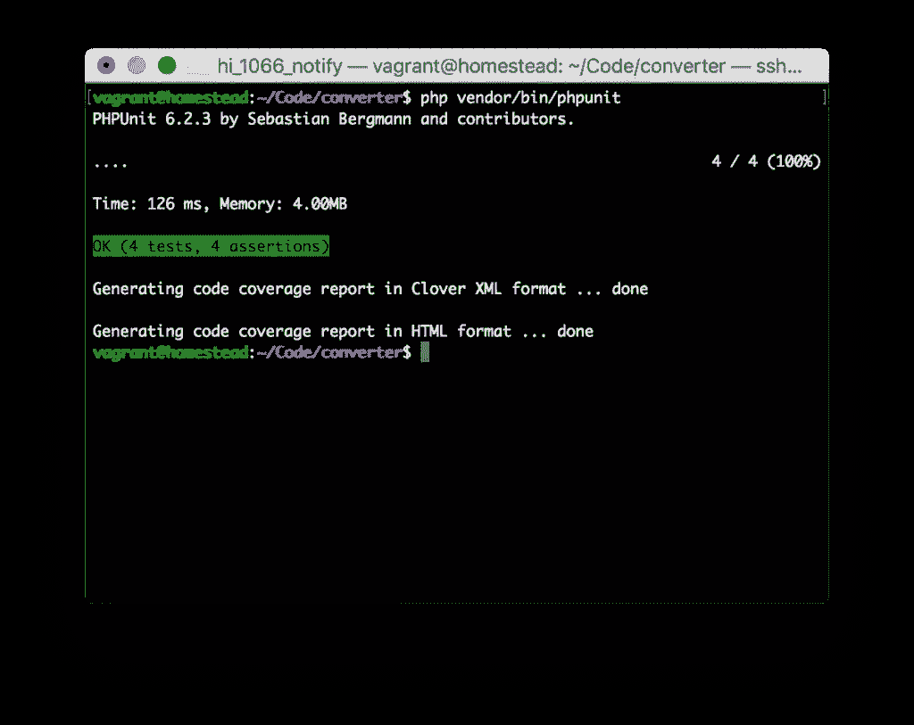

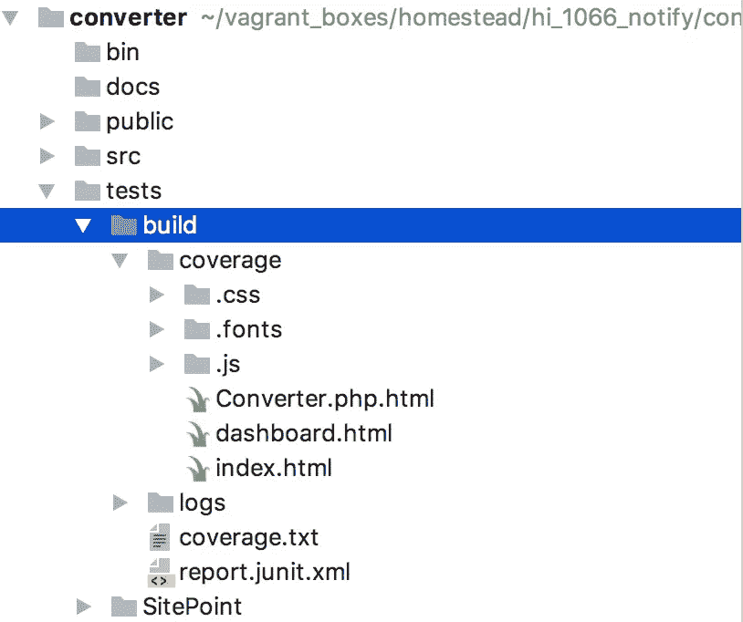

让我们在浏览器中打开`index.html`文件。直接拖放到任何现代浏览器中应该都可以——不需要虚拟主机或运行服务器——它只是一个静态文件。

索引文件将列出所有测试的摘要。您可以点击单个类来查看它们详细的覆盖率报告，将鼠标悬停在方法体上将会显示工具提示，解释给定方法测试了多少。

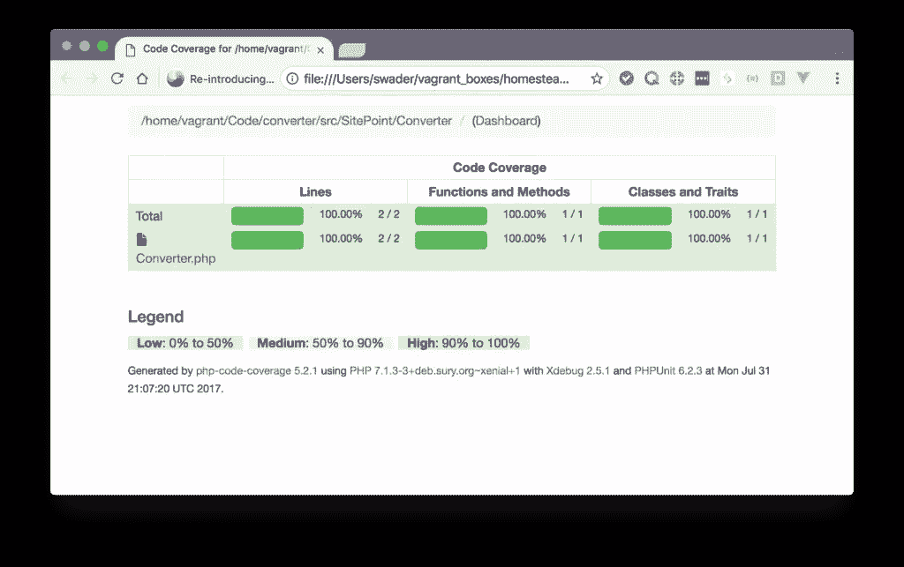

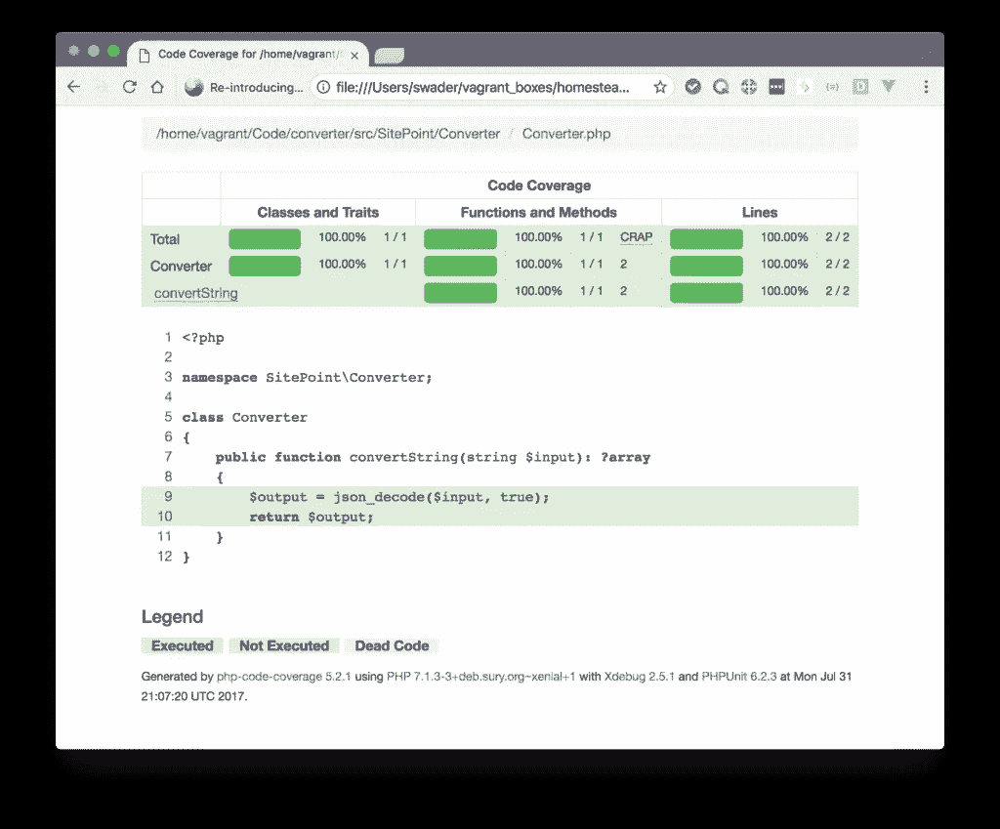


随着我们进一步开发我们的工具，我们将在后续文章中更深入地讨论代码覆盖。

## 结论

在对 PHPUnit 的介绍中，我们大致了解了测试驱动开发(TDD ),并将其概念应用于新 PHP 工具的开始阶段。我们写的所有代码都可以从 Github 下载[。](https://github.com/Swader/json-converter)

我们学习了 PHPUnit 基础知识，解释了数据提供者，并展示了代码覆盖率。这篇文章只涉及了 PHPUnit 的一些基本概念和特性，我们鼓励您自己进一步探索，或者请求澄清您认为令人困惑的概念——我们希望能够为您澄清更多的事情。

在后续的文章中，我们将介绍一些中间技术，并进一步开发我们的应用程序。

请在下面留下你的评论和问题！

## 分享这篇文章