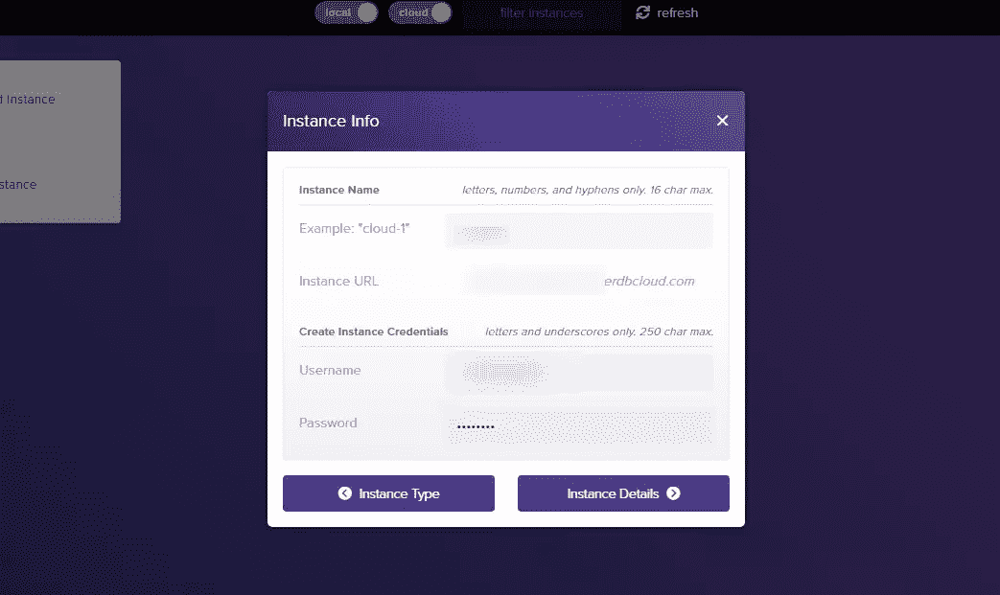
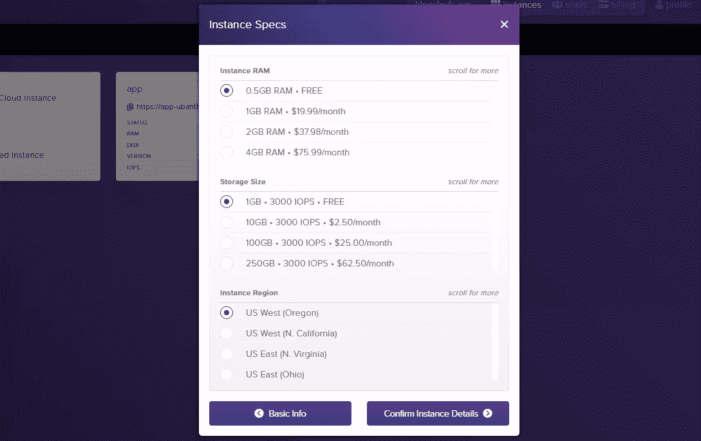
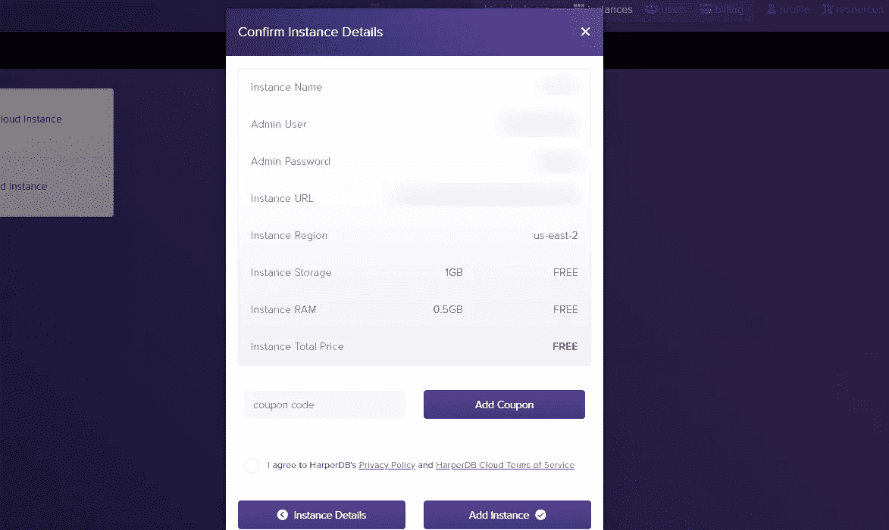
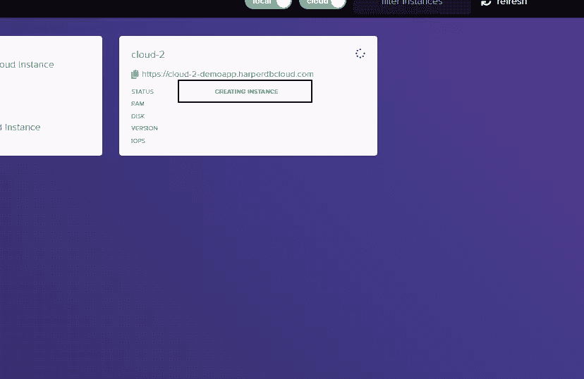
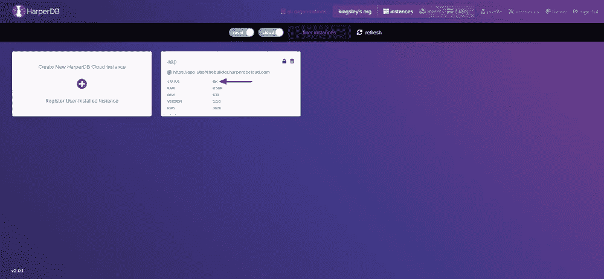
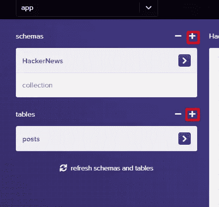
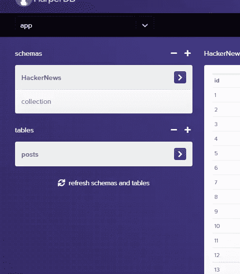
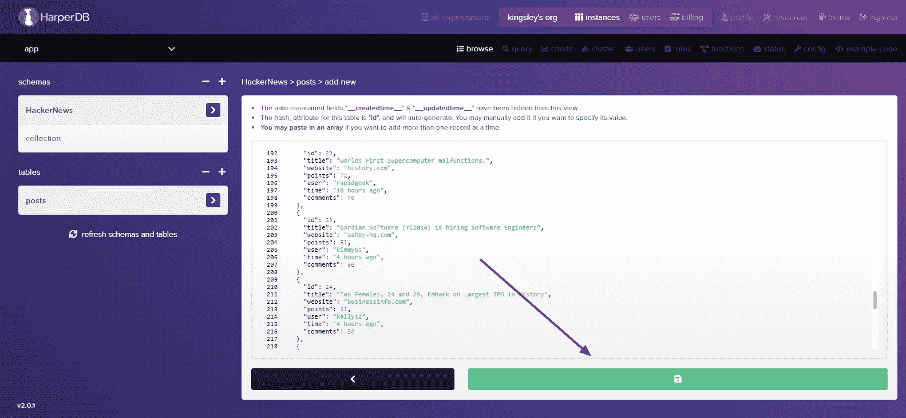

# 使用 React 和 HarperDB 构建一个黑客新闻克隆

> 原文：<https://www.sitepoint.com/react-harperdb-build-hacker-news-clone/>

提高你的网络开发技能的最有效和最有趣的方法之一是克隆一个现有的网页或网站。在本教程中，我们将利用 React 和 HarperDB 克隆黑客新闻[主页](https://news.ycombinator.com/)。

当我们完成时，我们的黑客新闻主页的克隆版本应该是这样的:


这个项目的代码可以在它的 [GitHub 库](https://github.com/KingsleyUbah/hacker-news-clone)中找到。

## 克隆的好处

构建网页的克隆有以下好处:

*   它帮助你关注设计的复杂性和细微差别。这让你成为一个更全面的设计师。

*   它帮助你熟悉颜色和排版。这些都是每个前端开发者/设计师都应该精通的非常重要的概念。

*   它让你了解新技术。你可以使用新的技术，拓宽你的知识和技能范围。

## 关于 React/useHarperDB 技术堆栈

我们将在这个项目中使用的堆栈主要是 React/useHarperDB 堆栈。

HarperDB 是一个数据管理软件。它非常适合需要 NoSQL 和 SQL 功能、快速应用开发、集成、边缘计算、分布式计算和实时运营分析的情况。

HarperDB 也很灵活。它允许您执行以下操作:

*   对单个端点进行查询
*   使用 SQL 和 NoSQL 查询您的数据库
*   用 JSON 和 SQL 查询上传数据
*   在单个 CSV 文件中上传批量数据

它非常快，使用简单，并允许您设置在一个无服务器的方式。无服务器架构需要将后端任务抽象到另一个服务。

更简单地说，作为开发人员，您不必在本地机器上为 web 应用程序实现后端和数据库。相反，像 HarperDB 这样的平台负责后端操作，并为您提供通过云从其基础架构访问和管理数据的方法。这样，您就可以专注于前端开发。

在整个开发过程中，我们将使用以下工具。

### 反应

我们将使用 React 库来克隆我们的主页。React 是一个前端 JavaScript 库，用于构建可重用的用户界面组件。例如，假设您想在网站的两个或更多地方使用类似的按钮。使用 HTML，您可以在想要使用的每个部分中为该按钮定义标记。这不符合干燥(不要重复自己)原则。使用 React，您需要做的就是定义一个按钮组件，然后在您打算在应用程序中使用它的每个部分中注册该组件。这简化了整个构建过程并清理了您的代码。

我们将使用`create-react-app`工具立即为我们构建一个工作框架，而不是手动安装 React 并设置繁琐的配置。这将有助于节省时间。

### 节点和国家预防机制

React、React DOM 和数以千计的其他包都位于 npm 注册表中。为了能够在本地机器上安装这些依赖项，我们需要安装 Node 和 npm。您可以从[这里](https://nodejs.org/en/download/)安装节点。

如果您不确定 Node 是否已经安装在您的计算机上，或者您不确定当前安装的是哪个版本，只需在您的计算机上打开一个命令终端并键入`node -v`。如果您安装了节点，它应该显示您安装的节点的版本。请注意，要运行这个项目，您应该拥有至少 12.xx 的节点版本。

### HarperDB 云帐户

为了建立一个数据库，我们需要为我们的应用程序创建一个实例。要创建一个实例，我们首先需要注册 Harper。设置完数据库云实例后，我们需要在 React 应用程序中使用用户名、密码和数据库 URL。在数据库中，我们将创建一个表来保存稍后将在网页上显示的黑客新闻帖子列表。

### useHarperDB

这是 Harper 提供的一个 React 钩子。这个钩子本质上充当了 React 应用程序和数据库之间的桥梁。通过在我们的 React 组件中调用这个函数并传递一些重要的参数——包括一个 SQL 查询——我们将能够从我们的云数据库中访问帖子。这个包将使用节点包管理器安装，关于它的详细信息可以在找到[。](https://www.npmjs.com/package/use-harperdb?ref=hackernoon.com)

### 结构化查询语言

在这个项目中，我们将只使用一个基本的 SQL 查询，所以不需要广泛的知识。

### 半铸钢ˌ钢性铸铁(Cast Semi-Steel)

最后，我们将使用没有库的纯 CSS 来设计我们的克隆体。我们应用的每一种风格都是为了模仿哈珀新闻主页。

### 黑客新闻标志

由于我们将创建一个真正的黑客新闻主页的精确副本，我们将需要徽标图像。你可以在这里下载 SVG 格式的 logo[。](https://iconscout.com/icon/hacker-news-3521477)

## 创建 HarperDB 云实例

首先，我们需要设置我们的云实例。我们转到 HarperDB 主页，[注册了一个免费账户](https://studio.harperdb.io/sign-up)。


注册后，我们将为我们的应用程序创建一个 HarperDB 云实例。按照说明，填写您的用户名、您的实例的密码和您的实例名称。这样做之后，将为您生成一个 URL。



在下一页，我们将被告知选择我们的规格。由于这是一个教程，我们将去免费计划。



点击“确认实例详细信息”,您将转到包含所有实例信息的页面。现在，复制您的实例 URL、用户名和密码，并将其保存在某个地方，因为您稍后会需要它们。



最后，我们确认实例。您会立即在卡片上看到“创建实例”标签。这表明 HarperDB 正在处理我们的实例，它将在几分钟内全部设置好。



将我们的实例凭证存储在一个可访问的地方很重要，因为我们将在教程的后面用到它。凭证是您的用户名、密码和实例 URL。

## 设置我们的项目目录

我们的数据库现在正在加速运转。现在是时候为我们的应用程序创建目录并安装依赖项了。

首先，我们转到终端并运行以下命令:

```
npx create-react-app hacker-news-clone 
```

这将创建一个名为`hacker-news-clone`的文件夹，并将 React 库安装到项目中。由于`create-react-app`是一个代码生成器，所有的配置都会自动完成。这样，我们可以更专注于开发我们的应用程序。

## 创建数据库并为其提供数据

回到 HarperDB，我们需要为页面提供数据。这些数据将是黑客新闻的列表，我们将在我们的前端显示。

### 在数据库中创建模式和表

我们需要为我们的数据库定义一个模式。模式是数据库的结构形式。它定义了数据在数据库中的组织方式。在 HarperDB 中，您可以简单地将模式视为表的集合。我们可以在一个模式中定义多个表，并从应用程序中的不同位置访问这些表。

在 HarperDB 仪表板上，单击该卡。您将被引导至新页面。



要创建一个模式，只需点击旁边的 **+** 图标。



在我们的教程中，我们将把我们的模式命名为“HackerNews”。

在模式内部，我们将定义第一个表，名为`posts`。这个表将包含所有将显示在我们页面上的文章数据。除了表名之外，我们还必须为表传入一个 hash 属性。一个**散列属性**是一个惟一的值，用于区分表中的一行(post)和另一行数据。

对于我们的 posts 表，我们将 hash 属性设置为`id`。这意味着`id`列将保存表中每一行的唯一数据。



### 用数据填充我们的表

此时，桌子是空的。我们必须用数据填充表格。HarperDB 为我们提供了多种实现方式:

*   通过 SQL 或 NoSQL 查询在我们的数据库上创建数据
*   通过定义单个 JSON 对象(仅针对一条记录)和一组 JSON 数据(针对多条记录)
*   通过用 CSV 文件导入和加载数据

在本教程中，我们将通过 JSON 提供数据。因为我们要插入多篇文章的记录，所以我们将使用一个 JSON 对象数组，每个对象保存一篇文章的信息。

点击右上角的小 **+** 图标，粘贴以下 JSON 数据:

```
[
  {
    "id": 1,
    "title": "Intel Is Reducing Server Chip Pricing in Attempt to Stem the AMD Tide",
    "website": "(tomshardware.com)",
    "url": "https://www.tomshardware.com",
    "points": 115,
    "user": "rbanffy",
    "time": "2 hours ago",
    "comments": 67
  },

  {
    "id": 2,
    "title": "AI recognizes race in medical images",
    "website": "(explainthispaper.com)",
    "url": "https://www.explainthispaper.com",
    "points": 31,
    "user": "stuartbman",
    "time": "30 minutes ago",
    "comments": 15
  }
] 
```

*注:这个数据只是针对两个黑客新闻帖子。你可以从 GitHub 库获得 30 篇文章的数据。*

去点击绿色按钮，将它们插入到表格中。这应该用两个帖子动态填充我们的表。



至此，我们已经完成了 HarperDB 云的工作。现在是时候关注我们网站的前端部分了。

## 将 HarperDB 和我们的应用程序与 HarperDBProvider 集成

现在，我们的前端和后端是隔离的。我们必须将 HarperDB 云实例连接到 React 应用程序。谢天谢地，HarperDB 为我们提供了一个钩子: [use-harperdb](https://www.npmjs.com/package/use-harperdb) 。

我们需要将`useharperdb`安装到我们的项目中。为此，我们运行以下命令:

```
npm install use-harperdb 
```

出于安全原因，我们需要将实例凭证存储在环境变量中。我们将在根应用程序(`hacker-news-clone`)中创建一个名为`.env`的文件，并传入以下变量:

```
REACT_APP_DB_URL=**
REACT_APP_USER=**
REACT_APP_PASSWORD=** 
```

请确保遵循相同的格式，并用您自己的实例信息替换双星号。传入数据库的 URL、用户名和密码。

之后，我们将通过导航到`hacker-news-clone/src/index.js`进入`index.js`文件。然后我们导入`HarperDBProvider`,将我们的整个应用程序包装在里面:

```
import React from 'react';
import ReactDOM from 'react-dom';
import './index.css';
import App from './App';
import { HarperDBProvider } from 'use-harperdb';

ReactDOM.render(
  <React.StrictMode>
    <HarperDBProvider
    url={process.env.REACT_APP_DB_URL}
    user={process.env.REACT_APP_USER}
    password={process.env.REACT_APP_PASSWORD}
    >
      <App />
    </HarperDBProvider>
  </React.StrictMode>,
  document.getElementById('root')
); 
```

在`<HarperDBProvider>`中，我们传递我们的环境变量。这是一个非常重要的步骤，因为它基本上确保了我们的整个应用程序拥有我们的云实例的上下文，因此可以从中提取数据。

## 用 React 构建主页

记住任务是克隆黑客新闻主页。这也意味着我们将非常关注造型。考虑到这一点，是时候开始构建了。

### 构建根组件

根组件是`app.js`。导航到`hacker-news-clone/src/App.js`并输入以下代码:

```
import React from 'react';
import './App.css';
import Posts from './components/Posts';
import logo from './hacker-news.svg'

function App() {
  return (
    <div className="App">
    <div className="container">
      <div className="header flex">
          <div className="part-1 flex">
              <div className="image">
                
              </div>

              <h1 className="logo">Hacker News</h1>
              <h3><a href="https://news.ycombinator.com/newest">new</a></h3> <span className="stroke">|</span>
              <h3><a href="https://news.ycombinator.com/front">past</a></h3> <span className="stroke">|</span>
              <h3><a href="https://news.ycombinator.com/newcomments">comments</a></h3> <span className="stroke">|</span>
              <h3><a href="https://news.ycombinator.com/ask">ask</a></h3> <span className="stroke">|</span>
              <h3><a href="https://news.ycombinator.com/show">show</a></h3> <span className="stroke">|</span>
              <h3><a href="https://news.ycombinator.com/job">job</a></h3> <span className="stroke">|</span>
              <h3><a href="https://news.ycombinator.com/submit">submit</a></h3> <span className="stroke">|</span>
          </div>

          <div className="part-2">
              <h3><a href="https://news.ycombinator.com/login">login</a></h3>
          </div>
        </div>

          <Posts />
    </div>
  </div>
  );
}

export default App; 
```

作为根组件，`app.js`将拥有我们 React 应用的全部。在顶部，我们可以看到页面标题部分的标记，在下面，我们可以看到 posts 组件也注册在其中。

header `<div>`保存了黑客新闻页面标题部分的所有标记。这包括小徽标、徽标文本和导航链接列表。还可以看到在一些元素上注册了`flex`类。所有的对齐都将使用 Flexbox 从我们的样式表`App.css`中完成。

最后的**组件**就是`post`组件。该组件将保存页面的下半部分，其中包括来自 HarperDB 的帖子列表。

### 构建员额组件

这可能是这个项目中最有趣的 React 组件。该组件将显示使用`use-harperdb`函数从数据库中提取的文章列表。

导航到`hacker-news-clone/src/components/Post.js`并创建`Post`组件:

```
import { useHarperDB } from 'use-harperdb';

function Posts() {
let [data, loading, error, refresh] = useHarperDB({
    query: {
      operation: 'sql',
      sql: `select * from HackerNews.posts`
    }
    /* interval: 40000 */
  })

// CODE WILL CONTINUE 
```

导入依赖项后，我们将定义我们的 posts“function”组件。在其中，我们执行`useHarperDB`函数，并传入一个查询对象作为参数。在这个对象中，我们定义了两个属性:

*   `operation`:这定义了我们想要在数据库上执行的查询操作的种类。在我们的例子中，它是一个 SQL 操作。
*   这里我们定义我们的 SQL 查询。

还可以看到 interval 属性。使用该属性，我们可以指定在自动向`HarperDB`发出新的数据请求之前，我们希望等待多长时间。就当是自动刷新吧。

然而，由于我们在这里不需要它，我决定把它注释掉。我只是出于学习目的提一下。

调用`useharperdb`函数将返回以下变量，我们将这些变量放入一个数组中:

*   `loading`:表示数据仍在加载中
*   `error`:如果遇到错误，错误信息返回到该变量中
*   `refresh`:该功能可用于反复从数据库中提取数据
*   `data`:包含我们在查询对象中查询到的实际数据

现在我们将编写组件的剩余部分:

```
// CONTINUATION

if(loading) {
    return <div> Loading... </div>
  }

if(data) {
      return (
        <div className="body">
          <div className="posts">

          {data.map((post, index) => {
            return (
            <div key={post.id}>
              <p><span className="number">{post.id}.</span> <span className="triangle"></span>{post.title}<a href={post.url} className="website">{post.website}</a> </p>
              <p className="secondary">{post.points} points by <a href="" className="outline">{post.user}</a> <a href="" className="outline">{post.time}</a>  | <a href="" className="outline">hide</a> |  <a class="outline" href="">{post.comments} comments</a> </p>
            </div>
          )
          })}
          </div>

          <div className="footer">
            <p><a href="https://news.ycombinator.com/newest" onClick={refresh}>More</a></p>
            <hr />
            <div className="links">
              <p><a href="">Guidelines</a><span className="stroke">|</span> <a href="">FAQs</a><span className="stroke">|</span> <a href="">Lists</a><span className="stroke">|</span>
                  <a href="">API</a><span className="stroke">|</span> <a href="">Security</a><span className="stroke">|</span> <a href="">Legal</a><span className="stroke">|</span>
                  <a href="">Apply to YC</a><span className="stroke">|</span> <a href="">Contact</a>
              </p>
            </div>
            <div className="form">
              <label for="Search">Search:</label>
              <input type="text" name="" id="" />
            </div>
        </div>
      </div>
)
} else {
    return (
      <div>Sorry, no data
        {error}
      </div>
  )
}

}

export default Posts 
```

从调用`use-harperdb`返回的数据将是一个包含 30 个对象的数组。这是 30 条黑客新闻。

每个帖子对象将有一个 ID，标题，网站，网址，点，用户，时间和评论。所有这些数据都将用于填充我们的模板。

如果数据尚未准备好，第一个`if`语句会显示一条`Loading...`消息。

第二个语句检查以确保有数据，并且数据数组有多个 post。在这种情况下，我们将使用`map()`方法显示页面上的所有帖子。来自每个帖子的数据将被动态地传递到模板中。

我们需要在每次迭代中为`key`属性提供一个惟一的值，以帮助 React 区分每一组新的帖子。对于这个角色来说,`id`字段非常合适，因为每个帖子都有一个唯一的`id`值。

如果第二条语句为假，并且没有数据返回，我们显示**对不起，没有数据**，以及错误消息。正如我前面提到的，任何错误消息都将在`error`中返回。

在页脚部分，我们将把`refresh`函数分配给链接的`onClick`属性。因此，每次点击**更多的**，页面就会刷新。

最后，我们确保导出组件。这样，`app.js`就可以使用它了。

要查看应用程序，我们只需运行以下命令:

```
cd /path/to/hacker-news-clone
npm start 
```

该命令将运行本地开发服务器，并在`localhost:3000`启动您的应用程序。

### 模仿黑客新闻的页面样式

最后，我们在`app.css`中定义应用程序的样式。

为了便于理解，已经记录了一些样式。导航至`hacker-news-clone/src/App.css`并使用以下内容:

```
/* BASE STYLES */

/* Reset user agent default styles */
* {
  box-sizing: border-box;
  margin: 0;
  padding: 0;
}

/* Set the font-family to the same typeface as Hacker News */

body{
  font-family: "verdana", "geneva", sans-serif;
}

a {
  text-decoration: none;
  color: black;
}

/* NAVIGATION STYLES */

/* Center the navbar, ensure it doesn't exceed the specified width */

.container {
  margin: 10px auto;
  max-width: 1350px;
}

/* Set the height of Hacker News Logo */
.image {
  height: 19px;
  width: 19px;
  border: 1px solid white;
  margin: 0 3px 0 0;
}

.part-1 img {
  height: 100%;
  width: 100%;
  background-color: white;
}

/* Display the navbar in a horizontally-aligned manner, using FlexBox */
.flex {
  display: flex;
  justify-content: space-between;
  align-items: center;
}

/* Set background color to same orange shade as Hacker News */

.header {
  padding: 1px 2px;
  margin: 0;
  height: 22px;
  background-color: #f46404;
}

.header h1 {
  font-size: 13px;
  margin: 0 4px;
}

.header h3 {
  font-size: 13px;
  font-weight: 100;
  margin: 0 4px;
}

/* Style the strokes which divides the nav links */
.stroke {
  font-size: 13px;
}

/* BODY SECTION */

/* Set body color to lighter purple */
.body {
  background-color: #f3f4ec;
  padding-bottom: 10px;
  margin: 0;

}

/* Draw a triangle */

.triangle {
     width: 0;
     height: 0;
     border-left: 4px solid transparent;
     border-right: 4px solid transparent;
     border-bottom: 8px solid #9c9c9c;
     position: relative;
     bottom: 12px;
     right: 3px;
   }

.posts {
  padding: 10px 6px;
  font-size: 13px;
}

.posts p{
  color: black;
}

/* Sets the font size of each paragrapgh */

.posts .secondary,
.posts .outline {
  font-size: 9px;
  margin: 5px 0;
}

.posts .secondary {
  color: #9c9c9c;
  font-size: 9px;
  margin-left: 30px;
}

.website {
  margin-left: 3px;
}

.posts .number {
  color: #9c9c9c;
}

/* Set a border on the bottom of the links when hovered over */

.outline:hover {
  border-bottom: 1px solid #9c9c9c;
}

.posts a {
  color: #9c9c9c;
  font-size: 11px;
}

/* Footer */
.footer p {
  font-size: 13px;
}

.footer hr {
  border: 1px solid #f46404;
  margin: 7px 0;
}

.footer p {
  font-size: 11px;
  font-weight: 100;
  margin: 0 4px;
}

.links {
  text-align: center;
}

.links a {
  margin-right: 6px;
}

.form {
  color:#9c9c9c;
  margin: 20px auto;
  width: 200px;
}

.form input {
  width: 130px;
} 
```

造型到此为止。

### 查看我们的应用

在命令行中，键入以下命令:

```
npm start 
```

这将启动本地开发服务器，并在`localhost:3000`上显示我们的页面。

## 部署到 GitHub 页面

您可以更进一步，将您的页面部署到 GitHub 页面。

在继续之前，请确保您有一个有效的 GitHub 帐户。还请确保您的本地机器上安装了 Git。

导航回您的命令终端，并运行以下命令:

```
npm install gh-pages --save-dev 
```

这将把 GitHub 页面作为开发依赖项保存到您的项目中。

安装完成后，转到您的项目文件夹，打开根文件夹中的`package.json`文件。您应该在 dev 依赖项下找到`gh-pages`:

```
"devDependencies": {
    "gh-pages": "^3.2.3"
  } 
```

导航到您的项目目录(`hacker-news-clone`)并选择`package.json`文件。在文件中，插入以下字符串行(用您的模板替换模板):

```
"homepage":  https://{Your GitHub username here}.github.io/{Your Project Name}.git

// Inside scripts object
"predeploy": "npm run build",
"deploy": "gh-pages -d build" 
```

现在运行以下命令

```
npm run deploy 
```

这将把您的应用程序部署到 GitHub 页面。您可以从存储库中获得该页面的链接。

## 最后的话

HarperDB 最大的一个优点是它为用户提供了一个免费的计划。作为一个开发者，这使得它可以建立各种各样的项目，而不必担心收费。

使用 React/HarperDB 堆栈，您可以通过构建一些其他简单的 CRUD 应用程序来提高您的编码技能。

感谢跟随。

## 分享这篇文章