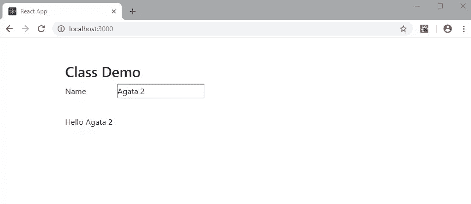
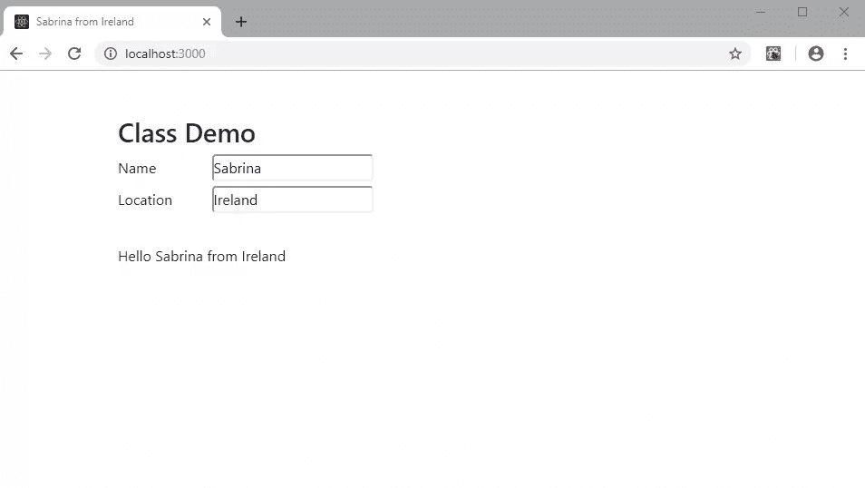
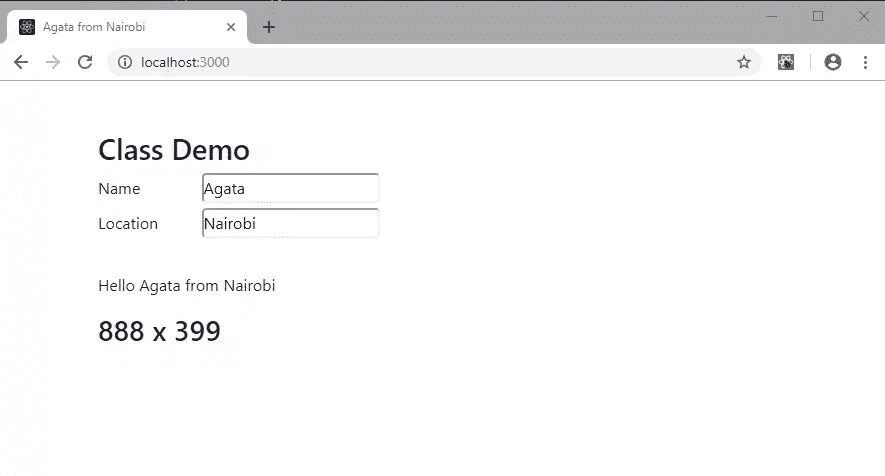
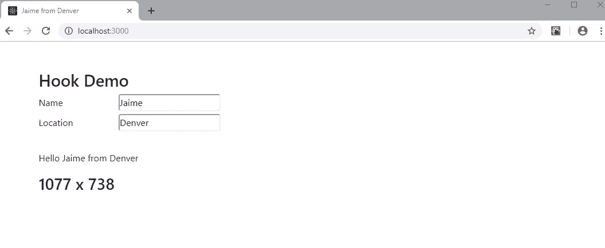

# React Hooks:如何开始创建自己的产品

> 原文：<https://www.sitepoint.com/react-hooks/>

胡克在整个反应世界掀起了一场风暴。在本教程中，我们将看看什么是钩子以及如何使用它们。我将向您介绍 React 附带的一些常见钩子，并向您展示如何编写自己的钩子。完成后，您将能够在自己的 React 项目中使用钩子。

## 什么是 React 钩子？

React 挂钩是特殊的函数，允许您“挂钩”函数组件中的 React 特性。例如，`useState`钩子允许你添加状态，而`useEffect`允许你执行副作用。以前，副作用是使用生命周期方法实现的。有了钩子，这就不再需要了。

这意味着在构造 React 组件时不再需要定义类。事实证明，React 中使用的类架构是 React 开发人员每天面临的大量挑战的原因。我们经常发现自己在编写难以分解的大型复杂组件。相关代码分散在几个生命周期方法中，这使得阅读、维护和测试变得棘手。此外，在访问`state`、`props`和方法时，我们必须处理`this`关键字。我们还必须将方法绑定到`this`以确保它们在组件中是可访问的。然后，在处理高阶组件时，我们会遇到过多的 prop drilling 问题，也称为包装器地狱。

简而言之，钩子是一个革命性的特性，它将简化你的代码，使之易于阅读、维护、测试和在你的项目中重用。你只需要一个小时就可以熟悉它们，但这会让你对编写 React 代码的方式有不同的想法。

React Hooks 在 2018 年 10 月举行的 React 大会上首次公布，并在 React 16.8 中正式提供。该功能仍在开发中；仍然有许多 React 类特性被移植到钩子中。好消息是你现在可以开始使用它们了。如果你想的话，你仍然可以使用 React 类组件，但是我怀疑你在阅读了这篇介绍性的指南之后会想这么做。

如果我激起了你的好奇心，让我们深入研究一下，看看一些实际的例子。

### 先决条件

本教程面向对 React 是什么以及它如何工作有基本了解的人。如果您是 React 初学者，请在继续之前查看我们的[React 入门教程](https://www.sitepoint.com/getting-started-react-beginners-guide/)。

如果您希望跟随示例，您应该已经设置了一个 React 应用程序。最简单的方法是使用 Create React App 工具。要使用它，您需要安装 Node 和 npm。如果您还没有，请访问 Node.js [下载页面](https://nodejs.org/en/download/)，获取您系统的最新版本(npm 与 Node 捆绑在一起)。或者，你可以参考我们关于使用版本管理器安装节点的[教程。](https://www.sitepoint.com/quick-tip-multiple-versions-node-nvm/)

安装 Node 后，您可以创建一个新的 React 应用程序，如下所示:

```
npx create-react-app myapp 
```

这将创建一个`myapp`文件夹。切换到这个文件夹并启动开发服务器，如下所示:

```
cd myapp
npm start 
```

您的默认浏览器将打开，您将看到新的 React 应用程序。出于本教程的目的，您可以在位于`src/App.js`的`App`组件中工作。

你也可以在 GitHub 上找到本教程的[代码，以及本教程最后的成品代码演示。](https://github.com/sitepoint-editors/react-hooks-demo)

## `useState`钩子

现在让我们看一些代码。 [useState 钩子](https://reactjs.org/docs/hooks-state.html)可能是 React 附带的最常见的钩子。顾名思义，它允许您在函数组件中使用`state`。

考虑下面的 React 类组件:

```
import React from "react";

export default class ClassDemo extends React.Component {
  constructor(props) {
    super(props);
    this.state = {
      name: "Agata"
    };
    this.handleNameChange = this.handleNameChange.bind(this);
  }

  handleNameChange(e) {
    this.setState({
      name: e.target.value
    });
  }

  render() {
    return (
      <section>
        <form autoComplete="off">
          <section>
            <label htmlFor="name">Name</label>
            <input
              type="text"
              name="name"
              id="name"
              value={this.state.name}
              onChange={this.handleNameChange}
            />
          </section>
        </form>
        <p>Hello {this.state.name}</p>
      </section>
    );
  }
} 
```

如果您正在使用 Create React App，只需用上面的内容替换`App.js`的内容。

看起来是这样的:



给自己一分钟理解代码。在构造函数中，我们在我们的`state`对象上声明了一个`name`属性，并将一个`handleNameChange`函数绑定到组件实例。然后我们有一个带有输入的表单，它的值被设置为`this.state.name`。保存在`this.state.name`中的值也以问候的形式输出到页面。

当用户在输入框中输入任何内容时，就会调用`handleNameChange`函数，更新`state`并随之更新问候语。

现在，我们将使用`useState`钩子编写这段代码的新版本。其语法如下所示:

```
const [state, setState] = useState(initialState); 
```

当您调用`useState`函数时，它返回两个项目:

*   **州**:您所在州的名称——如`this.state.name`或`this.state.location`。
*   **setState** :为你的状态设置新值的函数。类似于`this.setState({name: newValue})`。

`initialState`是您在状态声明阶段赋予新声明的状态的默认值。既然你对什么是`useState`有了概念，让我们把它付诸行动:

```
import React, { useState } from "react";

export default function HookDemo(props) {
  const [name, setName] = useState("Agata");

  function handleNameChange(e) {
    setName(e.target.value);
  }

  return (
    <section>
      <form autoComplete="off">
        <section>
          <label htmlFor="name">Name</label>
          <input
            type="text"
            name="name"
            id="name"
            value={name}
            onChange={handleNameChange}
          />
        </section>
      </form>
      <p>Hello {name}</p>
    </section>
  );
} 
```

请注意这个函数版本和类版本之间的差异。它已经比类版本更简洁、更容易理解，但它们做的是完全一样的事情。让我们来看看不同之处:

*   整个类构造函数已经被只包含一行代码的`useState`钩子所取代。
*   因为`useState`钩子输出局部变量，所以您不再需要使用`this`关键字来引用您的函数或状态变量。老实说，这对大多数 JavaScript 开发人员来说是一个很大的痛苦，因为并不总是清楚什么时候应该使用`this`。
*   JSX 代码现在更清晰了，因为你可以不用`this.state`来引用本地状态值。

希望你现在印象深刻！您可能想知道当您需要声明多个状态值时该怎么办。答案很简单:只需调用另一个`useState`钩子。只要不使组件过于复杂，您可以任意多次声明。

注意:当使用 React 钩子时，确保在组件的顶部声明它们，而不要在条件中声明。

### 多个`useState`挂钩

但是如果我们想在州内申报多处房产呢？没问题。只需多次调用`useState`。

下面是一个有多个`useState`钩子的组件的例子:

```
import React, { useState } from "react";

export default function HookDemo(props) {
  const [name, setName] = useState("Agata");
  const [location, setLocation] = useState("Nairobi");

  function handleNameChange(e) {
    setName(e.target.value);
  }

  function handleLocationChange(e) {
    setLocation(e.target.value);
  }

  return (
    <section>
      <form autoComplete="off">
        <section>
          <label htmlFor="name">Name</label>
          <input
            type="text"
            name="name"
            id="name"
            value={name}
            onChange={handleNameChange}
          />
        </section>
        <section>
          <label htmlFor="location">Location</label>
          <input
            type="text"
            name="location"
            id="location"
            value={location}
            onChange={handleLocationChange}
          />
        </section>
      </form>
      <p>
        Hello {name} from {location}
      </p>
    </section>
  );
} 
```

很简单，不是吗？在类版本中做同样的事情需要你更多地使用`this`关键字。

现在，让我们继续下一个基本的反应钩。

## `useEffect`挂钩

大多数 React 组件都需要执行特定的操作，比如获取数据、订阅数据流或手动更改 DOM。这种操作被称为副作用。

在基于类的组件中，我们通常将副作用代码放在`componentDidMount`和`componentDidUpdate`中。这些是生命周期方法，允许我们在适当的时候触发 render 方法。

这里有一个简单的例子:

```
componentDidMount() {
  document.title = this.state.name + " from " + this.state.location;
} 
```

这段代码将根据 state 中保存的内容设置文档标题。但是，当您尝试通过表单对状态值进行更改时，什么也没有发生。要解决这个问题，您需要添加另一个生命周期方法:

```
componentDidUpdate() {
  document.title = this.state.name + " from " + this.state.location;
} 
```

更新表单现在也应该更新文档标题。

让我们看看如何使用`useEffect`钩子实现相同的逻辑。按如下方式更新上述功能组件:

```
import React, { useState, useEffect } from "react";
//...

useEffect(() => {
  document.title = name + " from " + location;
}); 
```

仅用这几行代码，我们就在一个简单的函数中实现了两种生命周期方法的工作。



### 添加清除代码

这是一个简单的例子。但是，在某些情况下，您需要编写清理代码，例如取消订阅数据流或从事件侦听器中注销。让我们看一个在 React 类组件中如何实现的例子:

```
import React from "react";

export default class ClassDemo extends React.Component {
  constructor(props) {
    super(props);
    this.state = {
      resolution: {
        width: window.innerWidth,
        height: window.innerHeight
      }
    };

    this.handleResize = this.handleResize.bind(this);
  }

  componentDidMount() {
    window.addEventListener("resize", this.handleResize);
  }

  componentDidUpdate() {
    window.addEventListener("resize", this.handleResize);
  }

  componentWillUnmount() {
    window.removeEventListener('resize', this.handleResize);
  }

  handleResize() {
    this.setState({
      resolution: {
        width: window.innerWidth,
        height: window.innerHeight
      }
    });
  }

  render() {
    return (
      <section>
        <h3>
          {this.state.resolution.width} x {this.state.resolution.height}
        </h3>
      </section>
    )
  }
} 
```

上面的代码将显示你的浏览器窗口的当前分辨率。调整窗口大小，你应该会看到数字自动更新。如果你在 Chrome 中按下`F11`，它应该显示你的显示器的全分辨率。我们还使用了生命周期方法`componentWillUnmount`来注销`resize`事件。

让我们在钩子版本中复制上面的基于类的代码。我们需要定义第三个`useState`钩子和第二个`useEffect`钩子来处理这个新特性:

```
import React, { useState, useEffect } from "react";

export default function HookDemo(props) {
  ...
  const [resolution, setResolution] = useState({
    width: window.innerWidth,
    height: window.innerHeight
  });

  useEffect(() => {
    const handleResize = () => {
      setResolution({
        width: window.innerWidth,
        height: window.innerHeight
      });
    };
    window.addEventListener("resize", handleResize);

    // return clean-up function
    return () => {
      document.title = 'React Hooks Demo';
      window.removeEventListener("resize", handleResize);
    };
  });

  ...

  return (
    <section> ... <h3>  {resolution.width} x {resolution.height}  </h3>  </section>
  );
} 
```



令人惊讶的是，这个钩子版本的代码做了同样的事情。更干净，更紧凑。将代码放入自己的`useEffect`声明中的好处是[我们可以很容易地测试它](https://blog.logrocket.com/a-quick-guide-to-testing-react-hooks-fa584c415407/)，因为代码是独立的。

你注意到我们在这个`useEffect`钩子中返回一个函数了吗？这是因为您在`useEffect`函数中返回的任何函数都将被视为清理代码。如果你不返回一个函数，就不会进行清理。在这种情况下，需要进行清理，否则您会在浏览器控制台上看到一条错误消息，指出“无法对卸载的组件执行反应状态更新”。

## 自定义反应挂钩

现在你已经了解了`useState`和`useEffect`钩子，让我向你展示一个非常酷的方法，让你的代码比我们迄今为止所实现的更加紧凑、干净和可重用。我们将创建一个*定制钩子*来进一步简化我们的代码。

我们将通过提取`resize`功能并将其放在组件外部来实现这一点。

创建一个新函数，如下所示:

```
function useWindowResolution() {
  const [width, setWidth] = useState(window.innerWidth);
  const [height, setHeight] = useState(window.innerHeight);
  useEffect(() => {
    const handleResize = () => {
      setWidth(window.innerWidth);
      setHeight(window.innerHeight);
    };
    window.addEventListener("resize", handleResize);
    return () => {
      window.removeEventListener("resize ", handleResize);
    };
  }, [width, height]);
  return {
    width,
    height
  };
} 
```

接下来，在组件中，您需要替换以下代码:

```
const [resolution, setResolution] = useState({
  width: window.innerWidth,
  height: window.innerHeight
}); 
```

…有了这个:

```
const resolution = useWindowResolution(); 
```

删除第二个`useEffect`代码。保存文件并测试它。一切都应该和以前一样。

既然我们已经创建了第一个定制钩子，那么让我们对文档标题做同样的事情。首先，删除组件内部剩余的对`useEffect`的调用。然后，在组件外部，添加以下代码:

```
function useDocumentTitle(title) {
  useEffect(() => {
    document.title = title;
  });
} 
```

最后，从组件内部调用它:

```
useDocumentTitle(name + " from " + location); 
```

回到您的浏览器，在输入字段中输入一些内容。文档标题应该像以前一样更改。

最后，让我们重构表单字段。我们希望创建一个钩子来保持它们的值与 state 中相应的值同步。

让我们从自定义挂钩开始。在组件外部添加以下内容:

```
function useFormInput(initialValue) {
  const [value, setValue] = useState(initialValue);

  function handleChange(e) {
    setValue(e.target.value);
  }

  return {
    value,
    onChange: handleChange
  };
} 
```

然后更新组件以使用它:

```
export default function HookDemo(props) {
  const name = useFormInput("Agata");
  const location = useFormInput("Nairobi");
  const resolution = useWindowResolution();
  useDocumentTitle(name.value + " from " + location.value);

  return (
    <section>
      <form autoComplete="off">
        <section>
          <label htmlFor="name">Name</label>
          <input {...name} />
        </section>
        <section>
          <label htmlFor="location">Location</label>
          <input {...location} />
        </section>
      </form>
      <p>
        Hello {name.value} from {location.value}
      </p>
      <h3>
        {resolution.width} x {resolution.height}
      </h3>
    </section>
  );
} 
```

慢慢检查代码，找出我们所做的所有更改。很漂亮，对吧？我们的组件更加紧凑。

出于本教程的目的，我们已经在同一个文件中将钩子声明为函数，作为使用它们的组件。然而，在一个普通的 React 项目中，您会有一个`hooks`文件夹，其中每个钩子都在一个单独的文件中，然后可以将其导入到任何需要的地方。

我们甚至可以将`useFormInput`、`useDocumentTitle`和`useWindowResolution`钩子打包到一个外部 npm 模块中，因为它们完全独立于我们代码的主逻辑。我们可以很容易地在项目的其他部分，甚至是将来的其他项目中重用这些定制钩子。

作为参考，下面是完整的钩子组件版本:

```
import React, { useState, useEffect } from "react";

function useWindowResolution() {
  const [width, setWidth] = useState(window.innerWidth);
  const [height, setHeight] = useState(window.innerHeight);
  useEffect(() => {
    const handleResize = () => {
      setWidth(window.innerWidth);
      setHeight(window.innerHeight);
    };
    window.addEventListener("resize", handleResize);
    return () => {
      window.removeEventListener("resize ", handleResize);
    };
  }, [width, height]);
  return {
    width,
    height
  };
}

function useDocumentTitle(title){
  useEffect(() => {
    document.title = title;
  });
}

function useFormInput(initialValue) {
  const [value, setValue] = useState(initialValue);

  function handleChange(e) {
    setValue(e.target.value);
  }

  return {
    value,
    onChange: handleChange
  };
}

export default function HookDemo(props) {
  const name = useFormInput("Agata");
  const location = useFormInput("Nairobi");
  const resolution = useWindowResolution();
  useDocumentTitle(name.value + " from " + location.value);

  return (
    <section>
      <form autoComplete="off">
        <section>
          <label htmlFor="name">Name</label>
          <input {...name} />
        </section>
        <section>
          <label htmlFor="location">Location</label>
          <input {...location} />
        </section>
      </form>
      <p>
        Hello {name.value} from {location.value}
      </p>
      <h3>
        {resolution.width} x {resolution.height}
      </h3>
    </section>
  );
} 
```

钩子的组件应该像类组件版本一样呈现和表现:



如果将钩子版本与类组件版本进行比较，您会发现钩子特性至少减少了 30%的组件代码。您甚至可以通过将可重用的函数导出到 npm 库中来进一步减少代码。

接下来让我们看看如何在我们的代码中使用别人的钩子。

## 使用第三方钩子获取数据

让我们看一个例子，看看如何使用 Axios 和 React 钩子从 REST JSON API 获取数据。如果您在家学习，您需要安装 Axios 库:

```
npm i axios 
```

将您的组件更改为如下所示:

```
import React, { useState, useEffect } from 'react';
import axios from 'axios';

export default function UserList() {
  const [users, setUsers] = useState([]);

  useEffect(() => {
    const fetchData = async () => {
      const result = await axios('https://jsonplaceholder.typicode.com/users');
      setUsers(result.data);
    };
    fetchData();
  }, []);

  const userRows = users.map((user, index) => <li key={index}>{user.name}</li>);

  return (
    <div className="component">
      <h1>List of Users</h1>
      <ul>{userRows}</ul>
    </div>
  );
} 
```

我们应该期待以下输出:


可以通过构建自己的定制钩子来重构上面的代码，这样我们就不再需要使用`useState`和`useEffect`钩子。对我们来说幸运的是，许多开发人员已经完成了这个任务，并将他们的工作作为一个包发布，我们可以将它安装到我们的项目中。我们将使用由[西蒙·布索利](https://github.com/simoneb)设计的[轴钩](https://www.npmjs.com/package/axios-hooks)，这是最受欢迎的一款。

您可以使用以下命令安装该软件包:

```
npm i axios-hooks 
```

下面，我用`axios-hooks`重构了上面的代码:

```
import React from 'react';
import useAxios from 'axios-hooks';

export default function UserListAxiosHooks() {
  const [{ data, loading, error }, refetch] = useAxios(
    'https://jsonplaceholder.typicode.com/users'
  );

  if (loading) return <p>Loading...</p>;
  if (error) return <p>Error!</p>;

  const userRows = data.map((user, index) => <li key={index}>{user.name}</li>);

  return (
    <div className="component">
      <h1>List of Users</h1>
      <ul>{userRows}</ul>
      <button onClick={refetch}>Reload</button>
    </div>
  );
} 
```

我们不仅从代码中去掉了`useState`和`useEffect`挂钩，而且我们还获得了三种新的能力，而无需额外的脑力:

*   显示装载状态
*   显示错误消息
*   通过单击按钮来重新提取数据

这里的教训是避免重新发明轮子。谷歌是你的朋友。在 JavaScript 世界中，很有可能有人已经解决了您试图解决的问题。

## 演示

下面是我们迄今为止所取得成就的现场演示:

[https://codesandbox.io/embed/react-hooks-live-1pc06?fontsize=14&hidenavigation=1&theme=dark](https://codesandbox.io/embed/react-hooks-live-1pc06?fontsize=14&hidenavigation=1&theme=dark)

## 官方反应钩

这些是您在日常 React 项目中会遇到的基本 React 挂钩:

*   `useState`:用于管理本地状态
*   `useEffect`:取代生命周期功能
*   `useContext`:允许您轻松使用 React 上下文 API(解决道具钻探问题)

根据您的项目需求，我们还提供了您可能需要使用的其他官方 React 挂钩:

*   `useReducer`:管理复杂状态逻辑的高级版本`useState`。和 Redux 挺像的。
*   `useCallback`:返回一个函数，该函数返回一个可缓存的值。如果您希望在输入未更改时防止不必要的重新渲染，这对性能优化很有用。
*   `useMemo`:从一个[记忆的](https://en.wikipedia.org/wiki/Memoization)函数返回一个值。类似于`computed`如果你熟悉 Vue 的话。
*   `useRef`:返回一个可变的 ref 对象，该对象在组件的生存期内保持不变。
*   `useImperativeHandle`:定制使用`ref`时暴露给父组件的实例值。
*   `useLayoutEffect`:类似于`useEffect`，但是在所有 DOM 突变之后同步触发。
*   `useDebugValue`:显示 React 开发者工具中自定义钩子的标签。

你可以在官方 React 文档中阅读所有关于这些钩子的内容。

## 摘要

React 社区对新的 React Hooks 特性反应积极。已经有一个名为 [awesome-react-hooks](https://github.com/rehooks/awesome-react-hooks) 的开源库，数百个定制 React Hooks 已经提交到这个库中。这里有一个在本地存储中存储值的钩子的简单例子:

```
import useLocalStorage from "@rehooks/local-storage";

function MyComponent() {
  let name = useLocalStorage("name"); // send the key to be tracked.
  return (
    <div>
      <h1>{name}</h1>
    </div>
  );
} 
```

您需要像这样安装带有 npm 或纱线的`local-storage`挂钩来使用它:

```
npm i @rehooks/local-storage 
```

很漂亮，对吧？

React 钩子的引入引起了巨大的轰动。它的浪潮已经超越了 React 社区，进入了 JavaScript 世界。这是因为钩子是一个新概念，可以让整个 JavaScript 生态系统受益。事实上，Vue.js 团队最近发布了类似的东西，叫做 [Composition API](https://composition-api.vuejs.org/) 。

还有人说 React Hooks 和 Context API 会把 Redux 从状态管理的宝座上拉下来。显然，钩子使得编码变得更加简单，并且改变了我们编写新代码的方式。如果你和我一样，你可能有一种强烈的冲动去重写你所有的 React 组件类，并用功能组件钩子替换它们。

请注意，这并不是真正必要的:React 团队并不打算弃用 React 类组件。您还应该知道，并不是所有的 React 类生命周期方法都可以使用钩子。您可能需要更长时间地使用 React 组件类。

如果你对你的基本反应钩的新知识有足够的信心，我想留给你一个挑战。使用 React 钩子重构这个[倒数计时器类](https://github.com/sitepoint-editors/react-hooks-demo/blob/master/src/components/countdown-class.js),使它尽可能的简洁。

编码愉快，让我知道你进展如何！

## 分享这篇文章