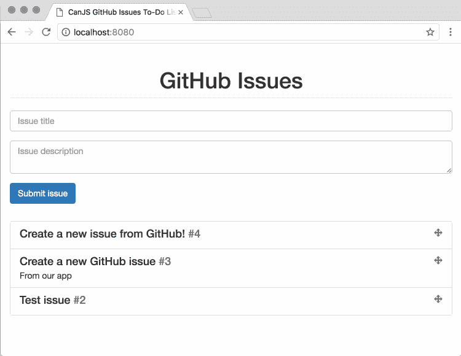
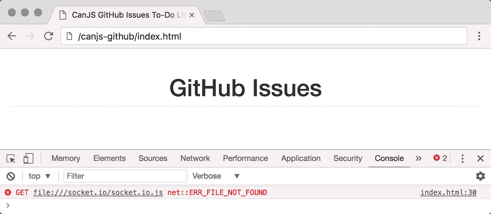
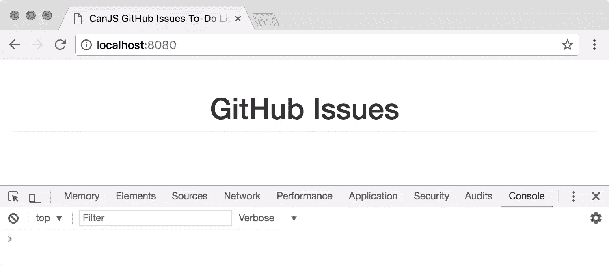
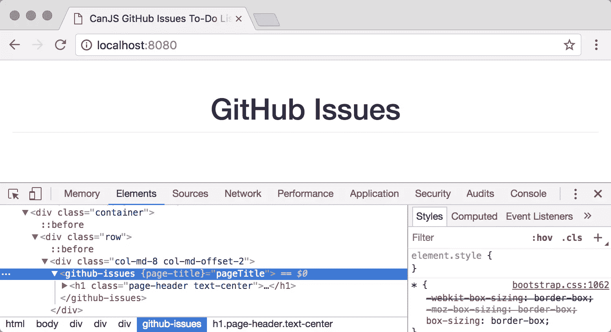
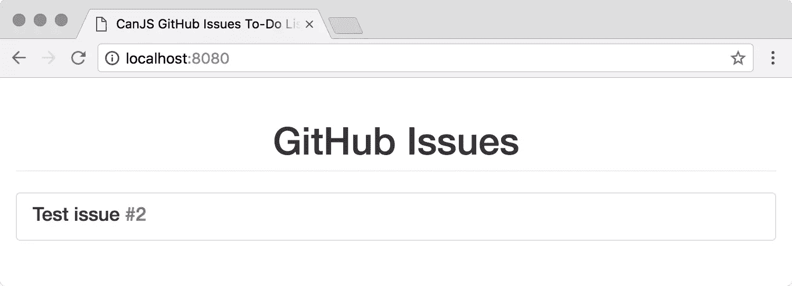
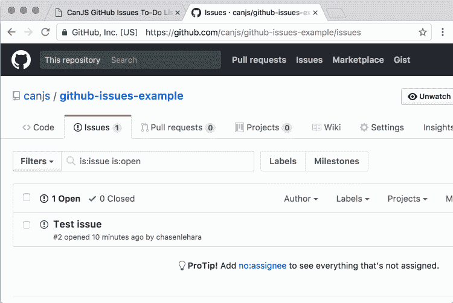
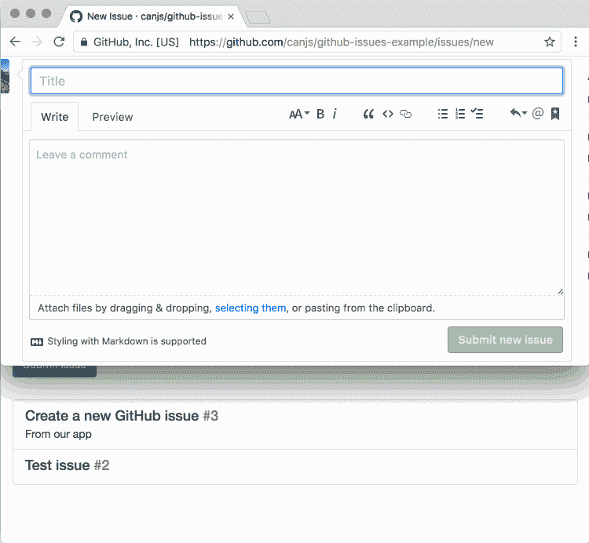
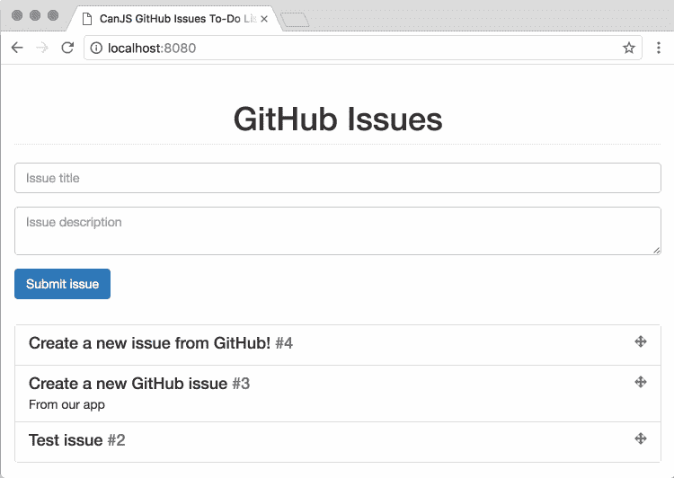

# 如何用 CanJS 构建实时 GitHub 问题待办列表

> 原文：<https://www.sitepoint.com/real-time-github-issue-list-canjs/>

CanJS 是一个前端库的集合，它使得构建复杂的、创新的、可长期维护的 web 应用变得更加容易。它被分解成几十个单独的包，所以你可以在你的应用程序中挑选你想要的，而不会被一个巨大的 100kb 以上的依赖所困扰。

CanJS 通过以下关键包推广 MVVM(模型-视图-视图模型)架构:

*   [自定义元素的 can 组件](https://canjs.com/doc/can-component.html)
*   [can-connect](https://canjs.com/doc/can-connect.html) 用于与 API 通信
*   [可以为可观察值定义](https://canjs.com/doc/can-define.html)
*   [用于车把状模板的 can-stache](https://canjs.com/doc/can-stache.html)

在本教程中，我们将制作一个待办事项应用程序，它使用 GitHub 存储库的问题列表作为其来源。多亏了 GitHub 的 Webhook API，我们的应用程序将会实时更新；多亏了 T2 的 jQuery UI 的可排序交互，我们将能够对问题进行重新排序。

你可以在 GitHub 上找到这个应用[的完整源代码。这是最终的应用程序的样子:](https://github.com/canjs/github-issues-example)



> 如果你有兴趣让你的 JavaScript 技能更上一层楼，注册 SitePoint Premium，看看我们的新书 [Modern JavaScript](https://www.sitepoint.com/premium/books/modern-javascript/?aref=njacques)

## 加拿大的 MVVM

在我们开始本教程的项目之前，让我们深入了解一下 MVVM 在 CanJS 应用程序中的含义。

### 数据模型

MVVM 的“模型”是指数据模型:应用程序中数据的表示。我们的应用程序处理单个问题和一系列问题，所以这些是我们模型中的数据类型。

在 CanJS 中，我们用 [can-define/list/list](https://canjs.com/doc/can-define/list/list.html) 和 [can-define/map/map](https://canjs.com/doc/can-define/map/map.html) 分别表示数组和对象。这些是可观察的数据类型，当它们改变时，将自动更新视图或视图模型(在 MVVM)。

例如，我们的应用程序将有这样一个`Issue`类型:

```
import DefineMap from 'can-define/map/map';
const Issue = DefineMap.extend('Issue', {
  id: 'number',
  title: 'string',
  sort_position: 'number',
  body: 'string'
}); 
```

每个`Issue`实例将有四个属性:`id`、`title`、`sort_position`和`body`。当设置了一个值时，`can-define/map/map`会将该值转换为上面指定的类型，除非该值是`null`或`undefined`。例如，将`id`设置为字符串`"1"`将赋予`id`属性数值`1`，而将其设置为`null`实际上将使其成为`null`。

我们将为一系列问题定义一种类型，如下所示:

```
import DefineList from 'can-define/list/list';
Issue.List = DefineList.extend('IssueList', {
  '#': Issue
}); 
```

一个`can-define/list/list`上的 [#](https://canjs.com/doc/can-define/list/list.prototype.wildcardItems.html) 属性将把列表中的任何一项转换成指定的类型，所以一个`Issue.List`中的任何一项都将是一个`Issue`实例。

### 查看模板

web 应用程序中的“视图”是用户与之交互的 HTML 用户界面。CanJS 可以用几种不同的模板语法来呈现 HTML，包括 [can-stache](https://canjs.com/doc/can-stache.html) ，类似于[小胡子](https://mustache.github.io)和[车把](http://handlebarsjs.com)。

下面是一个简单的`can-stache`模板示例:

```
<ol>
  {{#each issues}}
    <li>
      {{title}}
    </li>
  {{/each}}
</ol> 
```

在上面的例子中，我们使用 [{{#each}}](https://canjs.com/doc/can-stache.helpers.each.html) 遍历一个`issues`列表，然后用`{{title}}`显示每期的`title`。对`issues`列表或问题标题的任何更改都将导致 DOM 更新(例如，如果列表中添加了新问题，则`li`将被添加到 DOM)。

### 查看模型

MVVM 的 ViewModel 是模型和视图之间的粘合代码。任何不能包含在模型中但对视图来说是必要的逻辑都由视图模型提供。

在 CanJS 中，`can-stache`模板是用 ViewModel 呈现的。这里有一个非常简单的例子:

```
import stache from 'can-stache';
const renderer = stache('{{greeting}} world');
const viewModel = {greeting: 'Hello'};
const fragment = renderer(viewModel);
console.log(fragment.textContent);// Logs “Hello world” 
```

### 成分

将所有这些东西联系在一起的概念是组件(或定制元素)。组件有助于将功能组合在一起，并使东西在整个应用程序中可重用。

在 CanJS 中， [can 组件](https://canjs.com/doc/can-component.html)由一个视图(`can-stache`文件)、一个视图模型(`can-define/map/map`)和一个可以监听 JavaScript 事件的对象(可选)组成。

```
import Component from 'can-component';
import DefineMap from 'can-define/map/map';
import stache from 'can-stache';

const HelloWorldViewModel = DefineMap.extend('HelloWorldVM', {
  greeting: {value: 'Hello'},
  showExclamation: {value: true}
});

Component.extend({
  tag: 'hello-world',
  view: stache('{{greeting}} world{{#if showExclamation}}!{{/if}}'),
  ViewModel: HelloWorldViewModel,
  events: {
    '{element} click': () => {
      this.viewModel.showExclamation = !this.viewModel.showExclamation;
    }
  }
});

const template = stache('hello-world');
document.body.appendChild(template); 
```

在上面的例子中，我们的模板要么显示“Hello world！”或者只是“Hello world”(没有感叹号)，这取决于用户是否点击了我们的定制元素。

这四个概念就是你构建一个 CanJS app 需要知道的全部！我们的示例应用程序将使用这四个想法来构建一个成熟的 MVVM 应用程序。

## 本教程的先决条件

在开始之前，安装一个最新版本的 [Node.js](https://nodejs.org/) 。我们将使用 [npm](https://www.npmjs.com) 来安装一个后端服务器，它将处理与 GitHub 的 API 的通信。

此外，如果您还没有 GitHub 帐户，[注册一个](https://github.com/join)。如果你想通过在命令行中执行 GitHub 动作和 Git 命令来节省时间，你也可以[获得 GitHub CLI](https://www.sitepoint.com/github-cli-quickstart-guide/) 。

## 建立我们的本地项目

让我们首先为我们的项目创建一个新目录，然后切换到这个新目录:

```
mkdir canjs-github
cd canjs-github 
```

现在让我们创建项目所需的文件:

```
touch app.css app.js index.html 
```

我们将使用`app.css`作为样式，`app.js`作为 JavaScript，而`index.html`作为用户界面(UI)。

## CanJS Hello World

让我们开始编码吧！首先，我们将把它添加到我们的`index.html`文件中:

```
<!DOCTYPE html>
<html>
<head>
  <meta charset="utf-8">
  <title>CanJS GitHub Issues To-Do List</title>
  <link rel="stylesheet" href="https://maxcdn.bootstrapcdn.com/bootstrap/3.3.7/css/bootstrap.min.css">
  <link rel="stylesheet" href="app.css">
</head>
<body>

<script type="text/stache" id="app-template"> <div class="container">
    <div class="row">
      <div class="col-md-8 col-md-offset-2">
        <h1 class="page-header text-center">
          {{pageTitle}}
        </h1>
      </div>
    </div>
  </div> </script>

<script type="text/stache" id="github-issues-template">  </script>

<script src="https://unpkg.com/jquery@3/dist/jquery.min.js"></script>
<script src="https://code.jquery.com/ui/1.12.1/jquery-ui.js"></script>
<script src="https://unpkg.com/can@3/dist/global/can.all.js"></script>
<script src="/socket.io/socket.io.js"></script>
<script src="app.js"></script>
</body>
</html> 
```

这有一堆不同的部分，让我们来分解一下:

*   `head`中的两个`link`元素是我们项目的样式表。我们正在使用[引导](https://getbootstrap.com)的一些基本风格，我们将有一些定制在`app.css`
*   第一个`script`元素(带有`id="app-template"`)包含我们的应用程序的根模板
*   第二个`script`元素(带有`id="github-issues-template"`)将包含我们将在本教程稍后创建的`github-issues`组件的模板
*   页面末尾的`script`元素加载我们的依赖项:jQuery、jQuery UI、CanJS、Socket.io 和我们的应用程序代码

在我们的应用程序中，我们将使用 [jQuery UI](https://jqueryui.com) (它依赖于 [jQuery](https://jquery.com) )通过拖放对问题进行排序。我们已经包含了`can.all.js`，所以我们可以访问[每个 CanJS 模块](https://canjs.com/doc/api.html)；通常，您会希望使用像 StealJS 或 [webpack](https://www.sitepoint.com/beginners-guide-webpack-module-bundling/) 这样的[模块加载器，但这超出了本文的范围。我们将使用](https://stealjs.com) [Socket.io](https://socket.io) 从 GitHub 接收事件，以实时更新我们的应用程序。

接下来，让我们给我们的`app.css`文件添加一些样式:

```
form {
  margin: 1em 0 2em 0;
}

.list-group .drag-background {
  background-color: #dff0d8;
}

.text-overflow {
  overflow: hidden;
  text-overflow: ellipsis;
  white-space: nowrap;
} 
```

最后，让我们给我们的`app.js`文件添加一些代码:

```
var AppViewModel = can.DefineMap.extend('AppVM', {
  pageTitle: {
    type: "string",
    value: "GitHub Issues",
  }
});

var appVM = new AppViewModel();
var template = can.stache.from('app-template');
var appFragment = template(appVM);
document.body.appendChild(appFragment); 
```

让我们来分解一下 JavaScript:

*   `can.DefineMap`用于声明自定义的可观察对象类型
*   是可观察的对象类型，将作为我们应用程序的根视图模型
*   `pageTitle`是所有`AppViewModel`实例的属性，默认值为`GitHub Issues`
*   `appVM`是我们应用程序视图模型的新实例
*   `can.stache.from`将一个`script`标签的内容转换成一个呈现模板的函数
*   `appFragment`是具有`appVM`数据的渲染模板的文档片段
*   获取一个 DOM 节点并将其附加到 HTML 主体中

> **注意:**我们页面中的`can.all.js`脚本生成了一个`can`全局变量，我们可以用它来访问任何 CanJS 模块。例如，`can-stache`模块可用于我们的脚本`can.stache`。

如果你在浏览器中打开`index.html`，你会看到类似这样的内容:



控制台中有一个错误，因为我们还没有设置我们的实时 Socket.io 服务器。让我们接下来做那件事。

## 设置我们的服务器

GitHub 的 Webhooks API 可以在存储库中发生变化时发送服务器通知。我没有花时间编写服务器代码，而是制作了 [github-issue-server npm 模块](https://www.npmjs.com/package/github-issue-server)，它将:

*   设置一个 [ngrok](https://www.sitepoint.com/use-ngrok-test-local-site/) 服务器来接收 GitHub Webhook 事件
*   当我们在 UI 中出现问题时，向 GitHub API 发出经过验证的请求
*   使用 [Socket.io](https://socket.io) 与我们的 UI 进行实时通信
*   提供我们项目目录中的文件
*   为每个问题添加一个`sort_position`属性
*   将我们的问题列表及其`sort_position`保存到本地`issues.json`文件中

为了让服务器通过认证请求与 GitHub 通信，我们需要[创建一个个人访问令牌](https://help.github.com/articles/creating-a-personal-access-token-for-the-command-line/):

1.  前往[github.com/settings/tokens/new](https://github.com/settings/tokens/new)
2.  输入一个*令牌描述*(我把我的称为“CanJS GitHub 发布待办事项列表”)
3.  选择`public_repo`范围
4.  点击*生成令牌*
5.  在下一页上，单击令牌旁边的*复制令牌*剪贴板图标

现在我们可以安装服务器了。我们将使用 npm 来[创建 package.json](https://docs.npmjs.com/cli/init) 并安装`github-issue-server`:

```
npm init -y
npm install github-issue-server 
```

要启动我们的服务器，运行以下命令，用从 GitHub 复制的个人访问令牌替换 *ACCESS_TOKEN* :

```
node node_modules/github-issue-server/ ACCESS_TOKEN 
```

您的服务器将会启动并显示如下内容:

```
Started up server, available at:
  http://localhost:8080/
Started up ngrok server, webhook available at:
  https://829s1522.ngrok.io/api/webhook 
```

`ngrok`服务器地址将有一个不同的子域，这是您独有的。

现在，如果我们在浏览器中打开`localhost`或`ngrok.io`地址，我们将看到与之前相同的主页，只是这次我们的控制台中不会出现任何错误:



## 创建 GitHub 问题组件

在 CanJS 中，*组件*是一个定制元素，它有一个*视图*(一个 stache 模板)和一个*视图模型*(将您的数据模型连接到视图)。组件有助于将功能组合在一起，并使其在整个应用程序中可重用。

让我们创建一个`github-issues`组件，用于列出我们所有的 GitHub 问题并添加新问题！

首先，我们将把它添加到我们的`app.js`文件的顶部:

```
var GitHubIssuesVM = can.DefineMap.extend('GitHubIssuesVM', {
  pageTitle: 'string'
});

can.Component.extend({
  tag: 'github-issues',
  view: can.stache.from('github-issues-template'),
  ViewModel: GitHubIssuesVM
}); 
```

`GitHubIssuesVM`被定义为组件的视图模型。组件的每个实例都有自己的`pageTitle`属性，该属性将呈现在 HTML 视图中。

其次，让我们为`github-issues`元素定义模板:

```
<script type="text/stache" id="github-issues-template"> <h1 class="page-header text-center">
    {{pageTitle}}
  </h1> </script> 
```

注意`{{pageTitle}}`语法，它将视图模型中的`pageTitle`呈现给模板。

最后，让我们替换 HTML 中的标题:

```
<h1 class="page-header text-center">
  {{pageTitle}}
</h1> 
```

…借助我们新的定制元素:

```
<github-issues {page-title}="pageTitle" /> 
```

在上面的代码中，我们将应用程序的视图模型中的`pageTitle`属性传递给了`github-issues`组件。`{page-title}`语法是从父模板到子组件的[单向绑定](https://canjs.com/doc/can-stache-bindings.toChild.html)，这意味着父模板中的任何更改都将传播到子模板，但子模板中的任何更改都不会影响父模板。CanJS 支持单向和[双向](https://canjs.com/doc/can-stache-bindings.twoWay.html)数据绑定。稍后我们将查看双向数据绑定的示例。

我们的页面看起来应该和以前完全一样，除了现在它有这样的 HTML 结构:



## 设置 GitHub repo

我们的应用程序将在 GitHub repo(repo)中列出一个待办事项列表，因此我们需要为我们的应用程序配置一个 GitHub repo。

如果你已经有一个回购你想用，太好了！否则，[现在创建一个](https://github.com/new)。

现在我们有了一个回购，进入它的*设置*页面，点击 *Webhooks* ，然后点击*添加 webhook* 。通过身份验证后，您可以填写表单:

*   将`ngrok`服务器地址从您的本地服务器复制到*有效负载 URL* 字段(地址类似于`https://829s1522.ngrok.io/api/webhook`)
*   选择`application/json`作为*内容类型*
*   点击*让我选择单个事件*并选择*事件*复选框
*   gfgf
*   点击*添加 webhook* 按钮完成该过程

现在，每当您的 repo 中的问题列表发生变化时，您的本地服务器都会收到这些 Webhook 事件。让我们来测试一下！

在 GitHub repo 中创建一个问题，方法是转到 GitHub 中的 *Issues* 选项卡。如果您创建了一个名为“测试问题”的问题，您将在命令行界面中看到以下消息:

> 收到 GitHub 针对问题“测试问题”的“已打开”操作


## 列出 GitHub 的问题

现在，我们的 GitHub 存储库中出现了一些问题，让我们在 UI 中显示这些问题！

首先，我们将创建一个可观察的`Issue`类型，它将成为我们问题数据的模型。将此添加到您的`app.js`文件的顶部:

```
var Issue = can.DefineMap.extend('Issue', {
  seal: false
}, {
  id: 'number',
  title: 'string',
  sort_position: 'number',
  body: 'string'
}); 
```

每个`Issue`实例将有`id`、`title`、`sort_position`和`body`属性。因为 GitHub 问题有很多其他属性，不仅仅是我们在这里建模的属性，我们将设置 [seal](https://canjs.com/doc/can-define/map/map.seal.html) 到`false`，这样当其他属性通过 GitHub API 时就不会抛出错误。

其次，让我们为问题数组创建一个`can.DefineList`类型:

```
Issue.List = can.DefineList.extend('IssueList', {
  '#': Issue
}); 
```

第三，我们将配置一个 [can-set。代数](https://canjs.com/doc/can-set.Algebra.html)因此`can-connect`知道两个特殊属性:`id`是每个问题的唯一标识符，我们将使用`sort`和`Issue.getList`以特定顺序检索问题。

```
Issue.algebra = new can.set.Algebra(
  can.set.props.id('id'),
  can.set.props.sort('sort')
); 
```

最后，我们将把`Issue`和`Issue.List`类型连接到我们的服务器端点。确保用回购信息替换 *GITHUB_ORG/GITHUB_REPO* :

```
Issue.connection = can.connect.superMap({
  url: '/api/github/repos/GITHUB_ORG/GITHUB_REPO/issues',
  Map: Issue,
  List: Issue.List,
  name: 'issue',
  algebra: Issue.algebra
}); 
```

当我们调用 [can.connect.superMap](https://canjs.com/doc/can-connect/can/super-map/super-map.html) 时，一些 CRUD(创建、读取、更新和删除)方法被添加到我们的`Issue`对象中。这些方法中包含了 [getList](https://canjs.com/doc/can-connect/can/map/map.getList.html) ，可以调用它来获取该类型的所有实例的列表。

在我们的应用程序中，我们将使用`Issue.getList`从我们的服务器获取所有问题。让我们更新我们的`GitHubIssuesVM`来拥有一个`issuesPromise`属性:

```
var GitHubIssuesVM = can.DefineMap.extend('GitHubIssuesVM', {
  issuesPromise: {
    value: function() {
        return Issue.getList({
          sort: 'sort_position'
        });
    }
  },
  issues: {
    get: function(lastValue, setValue) {
      if (lastValue) {
        return lastValue;
      }
      this.issuesPromise.then(setValue);
    }
  },
  pageTitle: 'string'
}); 
```

`issuesPromise`属性是`Issue.getList`返回的[承诺](https://developer.mozilla.org/en-US/docs/Web/JavaScript/Reference/Global_Objects/Promise)；我们将`sort_position`指定为`sort`属性，这样列表就按照该属性排序。`issues`财产将是承诺解决后的价值。

现在让我们修改`index.html`中的`github-issues-template`:

```
 <div class="list-group">
    {{#if issuesPromise.isPending}}
      <div class="list-group-item list-group-item-info">
        <h4>Loading…</h4>
      </div>
    {{/if}}
    {{#if issuesPromise.isRejected}}
      <div class="list-group-item list-group-item-danger">
        <h4>Error</h4>
        <p>{{issuesPromise.reason}}</p>
      </div>
    {{/if}}
    {{#if issuesPromise.isResolved}}
      {{#if issues.length}}
        <ol class="list-unstyled">
          {{#each issues}}
            <li class="list-group-item">
              <h4 class="list-group-item-heading">
                {{title}} <span class="text-muted">#{{number}}</span>
              </h4>
              <p class="list-group-item-text text-overflow">
                {{body}}
              </p>
            </li>
          {{/each}}
        </ol>
      {{else}}
        <div class="list-group-item list-group-item-info">
            <h4>No issues</h4>
        </div>
      {{/if}}
    {{/if}}
  </div> 
```

在`can-stache`模板中，我们可以使用 [{{#if}}](https://canjs.com/doc/can-stache.helpers.if.html) 作为条件句，因此我们有三个主要模块来判断我们的问题列表[的承诺是否为未决](https://canjs.com/doc/can-connect/can/ref/ref.Map.Ref.prototype.isPending.html)、[被拒绝](https://canjs.com/doc/can-connect/can/ref/ref.Map.Ref.prototype.isRejected.html)或[被解决](https://canjs.com/doc/can-connect/can/ref/ref.Map.Ref.prototype.isResolved.html)。在`isResolved`的情况下，我们将使用 [{{#each}}](https://canjs.com/doc/can-stache.helpers.each.html) 遍历问题数组，或者显示一条没有问题的消息。

现在，当您重新加载您的页面时，您将看到相同的问题列表！



## 制造 GitHub 问题

让我们添加一个表单，用于创建一个带有标题和描述的新问题。然后，我们将通过 GitHub 的 API 创建一个新问题。

首先，让我们在`index.html`的`github-issues-template`模板的`h1`下添加一个表单:

```
 <form ($submit)="send()">
    <div class="form-group">
      <label for="title" class="sr-only">Issue title</label>
      <input class="form-control" id="title" placeholder="Issue title" type="text" {($value)}="title" />
    </div>
    <div class="form-group">
      <label for="body" class="sr-only">Issue description</label>
      <textarea class="form-control" id="body" placeholder="Issue description" {($value)}="body"></textarea>
    </div>
    <button class="btn btn-primary" type="submit">Submit issue</button>
  </form> 
```

上面的代码片段使用了一些我们没有谈到的 CanJS 特性:

*   `($submit)`是一个 [DOM 事件监听器](https://canjs.com/doc/can-stache-bindings.event.html#DOMevents)，每当提交表单时，它将调用我们的视图模型中的`send()`函数
*   `{($value)}="title"`和`{($value)}="body"`都是[双向绑定值](https://canjs.com/doc/can-stache-bindings.twoWay.html):当`input`的`value`改变时，视图模型会更新，反之亦然

其次，让我们更新`app.js`中的`GitHubIssuesVM`,使其具有三个新属性:

```
var GitHubIssuesVM = can.DefineMap.extend('GitHubIssuesVM', {
  issuesPromise: {
    value: function() {
        return Issue.getList({
          sort: 'sort_position'
        });
    }
  },
  issues: {
    get: function(lastValue, setValue) {
      if (lastValue) {
        return lastValue;
      }
      this.issuesPromise.then(setValue);
    }
  },
  pageTitle: 'string',
  title: 'string',
  body: 'string',
  send: function() {
    var firstIssue = (this.issues) ? this.issues[0] : null;
    var sortPosition = (firstIssue) ? (Number.MIN_SAFE_INTEGER + firstIssue.sort_position) / 2 : 0;

    new Issue({
        title: this.title,
        body: this.body,
        sort_position: sortPosition
    }).save().then(function() {
        this.title = this.body = '';
    }.bind(this));
  }
}); 
```

除了新问题的`body`和`title`属性，我们还添加了一个创建新问题的`send()`方法。它接受`issues`列表，这样它就可以为新问题计算一个`sort_position`:我们希望它在第一个问题之前。一旦我们有了新问题的所有值，我们调用`new Issue()`来创建它，调用`.save()`将它发布到我们的服务器，然后等待承诺解决；如果成功，我们重置`title`和`body`，这样表单就被清除了！

最后，让我们更新`app.js`中的`github-issues`组件，使其拥有一个新的`events`对象:

```
can.Component.extend({
  tag: 'github-issues',
  view: can.stache.from('github-issues-template'),
  ViewModel: GitHubIssuesVM,
  events: {
    '{element} form submit': function(element, event) {
      event.preventDefault();
    }
  }
}); 
```

`can-component`的[事件](https://canjs.com/doc/can-component.prototype.events.html)属性用于监听表单的[提交事件](https://developer.mozilla.org/en-US/docs/Web/Events/submit)被触发。我们不希望页面在用户提交表单时被重新加载，所以我们调用 [preventDefault()](https://developer.mozilla.org/en-US/docs/Web/API/Event/preventDefault) 来取消默认的表单提交行为。

现在我们可以添加一个问题，并看到它出现在 GitHub UI 中！更重要的是，这个问题出现在我们问题列表的底部，多亏了集合代数，这真是太棒了！



## 添加实时更新

我们的应用程序可以向 GitHub 发送新问题，但 GitHub 的更改不会更新我们的应用程序。让我们用 [Socket 添加一些实时更新。IO](https://socket.io) ！

在`app.js`中，让我们在设置`Issue.connection`的位置后添加以下代码:

```
var socket = io();
socket.on('issue created', function(issue) {
  Issue.connection.createInstance(issue);
});
socket.on('issue removed', function(issue) {
  Issue.connection.destroyInstance(issue);
});
socket.on('issue updated', function(issue) {
  Issue.connection.updateInstance(issue);
}); 
```

当创建、删除或更新问题时，我们的本地服务器会发出三种不同的事件。我们的事件监听器然后调用 [createInstance](https://canjs.com/doc/can-connect/real-time/real-time.createInstance.html) 、 [destroyInstance](https://canjs.com/doc/can-connect/real-time/real-time.destroyInstance.html) 或 [updateInstance](https://canjs.com/doc/can-connect/real-time/real-time.updateInstance.html) 来修改`Issue`数据模型。因为`Issue`的每个实例都是可观察的*和* `Issue.List`是可观察的，CanJS 将自动更新我们应用程序中引用`Issue`模型中任何内容的任何部分！

当我们重新加载页面并通过 GitHub 的 UI 进行更改时，我们将在我们的 UI 中看到相同的更改！



## 重新排序问题

现在让我们添加一些拖放功能来组织我们的问题！我们的本地服务器设置为每当我们的问题列表的顺序改变时，将一个`issues.json`文件保存到我们的项目目录中，因此我们需要做的就是更新我们的应用程序，以获得一些对问题重新排序的控件和一些为它们分配新的`sort_position`的逻辑。

插座后。我们在上一节中添加的 IO 代码，让我们添加以下内容:

```
can.view.callbacks.attr('sortable-issues', function(element) {
  $(element).sortable({
    containment: 'parent',
    handle: '.grab-handle',
    revert: true,
    start: function(event, ui) {
      var draggedElement = ui.item;
      draggedElement.addClass('drag-background');
    },
    stop: function(event, ui) {
      var draggedElement = ui.item;
      draggedElement.removeClass('drag-background');
    },
    update: function(event, ui) {
      var draggedElement = ui.item[0];
      var draggedIssue = can.data.get.call(draggedElement, 'issue');
      var nextSibling = draggedElement.nextElementSibling;
      var previousSibling = draggedElement.previousElementSibling;
      var nextIssue = (nextSibling) ? can.data.get.call(nextSibling, 'issue') : {sort_position: Number.MAX_SAFE_INTEGER};
      var previousIssue = (previousSibling) ? can.data.get.call(previousSibling, 'issue') : {sort_position: Number.MIN_SAFE_INTEGER};
      draggedIssue.sort_position = (nextIssue.sort_position + previousIssue.sort_position) / 2;
      draggedIssue.save();
    }
  });
}); 
```

咻！让我们来分解一下:

*   [can.view.callbacks](https://canjs.com/doc/can-view-callbacks.html) 用于每当一个新的[属性](https://canjs.com/doc/can-view-callbacks.attr.html)或[元素](https://canjs.com/doc/can-view-callbacks.tag.html)被添加到 DOM 时注册一个回调。在我们的代码中，每当`sortable-issues`属性被添加到一个元素时，我们的函数都会被调用。
*   我们使用 [jQuery UI 的可排序交互](https://jqueryui.com/sortable/)来处理 DOM 元素的拖放。我们已经为它配置了[遏制](http://api.jqueryui.com/sortable/#option-containment)、[手柄](http://api.jqueryui.com/sortable/#option-handle)和[回复](http://api.jqueryui.com/sortable/#option-revert)选项。
*   每当用户开始拖动某个问题时，就会触发 [start](http://api.jqueryui.com/sortable/#event-start) 函数，这将向 DOM 元素添加一个类。
*   每当用户放弃一个问题，就会触发[停止](http://api.jqueryui.com/sortable/#event-stop)功能，这将删除我们在`start`中添加的类。
*   [一旦排序完全停止并且 DOM 被更新，就会调用更新](http://api.jqueryui.com/sortable/#event-update)。我们的函数获取被拖动的问题的`Issue`模型数据，以及紧随其后的问题的模型数据，因此它可以重新计算两个问题之间的`sort_position`。在我们分配了`sort_position`属性之后，我们调用 [save()](https://canjs.com/doc/can-connect/can/map/map.prototype.save.html) 将更新的问题数据放到我们的本地服务器上。

现在让我们更新`index.html`中问题的`<ol>`:

```
 <ol class="list-unstyled" sortable-issues>
          {{#each issues}}
            <li class="list-group-item" {{data('issue', this)}}>
              {{^is issues.length 1}}
                <span class="glyphicon glyphicon-move grab-handle pull-right text-muted" aria-hidden="true"></span>
              {{/is}}
              <h4 class="list-group-item-heading">
                {{title}} <span class="text-muted">#{{number}}</span>
              </h4>
              <p class="list-group-item-text text-overflow">
                {{body}}
              </p>
            </li>
          {{/each}}
        </ol> 
```

我们添加了一些新内容:

*   一旦列表在 DOM 中，`sortable-issues`属性将导致我们在`app.js`中定义的回调被调用。
*   `{{data('issue', this)}}`将问题数据附加到 DOM 元素，这样我们就可以在我们的`sortable-issues`回调中得到它。
*   如果列表中有多个问题，则`{{^is issues.length 1}}`部分将添加一个抓取柄来移动问题。

现在，当我们重新加载页面时，我们将看到每个问题的抓取柄，我们可以选择它们来重新排序问题！



## 进一步阅读

我们已经成功地用 CanJS 为 GitHub 问题建立了一个实时待办事项列表！如果我激起了你学习更多关于 CanJS 的兴趣，看看下面关于[CanJS.com](https://canjs.com)的一些指南:

*   [实时聊天](https://canjs.com/doc/guides/chat.html)
*   [TodoMVC](https://canjs.com/doc/guides/todomvc.html)
*   [天气预报](https://canjs.com/doc/guides/recipes/weather-report-simple.html)

感谢您花时间阅读本教程。如果您需要任何帮助，请不要害怕在 Gitter 、 [CanJS 论坛](http://forums.donejs.com/c/canjs)、[tweet in me](https://twitter.com/chasenlehara)上[提问，或者在下面留下评论！](https://gitter.im/canjs/canjs)

*这篇文章由 [Camilo Reyes](https://www.sitepoint.com/author/creyes/) 同行评审。感谢 SitePoint 的所有同行评审员使 SitePoint 的内容尽可能做到最好！*

## 分享这篇文章