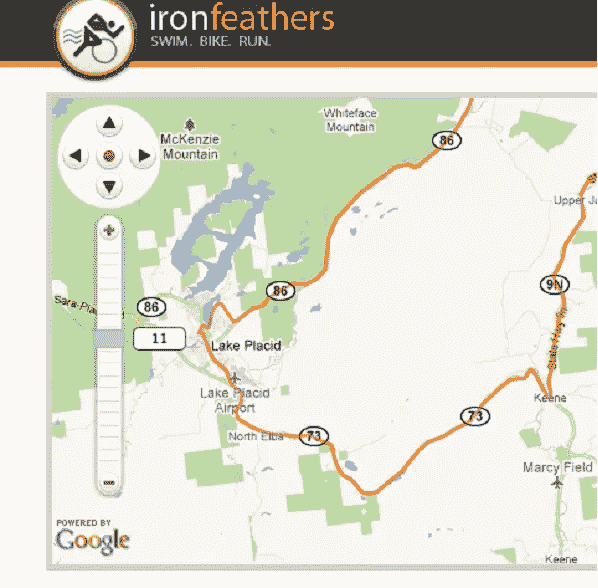
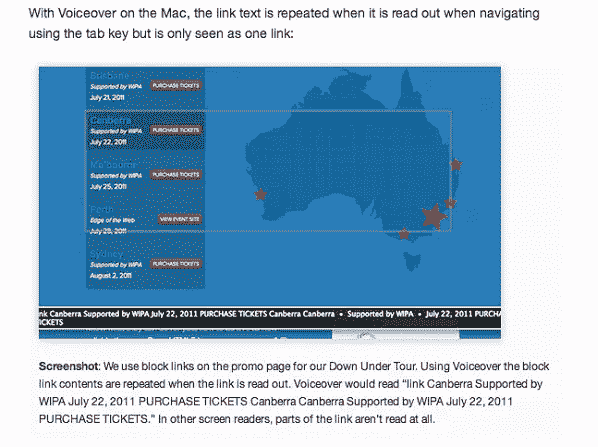

# 真实世界的可访问性:HTML5、ARIA 和现代网络

> 原文：<https://www.sitepoint.com/real-world-accessibility-html5-aria-and-the-modern-web/>

网页设计者和开发者需要一些技术，这些技术既能在当下发挥作用，又能着眼于未来。为了做到这一点，在过去七年里，我教授的每一个研讨会都有一个重点:让开发人员和设计人员获得创建可访问网站和应用程序的最佳现实解决方案。

我说的真实世界是什么意思？很简单:可访问性不会也不应该存在于真空中。现实世界很乱。它不是非黑即白，而是介于两者之间的灰色阴影。这适用于可达性，但也适用于我们的工艺。我们必须做出妥协。我们必须做出选择。我们必须中途改变策略。我们必须在昨天完成。

这就是我们关注真实世界可访问性的原因。您需要知道现在什么是有效的，以便在实施现代 web 技术时能够做出明智的决策。在过去的两年里，我们一直专注于 HTML5、CSS3 和 ARIA 的[真实世界可访问性——这个月我们将在澳大利亚举办这个研讨会。](http://furtherahead.com/tour-down-under-2011/)

为了准备 2011 年的[@羽毛之旅(我是推特上的](http://furtherahead.com/tour-down-under-2011/)[@羽毛](http://twitter.com/feather)),我们精心制作了一个页面，突出了你将会得到的内容和细节。这不是我们建立的第一个 HTML5 网站/页面，但是我们想做一些独特的设计，是可访问的，并给我们一个机会来测试一些用于 web 设计和开发的现代技术。

每次我们用 HTML5 构建一些东西，我们都有机会仔细看看它现在的可访问性如何，我们可以一瞥新技术将会带来什么样的可访问性。

### HTML5 语义

在很大程度上，我是 HTML5 带给我们的新语义的粉丝。它为我们打开了新的大门——世界各地的作者都很高兴使用 HTML5 中引入的语义合理的元素。

每个人都知道可访问性的基础是语义，对吗？没错。

那么，当您将一种语义相当丰富的语言(如 HTML5)与浏览器和辅助技术(甚至在考虑 HTML5 的语义之前编写的)结合起来时，会发生什么呢？

*没事*。这就是问题所在。

HTML5 的语义给我们带来的优势并没有给可访问性带来应有的好处。(要跟踪哪些 HTML5 元素被浏览器完全公开并传递到不同操作系统的可访问性 API，请务必查看 HTML5accessibility.com 的。)

可访问性在 HTML5 中继续发展。W3C 有一个团队致力于 HTML5 的可访问性。在 HTML5 的可访问性继续发展的同时，我将尽最大努力确保我们为可访问性所做的不仅仅是关于什么在未来会起作用，而且是关于什么在“此时此地”会起作用为什么？因为我们已经在浏览器**中“支持”HTML5 了**。这意味着人们将会使用它**现在**。这意味着现在需要访问它**。**

 **以下是撰写本文时 HTML5 可访问性的真实情况:

1.  我们现在可以在我们的网站和应用程序中使用新元素(文章、章节、旁白、页眉、页脚、导航等等)。
2.  我们可以通过使用 HTML5 shiv 来欺骗不能理解这些元素的浏览器。是的，它使用 JavaScript，不，这不是不使用它的理由。是的，您需要考虑“JavaScript 关闭”的情况，但是我们将在后面详细讨论这个问题。
3.  我们必须知道，HTML5 的语义现在还没有被现有的辅助技术表达或解释。没关系——支持将会到来，但这需要一些时间。
4.  当我们等待 HTML5 等新兴技术的支持时，我们需要找到现在有效的解决方案。

### 网站内容可访问性指南

我很高兴我们已经从 WCAG 1.0 向前迈进了，但我错过了它的一个标志:临时解决方案指南。告诉我们:

> “使用临时解决方案。
> 
> 使用临时辅助功能解决方案，以便辅助技术和旧浏览器能够正常运行。"

让我们明确一点:我不喜欢 WCAG 1.0 中提倡的具体的临时解决方案。这些检查点都是关于“直到用户代理”允许 X 或者有做 Y 的功能，使用这些技术。用户代理现在做这些事情，所以我们不需要担心他们与 WCAG 2.0。它们太不重要了，我甚至不想在这里提到它们。

但是使用临时解决方案背后的*想法*完全是为了认识到某些技术可能在旧的辅助技术或浏览器中得不到完全支持，我们**必须**考虑这些情况。

而现在 HTML5 就是这种情况。

那么，我们可以在 HTML5 中使用哪些“临时解决方案”来帮助辅助技术理解语义呢？

### 使用 WAI-ARIA

ARIA([Accessible Rich Internet Applications](https://www.w3.org/WAI/intro/aria))是一种技术，用于帮助以编程方式更清楚地指定用户界面组件(或“小部件”)是什么 web，以便辅助技术可以为其用户提供更多意义。

它通常被称为“桥梁技术”，因为它帮助我们弥合过去、现在和未来之间的差距。简而言之，如果我们现有的遗留 web 应用程序使用较旧的标记和编码实践，我们可以通过将 ARIA 属性应用于标记来使其更易于访问，而无需用更现代的语言重写整个应用程序。

以下是艾瑞亚的帮助。

考虑一下谷歌地图的实现:[http://examples.furtherahead.com/aria/slider/index-3.html](http://examples.furtherahead.com/aria/slider/index-3.html)



请注意，我们在地图上使用了一组自定义的控件，这些控件允许出色的键盘可访问性。我们还实现了一个定制的滑块控件来代替标准的 Google Maps 控件。

我们在 HTML 中没有原生的 slider 元素(至少目前没有)，所以我们用 HTML、CSS 和 JavaScript 构建了 slider，使其接近 slider 控件的视觉外观和功能。问题是，当我们这样做时，我们实际上是在创建一个复杂的用户界面组件，它由语义上无意义的 div、跨度、图像、链接和按钮组成。

1.  对于任何复杂的用户界面组件，我们需要知道三条基本信息:
2.  这是什么东西？(其作用)
3.  它有什么一般特征？(其属性)
4.  你现在能告诉我些什么？(其状态)

整体大于部分之和；综合起来，这些 div，跨度，图像和链接创造了更多的东西(一个滑块)。ARIA 让我们精确地指定整体的含义，以便辅助技术可以更好地理解整体，而不是将其分解并试图理解其单个组件。

传统上，我们可能会像这样使用标记:

```
<a href="#"

      id="handle_zoomSlider">

<span>11</span>

</a>
```

这个链接给了我们一个可聚焦的控件，我们可以用它来控制滑块的“拇指”沿着导轨滑动。链接文本告诉我们当前的缩放级别(11)，它也显示在屏幕上。我们将为“轨道”使用前景或背景图像，使它看起来像一个滑块，然后我们将应用适当的 JavaScript 来允许我们用鼠标和键盘操纵拇指。

对于辅助技术来说，这只是一个包含一些文本的链接。没有迹象表明这个链接是关于什么的或者它有什么作用。

我们怎样才能做得更好？我们添加了一些 ARIA 属性:

```
<a href="#"

      id="handle_zoomSlider"

      role="slider"

      aria-orientation="vertical"

      aria-valuemin="0"

      aria-valuemax="17"

      aria-valuetext="14"

      aria-valuenow="14" >

<span>11</span>

</a>
```

标记相当简单。我们做了几件事:

1.  指示组件的角色(`role="slider"`)，
2.  使用`aria-orientation="vertical"`指定其在页面中垂直定向，
3.  向那个滑块添加了几个属性(`aria-valuemin="0"`、`aria-valuemax="17"`、`aria-valuetext="14"`和`aria-valuenow="14"`)。

当我们使用 JavaScript 改变滑块在导轨上的位置时，我们也改变了`aria-valuenow`和`aria-valuetext`的值以匹配缩放级别。ARIA 属性得到了更新，如果我们使用了正确的辅助技术，我们就可以获得适当的通知或与该接口组件的交互。例如，屏幕阅读器用户将听到用户界面组件是滑块，并且他们将听到随着值响应于沿导轨移动拇指而改变而读出的值。

这就是 ARIA 给我们的:为复杂的用户界面组件提供更好的编程可访问性的能力。还有更多的细节，但这只是简单的咏叹调。

现在，然后…我告诉你*那个*告诉你*这个*。

### ARIA 和 HTML5

还记得我们讨论过临时解决方案的想法吗？这就是 ARIA 和 HTML5 结合的地方。

ARIA 在辅助技术方面有不错的支持。它并不完美，但屏幕阅读器和放大镜以及其他技术对 ARIA 的支持要比它们对 HTML5 的支持强得多。为什么？很简单，尽管 ARIA 仍然是“新的”，但它比 HTML5 要老。辅助技术供应商已经实现了对 ARIA 某些部分的支持，并且这种支持还在继续增长。

由于这种级别的支持，我们可以添加 ARIA 来为我们提供 HTML5 应该提供的一些语义，但在辅助技术中还不支持或不公开。

我们使用 ARIA 在我们构建的站点中补充 HTML5 的语义。我们在 2010 年 10 月重新推出了以可访问性为中心的网站[simple Accessible](http://simplyaccessible.com/),并定义了许多 ARIA 里程碑式的角色，这些角色有助于在还不能通过 HTML5 传递的地方赋予意义。

我们将`role=”main”`添加到页面的主要内容中，该内容也用 HTML5 的`<article>`元素标记。我们在侧边栏的相关内容的`<aside>`元素上使用了`role=”complementary”`。我们在页面顶部和底部的`<nav>`元素上使用了`role=”navigation”`。

看到它是如何工作的吗？我们仍然使用 HTML5 的元素，但是我们用 ARIA 来支持那些还没有“得到”HTML5 的辅助技术和浏览器组合。

我们按照这个顺序考虑事情:

1.  我们可以编写的解决问题的最具语义的 HTML5 是什么？
2.  对于不懂 HTML5 的技术，如何用 ARIA 传达尽可能接近相同的意思？
3.  对于既不理解 HTML5 也不理解 ARIA 的技术，我们怎样才能表达出接近相同的意思呢？

让我们用最后一个例子来总结一下。

### 网页中的数字

在最近的一篇文章[Accessibility and html 5 Block Links](http://simplyaccessible.com/article/html5-block-links/)中，我谈到了 block link 结构与屏幕阅读技术产生的一些问题。在那篇文章中，我使用了一个 HTML5 figure 元素来表达图像和它下面标题之间的关系:



```
<figure>


<figcaption id="figcaption1">

<strong>Screenshot</strong>: We use block links on the promo page...
In other screen readers, parts of the link aren’t read at all.

</figcaption>

</figure>
```

这种结构在以前不存在的地方创造了一种明确的关系。父`<figure>`元素包含一个`<figcaption>`元素和一个兄弟``元素。这个 HTML5 结构形式化了人们多年来一直在做的事情——在页面中放置一个图像，并在图像之后的标记中包含一段文本。

对于一个不理解 HTML5 的浏览器和辅助技术组合来说，这是如何工作的？一个不理解元素的浏览器会跳过这个元素。因此，当我们没有完整的 HTML5 支持时，我们会退回到邻近性关联:图像和段落在源代码中是兄弟姐妹，因此它们必须相关。

然而，我们能为理解 ARIA，但不理解`<figure>`和`<figcaption>`的辅助技术做些什么呢？我们可以通过添加`aria-describedby`属性来创建一个编程关联:

```
<figure>


<figcaption id="figcaption1">

      <strong>Screenshot</strong>: We use block links on the promo page...
      In other screen readers, parts of the link aren’t read at all.

</figcaption>

</figure>
```

现在有了一个更强的关联，而不仅仅是通过添加 ARIA 创建的两个内容的接近度。属性的值做了您认为它应该做的事情:它包含页面中描述内容的节点的值。``的详细描述由具有相应`id`的节点提供，在本例中是`<figcaption>`。

如果我们没有 HTML5 或 ARIA 支持怎么办？我们退回到古老的通过邻近联系的方法:图像和描述在代码中紧挨着。

这就是真实世界的可及性。现在有效，将来也会更有效。

研究这种场景是了解真实世界可访问性的一种实用方法，这正是我们在全天研讨会中探索的场景——以你能想象到的动手操作的方式。如果你在澳大利亚，你可以今天就[注册，否则请留意我们何时在你所在的地区。](http://furtherahead.com/tour-down-under-2011)

同时，让我知道你对这一切的想法。** 

## **分享这篇文章**