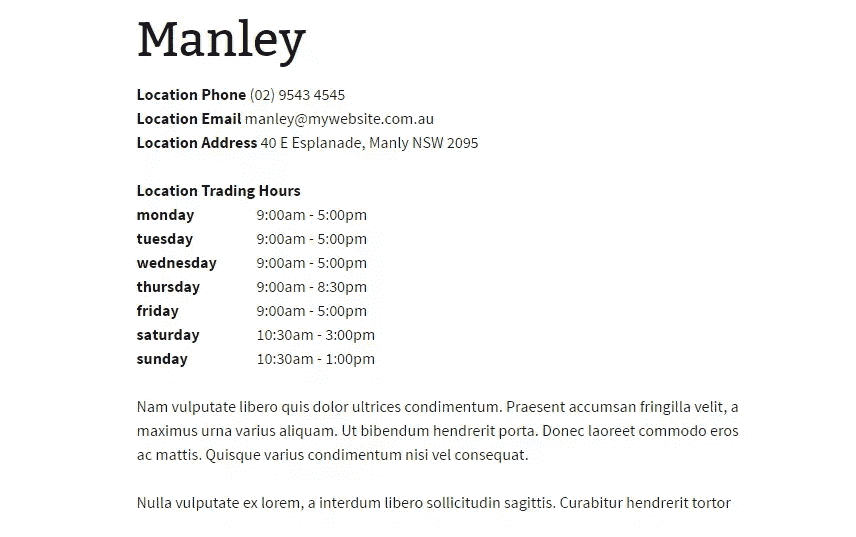
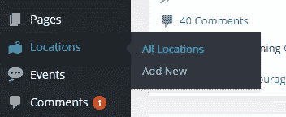
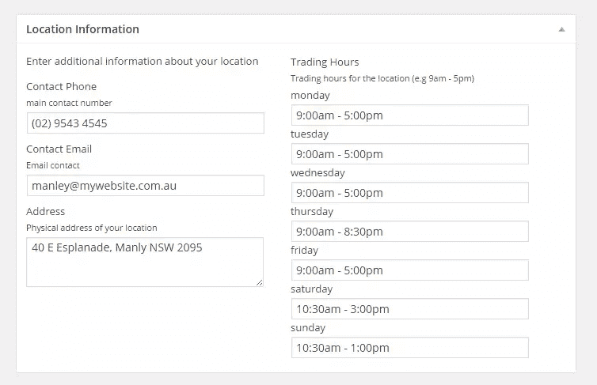
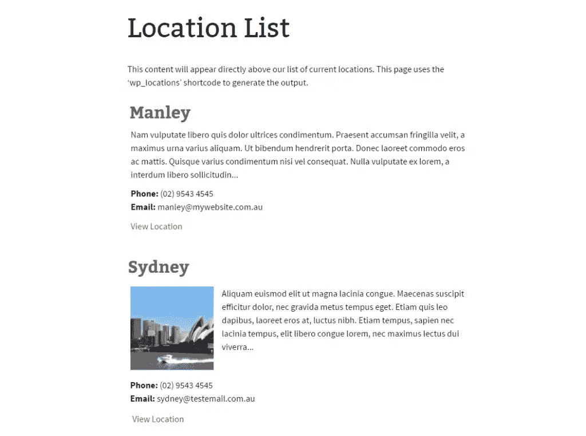

# WordPress 插件开发的真实例子

> 原文：<https://www.sitepoint.com/real-world-example-wordpress-plugin-development/>

为了充分利用本教程，您应该对诸如`actions`、`filters`、`shortcodes`、`widgets`和`object orientated design`等主题有基本的了解。

如果你对基础知识感兴趣，你可以阅读我之前的文章[WordPress 插件开发介绍](https://www.sitepoint.com/an-introduction-to-wordpress-plugin-development/)。这将有助于你对我们将在本教程中用到的概念和思想建立牢固的理解。


## 真实世界示例-商业地点列表

让我们直接进入一个真实世界的例子，看看插件是如何被用来解决问题和为你的网站增加功能的。

通常，企业希望展示他们拥有的各种位置或办公室。虽然可以将这些位置创建为页面，但是最好将它们创建为与它们的唯一信息相匹配的内容类型，并为用户提供一个简单的界面来显示这些位置。

虽然我们可以将这个功能构建到我们的子主题中，但它足够通用，我们可以将其构建为一个插件，使其在其他网站中的实现变得简单和容易。

我们的例子将涵盖处理和输出位置的插件的开发。这些位置将是自定义内容类型，具有用于存储位置特定数据的附加元信息。该插件还将演示输出信息的各种方式(例如个人位置页面、位置列表小部件和位置列表短代码)



### 设置好一切

让我们设置好一切，跳转到你的插件目录，创建下面的文件夹/文件结构

*   wp _ 简单 _ 位置 _ 插件
    *   钢性铸铁
        *   wp_location_public_styles.css
        *   wp _ location _ admin _ styles.css
    *   股份有限公司
        *   wp_location_widget.php
        *   wp_location_shortcode.php
    *   wp_simple_location_plugin.php

顶层文件`wp_simple_location_plugin.php`将成为我们的主文件。在这里，我们将从 CSS 目录中加载样式，并从 includes 目录中加载额外的 PHP 文件。

## 主要位置类别

在`wp_simple_location_plugin.php`文件中，我们将定义插件的核心功能。我们还将包括小部件和短代码功能所需的附加文件。

### 不能直接进入

一个建议是通过检查是否定义了`ABSPATH`变量来阻止对 PHP 文件的直接访问(如果定义了，我们就终止执行)。在开始的 PHP 标记后直接添加以下代码:

```
defined( 'ABSPATH' ) or die( 'Nope, not accessing this' ); 
```

### 插件声明

为了让我们的插件工作，需要定义一个插件声明。插件声明是 WordPress 将寻找的一组注释，包含关于你的插件的信息。这必须包括在内，否则你的插件不会出现在 WP 插件管理器中。

```
<?php
/*
Plugin Name: WordPress Simple Location Plugin
Plugin URI:  https://github.com/simonrcodrington/Introduction-to-WordPress-Plugins---Location-Plugin
Description: Creates an interfaces to manage store / business locations on your website. Useful for showing location based information quickly. Includes both a widget and shortcode for ease of use.
Version:     1.0.0
Author:      Simon Codrington
Author URI:  http://www.simoncodrington.com.au
License:     GPL2
License URI: https://www.gnu.org/licenses/gpl-2.0.html
*/ 
```

您可以在这里定义您的插件名称、描述、版本和其他信息。当用户激活插件时，大部分内容会显示在插件管理页面上。

#### wp _ 简单 _ 位置类

我们现在创建`wp_simple_location`类的外壳。这个类将包含这个插件的大部分功能，并将用于保存我们的属性和方法。

```
class wp_simple_location{

} 
```

### 包括短代码和小部件文件

因为我们将同时使用一个小部件和一个短代码，所以每一个的功能都被分割到它自己的文件中。

转到`wp_simple_location`类的末尾，添加以下内容:

```
//include shortcodes
include(plugin_dir_path(__FILE__) . 'inc/wp_location_shortcode.php');
//include widgets
include(plugin_dir_path(__FILE__) . 'inc/wp_location_widget.php'); 
```

这将加载我们的两个文件，我们稍后会看到。

### 类别属性

类属性是可以从类中的函数访问的变量。

声明属性使得访问常用元素变得更加容易。

我们在这个函数中只有一个性质；将用于该位置交易时间的一组日期。让我们将值定义为一个空数组，因为稍后我们将用我们的值填充它。

```
//properties
private $wp_location_trading_hour_days = array(); 
```

### _ 构造函数

`_construct`函数是插件的重要部分，因为它充当主函数，让我们处理和执行其他函数。

这个函数是一个`magic`函数；魔法函数是 PHP5 中添加的特殊函数，在特定条件下会自动触发。这个函数在我们的类被实例化(类被创建并赋给一个变量)时被触发。

在一个插件中，你将使用这个函数来添加你所有的动作、过滤器和函数调用。你可以在课堂外添加这些钩子，但是把它们放在这里也没关系。

复制下面的代码。我们将一次讨论一个元素，这样您就可以看到发生了什么。

```
//magic function (triggered on initialization)
public function __construct(){

    add_action('init', array($this,'set_location_trading_hour_days')); //sets the default trading hour days (used by the content type)
    add_action('init', array($this,'register_location_content_type')); //register location content type
    add_action('add_meta_boxes', array($this,'add_location_meta_boxes')); //add meta boxes
    add_action('save_post_wp_locations', array($this,'save_location')); //save location
    add_action('admin_enqueue_scripts', array($this,'enqueue_admin_scripts_and_styles')); //admin scripts and styles
    add_action('wp_enqueue_scripts', array($this,'enqueue_public_scripts_and_styles')); //public scripts and styles
    add_filter('the_content', array($this,'prepend_location_meta_to_content')); //gets our meta data and dispayed it before the content

    register_activation_hook(__FILE__, array($this,'plugin_activate')); //activate hook
    register_deactivation_hook(__FILE__, array($this,'plugin_deactivate')); //deactivate hook

} 
```

`register_activation_hook`和`register_deactivation_hook`函数用于在插件被激活或停用时挂钩函数。我们使用这些挂钩来确保我们的内容类型(我们的位置)被正确添加，并刷新我们的永久链接(这样我们就可以使用漂亮的永久链接)

### 设置位置交易时间天数

我们的插件允许管理员在单个位置的基础上定义不同天的开放和关闭时间。

您输入这些详细信息的后端管理员会查看我们的属性`$wp_location_trading_hour_days`,其中包含我们的一系列日子。我们需要调用`set_location_trading_hour_days`函数来设置我们想要显示位置交易时间的日期。

```
//set the default trading hour days (used in our admin backend)
public function set_location_trading_hour_days(){

    //set the default days to use for the trading hours
    $this->wp_location_trading_hour_days = apply_filters('wp_location_trading_hours_days', 
        array('monday' => 'Monday',
              'tuesday' => 'Tuesday',
              'wednesday' => 'Wednesday',
              'thursday' => 'Thursday',
              'friday' => 'Friday',
              'saturday' => 'Saturday',
              'sunday' => 'Sunday',
        )
    );      
} 
```

当给数组赋值时，我们也称之为`wp_location_trading_hours_days`过滤器。这意味着一个主题或另一个插件可以重新定义位置营业的日期(他们可能会过滤数组并将“假日”添加到数组中，以便他们可以输入当天的交易时间值)。

### 设置位置交易时间天数

在这里，我们定义了将在插件中使用的新的自定义位置内容类型。

我们为内容类型定义标签和参数，并将我们的参数传递给 [`register_post_type`](https://codex.wordpress.org/Function_Reference/register_post_type) 函数。

自定义内容类型的 codex 页面解释了您可以指定的所有选项。对于我们的内容类型，我们需要对标题、编辑器和特色图片的基本支持。

```
//register the location content type
public function register_location_content_type(){
     //Labels for post type
     $labels = array(
           'name'               => 'Location',
           'singular_name'      => 'Location',
           'menu_name'          => 'Locations',
           'name_admin_bar'     => 'Location',
           'add_new'            => 'Add New', 
           'add_new_item'       => 'Add New Location',
           'new_item'           => 'New Location', 
           'edit_item'          => 'Edit Location',
           'view_item'          => 'View Location',
           'all_items'          => 'All Locations',
           'search_items'       => 'Search Locations',
           'parent_item_colon'  => 'Parent Location:', 
           'not_found'          => 'No Locations found.', 
           'not_found_in_trash' => 'No Locations found in Trash.',
       );
       //arguments for post type
       $args = array(
           'labels'            => $labels,
           'public'            => true,
           'publicly_queryable'=> true,
           'show_ui'           => true,
           'show_in_nav'       => true,
           'query_var'         => true,
           'hierarchical'      => false,
           'supports'          => array('title','thumbnail','editor'),
           'has_archive'       => true,
           'menu_position'     => 20,
           'show_in_admin_bar' => true,
           'menu_icon'         => 'dashicons-location-alt',
           'rewrite'            => array('slug' => 'locations', 'with_front' => 'true')
       );
       //register post type
       register_post_type('wp_locations', $args);
} 
```

当你这样做的时候，你应该会看到你的文章类型的新菜单



### 向位置内容类型添加元框

我们定义了一个自定义元框，将显示在我们的位置页面。该框将包含我们希望保存为元数据的所有附加字段(如电话号码、电子邮件、地址)。

在我们的函数内部，我们调用 [`add_meta_box()`](https://codex.wordpress.org/Function_Reference/add_meta_box) 函数并提供我们的参数。

```
//adding meta boxes for the location content type*/
public function add_location_meta_boxes(){

    add_meta_box(
        'wp_location_meta_box', //id
        'Location Information', //name
        array($this,'location_meta_box_display'), //display function
        'wp_locations', //post type
        'normal', //location
        'default' //priority
    );
} 
```

我们给`add_meta_box`的第三个值是显示盒子输出的函数。我们正在调用`location_meta_box_display`函数，这是我们将添加到类中的下一个函数

### 位置元框显示

这是将从我们的位置元框调用的功能，它显示管理员可以用来保存他们的位置信息的附加字段。

```
//display function used for our custom location meta box*/
public function location_meta_box_display($post){

    //set nonce field
    wp_nonce_field('wp_location_nonce', 'wp_location_nonce_field');

    //collect variables
    $wp_location_phone = get_post_meta($post->ID,'wp_location_phone',true);
    $wp_location_email = get_post_meta($post->ID,'wp_location_email',true);
    $wp_location_address = get_post_meta($post->ID,'wp_location_address',true);

    ?>
    <p>Enter additional information about your location </p>
    <div class="field-container">
        <?php 
        //before main form elementst hook
        do_action('wp_location_admin_form_start'); 
        ?>
        <div class="field">
            <label for="wp_location_phone">Contact Phone</label>
            <small>main contact number</small>
            <input type="tel" name="wp_location_phone" id="wp_location_phone" value="<?php echo $wp_location_phone;?>"/>
        </div>
        <div class="field">
            <label for="wp_location_email">Contact Email</label>
            <small>Email contact</small>
            <input type="email" name="wp_location_email" id="wp_location_email" value="<?php echo $wp_location_email;?>"/>
        </div>
        <div class="field">
            <label for="wp_location_address">Address</label>
            <small>Physical address of your location</small>
            <textarea name="wp_location_address" id="wp_location_address"><?php echo $wp_location_address;?></textarea>
        </div>
        <?php
        //trading hours
        if(!empty($this->wp_location_trading_hour_days)){
            echo '<div class="field">';
                echo '<label>Trading Hours </label>';
                echo '<small> Trading hours for the location (e.g 9am - 5pm) </small>';
                //go through all of our registered trading hour days
                foreach($this->wp_location_trading_hour_days as $day_key => $day_value){
                    //collect trading hour meta data
                    $wp_location_trading_hour_value =  get_post_meta($post->ID,'wp_location_trading_hours_' . $day_key, true);
                    //dsiplay label and input
                    echo '<label for="wp_location_trading_hours_' . $day_key . '">' . $day_key . '</label>';
                    echo '<input type="text" name="wp_location_trading_hours_' . $day_key . '" id="wp_location_trading_hours_' . $day_key . '" value="' . $wp_location_trading_hour_value . '"/>';
                }
            echo '</div>';
        }       
        ?>
    <?php 
    //after main form elementst hook
    do_action('wp_location_admin_form_end'); 
    ?>
    </div>
    <?php

} 
```

让我们来看看这个函数是做什么的

*   首先，它为元框创建一个安全的随机数字段([随机数用于验证提交动作来自正确的位置](https://codex.wordpress.org/Function_Reference/wp_nonce_field))。
*   它收集我们的电话，电子邮件和地址元信息(如果我们有的话)。
*   就在表单开始之前，我们添加了`wp_location_admin_form_start`动作钩子。这将让其他插件或主题挂钩到这个位置，允许显示额外的字段或信息。
*   显示电话、电子邮件和地址字段(如果我们有任何以前的值，则预先填充它们)。
*   显示该地点的交易时间列表。在这里，管理员可以定义每天的交易时间。这些日子可以是动态的，因为它们被附加到`wp_location_trading_hours_days`过滤器上。
*   就在表单结束之前，我们添加了`wp_location_admin_form_end`动作钩子。这将让其他插件或主题挂钩到这个位置，允许显示额外的字段或信息。

你应该看到你的元框显示在你的位置。它应该看起来像这样



### 注册内容类型并在激活时刷新重写规则

当一个插件第一次激活时，你可以调用一个函数来执行一次性动作。这就是我们对`plugin_activate`函数所做的。

即使我们通过`init`钩子注册了我们的内容类型，我们仍然需要从它内部调用`register_location_content_type`(以确保我们的内容类型被正确添加)

我们还刷新了重写规则，这样我们就可以为我们的位置使用漂亮的永久链接(我们可以使用像`example.com/location/mylocation`这样的链接来代替`example.com/?p=144`

```
//triggered on activation of the plugin (called only once)
public function plugin_activate(){  
    //call our custom content type function
    $this->register_location_content_type();
    //flush permalinks
    flush_rewrite_rules();
} 
```

### 停用时刷新重写规则

当我们停用插件时，插件停用被触发。因为我们正在删除插件，并且插件定义了一个自定义内容类型，所以我们想利用这个机会刷新我们的重写规则以保持一致性。

```
//trigered on deactivation of the plugin (called only once)
public function plugin_deactivate(){
    //flush permalinks
    flush_rewrite_rules();
} 
```

### 在单个位置显示我们的位置元信息

因为我们为每个位置定义了额外的元信息，所以我们创建了一个函数，在查看单个位置页面时处理这些额外信息的显示。

`prepend_location_meta_to_content`函数与`the_content`过滤器挂钩，这意味着我们可以在页面主要内容之前添加我们的附加信息。

```
public function prepend_location_meta_to_content($content){

    global $post, $post_type;

    //display meta only on our locations (and if its a single location)
    if($post_type == 'wp_locations' && is_singular('wp_locations')){

        //collect variables
        $wp_location_id = $post->ID;
        $wp_location_phone = get_post_meta($post->ID,'wp_location_phone',true);
        $wp_location_email = get_post_meta($post->ID,'wp_location_email',true);
        $wp_location_address = get_post_meta($post->ID,'wp_location_address',true);

        //display
        $html = '';

        $html .= '<section class="meta-data">';

        //hook for outputting additional meta data (at the start of the form)
        do_action('wp_location_meta_data_output_start',$wp_location_id);

        $html .= '<p>';
        //phone
        if(!empty($wp_location_phone)){
            $html .= '<b>Location Phone</b> ' . $wp_location_phone . '</br>';
        }
        //email
        if(!empty($wp_location_email)){
            $html .= '<b>Location Email</b> ' . $wp_location_email . '</br>';
        }
        //address
        if(!empty($wp_location_address)){
            $html .= '<b>Location Address</b> ' . $wp_location_address . '</br>';
        }
        $html .= '</p>';

        //location
        if(!empty($this->wp_location_trading_hour_days)){
            $html .= '<p>';
            $html .= '<b>Location Trading Hours </b></br>';
            foreach($this->wp_location_trading_hour_days as $day_key => $day_value){
                $trading_hours = get_post_meta($post->ID, 'wp_location_trading_hours_' . $day_key , true);
                $html .= '<span class="day">' . $day_key . '</span><span class="hours">' . $trading_hours . '</span></br>';
            }
            $html .= '</p>';
        }

        //hook for outputting additional meta data (at the end of the form)
        do_action('wp_location_meta_data_output_end',$wp_location_id);

        $html .= '</section>';
        $html .= $content;

        return $html;  

    }else{
        return $content;
    }

} 
```

让我们来看看这个函数是做什么的:

*   由于该函数被添加到了`the_content`钩子中，所以它将在每次加载页面时运行。因此，我们使用全局`$post`和`$post_type`变量来确保我们只在一个位置页面上
*   我们收集我们的基本位置信息，如电子邮件、电话和地址。
*   就在我们将要显示我们的元信息时，我们称之为`wp_location_meta_data_output_start`动作钩子。这个动作将让其他插件或主题挂钩到元信息的开始输出(如果有人在这个位置添加了一个新字段，这个挂钩可以用来显示保存的信息)。
*   我们输出电子邮件、电话和地址信息。
*   我们检查我们的`wp_location_trading_hour_days`变量，看看我们是否定义了日期。如果我们这样做了，我们循环通过所有这些，收集其交易时间，并显示它们。
*   就在我们完成所有输出之前，我们称之为`wp_location_meta_data_output_end`动作。此操作将允许某人在关闭位置元之前输出附加信息。

### 把位置列表拿出来

我们创建一个函数，其目的是为我们的位置列表构建 HTML。

`get_locations_output`函数由位置短码和位置小部件生成标记。

因为它有多种用途，所以这个函数有几个重要的作用。我会一步一步地把它们分解。

```
//main function for displaying locations (used for our shortcodes and widgets)
public function get_locations_output($arguments = ""){

    //default args
    $default_args = array(
        'location_id'   => '',
        'number_of_locations'   => -1
    );

    //update default args if we passed in new args
    if(!empty($arguments) && is_array($arguments)){
        //go through each supplied argument
        foreach($arguments as $arg_key => $arg_val){
            //if this argument exists in our default argument, update its value
            if(array_key_exists($arg_key, $default_args)){
                $default_args[$arg_key] = $arg_val;
            }
        }
    }

    //find locations
    $location_args = array(
        'post_type'     => 'wp_locations',
        'posts_per_page'=> $default_args['number_of_locations'],
        'post_status'   => 'publish'
    );
    //if we passed in a single location to display
    if(!empty($default_args['location_id'])){
        $location_args['include'] = $default_args['location_id'];
    }

    //output
    $html = '';
    $locations = get_posts($location_args);
    //if we have locations 
    if($locations){
        $html .= '<article class="location_list cf">';
        //foreach location
        foreach($locations as $location){
            $html .= '<section class="location">';
                //collect location data
                $wp_location_id = $location->ID;
                $wp_location_title = get_the_title($wp_location_id);
                $wp_location_thumbnail = get_the_post_thumbnail($wp_location_id,'thumbnail');
                $wp_location_content = apply_filters('the_content', $location->post_content);
                if(!empty($wp_location_content)){
                    $wp_location_content = strip_shortcodes(wp_trim_words($wp_location_content, 40, '...'));
                }
                $wp_location_permalink = get_permalink($wp_location_id);
                $wp_location_phone = get_post_meta($wp_location_id,'wp_location_phone',true);
                $wp_location_email = get_post_meta($wp_location_id,'wp_location_email',true);

                //apply the filter before our main content starts 
                //(lets third parties hook into the HTML output to output data)
                $html = apply_filters('wp_location_before_main_content', $html);

                //title
                $html .= '<h2 class="title">';
                    $html .= '<a href="' . $wp_location_permalink . '" title="view location">';
                        $html .= $wp_location_title;
                    $html .= '</a>';
                $html .= '</h2>';

                //image & content
                if(!empty($wp_location_thumbnail) || !empty($wp_location_content)){

                    $html .= '<p class="image_content">';
                    if(!empty($wp_location_thumbnail)){
                        $html .= $wp_location_thumbnail;
                    }
                    if(!empty($wp_location_content)){
                        $html .=  $wp_location_content;
                    }

                    $html .= '</p>';
                }

                //phone & email output
                if(!empty($wp_location_phone) || !empty($wp_location_email)){
                    $html .= '<p class="phone_email">';
                    if(!empty($wp_location_phone)){
                        $html .= '<b>Phone: </b>' . $wp_location_phone . '</br>';
                    }
                    if(!empty($wp_location_email)){
                        $html .= '<b>Email: </b>' . $wp_location_email;
                    }
                    $html .= '</p>';
                }

                //apply the filter after the main content, before it ends 
                //(lets third parties hook into the HTML output to output data)
                $html = apply_filters('wp_location_after_main_content', $html);

                //readmore
                $html .= '<a class="link" href="' . $wp_location_permalink . '" title="view location">View Location</a>';
            $html .= '</section>';
        }
        $html .= '</article>';
        $html .= '<div class="cf"></div>';
    }

    return $html;
} 
```

*   首先，这个函数有一个可选的参数叫做`arguments`。这是因为 shortcode 和 widget 都将选项传递给显示器(以准确定制将返回的内容)。
*   该函数在`$default_args`数组中定义了一组默认参数。这基本上会将位置的数量设置为-1(所有位置)，并将位置 ID 设置为空(这意味着我们希望显示一个位置列表，而不只是默认的一个位置)。
*   我们检查传递的`$arguments`变量是否不为空并且也是一个数组(意味着我们传递了一个参数数组)。我们遍历`$arguments`数组中的所有元素，并检查是否有任何数组键与我们的`$default_args`数组中的任何元素相匹配。如果有匹配的，我们更新`$default_args`数组。
*   我们使用`$default_args`数组来构建对`get_posts()`的搜索，这将找到我们所有的位置(如果我们指定了一个位置，我们将只搜索它)
*   现在我们开始构建我们的 HTML 输出。我们定义了我们的`$html`变量，并开始构建我们的输出。
*   我们收集关于位置的所有信息(标题、内容、图像、链接等)，并准备好输出。
*   在我们继续收集我们的输出之前，我们对我们的`$html`变量进行`wp_location_before_main_content`过滤。这将允许第三方在位置标题前添加额外的内容。这很有用，就好像我们在 admin 中定义了任何额外的字段，我们可以用它来输出它们。
*   标题、图像、内容、电话和电子邮件被添加到我们的输出中(有条件地检查它们是否存在)。
*   在我们将要输出 read more 按钮之前，我们称之为第二个过滤器，即`wp_location_after_main_content`过滤器。这将允许第三方在按钮前添加内容。
*   我们将 read more 按钮添加到输出中，然后返回我们的`$html`变量。

### 保存位置的附加元信息

当我们保存单个位置时，我们希望运行一个功能来收集和更新我们的附加元信息(如电子邮件、电话、地址等)。

为此，我们使用了`save_location`函数。

```
//triggered when adding or editing a location
public function save_location($post_id){

    //check for nonce
    if(!isset($_POST['wp_location_nonce_field'])){
        return $post_id;
    }   
    //verify nonce
    if(!wp_verify_nonce($_POST['wp_location_nonce_field'], 'wp_location_nonce')){
        return $post_id;
    }
    //check for autosave
    if(defined('DOING_AUTOSAVE') && DOING_AUTOSAVE){
        return $post_id;
    }

    //get our phone, email and address fields
    $wp_location_phone = isset($_POST['wp_location_phone']) ? sanitize_text_field($_POST['wp_location_phone']) : '';
    $wp_location_email = isset($_POST['wp_location_email']) ? sanitize_text_field($_POST['wp_location_email']) : '';
    $wp_location_address = isset($_POST['wp_location_address']) ? sanitize_text_field($_POST['wp_location_address']) : '';

    //update phone, memil and address fields
    update_post_meta($post_id, 'wp_location_phone', $wp_location_phone);
    update_post_meta($post_id, 'wp_location_email', $wp_location_email);
    update_post_meta($post_id, 'wp_location_address', $wp_location_address);

    //search for our trading hour data and update
    foreach($_POST as $key => $value){
        //if we found our trading hour data, update it
        if(preg_match('/^wp_location_trading_hours_/', $key)){
            update_post_meta($post_id, $key, $value);
        }
    }

    //location save hook 
    //used so you can hook here and save additional post fields added via 'wp_location_meta_data_output_end' or 'wp_location_meta_data_output_end'
    do_action('wp_location_admin_save',$post_id, $_POST);

} 
```

让我们分析一下我们正在做的事情:

*   我们首先检查我们的 nonce，并验证它是否存在(从元盒中传递)。我们还检查以确保我们没有自动保存。一旦我们确定一切正常，我们就继续前进。
*   我们收集电话、电子邮件和地址信息，并使用 [`sanitize_text_field()`](https://codex.wordpress.org/Function_Reference/sanitize_text_field) 功能对其进行净化。它们被赋给变量，然后用我们的 [`update_post_meta()`](https://codex.wordpress.org/Function_Reference/update_post_meta) 函数将它们保存到这个位置。
*   因为我们的交易时间是动态的，我们必须以不同的方式收集和保存它们。因为我们不知道有多少将会存在，我们不能按名称从`$_POST`数组中提取它们。因此，我们遍历所有的`$_POST`变量，并检查是否有任何变量以`wp_location_trading_hours_`开头。如果有，我们会更新它们的值，并将它们保存为元信息。
*   最后，在我们结束之前，我们调用`wp_location_admin_save`动作。该操作将把该位置的当前 id 作为`$post_id`，并让第三方功能从全局`$_POST`收集附加信息，并将它们保存到该位置。

### 加载我们的管理和公共脚本和样式

我们需要为我们网站的前端和后端加载额外的 CSS 文件。我们创建了两个函数来加载我们需要的任何脚本或样式。

在这些 CSS 文件中，有元框中管理字段的基本样式，也有少量的前端样式。

这个插件在没有任何 CSS 的情况下也能很好地工作，所以如果你不感兴趣的话，可以安全地忽略这些。(如果不想添加这些，也要记得从 construct 函数中移除它们的 action 调用)。

```
//enqueus scripts and stles on the back end
public function enqueue_admin_scripts_and_styles(){
    wp_enqueue_style('wp_location_admin_styles', plugin_dir_url(__FILE__) . '/css/wp_location_admin_styles.css');
}

//enqueues scripts and styled on the front end
public function enqueue_public_scripts_and_styles(){
    wp_enqueue_style('wp_location_public_styles', plugin_dir_url(__FILE__). '/css/wp_location_public_styles.css');

} 
```

## 位置短代码

现在我们可以看看将与我们的主类结合使用的 shortcode 类。

添加短代码为管理员提供了一个易于使用的界面来展示他们可能拥有的各种位置。这些短代码也将是可定制的，允许管理员指定其 ID 或所有的确切位置。当您在页面上使用这个短代码时，它应该看起来像下面这样



我们将在`wp_location_shortcode.php`文件中工作

### 拒绝直接访问

就像在我们的主 PHP 文件中一样，我们希望拒绝任何直接访问。请务必将以下内容添加到我们文件的顶部

```
defined( 'ABSPATH' ) or die( 'Nope, not accessing this' ); 
```

### wp_location_shortcode 类

让我们从创建短代码的类大纲开始。这个类不像我们的主类那么大，但是它将包含一些我们很快会看到的函数。

```
//defines the functionality for the location shortcode
class wp_location_shortcode{

} 
```

### _ 构造函数

我们定义了构造函数，并用它来添加我们的动作和过滤器。这个类只需要一个函数。

```
//on initialize
public function __construct(){
    add_action('init', array($this,'register_location_shortcodes')); //shortcodes
} 
```

### 注册位置短代码

我们使用这个函数来添加我们的短代码。

我们调用`add_shortcode`函数来创建一个名为`wp_locations`的新短代码。然后我们将使用 [`location_shortcode_output`](https://codex.wordpress.org/Function_Reference/add_shortcode) 函数来输出短代码。

```
//location shortcode
public function register_location_shortcodes(){
    add_shortcode('wp_locations', array($this,'location_shortcode_output'));
} 
```

### 构建短代码的输出

该函数从`add_shortcode`函数调用，用于构建短代码的输出。

```
//shortcode display
public function location_shortcode_output($atts, $content = '', $tag){

    //get the global wp_simple_locations class
    global $wp_simple_locations;

    //build default arguments
    $arguments = shortcode_atts(array(
        'location_id' => '',
        'number_of_locations' => -1)
    ,$atts,$tag);

    //uses the main output function of the location class
    $html = $wp_simple_locations->get_locations_output($arguments);

    return $html;
} 
```

让我们看看这个函数的作用:

*   该函数接受短代码`$atts`的参数、短代码`$content`之间的内容以及短代码`$tag`的名称。我们使用这些元素来帮助构建输出
*   我们引用全局`$wp_simple_locations`变量，这样我们就可以访问主 location 类(及其所有函数)。
*   我们使用 [`shortcode_atts()`](https://codex.wordpress.org/Function_Reference/shortcode_atts) 函数为短代码创建一个默认的参数数组。
*   我们使用来自`$wp_simple_locations`对象的`get_locations_output`函数来构建短代码输出。我们传入参数，以便短代码可以提供动态内容。例如，可以传递一个位置 ID，因此只返回一个位置。
*   我们返回短代码，它会显示在您添加的任何页面或帖子中。

### 创建新的 wp_location_shortcode 对象

在你的类结束时，你将创建一个新的`wp_location_shortcode`对象。该类中的所有功能都将被激活，您将能够使用新的短代码。

```
$wp_location_shortcode = new wp_location_shortcode; 
```

## 位置小部件

让我们通过查看处理位置小部件功能的类来总结这一点。

我们添加了窗口小部件支持，因为几乎所有的主题都支持窗口小部件，并且它们为管理员用户提供了一种快速简单的方式来展示他们的位置(或者可能是一个位置)。

我们打开`wp_location_widget.php`文件并开始。

### 拒绝直接访问

我们再次拒绝直接访问 PHP 文件，方法是在最开始包含以下内容:

```
defined( 'ABSPATH' ) or die( 'Nope, not accessing this' ); 
```

### wp_location_widget 类

让我们为`wp_location_widget`类创建我们的基本结构。

该类类似于我们已经创建的其他类；然而这次我们扩展了已经定义的 [`WP_widget`](https://codex.wordpress.org/Widgets_API) 类。

```
//main widget used for displaying locations
class wp_location_widget extends WP_widget{

} 
```

### _ 构造函数

在我们的`_construct`函数中，我们通过重载父`_construct`函数并提供我们自己的值来定义小部件的基本属性。我们设置小部件的 ID、名称和描述。

此外，我们还将我们的`register_wp_location_widgets`函数挂接到`widgets_init`钩子上，以便我们可以注册我们的小部件。

```
//initialise widget values
public function __construct(){
    //set base values for the widget (override parent)
    parent::__construct(
        'wp_location_widget',
        'WP Location Widget', 
        array('description' => 'A widget that displays your locations')
    );
    add_action('widgets_init',array($this,'register_wp_location_widgets'));
} 
```

### 构建小部件的管理界面

管理界面是管理用户在设置小部件时将与之交互的界面。

因为我们想提供一些选项，你可以选择有多少位置将通过小工具显示，如果你想选择一个位置显示。

函数`form()`是从父函数`WP_widget`继承的，所以当我们在小工具管理屏幕上时，它会被自动调用。

```
 //handles the back-end admin of the widget
    //$instance - saved values for the form
    public function form($instance){
        //collect variables 
        $location_id = (isset($instance['location_id']) ? $instance['location_id'] : 'default');
        $number_of_locations = (isset($instance['number_of_locations']) ? $instance['number_of_locations'] : 5);

        ?>
        <p>Select your options below</p>
        <p>
            <label for="<?php echo $this->get_field_name('location_id'); ?>">Location to display</label>
            <select class="widefat" name="<?php echo $this->get_field_name('location_id'); ?>" id="<?php echo $this->get_field_id('location_id'); ?>" value="<?php echo $location_id; ?>">
                <option value="default">All Locations</option>
                <?php
                $args = array(
                    'posts_per_page'    => -1,
                    'post_type'         => 'wp_locations'
                );
                $locations = get_posts($args);
                if($locations){
                    foreach($locations as $location){
                        if($location->ID == $location_id){
                            echo '<option selected value="' . $location->ID . '">' . get_the_title($location->ID) . '</option>';
                        }else{
                            echo '<option value="' . $location->ID . '">' . get_the_title($location->ID) . '</option>';
                        }
                    }
                }
                ?>
            </select>
        </p>
        <p>
            <small>If you want to display multiple locations select how many below</small><br/>
            <label for="<?php echo $this->get_field_id('number_of_locations'); ?>">Number of Locations</label>
            <select class="widefat" name="<?php echo $this->get_field_name('number_of_locations'); ?>" id="<?php echo $this->get_field_id('number_of_locations'); ?>" value="<?php echo $number_of_locations; ?>">
                <option value="default" <?php if($number_of_locations == 'default'){ echo 'selected';}?>>All Locations</option>
                <option value="1" <?php if($number_of_locations == '1'){ echo 'selected';}?>>1</option>
                <option value="2" <?php if($number_of_locations == '2'){ echo 'selected';}?>>2</option>
                <option value="3" <?php if($number_of_locations == '3'){ echo 'selected';}?>>3</option>
                <option value="4" <?php if($number_of_locations == '4'){ echo 'selected';}?>>4</option>
                <option value="5" <?php if($number_of_locations == '5'){ echo 'selected';}?>>5</option>
                <option value="10" <?php if($number_of_locations == '10'){ echo 'selected';}?>>10</option>
            </select>
        </p>
        <?php
    } 
```

让我们来看看这里发生了什么:

*   首先，我们定义位置 ID 和位置数量的值。我们检查`$instance`变量是否包含这些值中的任何一个(如果它们已经存在)。如果值确实存在，我们提取它们，如果不存在，我们简单地提供默认值(将位置数量设置为 5，位置 ID 设置为默认值)。
*   我们创建一个标签和表单字段，用于向管理员显示位置。我们获取所有带有 [`get_posts()`](https://codex.wordpress.org/Template_Tags/get_posts) 的位置并显示它们。我们检查每个位置，看它是否与保存在位置 id 中的值匹配(如果已经设置)。
*   我们为要显示的位置数量创建选择列表。我们再次检查每个选项，看它是否与传递给位置变量 number 的值相匹配。

### 更新小部件并保存选项

小部件需要调用一个更新函数来保存它的表单值，这就是这个函数的作用。

`update()`函数也是从父类`WP_widget`继承的，所以我们只需指定如何保存我们的值

```
//handles updating the widget 
//$new_instance - new values, $old_instance - old saved values
public function update($new_instance, $old_instance){

    $instance = array();

    $instance['location_id'] = $new_instance['location_id'];
    $instance['number_of_locations'] = $new_instance['number_of_locations'];

    return $instance;
} 
```

我们有两个变量，T0 和 T1。

新实例包含表单中的当前值，旧实例包含以前的值。

我们所做的是创建一个新的数组来保存我们提取的值，然后返回它们。

### 在前端显示小部件

`widget()`函数是从父`WP_widget`类继承的另一个函数，负责前端小部件的输出。它利用来自`wp_simple_locations`类的显示函数来构建它的输出。

```
//handles public display of the widget
//$args - arguments set by the widget area, $instance - saved values
public function widget( $args, $instance ) {

    //get wp_simple_location class (as it builds out output)
    global $wp_simple_locations;

    //pass any arguments if we have any from the widget
    $arguments = array();
    //if we specify a location

    //if we specify a single location
    if($instance['location_id'] != 'default'){
        $arguments['location_id'] = $instance['location_id'];
    }
    //if we specify a number of locations
    if($instance['number_of_locations'] != 'default'){
        $arguments['number_of_locations'] = $instance['number_of_locations'];
    }

    //get the output
    $html = '';

    $html .= $args['before_widget'];
    $html .= $args['before_title'];
    $html .= 'Locations';
    $html .= $args['after_title'];
    //uses the main output function of the location class
    $html .= $wp_simple_locations->get_locations_output($arguments);
    $html .= $args['after_widget'];

    echo $html;
} 
```

让我们回顾一下我们已经完成的工作:

*   我们收集我们的全局`$wp_simple_locations`对象，因为我们想使用它的显示功能。
*   我们创建一个空的参数数组，然后检查我们的小部件是否指定了任何参数(比如要显示的位置数或单个特定位置)。
*   我们开始输出的构建过程，并定义我们的`$html`变量。我们调用在`$wp_simple_locations`对象中定义的`get_locations_output()`函数，并传入我们的参数(它将返回我们需要的所有 HTML)。
*   我们回显我们的`$html`变量的结果，小部件被显示出来。

### 注册要使用的小工具

我们使用这个函数向 WordPress 注册我们的小部件。我们通过调用 [`register_widget()`](https://codex.wordpress.org/Function_Reference/register_widget) 函数并将我们的类名作为值提供给该函数来实现这一点。

```
//registers our widget for use
public function register_wp_location_widgets(){
    register_widget('wp_location_widget');
} 
```

我希望你喜欢这个从零开始构建 WordPress 插件的真实例子，请继续关注。

## 分享这篇文章