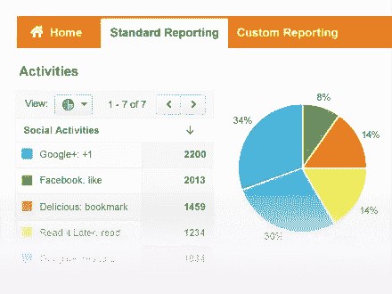
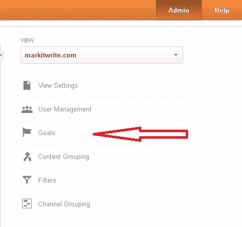
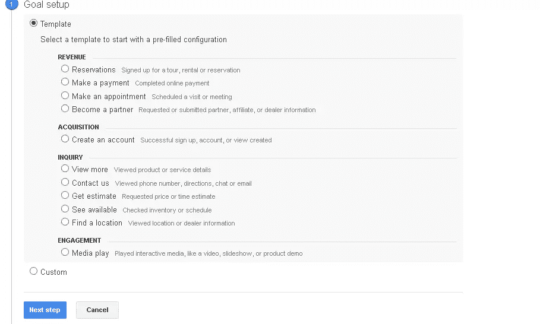
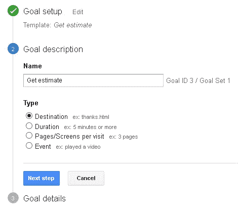
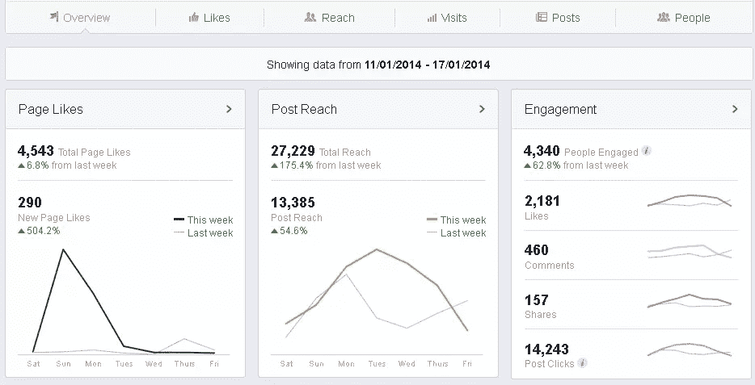
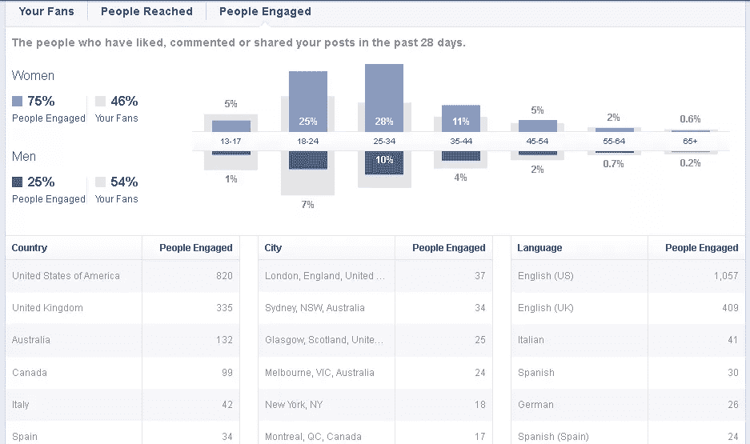
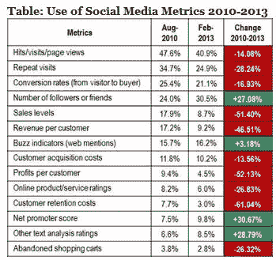
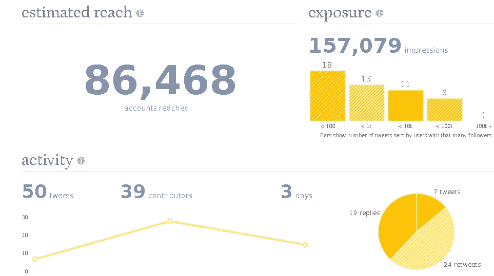

# 如何真正衡量社会努力的投资回报率

> 原文：<https://www.sitepoint.com/really-measure-roi-social-efforts/>

在过去的几年里，社交媒体的价值受到了广泛的质疑，许多人怀疑它真的能证明是有益的，并提供良好的投资回报。这需要一点时间，但大多数中小型企业和大型组织现在都意识到，在流量和声誉方面，社交媒体是一个出色的驱动因素。我们看到越来越多的社交媒体的创造性使用，更好的品牌账户，甚至更好的，正确使用社交媒体的能力。

我的意思是，按照预期的方式使用社交媒体。作为一种促销手段，以友好(社交)的语气，促进优质的客户服务并产生良好的反馈。当然，一些公司仍然在努力做好这件事，在很大程度上，这是因为缺乏时间、资源和对它如何造福企业的理解。

考虑到这一点，如何向客户证明投资回报率，以使他们相信这是值得花时间和精力的呢？

## 最近的研究

英国互联网广告局(IAB UK)去年进行的一项研究发现，社交媒体在“推动品牌情感”方面是有效的，并且它进一步:

*   提高参与度
*   提高客户忠诚度
*   产生超过 3:1 的潜在投资回报率

该研究采用了超过 4500 份定量调查反馈、800 份研究小组访谈和三个领先品牌的社交媒体页面来开展研究。

结果发现，在通过社交网络与品牌建立联系的消费者中，五分之四的人比通过其他方式建立联系的人更有可能购买。83%的人还表示，他们会在社交媒体上接触该品牌后尝试一种产品，在研究中使用的三个品牌中，他们都经历了“在实施社交媒体活动后情绪的提升”

研究的品牌有:

*   海因茨
*   茶叶公司 **Twinings**
*   **水壶**(生产薯片等的休闲食品公司。)

**亨氏**发现品牌好感度上升了 22%， **Twinings** :19%， **Kettle** : 17%。

根据这项研究，这意味着在社交媒体上每花费 1 英镑(1.6 美元)，回报可能高达 3.34 英镑(5.45 美元)，实际上是投资回报率的三倍。除此之外，我们还发现，那些定期在社交媒体上发帖的品牌，尤其是关于新产品的品牌，发现客户更有可能试用这些产品。

然而，另一项针对百事可乐社交活动的研究发现，该饮料公司在活动期间失去了 2.6%的美国市场。消费者知识中心的 Brian Urbick 认为，这意味着有必要不仅仅看“表面指标”,营销人员应该使用各种工具来研究活动的有效性。

## 使用谷歌分析

许多企业已经使用[谷歌分析](http://www.google.com/analytics)来衡量公司网站上的活动，这也可以用于社交。它可以作为一个独立的工具使用，也可以与我们稍后将讨论的其他工具一起使用。您可以使用分析来简单地测量社交流量，或者使用转化报告来证明投资回报率。

为了在分析中使用转换报告，首先需要建立目标和电子商务跟踪，以便深入了解社会活动的货币价值。

根据分析:

> 报告将社交网站的贡献分解为客户的最后一个推荐来源，例如，他们直接从社交网站访问您的网站，还可以分解社交网站在转化链中进一步参与的情况。

## 设定目标

在分析中，选择您想要使用的域，然后转到**管理**选项卡；你会看到有一个设置目标的选项。

接下来，这是一个选择你想要建立什么样的目标的问题:

如你所见，可以为许多不同的事情设定一个目标，你也可以根据你想要衡量的东西设定自定义目标。Google Analytics Premium 为设定目标和衡量效果提供了更多选择，但它每年需要 15 万美元。

一旦你选择了你想要设定的目标，如果有必要的话，给它起个名字，并选择你想要衡量的东西。

正如你所看到的，有几个选择，所以如果你像我一样选择 **get estimate** ，那么你可能希望将目标页面设置为感谢页面，这样就可以清楚地看到目标已经实现，访问者已经完成了整个过程。你可以根据需要设定任意多的目标，然后使用分析来查看转化率、销售漏斗、每个已完成目标的价值等等。

有关社交和 GA 的更多信息，请观看下面来自分析团队的视频。

### 贾斯汀·库特罗尼和本杰明·曼戈尔德:测量社交媒体

[//www.youtube.com/embed/hk_O0Fbcl_E](//www.youtube.com/embed/hk_O0Fbcl_E)

## 其他测量资源

谷歌分析是一个伟大的工具，应该用于所有的网站分析。然而，它不是唯一的工具，为了获得清晰、全面的社会活动图像，有必要使用多种资源。知识就是力量，在这种情况下，它可以强大到足以有效地推动你的网站的流量和转换。

各大社交网络都有自己的资源来做这件事，比如:

*   [脸书的见解](https://www.facebook.com/insights/)
*   [推特广告](https://business.twitter.com/products/analytics)
*   [Pinterest 分析](http://business.pinterest.com/analytics/)
*   LinkedIn(位于贵公司页面的“分析”选项卡中)

如果你是做广告的，那么这些特别有用，但即使你有机地使用社交媒体，它们也有助于了解哪些帖子在何时被关注。

例如，脸书的新见解可以让你看到哪些帖子最受关注，但也有很多其他有用的信息可以真正帮助你深入了解你的追随者最喜欢的内容。这允许你微调过程并获得更多的投资回报，因为你将能够更有效地瞄准你的观众。

如您所见，Insights dashboard 对您的脸书页面上发生的事情进行了概述。你可以看到参与度是上升了还是下降了，看看总接触范围等等。你也可以选择顶部的标签来查看统计数据，什么帖子做得最好，有机接触与付费等等。

同样，这真的有助于深入了解你的受众，他们喜欢什么，以及如何规划未来的内容。

## 专业工具

衡量社交媒体的方式不同于营销人员衡量其他形式广告的方式。在过去的几年里，衡量的标准随着可用工具的变化而变化，营销人员越来越习惯于与社交媒体合作。

[来源:福布斯](http://www.forbes.com/sites/christinemoorman/2013/05/21/measuring-social-media-roi-companies-emphasize-voice-metrics/)

如您所见，尽管许多公司开始使用传统的投资回报率指标，但到了 2013 年，只有 9%的公司采用了这一指标。这是因为社交不能用标准的交易公式来衡量，如**投资回报率(%) =(净利润/营销成本)∶100**，这是营销人员衡量 ROI 的传统方法。通过使用受众范围、参与度和情绪等指标，可以更有效地衡量社交，后者我们在前面讨论过。

这导致市场上出现了令人眼花缭乱的社交工具，其中一些很好，一些没什么用处。

TweetReach 是一个很好的工具，可以测量你的 Twitter 活动获得了多少曝光率，让你看到有多少账户被访问，它们的质量等等。

很容易就能发现谁在转发，他们拥有的权限，以及哪些推文获得了最多的参与、转发、回复等等。

[社交提及](http://socialmention.com)让你可以记录所有社交网络中谁在谈论你的品牌，这是一个有用的声誉管理工具。任何成功的社交活动都依赖于获得强大的品牌代表，因此尽管它可能无法衡量投资回报率，但它是你社交媒体营销武库中的一个好工具。

Hootsuite 是一款流行的同时管理多个账户的工具，现在包括了它自己的谷歌、脸书、推特等分析工具。

[//player.vimeo.com/video/20820336](//player.vimeo.com/video/20820336)

Hootsuite 还允许您生成可以在所有团队之间共享的报告，并且可以每天、每周、每月或者在您需要的任何时候生成。这允许您为不同的站点安排、选择定制模块，为客户创建品牌报告，这可能是最流行的管理工具。

还有许多其他专业工具，包括:

*   [第五次](http://www.quintly.com/)
*   [Klout](http://www.klout.com/)
*   [萌芽社交](http://home.sproutsocial.com/1/social-analytics)

还有更多！

归根结底是合理的计划，作为一个持续的计划，有必要真正研究你的观众在做什么，为什么。通过使用各种来源的分析，您可以确保根据参与度和转换率设定目标并进行调整，从而计算出投资回报率。

网络上有几个地方提供社交媒体投资回报率的公式，例如，看看这里的 14 个公式，或者试着用龙搜索(T2)的在线社交媒体投资回报率(T3)计算器算出来。

这仍然不是一门精确的科学，但当使用社交媒体进行营销时，肯定会有回报。对于许多网络专业人士来说，最困难的部分是让客户(尤其是小企业)相信社交网站能够真正促进业务。我发现这是很容易证明的，但是只有当客户在他们的网站上实际看到它工作时，他们才会相信，而不仅仅是在理论上。

## 分享这篇文章