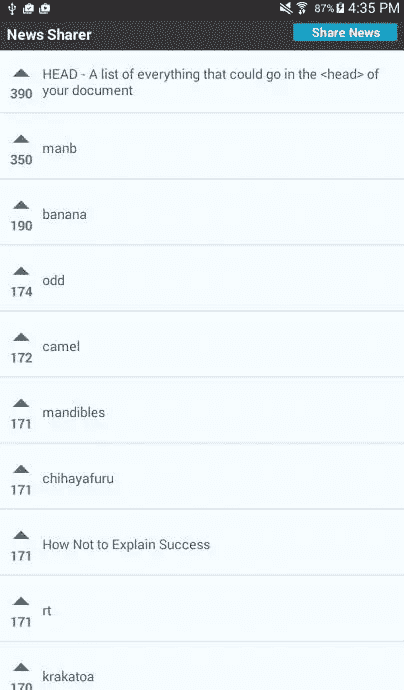
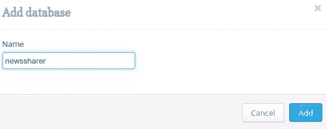
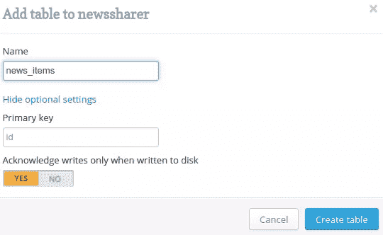

# 使用 RethinkDB 和 React Native 进行实时应用开发

> 原文：<https://www.sitepoint.com/realtime-app-development-with-rethinkdb-and-react-native/>

一个实时应用程序可以让用户在需要的时候获得他们想知道的最新信息。用户不需要不断刷新窗口来获得最新的更新，应用程序背后的服务器会自动将更新推送到应用程序。在本教程中，我将通过使用 [RethinkDB](https://www.rethinkdb.com/) 和 [React Native](https://facebook.github.io/react-native/) 创建一个新闻分享应用来介绍实时应用开发。

我假设你已经有了创建 React 原生应用的经验，所以我不打算对每一行代码进行详细描述。如果你是初学者，我推荐你阅读我之前的教程，“用 React Native 构建一个 Android 应用”。如果你想继续下去，你可以在 [Github](https://github.com/sitepoint-editors/rn-rethinkdb-socketio-newssharer) 上找到代码。

这是最终应用的外观:



我将从查看移动应用程序的代码开始，然后转到使用 Node、Express、Socket.io 和 RethinkDB 的服务器组件。

## 安装依赖项

在您的项目克隆中，导航到 *NewsSharer* 目录并执行`npm install`来安装以下依赖项:

*   **[React-Native](https://facebook.github.io/react-native/)**:React 原生框架。
*   **[lodash](https://github.com/lodash/lodash)** :用于操纵新闻条目的数组，使其受限并根据票数排序。
*   **[react-native-modal box](https://github.com/maxs15/react-native-modalbox)**:用于创建一个分享新闻条目的模态。
*   **[react-native-button](https://github.com/ide/react-native-button)**:react-native-modal box 的一个依赖，用于创建按钮。
*   **[react-native-vector-icons](https://github.com/oblador/react-native-vector-icons)**:用于创建带有 [FontAwesome](http://fortawesome.github.io/Font-Awesome/icons/) 和 [Ionicons](http://ionicframework.com/docs/v2/ionicons/) 等流行图标集的图标。这主要用于创建投票按钮的图标。
*   **[socket.io-client](https://github.com/socketio/socket.io-client)** :实时应用框架 [Socket.io](http://socket.io/) 的客户端组件。

### 链接图标

安装完依赖项后，还有一个额外的步骤让图标工作，将它们链接到应用程序。通过使用 React 本地包管理器 [rnpm](https://github.com/rnpm/rnpm) 来实现这一点。

使用 npm 安装 rnpm:

```
npm install rnpm -g 
```

然后在 *NewsSharer* 目录的根目录下执行`rnpm link`来链接图标。

## 该应用程序

下面是 *index.android.js* 文件的内容:

```
import React, { Component } from 'react';
import {
  AppRegistry,
  StyleSheet,
  View
} from 'react-native';

import Main from './components/Main';

class NewsSharer extends Component {

  render() {
    return (
      <View style={styles.container}>
        <Main />
      </View>
    );
  }
}

const styles = StyleSheet.create({
  container: {
    flex: 1,
    justifyContent: 'center',
    alignItems: 'center',
    backgroundColor: '#F5FCFF',
  }
});

AppRegistry.registerComponent('NewsSharer', () => NewsSharer); 
```

这个文件是 Android 应用程序的入口点文件。如果想部署到 iOS，可以将代码复制到一个新的 *index.ios.js* 文件中。

这个文件的主要任务是导入`Main`组件，这是应用程序的核心所在。这减少了代码重复，因为您导入了一个组件，而不是为每个平台重复代码。

### 主应用程序组件

内部 *components/Main.js* :

```
import React, { Component } from 'react';
import {
  AppRegistry,
  StyleSheet,
  Text,
  View,
  TextInput,
  TouchableHighlight,
  Linking,
  ListView
} from 'react-native';

import Button from 'react-native-button';
import Modal from 'react-native-modalbox';
import Icon from 'react-native-vector-icons/Octicons';

import "../UserAgent";
import io from 'socket.io-client/socket.io';

import _ from 'lodash';

var base_url = 'http://YOUR_DOMAIN_NAME_OR_IP_ADDRESS:3000';

export default class Main extends Component {

  constructor(props){
    super(props);

    this.socket = io(base_url, {
      transports: ['websocket']
    });

    this.state = {
      is_modal_open: false,
      news_title: '',
      news_url: '',
      news_items_datasource: new ListView.DataSource({
        rowHasChanged: (row1, row2) => row1 !== row2,
      }),
      is_news_loaded: false,
      news: {},
      news_items: []
    };

  }

  getNewsItems(){

    fetch(base_url + '/news')
      .then((response) => {
        return response.json();
      })
      .then((news_items) => {

        this.setState({
          'news_items': news_items
        });

        var news_datasource = this.state.news_items_datasource.cloneWithRows(news_items);

        this.setState({
          'news': news_datasource,
          'is_news_loaded': true
        });

        return news_items;
      })
      .catch((error) => {
        alert('Error occured while fetching news items');
      });

  }

  componentWillMount(){

    this.socket.on('news_updated', (data) => {

      var news_items = this.state.news_items;
      if(data.old_val === null){

        news_items.push(data.new_val);

      }else{

        _.map(news_items, function(row, index){
          if(row.id == data.new_val.id){
            news_items[index].upvotes = data.new_val.upvotes;
          }

        });

      }

      this.updateUI(news_items);

    });

  }

  updateUI(news_items){
    var ordered_news_items = _.orderBy(news_items, 'upvotes', 'desc');
    var limited_news_items = _.slice(ordered_news_items, 0, 30);
    var news_datasource = this.state.news_items_datasource.cloneWithRows(limited_news_items);

    this.setState({
      'news': news_datasource,
      'is_news_loaded': true,
      'is_modal_open': false,
      'news_items': limited_news_items
    });
  }

  componentDidMount(){
    this.getNewsItems();
  }

  upvoteNewsItem(id, upvotes){

    fetch(base_url + '/upvote-newsitem', {
      method: 'POST',
      headers: {
        'Accept': 'application/json',
        'Content-Type': 'application/json',
      },
      body: JSON.stringify({
        news_id: id,
        upvotes: upvotes + 1
      })
    })
      .catch((err) => {
        alert('Error occured while trying to upvote');
      });    

  }

  openModal(){
    this.setState({
      is_modal_open: true
    });
  }

  closeModal(){
    this.setState({
      is_modal_open: false
    });
  }

  shareNews(){

    fetch(base_url + '/save-newsitem', {
      method: 'POST',
      headers: {
        'Accept': 'application/json',
        'Content-Type': 'application/json',
      },
      body: JSON.stringify({
        news_title: this.state.news_title,
        news_url: this.state.news_url,
      })
    })
      .then((response) => {
        alert('News was shared!');
        this.setState({
          news_title: '',
          news_url: ''
        });
      })
      .catch((err) => {
        alert('Error occured while sharing news');
      });

  }

  openPage(url){
    Linking.canOpenURL(url).then(supported => {
      if(supported){
        Linking.openURL(url);
      }
    });
  }

  renderNews(news){
    return (
      <View style={styles.news_item}>
        <TouchableHighlight onPress={this.upvoteNewsItem.bind(this, news.id, news.upvotes)} underlayColor={"#E8E8E8"}>
          <View style={styles.upvote}>
              <Icon name="triangle-up" size={30} color="#666" />
              <Text style={styles.upvote_text}>{news.upvotes}</Text>
          </View>
        </TouchableHighlight>
        <TouchableHighlight onPress={this.openPage.bind(this, news.url)} underlayColor={"#E8E8E8"}>
          <View style={styles.news_title}>
            <Text style={styles.news_item_text}>{news.title}</Text>
          </View>
        </TouchableHighlight>
      </View>
    );
  }

  render(){

    return (
      <View style={styles.container}>
        <View style={styles.header}>
          <View style={styles.app_title}>
            <Text style={styles.header_text}>News Sharer</Text>   
          </View>
          <View style={styles.header_button_container}>
            <Button onPress={this.openModal.bind(this)} style={styles.btn}>
              Share News
            </Button>
          </View>     
        </View>

        {
          this.state.is_news_loaded &&
          <View style={styles.body}>
            <ListView initialListSize={1} dataSource={this.state.news} style={styles.news} renderRow={this.renderNews.bind(this)}></ListView>
          </View>
        }

        <Modal
          isOpen={this.state.is_modal_open}
          style={styles.modal}
          position={"center"}
        >
          <View style={styles.modal_body}>
            <View style={styles.modal_header}>
              <Text style={styles.modal_header_text}>Share News</Text>
            </View>

            <View style={styles.input_row}>
              <TextInput
                style={{height: 40, borderColor: 'gray', borderWidth: 1}}
                onChangeText={(text) => this.setState({news_title: text})}
                value={this.state.news_title}
                placeholder="Title"
              />
            </View>

            <View style={styles.input_row}>
              <TextInput
                style={{height: 40, borderColor: 'gray', borderWidth: 1}}
                onChangeText={(text) => this.setState({news_url: text})}
                value={this.state.news_url}
                placeholder="URL"
                keyboardType="url"
              />
            </View>

            <View style={styles.input_row}>
              <Button onPress={this.shareNews.bind(this)} style={[styles.btn, styles.share_btn]}>
                Share
              </Button>
            </View>
          </View>

        </Modal>
      </View>
    );
  }
}

const styles = StyleSheet.create({
  container: {
    flex: 1,
    alignSelf: 'stretch',
    backgroundColor: '#F5FCFF',
  },
  header: {
    flex: 1,
    backgroundColor: '#3B3738',
    flexDirection: 'row'
  },
  app_title: {
    flex: 7,
    padding: 10
  },
  header_text: {
    fontSize: 20,
    color: '#FFF',
    fontWeight: 'bold'
  },
  header_button_container: {
    flex: 3
  },
  body: {
    flex: 19
  },
  btn: {
    backgroundColor: "#05A5D1",
    color: "white",
    margin: 10
  },
  modal: {
    height: 300
  },
  modal_header: {
    margin: 20,
  },
  modal_body: {
    alignItems: 'center'
  },
  input_row: {
    padding: 20
  },
  modal_header_text: {
    fontSize: 18,
    fontWeight: 'bold'
  },
  share_btn: {
    width: 100
  },
  news_item: {
    paddingLeft: 10,
    paddingRight: 10,
    paddingTop: 15,
    paddingBottom: 15,
    marginBottom: 5,
    borderBottomWidth: 1,
    borderBottomColor: '#ccc',
    flex: 1,
    flexDirection: 'row'
  },
  news_item_text: {
    color: '#575757',
    fontSize: 18
  },
  upvote: {
    flex: 2,
    paddingRight: 15,
    paddingLeft: 5,
    alignItems: 'center'
  },
  news_title: {
    flex: 18,
    justifyContent: 'center'
  },
  upvote_text: {
    fontSize: 18,
    fontWeight: 'bold'
  }
});

AppRegistry.registerComponent('Main', () => Main); 
```

分解上面的代码。首先导入内置的 React 原生和所需的第三方组件。

```
import React, { Component } from 'react';
import {
  AppRegistry,
  StyleSheet,
  Text,
  View,
  TextInput,
  TouchableHighlight,
  Linking,
  ListView
} from 'react-native';

import Button from 'react-native-button';
import Modal from 'react-native-modalbox';
import Icon from 'react-native-vector-icons/Octicons';

import "../UserAgent";
import io from 'socket.io-client/socket.io';

import _ from 'lodash'; 
```

请注意，您在这里导入的是自定义代码:

```
import "../UserAgent"; 
```

这就是你在 *NewsSharer* 目录下看到的 *UserAgent.js* 文件。它包含将用户代理设置为`react-native`的代码，这是 Socket.io 工作所需要的，否则它将假设它处于浏览器环境中。

```
window.navigator.userAgent = 'react-native'; 
```

接下来，应用程序将向其发出请求的基本 URL。如果您在本地测试，这可能是您的计算机的内部 IP 地址。要做到这一点，你必须确保你的手机或平板电脑与你的电脑连接在同一个网络上。

```
var base_url = 'http://YOUR_DOMAIN_NAME_OR_IP_ADDRESS:3000'; 
```

在构造函数内部，初始化套接字连接:

```
this.socket = io(base_url, {
  transports: ['websocket']
}); 
```

设置默认应用程序状态:

```
this.state = {
  is_modal_open: false, //for showing/hiding the modal
  news_title: '', //default value for news title text field
  news_url: '', //default value for news url text field
  //initialize a datasource for the news items
  news_items_datasource: new ListView.DataSource({
    rowHasChanged: (row1, row2) => row1 !== row2,
  }),
  //for showing/hiding the news items
  is_news_loaded: false,
  news: {}, //the news items datasource
  news_items: [] //the news items
}; 
```

这个函数使用内置的 [fetch](https://facebook.github.io/react-native/docs/network.html) 方法从服务器获取新闻条目。它对`news`路由执行一个`GET`请求，然后从响应中提取`news_items`对象。然后用它来创建`ListView`组件所需的新闻数据源。创建后，它用新闻数据源更新状态，这样 UI 就可以用其中的新闻条目进行更新。

```
getNewsItems(){

  fetch(base_url + '/news')
    .then((response) => {
      return response.json();
    })
    .then((news_items) => {

      this.setState({
        'news_items': news_items
      });

      var news_datasource = this.state.news_items_datasource.cloneWithRows(news_items);

      this.setState({
        'news': news_datasource,
        'is_news_loaded': true
      });

      return news_items;
    })
    .catch((error) => {
      alert('Error occured while fetching news items');
    });

} 
```

[`componentWillMount`](https://facebook.github.io/react/docs/component-specs.html#mounting-componentwillmount) 方法是 React 的生命周期方法之一。这允许您在初始呈现发生之前执行代码。这是您监听 Socket.io 的服务器组件发出的`news_updated`事件的地方，当这个事件发生时，它可能是以下两种情况之一。当用户分享一个新闻条目或者当他们投票支持一个现有的新闻条目时。

如果是一个新项目，RethinkDB 的 changefeed 将为`old_val`返回一个`null`值。这就是你区分两种可能性的方式。如果一个用户分享了一个新的新闻条目，将其推送到`news_items`数组。否则，查找 upvoted 新闻项目并更新其 upvote 计数。现在，您可以更新 UI 来反映这些更改。

```
componentWillMount(){

  this.socket.on('news_updated', (data) => {

    var news_items = this.state.news_items;
    if(data.old_val === null){ //a new news item is shared
      //push the new item to the news_items array
      news_items.push(data.new_val);

    }else{ //an existing news item is upvoted
      //find the news item that was upvoted and update its upvote count
      _.map(news_items, function(row, index){
        if(row.id == data.new_val.id){
          news_items[index].upvotes = data.new_val.upvotes;
        }

      });

    }

    //update the UI to reflect the changes
    this.updateUI(news_items);

  });

} 
```

`updateUI`函数根据新闻条目的投票数从高到低进行排序。排序后，提取前 30 条新闻并更新状态。

```
updateUI(news_items){
  var ordered_news_items = _.orderBy(news_items, 'upvotes', 'desc');
  var limited_news_items = _.slice(ordered_news_items, 0, 30);
  var news_datasource = this.state.news_items_datasource.cloneWithRows(limited_news_items);

  this.setState({
    'news': news_datasource,
    'is_news_loaded': true,
    'is_modal_open': false,
    'news_items': limited_news_items
  });
} 
```

[`componentDidMount`](https://facebook.github.io/react/docs/component-specs.html#mounting-componentdidmount) 方法是在初始渲染发生后调用的另一个 React 生命周期方法。这是从服务器获取新闻条目的地方。

**注意**:如果你想在组件挂载之前发出请求，你也可以在`componentWillMount`方法中这样做。

```
componentDidMount(){
  this.getNewsItems();
} 
```

`upvoteNewsItem`方法向服务器发出一个 upvote 新闻条目请求。

```
upvoteNewsItem(id, upvotes){

  fetch(base_url + '/upvote-newsitem', {
    method: 'POST',
    headers: {
      'Accept': 'application/json',
      'Content-Type': 'application/json',
    },
    body: JSON.stringify({
      news_id: id,
      upvotes: upvotes + 1
    })
  })
    .catch((err) => {
      alert('Error occured while trying to upvote');
    });    

} 
```

`openModal`和`closeModal`方法显示和隐藏共享新闻条目的模式。

```
openModal(){
  this.setState({
    is_modal_open: true
  });
}

closeModal(){
  this.setState({
    is_modal_open: false
  });
} 
```

`shareNews`函数发送创建新闻条目的请求。

```
shareNews(){

  fetch(base_url + '/save-newsitem', {
    method: 'POST',
    headers: {
      'Accept': 'application/json',
      'Content-Type': 'application/json',
    },
    body: JSON.stringify({
      news_title: this.state.news_title,
      news_url: this.state.news_url,
    })
  })
    .then((response) => {
      alert('News was shared!');
      this.setState({
        news_title: '',
        news_url: ''
      });
    })
    .catch((err) => {
      alert('Error occured while sharing news');
    });

} 
```

`openPage`功能在浏览器中打开新闻条目的 URL。

```
openPage(url){
  Linking.canOpenURL(url).then(supported => {
    if(supported){
      Linking.openURL(url);
    }
  });
} 
```

`renderNews`函数返回每个新闻条目的 UI。这将显示向上投票按钮、向上投票数和新闻标题。新闻标题被包装在一个`TouchableHighlight`组件中。这允许您执行`openPage`功能来打开 URL。你做同样的事情来增加票数。

**注意**:代码使用了`TouchableHighlight`组件而不是`Button`组件，因为`Button`组件中不能有`View`或`Text`组件。

```
renderNews(news){
  return (
    <View style={styles.news_item}>
      <TouchableHighlight onPress={this.upvoteNewsItem.bind(this, news.id, news.upvotes)} underlayColor={"#E8E8E8"}>
        <View style={styles.upvote}>
            <Icon name="triangle-up" size={30} color="#666" />
            <Text style={styles.upvote_text}>{news.upvotes}</Text>
        </View>
      </TouchableHighlight>
      <TouchableHighlight onPress={this.openPage.bind(this, news.url)} underlayColor={"#E8E8E8"}>
        <View style={styles.news_title}>
          <Text style={styles.news_item_text}>{news.title}</Text>
        </View>
      </TouchableHighlight>
    </View>
  );
} 
```

`render`函数返回整个 app 的 UI。

```
render(){
    ...
} 
```

在`render`函数中，你有一个包含应用标题的标题和一个用于打开分享新闻的按钮。

```
<View style={styles.header}>
  <View style={styles.app_title}>
    <Text style={styles.header_text}>News Sharer</Text>   
  </View>
  <View style={styles.header_button_container}>
    <Button onPress={this.openModal.bind(this)} style={styles.btn}>
      Share News
    </Button>
  </View>     
</View> 
```

对于主体，您有用于呈现新闻条目的 [`ListView`组件](https://facebook.github.io/react-native/docs/listview.html#content)。它有三个必需的参数，`initialListSize`、`dataSource`和`renderRow`。`initialListSize`被设置为 1，这样`ListView`在多个帧的过程中一个接一个地渲染每一行。如果您希望所有行同时出现，也可以将其更新为更高的值。`dataSource`是新闻条目，而`renderRow`是呈现每个单独新闻条目行的函数。

```
{
  this.state.is_news_loaded &&
  <View style={styles.body}>
    <ListView initialListSize={1} dataSource={this.state.news} style={styles.news} renderRow={this.renderNews.bind(this)}></ListView>
  </View>
} 
```

接下来是分享新闻的模式。它有两个文本字段用于输入新闻的标题和 URL，还有一个按钮用于将新闻提交给服务器。文本字段使用 [`TextInput`组件](https://facebook.github.io/react-native/docs/textinput.html#content)。没有标签，所以添加占位符文本来引导用户输入他们需要的内容。

两个文本字段都有`onChangeText`方法来更新每个字段的值。`url`的`keyboardType`用于新闻 URL 文本字段，以便打开为在设备中输入 URL 而优化的键盘。用户不希望手动输入，他们可以使用复制和粘贴，但这是一个很好的选择，以防他们决定手动输入。文本栏下方是分享新闻的按钮。这将调用前面定义的`shareNews`函数。

```
<Modal
  isOpen={this.state.is_modal_open}
  style={styles.modal}
  position={"center"}
>
  <View style={styles.modal_body}>
    <View style={styles.modal_header}>
      <Text style={styles.modal_header_text}>Share News</Text>
    </View>

    <View style={styles.input_row}>
      <TextInput
        style={{height: 40, borderColor: 'gray', borderWidth: 1}}
        onChangeText={(text) => this.setState({news_title: text})}
        value={this.state.news_title}
        placeholder="Title"
      />
    </View>

    <View style={styles.input_row}>
      <TextInput
        style={{height: 40, borderColor: 'gray', borderWidth: 1}}
        onChangeText={(text) => this.setState({news_url: text})}
        value={this.state.news_url}
        placeholder="URL"
        keyboardType="url"
      />
    </View>

    <View style={styles.input_row}>
      <Button onPress={this.shareNews.bind(this)} style={[styles.btn, styles.share_btn]}>
        Share
      </Button>
    </View>
  </View>

</Modal> 
```

设置组件的样式:

```
const styles = StyleSheet.create({
  container: {
    flex: 1,
    alignSelf: 'stretch',
    backgroundColor: '#F5FCFF',
  },
  header: {
    flex: 1,
    backgroundColor: '#3B3738',
    flexDirection: 'row'
  },
  app_title: {
    flex: 7,
    padding: 10
  },
  header_text: {
    fontSize: 20,
    color: '#FFF',
    fontWeight: 'bold'
  },
  header_button_container: {
    flex: 3
  },
  body: {
    flex: 19
  },
  btn: {
    backgroundColor: "#05A5D1",
    color: "white",
    margin: 10
  },
  modal: {
    height: 300
  },
  modal_header: {
    margin: 20,
  },
  modal_body: {
    alignItems: 'center'
  },
  input_row: {
    padding: 20
  },
  modal_header_text: {
    fontSize: 18,
    fontWeight: 'bold'
  },
  share_btn: {
    width: 100
  },
  news_item: {
    paddingLeft: 10,
    paddingRight: 10,
    paddingTop: 15,
    paddingBottom: 15,
    marginBottom: 5,
    borderBottomWidth: 1,
    borderBottomColor: '#ccc',
    flex: 1,
    flexDirection: 'row'
  },
  news_item_text: {
    color: '#575757',
    fontSize: 18
  },
  upvote: {
    flex: 2,
    paddingRight: 15,
    paddingLeft: 5,
    alignItems: 'center'
  },
  news_title: {
    flex: 18,
    justifyContent: 'center'
  },
  upvote_text: {
    fontSize: 18,
    fontWeight: 'bold'
  }
}); 
```

## 服务器组件

现在是时候转到应用程序的服务器组件了，在这里您将学习如何在 RethinkDB 中保存和投票新闻项目，以及如何通知应用程序数据库中发生了变化。

### 创建数据库

我假设您已经在计算机上安装了 RethinkDB。如果没有，请遵循 RethinkDB 网站上的[安装和入门文档。](https://www.rethinkdb.com/docs/install/)

完成后，您现在可以在浏览器中访问`http://localhost:8080`来查看 RethinkDB 管理控制台。点击*表格的*标签，然后点击*添加数据库*按钮。这将打开一个模态框，让您输入数据库的名称，称之为“newssharer”并点击 **Add** 。



现在创建一个保存新闻条目的表。点击*添加表格*按钮，将其命名为‘news _ items’，然后点击*创建表格*。



### 安装依赖项

您可以通过导航到项目目录的根目录来安装服务器依赖项(带有 *newssharer-server.js* 和 *package.json* 文件)，并执行`npm install`来安装以下依赖项:

*   **[express](http://expressjs.com/)**:node . js 的 web 框架，允许你创建响应特定路由的 web 服务器。
*   **[body-parser](https://github.com/expressjs/body-parser)** :允许轻松提取请求体中传递的 JSON 字符串。
*   **[rethinkdb](https://www.npmjs.com/package/rethinkdb)**:node . js 的 RethinkDB 客户端
*   **[socket.io](http://socket.io/)** :当有人分享新闻或投票支持现有新闻时，允许您与所有连接的客户端进行通信的实时框架。

### 服务器端代码

inside*news sharer-server . js*:

```
var r = require('rethinkdb');

var express = require('express');
var app = express();

var server = require('http').createServer(app);
var io = require('socket.io')(server);

var bodyParser = require('body-parser');
app.use(bodyParser.json());

var connection;

r.connect({host: 'localhost', port: 28015}, function(err, conn) {
    if(err) throw err;
    connection = conn;

    r.db('newssharer').table('news_items')
        .orderBy({index: r.desc('upvotes')})
        .changes()
        .run(connection, function(err, cursor){

            if (err) throw err;
            io.sockets.on('connection', function(socket){
                cursor.each(function(err, row){
                    if(err) throw err;
                    io.sockets.emit('news_updated', row);   
                });
            });
    });

});

app.get('/create-table', function(req, res){
    r.db('newssharer').table('news_items').indexCreate('upvotes').run(connection, function(err, result){
        console.log('boom');
        res.send('ok')
    });
});

app.get('/fill', function(req, res){
    r.db('newssharer').table('news_items').insert([
        {
            title: 'A Conversation About Fantasy User Interfaces',
            url: 'https://www.subtraction.com/2016/06/02/a-conversation-about-fantasy-user-interfaces/',
            upvotes: 30
        },
        {
            title: 'Apple Cloud Services Outage',
            url: 'https://www.apple.com/support/systemstatus/',
            upvotes: 20
        }
    ]).run(connection, function(err, result){
        if (err) throw err;
        res.send('news_items table was filled!');
    });
});

app.get('/news', function(req, res){
    res.header("Content-Type", "application/json");
    r.db('newssharer').table('news_items')
        .orderBy({index: r.desc('upvotes')})
        .limit(30)
        .run(connection, function(err, cursor) {
            if (err) throw err;
            cursor.toArray(function(err, result) {
                if (err) throw err;
                res.send(result);
            });
    });
});

app.post('/save-newsitem', function(req, res){

    var news_title = req.body.news_title;
    var news_url = req.body.news_url;

    r.db('newssharer').table('news_items').insert([
       {
        'title': news_title,
        'url': news_url,
        'upvotes': 100
       },
    ]).run(connection, function(err, result){
        if (err) throw err;
        res.send('ok');
    });

});

app.post('/upvote-newsitem', function(req, res){

    var id = req.body.news_id;
    var upvote_count = req.body.upvotes;

    r.db('newssharer').table('news_items')
        .filter(r.row('id').eq(id))
        .update({upvotes: upvote_count})
        .run(connection, function(err, result) {
            if (err) throw err;
            res.send('ok');
        });
});

app.get('/test/upvote', function(req, res){
    var id = '144f7d7d-d580-42b3-8704-8372e9b2a17c';
    var upvote_count = 350;

    r.db('newssharer').table('news_items')
        .filter(r.row('id').eq(id))
        .update({upvotes: upvote_count})
        .run(connection, function(err, result) {
            if (err) throw err;
            res.send('ok');
        });
});

app.get('/test/save-newsitem', function(req, res){

    r.db('newssharer').table('news_items').insert([
       {
        'title': 'banana',
        'url': 'http://banana.com',
        'upvotes': 190,
        'downvotes': 0
       },
    ]).run(connection, function(err, result){
        if(err) throw err;
        res.send('ok');
    });

});

server.listen(3000); 
```

在上面的代码中，首先导入依赖项:

```
var r = require('rethinkdb');

var express = require('express');

var app = express();

var server = require('http').createServer(app);
var io = require('socket.io')(server);

var bodyParser = require('body-parser');
app.use(bodyParser.json()); 
```

创建用于存储当前 RethinkDB 连接的变量。

```
var connection; 
```

#### 倾听变化

连接到 RethinkDB 数据库，默认情况下，RethinkDB 在端口`28015`上运行，所以这是您连接的地方。如果您使用了不同的端口，用您使用的端口替换`28015`。

```
r.connect({host: 'localhost', port: 28015}, function(err, conn) {
    if(err) throw err;
    connection = conn;

    ...

}); 
```

仍然在数据库连接代码中，查询`newssharer`数据库中的`news_items`表，根据它们的 upvotes 计数对项目进行排序。然后使用 RethinkDB 的 [Changefeeds 特性](https://rethinkdb.com/docs/changefeeds/javascript/)来监听表中的变化(一种数据库日志)。每当表中发生变化(CRUD 操作)时，都会通知它这个变化。

```
r.db('newssharer').table('news_items')
    .orderBy({index: r.desc('upvotes')})
    .changes()
    .run(connection, function(err, cursor){

        ...
}); 
```

在`run`方法的回调函数中，初始化套接字连接并遍历`cursor`的内容。`cursor`表示表格中所做的更改。每次发生变化，都会触发`cursor.each`功能。

**注意**:该函数不包含所有的数据变化。每当进行新的更改时，以前的更改都会被替换。这意味着它在任何给定时间只循环一行。这允许您使用 socket.io 将更改发送到客户端。

```
if (err) throw err; //check if there are errors and return it if any
io.sockets.on('connection', function(socket){
    cursor.each(function(err, row){
        if(err) throw err;
        io.sockets.emit('news_updated', row);   
    });
}); 
```

如果新闻项目被共享，每个`row`具有以下结构:

```
{
  "old_val": null,
  "new_val": {
    "id": 1,
    "news_title": "Google",
    "news_url": "http://google.com",
    "upvotes": 0
  }
} 
```

这就是你之前检查`null`的原因，因为新分享的新闻不会有`old_val`。

如果用户投票支持一条新闻:

```
{
  "old_val": {
    "id": 1,
    "news_title": "Google",
    "news_url": "http://google.com",
    "upvotes": 0
  }
  "new_val": {
    "id": 1,
    "news_title": "Google",
    "news_url": "http://google.com",
    "upvotes": 1
  }
} 
```

它返回行的旧值和新值的整个结构。这意味着您可以更新一个客户端中的多个字段，并将这些更改发送到所有其他连接的客户端。RethinkDB 通过其 changfeeds 特性使实时应用的实现变得简单。

#### 向 Upvotes 字段添加索引

这是向`upvotes`字段添加索引的路线:

```
app.get('/add-index', function(req, res){
    r.db('newssharer').table('news_items').indexCreate('upvotes').run(connection, function(err, result){
        res.send('ok')
    });
}); 
```

您需要这个来使`orderBy`函数工作，因为它需要您排序的字段有一个索引。

```
.orderBy({index: r.desc('upvotes')}) 
```

当服务器运行时，在测试应用程序之前，请确保在浏览器中打开`http://localhost:3000/add-index`。这个路由只需要调用一次。

#### 添加虚拟新闻项目

该路径将虚拟条目插入到`news_items`表中。出于测试目的，这是可选的，以便您可以立即看到新闻项目，而不必通过应用程序添加它们。

```
app.get('/fill', function(req, res){
    r.db('newssharer').table('news_items').insert([
        {
            title: 'A Conversation About Fantasy User Interfaces',
            url: 'https://www.subtraction.com/2016/06/02/a-conversation-about-fantasy-user-interfaces/',
            upvotes: 30
        },
        {
            title: 'Apple Cloud Services Outage',
            url: 'https://www.apple.com/support/systemstatus/',
            upvotes: 20
        }
    ]).run(connection, function(err, result){
        if (err) throw err;
        res.send('news_items table was filled!');
    });
}); 
```

#### 返回新闻项目

此路径返回新闻项目:

```
app.get('/news', function(req, res){
    res.header("Content-Type", "application/json");
    r.db('newssharer').table('news_items')
        .orderBy({index: r.desc('upvotes')})
        .limit(30)
        .run(connection, function(err, cursor) {
            if (err) throw err;
            cursor.toArray(function(err, result) {
                if (err) throw err;
                res.send(result);
            });
    });
}); 
```

新闻条目从最高投票数到最低投票数排序，最多 30 条。不使用`cursor.each`遍历新闻条目，而是使用`cursor.toArray`将其转换为具有以下结构的数组:

```
[
    {
        "title": "A Conversation About Fantasy User Interfaces",
        "url": "https://www.subtraction.com/2016/06/02/a-conversation-about-fantasy-user-interfaces/",
        "upvotes": 30
    },
    {
        "title": "Apple Cloud Services Outage",
        "url": "https://www.apple.com/support/systemstatus/",
        "upvotes": 20
    }    
] 
```

#### 创建新闻项目

这条路线保存了一条新闻:

```
app.post('/save-newsitem', function(req, res){

    var news_title = req.body.news_title;
    var news_url = req.body.news_url;

    r.db('newssharer').table('news_items').insert([
       {
        'title': news_title,
        'url': news_url,
        'upvotes': 100
       },
    ]).run(connection, function(err, result){
        if (err) throw err;
        res.send('ok');
    });

}); 
```

当用户在应用程序中分享新闻时，就会调用这个函数。它接受来自请求体的新闻标题和 URL。初始向上投票计数设置为 100，但您可以选择另一个数字。

#### 投票赞成一条新闻

这是向上投票一个新闻项目的途径:

```
app.post('/upvote-newsitem', function(req, res){

    var id = req.body.news_id;
    var upvote_count = req.body.upvotes;

    r.db('newssharer').table('news_items')
        .filter(r.row('id').eq(id))
        .update({upvotes: upvote_count})
        .run(connection, function(err, result) {
            if (err) throw err;
            res.send('ok');
        });
}); 
```

当用户投票支持应用程序中的新闻项目时，就会调用这个函数。它使用新闻条目的 ID 来获取并更新它。

**注意**:你已经在应用程序中增加了`upvotes`，所以提供了请求体中的值。

#### 测试保存和向上投票新闻项目

我还包括了几个测试保存和上传新闻条目的路径。访问这些内容的最佳时间是应用程序已经在您的设备上运行的时候。这样，您将看到 UI 被更新了。如何运行应用程序将在下一节中介绍。

这是测试保存新闻项目的方法:

```
app.get('/test/save-newsitem', function(req, res){

    r.db('newssharer').table('news_items').insert([
       {
        'title': 'banana',
        'url': 'http://banana.com',
        'upvotes': 190,
        'downvotes': 0
       },
    ]).run(connection, function(err, result){
        if(err) throw err;
        res.send('ok');
    });

}); 
```

这是测试一个新闻项目投票率的途径。确保用现有新闻项目的 ID 替换 ID，以使其有效。

```
app.get('/test/upvote', function(req, res){
    var id = '144f7d7d-d580-42b3-8704-8372e9b2a17c';
    var upvote_count = 350;

    r.db('newssharer').table('news_items')
        .filter(r.row('id').eq(id))
        .update({upvotes: upvote_count})
        .run(connection, function(err, result) {
            if (err) throw err;
            res.send('ok');
        });
}); 
```

## 运行服务器

此时，我假设 RethinkDB 仍在后台运行。如果它还没有运行，请运行它。一旦它开始运行，在项目目录的根目录下执行`node newssharer-server.js`来运行应用程序的服务器组件。

## 运行应用程序

您可以像运行任何 React 本机应用程序一样运行该应用程序。以下是在您选择的平台上运行应用程序的链接:

*   [运行在安卓系统上](https://facebook.github.io/react-native/docs/running-on-device-android.html#content)
*   [在 iOS 上运行](https://facebook.github.io/react-native/docs/running-on-device-ios.html#content)

如果你在运行应用程序时遇到了问题，你可以查看我之前关于[用 React Native](https://www.sitepoint.com/build-android-app-react-native/) 构建 Android 应用程序的文章中的**常见问题**部分。

一旦应用程序运行，尝试它或访问您的浏览器中的任何测试路线。

## 下一步是什么

以下是进一步改进该应用程序的一些建议:

*   使用 React Native 的 [WebView 组件](https://facebook.github.io/react-native/docs/webview.html)来创建应用内使用的 WebView，而不是在设备的默认 web 浏览器应用中打开新闻项目。
*   该应用程序允许用户重复点击向上投票按钮，添加一个功能来检查当前用户是否已经向上投票了新闻项目。
*   将服务器设置为仅接受来自应用程序的请求。

就是这样！在本教程中，您创建了一个实时新闻共享应用程序，并学习了如何使用 Socket.io 和 RethinkDB 的 changefeeds 来创建一个实时应用程序。

## 分享这篇文章