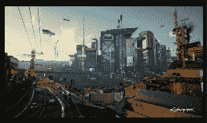

# 在 CSS 中重新创建赛博朋克 2077 按钮毛刺效果

> 原文：<https://www.sitepoint.com/recreate-the-cyberpunk-2077-button-glitch-effect-in-css/>

如果你对电子游戏有一丁点兴趣，你肯定知道赛博朋克 2077。这是 2020 年最令人期待的比赛之一。它描绘的世界有一种特定的风格。这款游戏的网站在描绘这种美感方面做得非常出色。它的设计很好地传达了外观和感觉。可以想象，这意味着它有一些看起来相当漂亮的 UI 组件。

有人首先找到我，问我如何在网站上创建一个图像效果。如果你将图像悬停在图库中，它们会产生这种整洁的“噪声”效果。



我接受了挑战。我挖进去看看网站的来源。经过一番挖掘，我发现它是用着色器和 WebGL 实现的。我对编写着色器和 WebGL 完全陌生。这确实促使我去试一试。但是，现在，我已经把学习 WebGL 和着色器代码放在了 backburner 上。

当我继续在我的直播流上环顾网站时，吸引我们眼球的是整洁的浮华效果按钮。我对用 CSS 创建浮华效果并不陌生。我们决定由我来尝试重现它们。


这就是你可以做到的！

## 效果按钮

让我们从一些标记开始:

```
<button class="cybr-btn">
  Beginning_
</button> 
```

我们首先需要排序的是大小、颜色和字体。得到这些的最好方法是什么？深入源代码，看看是如何做到的。从第一次检查中，我们看到使用了自定义字体。(您可以在下面的代码块中看到它的直接链接。)

让我们创建一个自定义@font-face 规则:

```
@font-face {
  font-family: Cyber;
  src: url("https://assets.codepen.io/605876/Blender-Pro-Bold.otf");
  font-display: swap;
} 
```

一旦我们有了这个，我们就可以把基本的造型放在适当的位置。在颜色和字体大小等方面使用 CSS 变量给了我们以后的机会。这也是使用 HSL 颜色空间的原因。我们稍后将说明原因。

```
--primary: hsl(var(--primary-hue), 85%, calc(var(--primary-lightness, 50) * 1%));
--shadow-primary: hsl(var(--shadow-primary-hue), 90%, 50%);
--primary-hue: 0;
--primary-lightness: 50;
--color: hsl(0, 0%, 100%);
--font-size: 26px;
--shadow-primary-hue: 180; 
```

把这些放在一起给了我们这个起点。注意我们是如何使用嵌入框阴影来代替蓝色线条的边框的？这是因为边框会使文本偏离中心。嵌入框阴影不会影响文本对齐。

见笔 [CSS 赛博朋克 2077 按钮:由 site point(](https://codepen.io/SitePoint/pen/zYKZXoM)[@ site point](https://codepen.io/SitePoint))
开始 [CodePen](https://codepen.io) 。