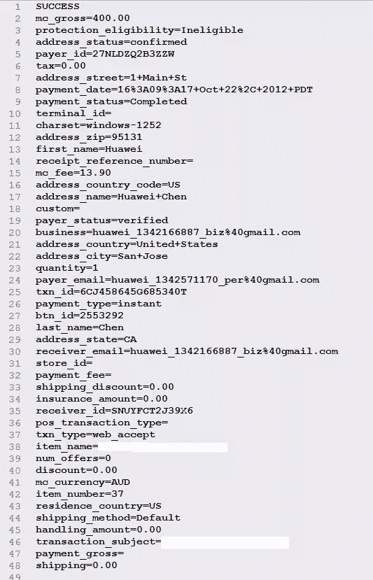
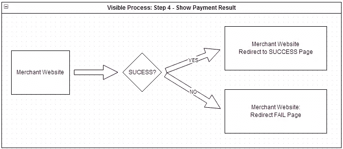
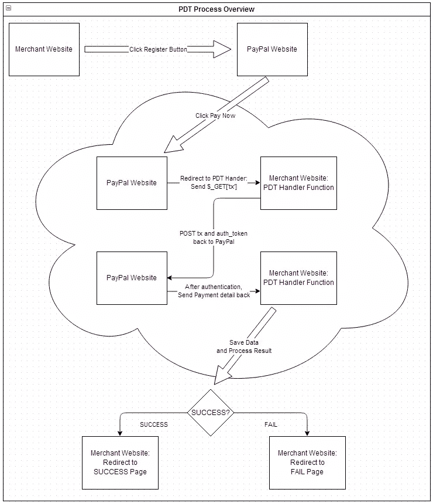
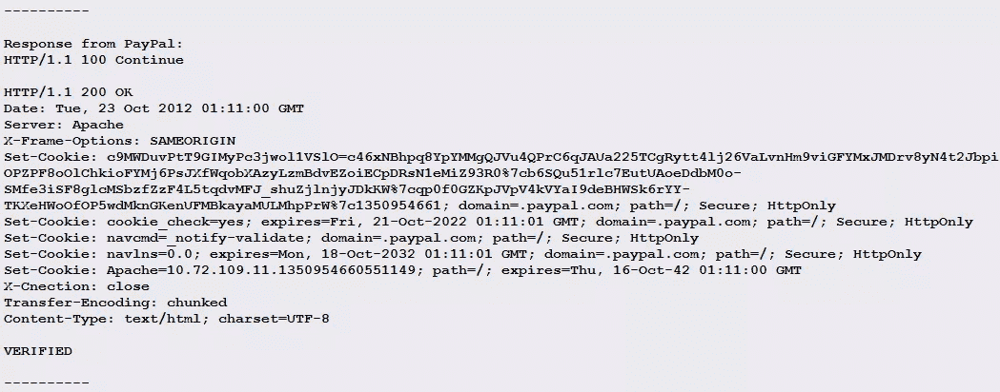
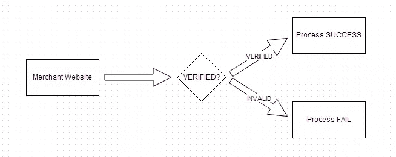
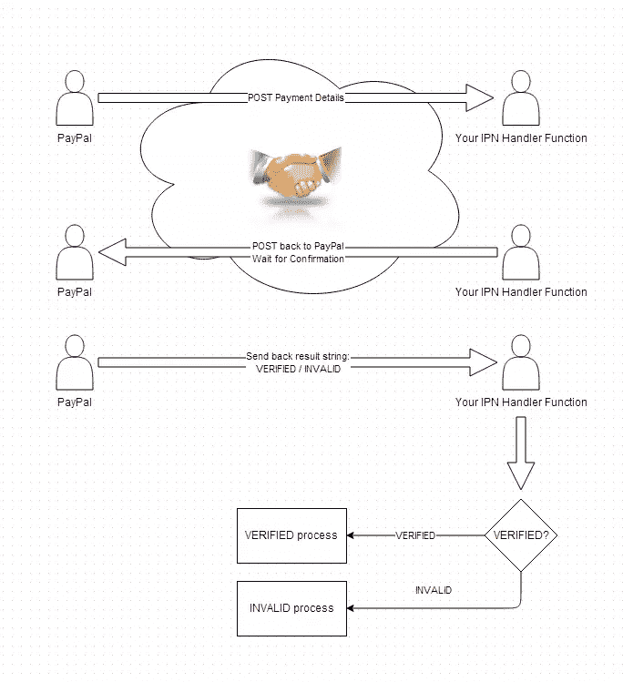
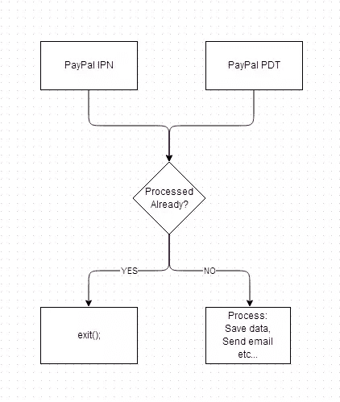

# 注册贝宝教程(1/3):光动力疗法和 IPN 过程

> 原文：<https://www.sitepoint.com/register-paypal-tutorial-3-1/>

## 摘要

本教程旨在介绍如何使注册过程与贝宝系统正常工作。

1.  解释 PayPal 的工作原理(IPN 和 PDT 流程)。第一章
2.  给出一个很好的例子来说明如何注册与贝宝合作，包括数据库，控制器和 jQuery 功能的前端表单。并解释如何设置一个贝宝帐户(沙盒和真正的贝宝商业帐户的例子)。 [两章](http://www.jquery4u.com/tutorials/register-paypal-tutorial-3-2-real-register-paypal-project/)
3.  用代码给出详细的注释。 [第三章](http://www.jquery4u.com/tutorials/register-paypal-tutorial-3-3-real-register-paypal-project/)

本教程给出了 PayPal 流程的大图(PDT 和 IPN)，以及一个从起点到终点的真实项目。很好的解释和图片，详细的注释在代码行。希望它对所有读者都有用。

## 第一章

### PayPal PDT(支付数据传输)

PDT 使买家能够从商家的网站重定向到 PayPal 网站，并支付付款，然后重定向回商家的网站。

#### 第一步:

客户点击按钮，并前往贝宝网站，显示付款形式。

#### 第二步:

客户填写付款表格后，点击 PayPal 中的“立即付款”按钮，PayPal 将重定向至 PayPal 结果页面，显示:

在这个步骤中，PayPal 调用您自己的 PDT 处理函数，并通过 URL 传递参数，最重要的变量是“tx”，即交易令牌。

例如:http://domain.com/register/paypalPDT?tx = 4xv 95919 fa 406935 a & ST =已完成& AMT = 400.00 & cc = AUD & cm = & item _ number = 38

#### 第三步:

这一步是隐形处理的。在 PayPal 调用您自己的 PDT 处理函数后，您的 PDT 处理函数会将 tx 和 auth_token 发送回 PayPal。

PayPal 将识别您的商户帐户 auth_token 和 tx token。然后，您自己的 PDT 处理函数 fsock 从 PayPal 获取数据。

PayPal 的付款数据是一个字符串，类似于:

#### 第四步:

最后一步简单易行。您的 PDT 处理函数可以将成功页面或失败页面呈现到买方的屏幕上。

#### 结论概述:

让我们对这四个步骤有一个总体的了解。

### PayPal IPN(实例付款通知)

IPN 是买家付款后关闭浏览器的备份计划，PDT 不能重定向回商家的网站。如果买家关闭浏览器或停止 PDT 重定向，您的 PDT 处理程序功能无法$_GET['tx']，则您无法回发 tx 和 auth_token，PayPal 无法向您的处理程序发送付款数据，结果页面也无法显示。

幸运的是，PayPal 提供了一个更可靠的 IPN 备份计划，因为 PayPal 会将支付数据发送到您的 IPN 处理函数中。

#### 第一步:

PayPal 张贴付款细节到您的 IPN 处理函数。发布数据类似于:

POST 数据应该是数组，但是我用 json_encode 编码了，所以现在用 json 格式显示。

#### 第二步:

您的 IPN 处理函数通过 cURL 将支付数据发送回 PayPal，并等待 PayPal 确认。

#### 第三步:

PayPal 从您的 IPN 处理函数确认支付数据，并返回确认结果。

类似于:

所以，你可以看到，发布的数据是经过 PayPal 验证的。

#### 结论概述:

从上图中，你可以看到，PayPal 和你的 IPN 处理函数，有一个“握手协议”来确认支付细节。然后，您的 IPN 处理函数从 PayPal 接收结果字符串，然后，您的函数可以根据结果处理不同的操作。

### PayPal IPN 和 PDT 携手合作

希望你对 PayPal PDT 和 IPN 有一个清晰的了解。下一步，我们应该让这两个工具一起工作，以确保支付正确处理。

关键的事情是处理复制处理器。例如，我们有一个名为 payment_1 的付款记录。PDT 处理了 payment_1，IPN 也尝试处理 payment_1(如果用户没有关闭浏览器)。

解决这个问题的一个方法是，在你的数据库中，你可以标记付款已经被处理，这意味着，预检付款 _1 是否已经被处理。

## 分享这篇文章