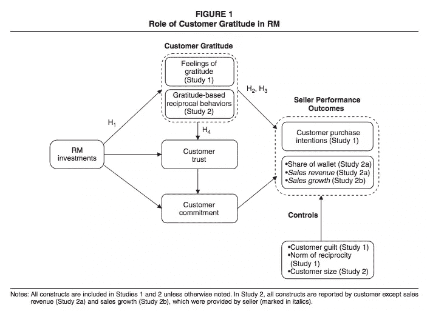

# 关系营销的该做和不该做

> 原文：<https://www.sitepoint.com/relationship-marketing-examples/>

一个流行的 Reddit 帖子让用户讨论不同的公司如何永远赢得他们的生意。

其中一个热门帖子是关于户外服装公司 MooseJaw 的。

这位 Redditor 描述了他的室友如何从 MooseJaw 订购了一件帽衫作为他女朋友的圣诞礼物。然后，在圣诞节前几周，她和他分手了。

室友把帽衫寄回给 MooseJaw 要求退款，在“退货原因”一栏写着“女朋友把我甩了。”

三个星期后，他收到了穆塞贾寄来的一个大包裹。

里面是精选的 t 恤和 MooseJaw 贴纸。还有一张卡片，上面写着，“我们很遗憾你的女朋友和你分手了，我们决定送你一份礼物。”

卡片的其余部分写满了 MooseJaw 工作人员的笔记和笑话。

这是一个最佳关系营销投资的例子。

在关系营销中，明确的目标不是达成交易，而是培养客户忠诚度和长期参与。但是关系营销是一件棘手的事情。

例如，一张手写的便条可以被看作是真诚的和排他的，就像上面的例子一样。但是如果 MooseJaw 忽略了退回的帽衫的背景，而是给顾客发了一封普通的短信，表达他们对不想要的产品的歉意，这一举动可能会被视为不真诚。

获得正确的关系营销需要额外的同理心和意识。

当你向一大群人广播时，没有个性化的期望。

你的信息可以更一般，你的陈述可以更全面。但是当你放大一个人时，会有期望，而且这些期望很高。

这里有一些关系营销的注意事项。

## Do:关注自由意志投资，而不是合同义务投资

啊，自由意志。它可能不会在伊甸园中产生共鸣，但它是关系营销中的热门商品。

“当客户将关系营销投资视为一种自由意志的行为时，他们会比将这些行为视为基于职责的义务或合同要求时更加感激，”罗伯特·帕尔马提埃等人在“[关系营销中客户感激的作用](http://faculty.washington.edu/palmatrw/docs/Role%20of%20Gratitude%20in%20Relationship%20Marketing.pdf)”中写道

在 MooseJaw 的例子中，公司在没有义务的情况下送给客户一份礼物。

举例来说，如果礼物是忠诚计划的一部分，这个行动就不会那么有效。

虽然忠诚度计划是留住客户的明智之举，但它们不会像自发的礼物一样激发客户的感激之情。

这是因为忠诚计划是一种合同义务，并不像出于自由意志的投资那样体现出深思熟虑。

此外，如果出现以下情况，客户会降低关系营销投资的价值:

*   这是每个人都会收到的东西。
*   这是对客户要求的回应。
*   它仅用于匹配竞争报价。
*   它是产品或服务的标准。

这并不是说应该放弃上述任何投资。当然，它们是任何体面企业不可或缺的组成部分，但作为关系营销工具，它们不如自由意志投资有效。

## 不要:等待为客户提供回报的机会

如果一家公司送了一张生日贺卡或一年的免费跳伞课，这并不重要，假以时日，客户的感激之情就会消退。

罗伯特·帕尔马提埃等人写道，在最糟糕的情况下，顾客最终可能“产生负罪感，顾客可能会试图通过解释为什么他们没有回报来缓解这种感觉”。

为了利用他们最大程度的感激之情，公司应该在跳伞票邮寄到达后不久就给客户提供回报的机会(时间敏感的折扣，新产品/服务提醒)。

但是和其他事情一样，这必须要有策略。如果一家公司一直用礼物或优惠给客户惊喜，只是立即宣布一个新的机会，投资将失去其诚意，并被视为另一种营销策略。

## 务必:谨慎行事，除非你真的了解客户

也许你听说过这个故事，或者它的一个变种。

一家公司想要感谢一位客户的持续业务。

该公司没有给客户写贺卡或打折，而是送了客户一瓶好酒。原来当事人是个正在康复的酒鬼。他在别处做生意。

这是一个极端的例子，但它说明了一个更大的问题。

当试图培养忠诚度时，你不会给一个酒鬼送一瓶酒，就像你不会给一个狂热的高尔夫球员送一张篮球赛的门票一样。从表面上看，这是一个很好的姿态，但这并没有向客户表明他们受到了赏识，而是向他们表明他们是一个陌生人。

如果一家公司想打破常规，放弃传统的生日卡，转而选择更个性化的东西，他们首先需要确保它是真正个性化的。投入少量的精力去了解客户的一些情况。

这真的没有那么难。

快速浏览某人的推特或脸书可以提供一年的礼物点子。

稍微超出标准商业领域的简单对话可以产生对客户个人生活的有价值的洞察。

“你周末做了什么？”

“我去钓鱼了。”

“你喜欢钓鱼吗？”

“是的。”

现在你知道该送他们什么了。钓鱼的东西。

除非客户明确告诉你他们现在喝酒，否则不要把酒作为礼物送出去。以防万一。

## 不要:进行与客户的情况和需求无关的投资

MooseJaw 的顾客不一定需要免费的衬衫和贴纸。

他需要的是对他处境的同情。

MooseJaw 明白这一点，他们的礼盒对于手势本身来说是次要的。

如果没有那张表达 MooseJaw 同情的纸条，这笔投资就不会产生同样的影响。

那家伙的女朋友和他分手了。几件衬衫有什么用？

罗伯特·帕尔马提耶(Robert Palmatier)等人认为，“顾客对所获利益的感知需求会影响他或她的感激之情。”

相关关系营销投资的一个很好的例子是纳什维尔的 Gaylord Opryland 酒店。

他们的一位顾客克里斯蒂娜·麦克梅内米迷上了她酒店房间里的闹钟，它播放的轻音乐就像在温泉浴场里看到的一样。

她想要一个自己的，但是在网上找不到。

因此，她通过 Twitter 联系了这家酒店，被告知他们的闹钟不向公众开放。

麦克梅内米正要放弃寻找，这时她回到酒店房间，发现了两个闹钟和一封手写的信。上面说是给她的。

麦克梅内米的回应是每一项关系营销投资都应该希望达到的。

她说,盖洛德·奥普瑞兰德“再次证明，仍然有公司专注于优质服务，你已经成为我的终生粉丝了。”

终身粉丝。这就是梦想。

## 结论

关系营销投资可以培养客户忠诚度和长期参与，但要想取得最大成效，必须深思熟虑，精确执行。

营销人员应该把重点放在自发的、自由意志的投资上，而不是那些有合同义务的投资，在给顾客提供互惠机会之前不应该等待太久。

想要走得更远的营销人员需要事先了解客户的真实情况，并努力为客户提供相关投资。

## 分享这篇文章