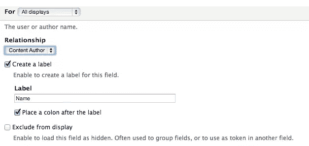
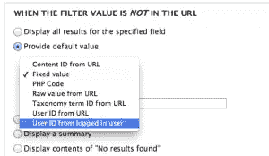
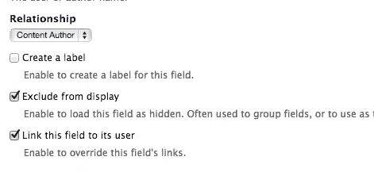

# Drupal 7:视图 3 中的关系、上下文过滤器和字段重写

> 原文：<https://www.sitepoint.com/relationships-contextual-filters-field-rewriting-views-3-drupal-7/>

在本文中，我们将继续探索视图的力量，并重点关注如何使用关系、上下文过滤器和重写字段输出。在之前的教程中，我向您展示了如何创建一个新的视图并为其执行基本的定制。我们已经了解了如何选择显示格式、显示哪些字段以及如何对结果进行过滤和排序。

在本文中，我们将更进一步，看看什么是关系和上下文过滤器——在视图编辑页面右侧的*高级*字段集中找到的两个最重要的选项。此外，我们将重写字段的输出，并将它们的值合并成一个值。

首先，我有一个简单的文章视图，只显示标题。如果你想跟进的话，很容易设置。展望未来，我想实现三件事:

1.  让视图也显示文章作者的用户名
2.  Make 使视图只显示登录用户创作的文章
3.  使作者用户名出现在标题后面的括号中

## 关系

首先，让视图包含文章的作者。如果视图显示的是字段(而不是视图模式或其他)，我们所要做的就是找到带有作者用户名的字段，对吗？不对。问题如下:节点表只包含对创建节点的用户实体的引用(以用户 ID-`uid`的形式)。因此，如果我们寻找用户相关的字段，我们将会找到几乎所有的内容:`Content: Author uid`。

我们需要做的是使用在`user`表中找到的用户实体的关系。关系基本上是表 A(在我们的例子中是`node`)将与表 B(在我们的例子中是`user`)连接，以便从那里检索与之相关的数据(比如用户名和许多其他数据)。在我们的例子中，连接将发生在两个表都匹配的`uid`字段上。

因此，让我们继续添加一个类型为`Content: Author`的新关系。在*标识符*下，我们可以为这种关系起一个描述性的名字，比如*内容作者*。其余的我们可以保留为默认值。

现在，如果您添加一个新字段，您会注意到许多其他与创作内容的用户相关的字段。继续添加`User: Name`字段。在它的设置中，你会在顶部看到一个*关系*选择列表，我们刚刚指定的关系标识符会被自动选中。这意味着该字段是使用该关系(或表连接)拉入的。保存字段将添加作者的用户名，在视图预览中已经可见。



还可以*连锁*关系。例如，如果`user`实体引用了另一个使用唯一标识符的表，您可以添加第二个关系。它将使用第一个并从该表中引入字段。因此，最终结果将是视图将通过创作节点的用户显示与节点相关的字段，但不严格来自`user`表，而是来自与作者相关的其他地方。你可以像这样连接桌子。

## 上下文过滤器

上下文筛选器类似于常规筛选器，因为您可以使用基本相同的字段来筛选记录。上下文过滤器的不同之处在于，当您创建视图时，您不需要设置过滤值，而是从上下文中获取。

过滤器值可以来自许多不同的上下文，但主要来自 URL。但是，您也可以指示视图在其他地方寻找上下文——比如登录用户的 ID。

我们现在要做的是添加一个上下文过滤器，以便视图只显示登录用户创作的文章。所以继续添加一个新的`Content: Author uid`类型的上下文过滤器。接下来，在*下，当过滤器值不在 URL* 字段集中时，选择`Provide default value`单选按钮。我们的目标是，如果视图在 URL 中找不到用户 ID，就让它去别处看看。



然后在*类型*选择列表下有一些选项，你应该在那里选择`User ID from logged in user`。这将使视图获取登录用户的 ID，并将其作为过滤器传递给视图。其余的可以保持原样并保存过滤器。在预览中，您会立即注意到只有您创作的文章才会出现。过滤是动态发生的。如果您使用另一个用户帐户登录，您应该只能看到该用户帐户创作的文章。

上下文过滤器的一个优点是，如果您在自定义模块中以编程方式显示一个视图，您可以在代码中传递过滤值，这为许多可能性打开了大门。

## 重写字段

在本教程中，我们要做的最后一件事是看看如何重写字段来连接它们的值。我们将通过更改 title 字段来说明这种技术，在括号中包含作者用户名。

我们将首先重新排列字段的顺序，并将标题移到最后显示。我们这样做的原因是，当您重写字段时，您可以使用仅从被重写的字段之前添加的字段中获取值的标记。因为我们想要重写 title 字段，所以我们希望用户名值的令牌存在，所以我们需要将它移动到 title 字段之前。

现在 title 字段是最后一个，编辑 author username 字段，取消选中框`Create a label`，然后选中框`Exclude from display`。您现在可以保存该字段。我们不在视图中显示这个字段的原因是，一旦我们将它连接到 title 字段，就不会重复它。



接下来，编辑标题字段，在*重写结果*下，勾选复选框`Rewrite the output of this field`。下面应该会出现一个新的文本区域，我们将在其中写入该字段的新内容。如果你在那里写了一些胡言乱语并保存了字段，你会注意到标题被这些胡言乱语取代了。

在这个文本区下面，你还会注意到一些*替换图案*。这些表示在这个视图之前加载的视图中所有字段的标记(也包括这个)。所以如果你跟着走，你会看到这里有`[name]`和`[title]`，还有其他的。

我们现在需要做的是将这些令牌放入这个盒子中，用我们想要的文本或标记进行包装。已经说过，我们希望用户名在节点标题后的括号中，我们可以在文本框中添加以下内容来实现这一点:

```
[title]  ([name])
```

保存字段并检查结果。现在，您应该将作者用户放在括号中。然而，它仍然不是完美的。我们让标题字段的`Link this field to the original piece of content`框处于选中状态，由于用户名有一个到用户个人资料页面的链接，这有点破坏了我们的输出。我们想要的是到节点标题的清晰链接，以及括号中链接到用户配置文件页面的用户名(括号本身不链接到任何内容)。

首先，添加一个名为`Content: Path`(节点的路径)的新字段。请确保将其从显示中排除，移除其标签并将其移动到标题字段之前。然后，编辑标题字段，取消选中`Link this field to the original piece of content`框，并用以下内容替换*重写结果*文本:

```
<a  href="[path]">[title]</a> ([name])
```

从我们刚刚添加的新字段中可以获得`[path]`令牌。保存后，您应该在预览中看到标题节点和括号中的用户名的更清晰的显示。

## 结论

在本教程中，我们研究了在 Drupal 7 中构建视图的三个主要方面:关系、上下文过滤器和重写字段。我们已经看到，通过使用关系，我们还可以使用来自相关实体的信息，而不仅仅是视图所基于的基表上的信息。当视图需要根据各种上下文条件(如 URL 或登录用户)动态显示内容时，上下文过滤器非常有用。最后，我们学习了如何重写字段，以及如何用来自多个字段的值构建更复杂的字段。如您所见，这种技术对于主题化视图非常强大，因为它允许我们输出复杂的标记。

Views 几乎是最流行的 Drupal 模块，它非常复杂。尽管很复杂，但作为站点管理员构建视图是非常容易的。所有你需要理解的是一些基本概念，你就可以开始了。为视图开发以扩展其功能或向其公开数据也是一种令人愉快的体验。如果你想了解更多，你可以在 Sitepoint.com 上阅读我的关于将你自己的定制模块表暴露给视图[的教程。](https://www.sitepoint.com/exposing-tables-views-drupal-7/)

## 分享这篇文章