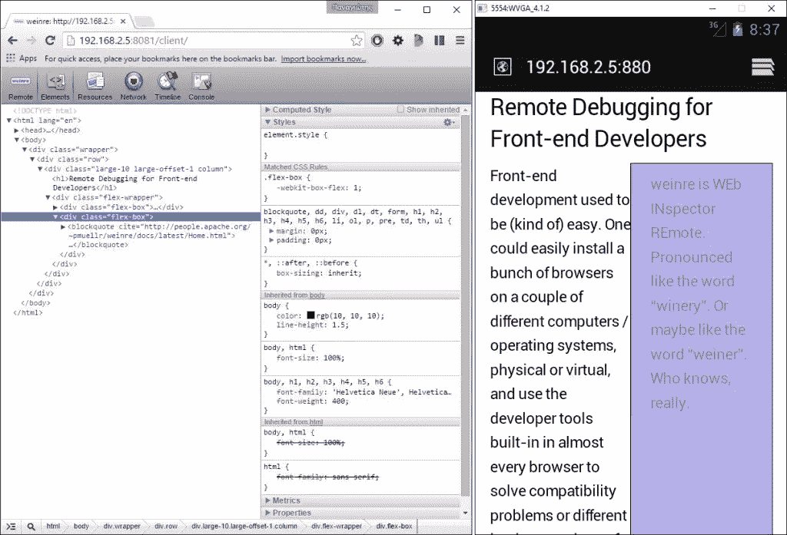
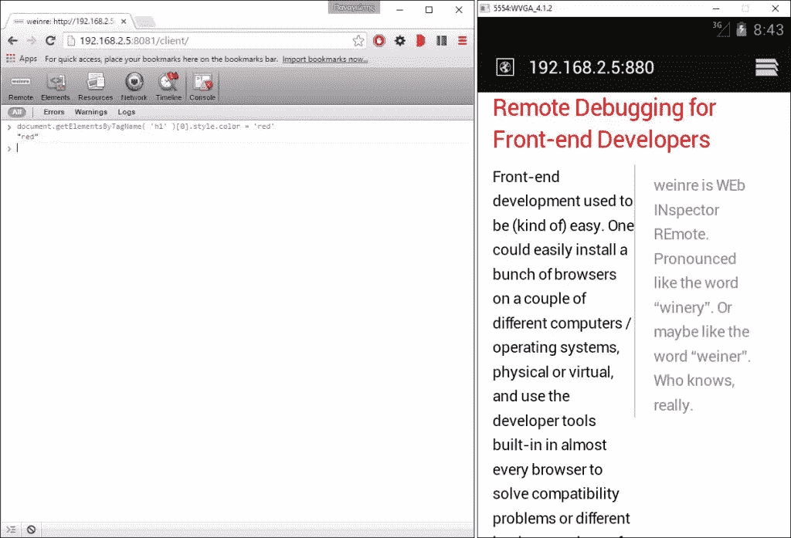
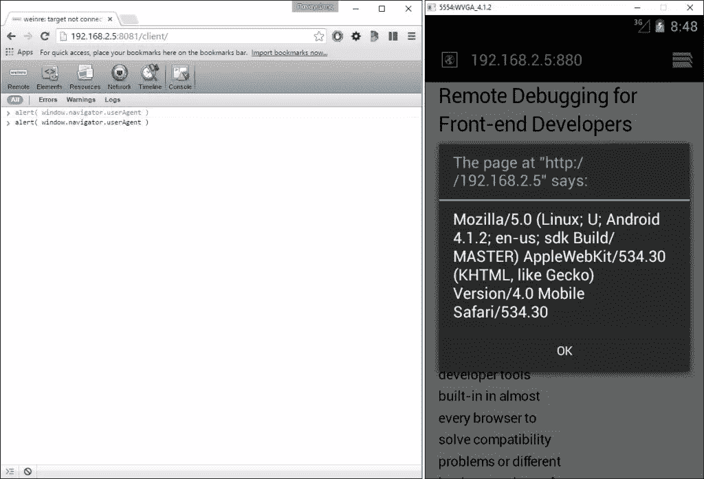
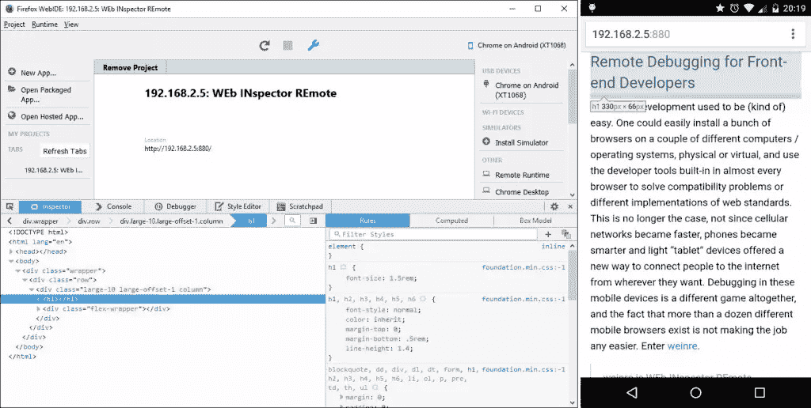
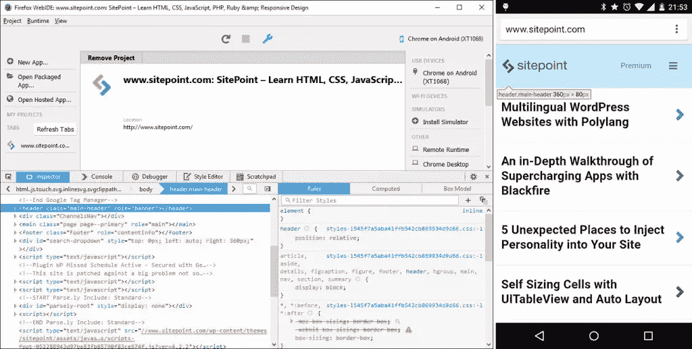
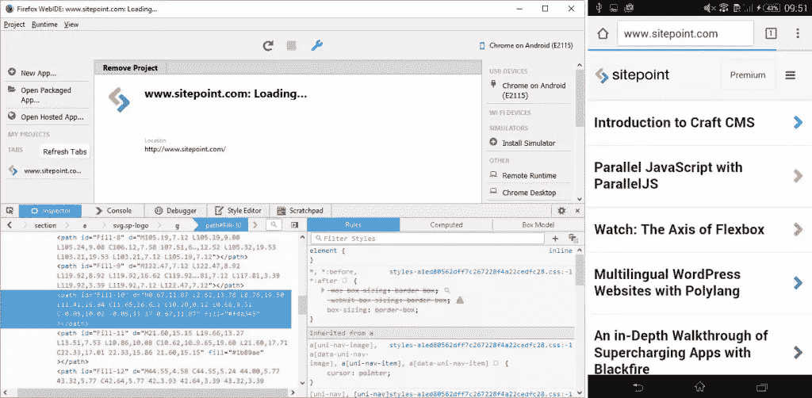
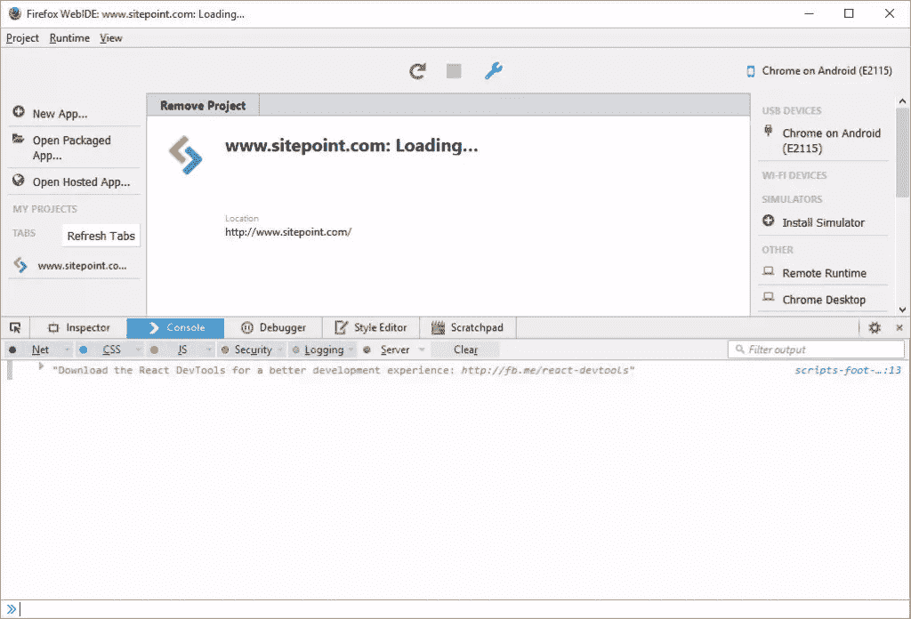
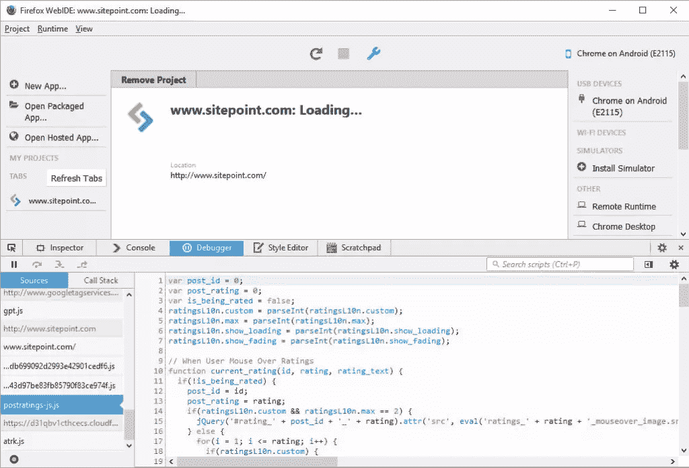

# 前端开发人员的远程调试

> 原文：<https://www.sitepoint.com/remote-debugging-for-front-end-developers/>

前端开发曾经(有点)容易。您可以在几台不同的计算机/操作系统(物理的或虚拟的)上安装一些浏览器，并使用几乎每个浏览器中内置的开发工具来解决兼容性问题，或者解决 web 标准的不同实现。现在情况不同了，因为蜂窝网络变得更快，手机变得更智能，轻便的“平板”设备提供了另一种方式将人们从任何地方连接到互联网。在这些(大部分)移动设备上调试是一种不同的游戏，事实上存在十几种不同的移动浏览器并没有使这项工作变得更容易。这就是远程调试派上用场的地方。

## [韦恩雷](http://people.apache.org/~pmuellr/weinre/docs/latest/Home.html)

WEb INspector REmote 旨在跨不同设备对网页进行远程检查和调试。这是一个有用的工具，尤其是当你在 Linux 或 Windows 上开发时，需要在 iOS 上调试一个" [UIWebView](https://developer.apple.com/library/ios/documentation/UIKit/Reference/UIWebView_Class/) "或 Safari。weinre *在 WebKit* 重用来自 Web Inspector 项目的用户界面代码，因此大多数前端开发人员应该已经熟悉了这个工具箱。

### 装置

在官方网站上有[安装 weinre 的文档](http://people.apache.org/~pmuellr/weinre/docs/latest/Installing.html)。这是一个 [node.js](https://nodejs.org/en/) 模块，所以你必须先安装它。在 Mac OSX 和 Linux 上，安装 Node.js 后，安装就像运行以下命令一样简单:

```
sudo npm -g install weinre
```

文档对如何在 Windows 上使用 weinre 不是很清楚，所以我将提供更多关于 Windows 方面的信息。你应该知道的第一件事是你的 IP 地址，因为访问`localhost`或`127.0.0.1`上的页面是不行的。你可以在 Linux 或 Mac OS 上使用`ifconfig`在 Windows 上使用`ipconfig`找到你的 IP 地址。静态 IP 地址对于使用 weinre 的开发人员来说是理想的，否则你可能不得不在每次启动计算机时发现你的 IP 地址！如何从你的本地网络获得一个特定的 IP 地址超出了本文的范围，但是这里有[Windows](http://www.howtogeek.com/howto/19249/how-to-assign-a-static-ip-address-in-xp-vista-or-windows-7/)指南、[Mac OSX](http://www.howtogeek.com/howto/22161/how-to-set-up-a-static-ip-in-mac-os-x/)指南和[Ubuntu](https://www.howtoforge.com/linux-basics-set-a-static-ip-on-ubuntu)指南。

然后你需要一个 HTTP 服务器，因为你不能在移动设备上加载 HTML 文件(这就是为什么你必须知道你的计算机的 IP 地址！).你可以使用 [node.js](https://www.sitepoint.com/creating-a-http-server-in-node-js/) 、 [Apache](http://apache.org/) 、 [IIS](https://www.iis.net/) ，或者像[中间人](https://middlemanapp.com/)或 [Jekyll](http://jekyllrb.com/) 这样的静态站点生成器——任何最适合你的工作流程的。还有[一个 RubyGem](https://rubygems.org/gems/middleman-weinre) 为中间人添加了一个简单的助手方法。我将使用 Apache，并提供下面这个并不特别有趣的静态 HTML 文件，它的样式刚好足以进行远程检查:

```
<!DOCTYPE html>
<html lang="en">

<head>
  <meta charset="utf-8">
  <title>WEb INspector REmote</title>
  <meta name="viewport" content="width=device-width, initial-scale=1">
  <link rel="stylesheet" href="css/foundation.min.css">

  <style> .flex-wrapper {
      display: -webkit-box;
      display: -webkit-flex;
      display: -ms-flexbox;
      display: flex;
      -webkit-flex-wrap: wrap;
          -ms-flex-wrap: wrap;
              flex-wrap: wrap;
    }

    .flex-box {
      -webkit-box-flex: 1;
      -webkit-flex: 1 1 30em;
          -ms-flex: 1 1 30em;
              flex: 1 1 30em;
    } </style>
</head>

<body>

<div class="wrapper">
  <div class="row">
    <div class="large-10 large-offset-1 column">
      <h1>Remote Debugging for Front-end Developers</h1>

      <div class="flex-wrapper">
        <div class="flex-box">
          <p>Front-end development used to be (kind of) easy.
          One could easily install a bunch of browsers on a couple 
          of different computers / operating systems, physical 
          or virtual, and use the developer tools built in almost 
          every browser to solve compatibility problems, or work 
          around different implementations of web standards. 
          This is no longer the case, not since cellular networks 
          became faster, phones became smarter and light “tablet” 
          devices offered a new way to connect people to the internet 
          from wherever they are. Debugging in these (mostly) 
          mobile devices is a different kind of game, and the fact 
          that more than a dozen different mobile browsers 
          exist is not making the job any easier.</p>
        </div>
        <div class="flex-box">
          <blockquote cite="http://people.apache.org/~pmuellr/weinre/docs/latest/Home.html">
            <p>weinre is WEb INspector REmote. Pronounced like
            the word “winery”. Or maybe like the word “weiner”. Who 
            knows, really.</p>
          </blockquote>
          <p>WEb INspector REmote was built to enable remote inspection 
          and debugging of web pages across different devices. It’s a 
          useful tool, especially when you need to debug a ”UIWebView” 
          or Safari on iOS while developing on Linux or Windows. weinre 
          *reuses the user interface code from the Web Inspector project 
          at WebKit* so most front-end developers should already be  
          familiar with the toolbox.</p>
        </div>
      </div>
    </div>
  </div>
</div>

</body>
</html>
```

### 跑步 Weinre

如果你不想每次运行时都用[配置 weinre](http://people.apache.org/~pmuellr/weinre/docs/latest/Running.html) ，你应该在`.weinre`目录下做一个`server.properties`文件。在您的配置文件目录中打开一个命令提示符(Windows 用户:您*必须*使用控制台以该名称创建一个文件夹！按`Win + R`键，键入“cmd”或按“Windows”键，从“命令提示符”键入几个字符，然后按`enter`键，键入`mkdir .weinre`键，创建一个新目录。对于 Windows 用户来说，最终的路径应该类似于`C:\Users\YOU_USER_NAME\.weinre`。

这个文件夹准备好后，在里面创建一个名为`server.properties`的新文本文件，内容如下:

```
boundHost:    -all-
httpPort:     8081
reuseAddr:    true
readTimeout:  1
deathTimeout: 5
```

如果那个被占用，请随意更改`httpPort`。您现在应该能够通过在命令提示符下键入`weinre`来运行 weinre 了，weinre 服务器将监听所选的端口。在需要调试的页面(或者上面我们提供的测试 HTML 文件)中添加下面一行:

```
<script src="http://YOUR_IP_ADDRESS:8081/target/target-script-min.js"></script>
```

启动你最喜欢的基于 **webkit 的**浏览器，输入 weinre 服务器的地址:`http://YOUR_IP_ADDRESS:8081/client/`。这是你的调试器！现在，在你的智能手机/平板电脑、不同的浏览器、电脑甚至虚拟操作系统/设备上打开你刚刚添加了`script`的网页——这没有任何区别。您应该能够在 weinre 调试器上看到这个客户端，并使用这些开发工具来检查设备上的页面！您可以在任何 DOM 元素上查看(大多数)应用的 CSS，添加、移除或更改内联样式，并在控制台中查看任何 JavaScript 消息。您还可以在控制台中运行 JavaScript 命令并操作 DOM。这应该足以帮助查明任何渲染错误或意外行为！

### 韦恩雷在行动

下面是一个在 Android 4.1.2 中检查默认浏览器的例子:



我们可以使用 JavaScript 控制台更改文本颜色:



以及任何其他 JavaScript 命令:



### 使用 Weinre 的应用程序

*   [Prepros](https://prepros.io/) 是一款编译 Less、Sass、Compass、Stylus、Jade 等的工具，带有自动 CSS 前缀，内置服务器，具有跨浏览器测试和远程调试功能。它甚至可以跨平台工作！

## 巴伦西亚

Valence 是 Firefox 的一个插件，它使 Firefox 开发工具能够远程检查/调试 iOS 上基于 Gecko 的浏览器、Chrome 和 Safari。调试“目标”可以是 iOS 设备或 Chrome 桌面浏览器(使用`--remote-debugging-port=9222`特殊的“标志”来允许远程检查——参见 Valence 网站上的 [Chrome 桌面设置](https://developer.mozilla.org/en-US/docs/Tools/Valence#Chrome_Desktop_setup)段落以获取说明)或 Firefox OS。不幸的是，Valence 不能检查 Android 设备模拟器，或旧的 Android 设备，但 iOS *上的 UIWebViews 和模拟器可以*检查——尽管我没有试过，因为我没有苹果电脑。

智能手机/平板电脑必须物理连接到您的计算机，如果您使用的是 Windows，您可能需要[为您的设备](http://developer.android.com/tools/extras/oem-usb.html)安装 USB 驱动程序，这可能存在，也可能不存在！如果 Windows 用户需要检查 iOS，他们还必须安装 [iTunes](http://www.apple.com/itunes/download/) 。最后，必须启用*开发者模式*和/或 *USB 调试*——当您的工作完成后，请记得取消设置！Valence 目前相当有限，而且作为一个早期测试版可能有些不稳定，但它是一个有前途的工具。

### 作用价

在 Android 5 智能手机上检查 Chrome 浏览器的 HTML 源代码和样式:



可以检查任何地点:



向 SVG 路径添加颜色属性，以更改徽标:



Ok React…谢谢你在下面给我留控制台消息！



下面是调试 JavaScript 的一个例子:



## 结论

在*桌面*浏览器上调试任何 CSS 渲染不一致或不同的 JavaScript 行为相对容易——现在很少需要，因为大多数现代浏览器定期更新并支持大量的 web 标准。但是*移动*浏览器并不是那么容易开发的。实际上有几十个，虽然[我能使用吗](http://caniuse.com/)数据库提供了关于不同平台中 CSS 和 JavaScript API 支持的有价值的信息，但了解给定浏览器对给定功能的支持有时与看到它或根本看不到它是不同的！Weinre 和 Valence 可以极大地帮助前端开发人员，提供远程检查/调试移动设备的工具。

## 分享这篇文章