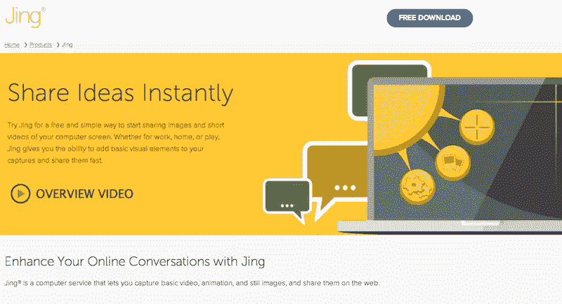
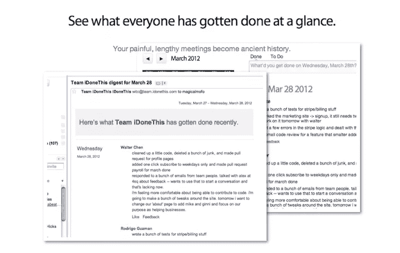
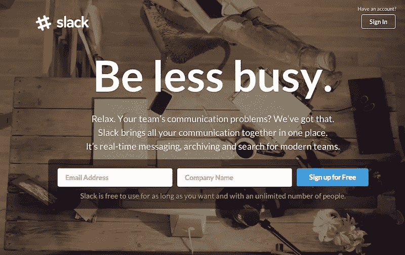
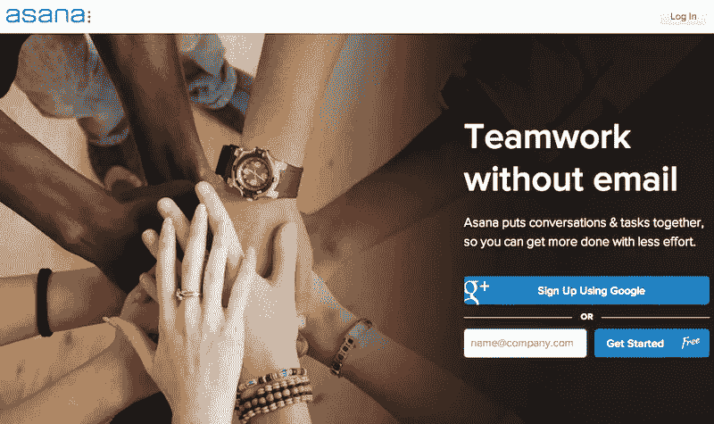

# 远程工作生存指南:14 个基本工具和技巧

> 原文：<https://www.sitepoint.com/remote-work-survival-guide-14-essential-tools-tips/>

根据 Intuit 的一项调查，到 2020 年，超过 40%的美国工人将成为自由职业者、合同工或临时工。

甚至在自由职业者之外，分布式团队的数量也在增加。

这些趋势意味着，如果你还没有和远程客户或团队成员一起工作，你很快就会了。

虽然远程工作有很多好处，但它绝对是一种调整，你需要一套新的沟通技巧和工具来使它发挥作用。

成为一名高效的远程工作者的第一步是学会避免人们陷入的两个最常见的陷阱:过度管理和管理不足。

正在寻找你的下一个角色？SitePoint 远程工作板帮助你找到科技领域最好的远程工作。

## 如何应对微观管理

当你和不习惯远程工作的人一起工作时，他们会很快变得…粘人。因为他们不能在你的工作间停下来看看你在做什么，他们开始每小时整点给你发一封电子邮件。

听起来熟悉吗？

### 如果你发现自己被微观管理，该怎么办

*   **建立沟通标准。无休止的会议对任何人都没有好处。回复纠缠不休的电子邮件也是如此。告诉你的客户，你会在合理的时间间隔内通过电子邮件与他们联系(无论是在工作日结束时还是每周一次，取决于你要与他们一起做的工作)，然后坚持这样做。如果他们拒绝，解释你花在邮件上的时间不是花在项目上的时间。这将花费他们更多的钱，并使你更难在截止日期前完成实际的交付。**
*   定期发送更新。有工具可以简化这一过程(参见本文末尾的应用程序部分)，但你也可以发送一封简短的电子邮件。在你设定了沟通标准之后，向客户展示你仍然会定期更新这些标准是很重要的。
*   创建操作文档或视频。有时候，客户需要更多的帮助，因为他们不知道你正在做的任务中包含了什么。如果他们想知道如何安排电子邮件自动回复或自己对模板进行小的编辑，请使用下面应用程序部分的工具之一为他们录制一个操作视频。这有助于停止无休止的提问。
*   作为团队成员，按时完成工作。这是不言而喻的，但是如果你经常在最后一分钟提交工作——甚至迟到——那么你是在鼓励客户的微观管理倾向，而不是与他们建立信任。

### 当*你*是微观管理者

随着自由职业者业务的增长，你可能需要偶尔引入分包商来帮助你的项目。

然后有一天，当你正在发送一天中的第三封电子邮件时，你惊恐地意识到*你现在是*微观管理者。你已经变成了你以前讨厌打交道的那个客户。

在这种情况下，后退一步，问问自己是什么导致了这个问题。

你在和你还不太信任的人一起工作吗？你觉得他们没有交流他们正在做的事情吗？建立一个内部项目管理工具是否有助于你跟踪正在完成的工作以及人们有什么问题？

找出你的症结所在——然后采取措施解决它。

## 相反的问题是:管理不足

另一方面，当你在一个远程团队中，你做了你的工作并提交了它，却只能听到完全的无线电静默。

不知道你是否做了正确的事情，错误的事情，你是否应该改变你的提交日期，或者你是否只是把你的工作送进了无尽的空白。

管理不足通常不像微观管理那样令人讨厌，但也会让人失去动力。

### 如果你在和一位副经理打交道，该怎么做

*   如果你有问题，确保你知道如何与某人联系。如果你的客户在你完成工作时经常擅离职守，重要问题就很难得到答案。确保你有一个可以联系到他们的号码，或者如果你需要的话，可以通过其他方式快速得到答案。收集你需要的任何登录信息(网站、社交账户等)也是一个很好的常规做法。)在项目开始的时候而不是等到你需要的时候，以防以后你联系不到任何人。
*   要求能够跟上团队成员。如果孤立让你很难保持动力，要求通过信息工具或简单的脸书群与其他团队成员交流。了解你正在工作的团队可以让你感觉不那么孤立，它还有额外的副作用，可以帮助你从整体上理解项目，而不仅仅是你的一部分，这通常会让你创造出更强的工作。
*   明确沟通中的延迟有时意味着交付成果的延迟。不管出于什么原因，有些人认为完全有理由从雷达上消失，不回答任何问题，然后几周后重新露面，希望你在他们回复你的电子邮件后几分钟内放下一切，开始他们的项目。希望你不会经常和这样的客户打交道，但确保你的客户在项目开始时就意识到如果他们花一周而不是几天回复邮件，这将大大延长项目的持续时间(通常是成本)，这总是一个好主意。

### 如果你发现自己是副经理

如果你知道自己有可能成为一名行动中失踪的经理人，确保人们有一个简单的联系方式(无论是通过电话、脸书还是下面的应用程序)。如果你经常和同一群分包商一起工作，考虑建立某种内部交流平台，这样他们就可以互相保持联系。

## 取得正确的平衡:5 个应用程序来帮助

**价格:**免费

Jing 非常适合我之前建议的那些操作视频。长达五分钟的视频完全免费(如果你在录制更长的视频，试试[Screencast-O-Matic](http://www.screencast-o-matic.com/)——也是免费的！)并有内置上传器。

你只需录下你的画面，点击上传按钮，Jing 马上给你一个链接，你可以通过电子邮件发送给你的客户。它也超级容易使用，所以如果你需要别人的视频，即使是最不懂技术的人也能弄清楚。

### [苏格兰场](http://evernote.com/skitch/)

**价格:**免费

Skitch 是 Evernote 的一款应用，可以让你快速轻松地创建添加了文本、箭头和其他图形的截图。需要告诉别人点击什么按钮，或者你得到什么错误？使用 Skitch 快速轻松地指出来。(如果你是在写而不是录，它也很适合为操作文档创建截图插入。)

### [我知道这个](https://idonethis.com/)

价格:免费 30 天试用，商务版每个用户每月 5 美元

这正是它听起来的样子。每天，它会给你团队的所有成员发送一封邮件，要求他们快速汇报当天的工作。每个团队成员通过回复电子邮件或在 web 界面中输入他们的每日报告进行汇报。

一天结束时，每个人都会收到一封电子邮件，告知团队的每日进展，让每个人都保持一致。用户还可以在在线界面上评论他人的活动，无论是问问题还是说“干得好！”

### [松弛](https://slack.com/)

价格:免费，付费选项从每个用户每月 7 美元起

Slack 的目标是集中团队内部的交流，减少电子邮件，从好评如潮来看，它做得相当不错。

Slack 的工作方式很像过去的 IRC 频道，只是它集成了 Dropbox、Twitter、Google Drive 等等。它将所有信息存档，并使搜索过去的对话变得容易。Slack 为 iOS、Android 和 OS X 提供了 web 界面和原生应用。

### [体式](https://asana.com/)

价格:15 人以下的团队免费，之后每月 50 美元(或更多，视团队规模而定)

Asana 是免费的，易于使用，并且有一些 Basecamp 缺乏的关键功能，比如重复任务。

您可以对任务进行评论，将它们分配给其他人，讨论，在列表或日历中查看任务，项目模板非常灵活，可以处理从典型的有时间限制的项目到 bug 跟踪的所有事情。

## 分享这篇文章