# 如何在 Photoshop 中移除背景:6 种快速简单的方法

> 原文：<https://www.sitepoint.com/remove-background-photoshop/>

**随着 Photoshop 在过去几年中的许多进步，** **从图像中移除背景从未如此简单快捷。了解如何在 Photoshop** 中去除图片的背景。

了解用于您正在处理的图像类型的最佳方法是使用最佳技术获得最佳结果的关键。

以下是使用 Photoshop Creative Cloud 移除照片背景的六种方法，以及何时使用每种技术可以获得最佳效果。

## 1.在 Photoshop 中使用对象选择工具移除背景

Photoshop 最显著的功能之一是新的对象选择工具，这是 Photoshop 2022 的新功能。对象选择工具利用 Adobe Sensi AI 技术来为您选择照片中的对象。

### 对象选择工具步骤

在 Photoshop 中打开你的照片，选择左边工具栏中的**对象选择**工具(与快速选择工具在同一个菜单中)。

现在，将光标悬停在你的主题上，等待它变成蓝色。(如果光标没有立即变成蓝色，请在小圆圈内移动光标。)

瞬间，你的主题就准备好了，可以被选中。

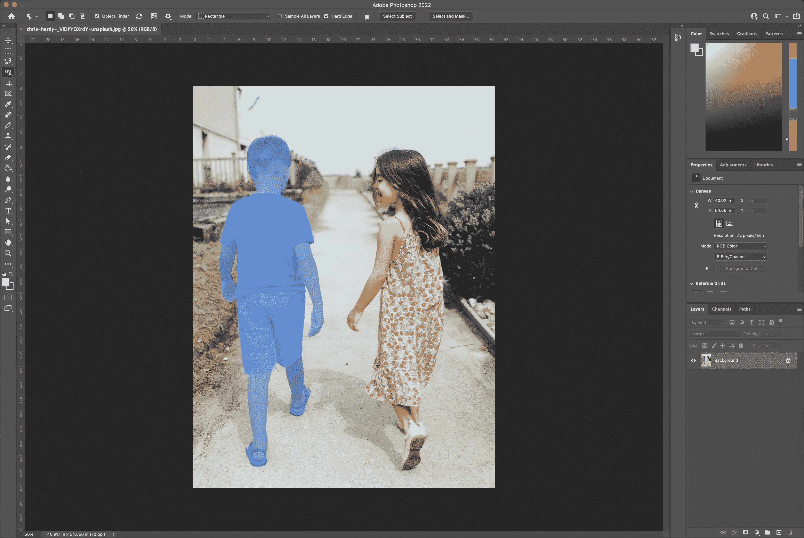

要擦除此处的背景材料，请按下`shift`键，同时选择您想要保留在照片中的所有对象。这个快捷方式将为你自动选择每个对象(显示每个实体周围行进的蚂蚁)。

接下来，转到**选择** > **反转**来反转选区(意味着你的背景现在被选中了，而不是你的物体)。

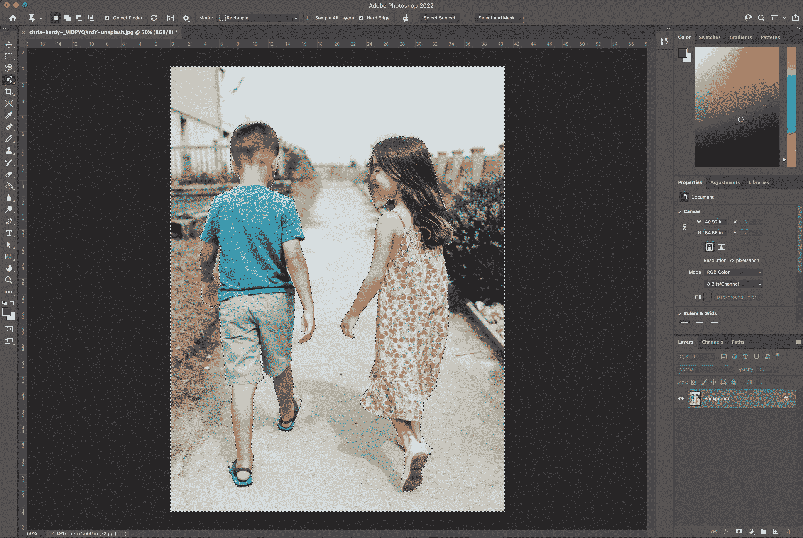

根据你希望背景是什么(在我的例子中，我希望它是透明的)，你可能需要解锁你的图像，所以它不再被认为是背景。

接下来，点按图像层右侧的锁以将其解锁。如果没有其他图层，图层名称将更改为“图层 0”。要删除背景，点击**橡皮擦工具**(确保你的笔刷很大)并开始擦除背景。

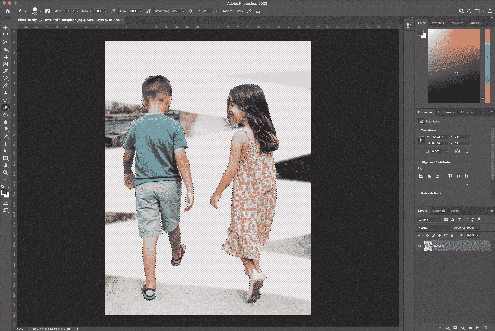

你不必担心 Photoshop 会丢失选区。如果您需要重新选择您的对象，请选择对象选择工具并再次悬停在您的对象上。

您可以学习如何[编辑由对象选择工具创建的结果蒙版](https://helpx.adobe.com/photoshop/using/making-quick-selections.html)(如果它没有在初始选择中获得所有内容)。

*图片来源:[克里斯·哈迪在 Unsplash](https://unsplash.com/photos/_ViDPYQXrdY) 上 *

## 2.在 Photoshop 中快速移除背景

最佳使用时机:你正在为自己做这件事，你很快就需要它，而且你不一定要追求完美。最好在主体和背景之间有高对比度的情况下使用，并且当主体有相当简单的线条时使用。

到目前为止，这里讨论的最快的方法是内置的 Photoshop **快速动作**，用于在 Photoshop 中移除背景。它是在 Photoshop 2021(在 Creative Cloud 订阅中)中引入的，并提供了一个有效且易于使用的 Adobe 背景去除器。

然而，速度越快，准确性就越低。使用 Photoshop Quick Action 将为您完成大部分工作，但结果可能达不到您的预期，这取决于您的图像。如果是这种情况，您可以使用这里描述的任何方法来润色结果。

### 快速行动步骤

1.  在 Photoshop 中打开您的图像，右键单击您的背景层，然后单击**复制层**。在弹出的对话框中，给你的图层命名(随便你怎么叫)，点击**确定**。单击原始层左侧的眼睛图标以关闭该层。
2.  进入**窗口** > **属性**，确保属性面板打开。(如果已经勾选了，就不用点了；如果未选中，默认情况下，单击它在右侧打开。)
3.  In your Layers panel, click your new layer. In the Properties panel (by default this should be above your Layers panel), click the **Remove Background** button under **Quick Action**.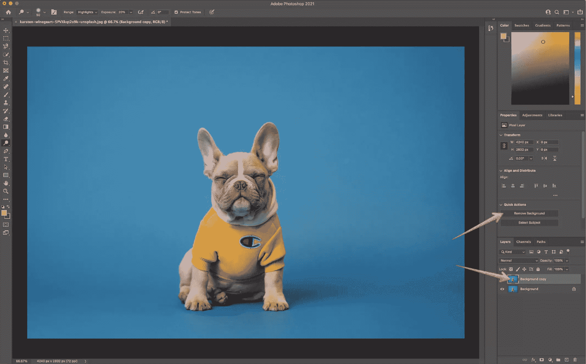
4.  The quick action has now removed the background, leaving your layer with a mask around the subject.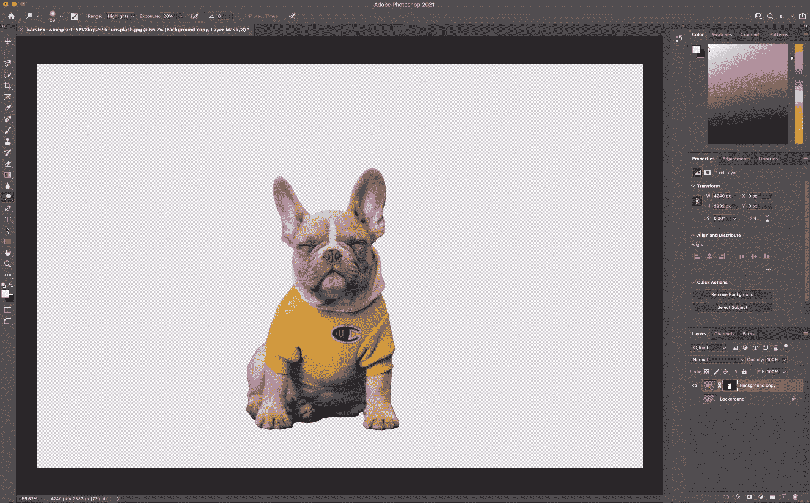

从这里，你可以通过进入遮罩并根据需要进行调整(例如在图像左下方的狗的脚周围)来进行细化。虽然超出了本文的范围，但如果你需要使用蒙版的帮助，[看看这个 Adobe 教程](https://helpx.adobe.com/photoshop/how-to/layer-mask.html)。

*图片来源:[卡斯滕·温格特在 Unsplash 上](https://unsplash.com/photos/5PVXkqt2s9k)*

## 3.在 Photoshop 中使用背景橡皮擦工具移除背景

最佳使用场合:处理高对比度图像，尽管这需要相当多的时间和精力来产生良好的效果。

如果你需要更多地控制在 Photoshop 中移除背景，但仍然希望 Photoshop 为你做一些繁重的工作，那么**背景橡皮擦**工具是非常好的。为了更多的控制，你必须牺牲一些时间来获得想要的结果。根据你的照片，使用背景橡皮擦工具可能会非常有效，节省时间，让你更接近你想要的结果。

### 背景橡皮擦工具步骤

1.  在 Photoshop 中打开您的图像，右键单击您的背景层，然后单击**复制层**。在弹出的对话框中，给你的图层命名(随便你怎么叫)，点击**确定**。单击原始层左侧的眼睛图标以关闭该层。
2.  从左侧的工具箱中选择背景橡皮擦工具。此工具可能隐藏在橡皮擦工具下面。点按并按住橡皮擦工具以显示更多选项，并选择背景橡皮擦工具。
3.  In the tool options bar at the top of the screen, click the brush icon to reveal the brush panel.

    改变硬度，使其接近或等于 100%。

    The size can be whatever you deem appropriate for the image you’re working with. In this case, I’m starting with 50px.

    你可以使用方括号(`[`和`]`)来调整画笔的大小。

    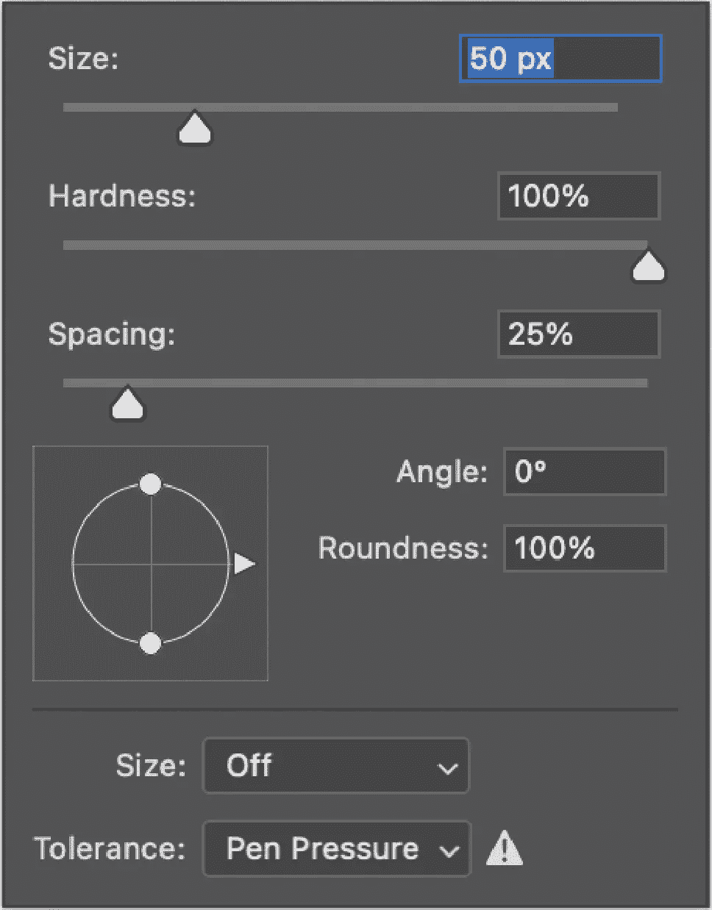
4.  Still in the tool options bar at the top, set the Sampling to be **Continuous**. It’s the first of three icons after the brush size option. Next, set the Limits to **Find Edges** and the Tolerance to be somewhere in the range of 20–25%.

    请注意，容差越低，拾取的颜色变化就越少。相反，容差越大，工具选择的颜色就越多。

    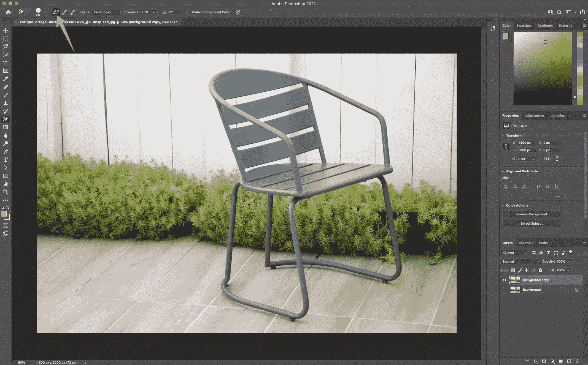
5.  Start erasing the background around your subject using the Background Eraser tool by clicking and holding while moving the brush. The goal here is to keep the crosshairs inside the tool from touching your subject. Zoom in on the image if you need to see more close details.

    我建议你用刷子短划(记得不时放开鼠标)，这样如果刷子走得太远，你可以随时撤销。

    In the more difficult areas, you may find that you need to adjust the size of your brush as you go. You can do this by revisiting the tools option bar at the top, or using `[` and `]` to adjust down and up the size of your brush.

    如果调整笔刷大小不起作用，并且它正在擦除你的主体，首先撤销你的操作。之后，进入顶部的工具选项栏，调整采样到**一次**(三个图标中的中间图标)，限制到**不连续**，公差到 10%左右。作为这些设置的结果，笔刷将只使用十字准线下的颜色，而不会在进行过程中重新采样。

    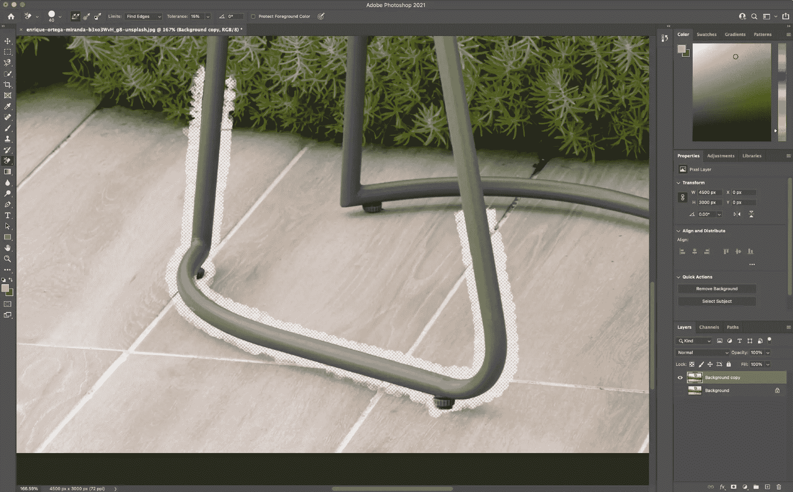

虽然这个过程可能很快或很乏味，这取决于您的图像，但它提供了良好的结果。你可以决定什么是主题，什么不是。如果这还不能完成工作，这里提到的其他方法可以帮助你更接近你想要的结果。

查看这个 Adobe 教程以获得背景橡皮擦工具的更多详细信息。

*图片来源:[恩里克·奥特加·米兰达在 Unsplash](https://unsplash.com/photos/b3xo3WvH_g8) 上*

## 4.在 Photoshop 中使用钢笔工具移除背景

最适合在以下情况下使用:主体和背景对比度不高，或者其他工具(如上面提到的快速动作或背景橡皮擦工具)不能产生理想的效果。在这里列出的所有方法中，它给了你最大的控制权。

**钢笔**工具是 Photoshop 中去除图像背景的最可靠的方法之一。它给了你对结果最大的控制权。然而，因为它给你最多的控制，它也可能是最耗时的。钢笔工具需要耐心。

### 钢笔工具步骤

1.  在 Photoshop 中打开您的图像，右键单击您的背景层，然后单击**复制层**。在弹出的对话框中，给你的图层命名(随便你喜欢什么)，点击**确定**。单击原始层左侧的眼睛图标以关闭该层。
2.  Select the Pen tool from the toolbox on the left-hand side (above the Text tool). Zoom in to an area of your image to start. Start at the edge of your subject (or a suitable starting point) and click to start the first anchor. Then start working your way around your subject, adding additional anchors to start outlining your subject.

    如果你需要画一条曲线，点击-按住-拖动产生一条曲线，移动鼠标根据需要调整曲线。

    To adjust an anchor point or directional lines for fine tuning, use the Direct Selection tool (hidden under the Path Selection tool) in the toolbox.

    若要撤销锚点，请转到**文件** > **撤销**或使用键盘快捷键(macOS 为`Command` + `Z`，Windows 为`Control` + `Z`)。

    For more info about the Pen tool and working with paths in Photoshop, [read this Adobe tutorial](https://helpx.adobe.com/photoshop/using/editing-paths.html).
3.  一旦你完成了第一点，确保你完成了路径。一旦你完成了路径并且对结果满意，你会想要保存路径。进入**窗口** > **路径**显示路径面板(默认情况下应该出现在右侧)。点击右边的三栏菜单，点击**新建路径**，给你的路径命名。现在，您的路径已保存在“路径”面板中。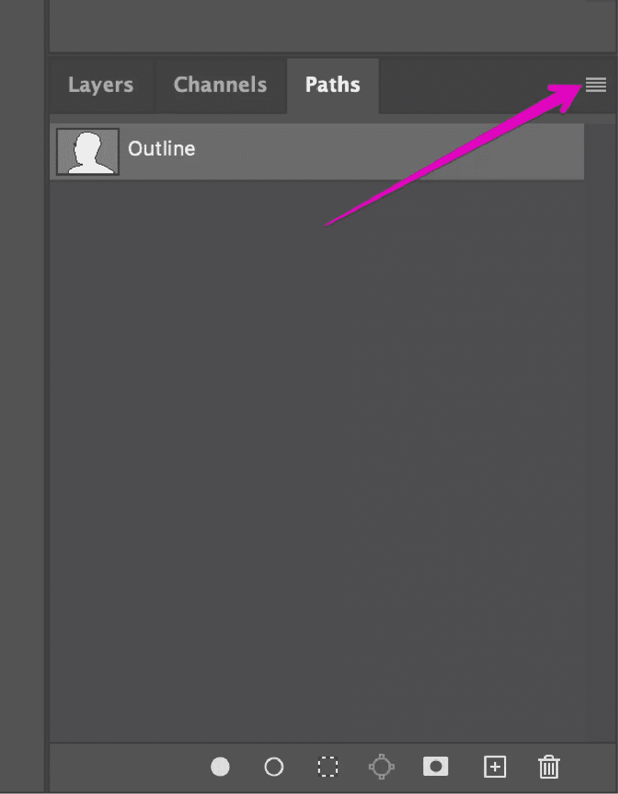
4.  接下来，右键单击路径面板中的新路径，选择**选择**，然后在对话框中单击**确定**(暂时保留所有默认值)。这会给你行进中的蚂蚁勾勒出你的路径。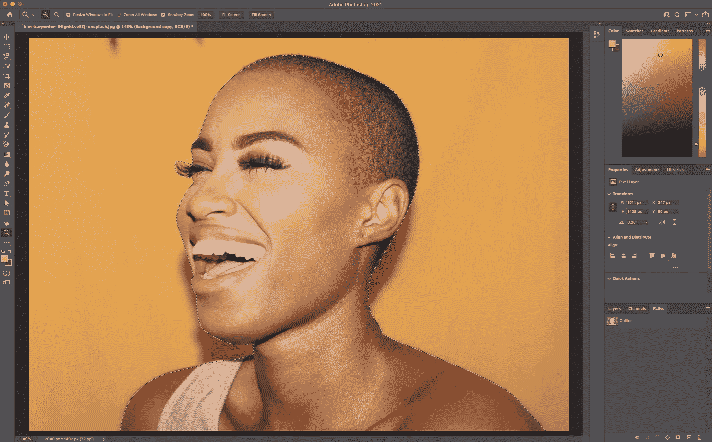
5.  因为我们不想删除选区内的内容，所以我们想将选区更改为除主题之外的所有内容。前往**选择** > **逆**。你会看到行进中的蚂蚁现在围绕着整个图像和主体，本质上是在选择背景。
6.  要删除背景，按**删除**。你现在应该看到白色/灰色方格背景，而不是你以前的背景。【T2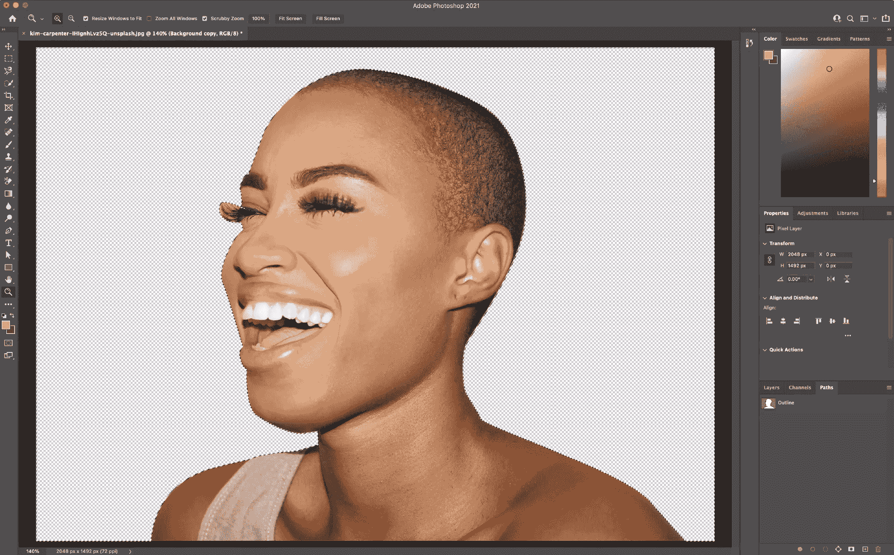

和列出的其他方法一样，你可能会发现这并不能让你 100%达到目标。结合使用钢笔工具和其他方法将有助于你更接近你想要的结果。(例如，我会使用不同的方法来帮助细化这张照片中女人的睫毛区域。)

关于钢笔工具的更多详细信息，请看这个 Adobe 教程。

*照片鸣谢:[金木匠踩着 un splash](https://unsplash.com/photos/IHIgnhLvz5Q)*

## 5.在 Photoshop 中使用磁性套索工具移除背景

最适用于以下情况:主体与背景的对比度较高，边缘复杂，并且您希望节省时间并让 Photoshop 为您检测路径。

如果钢笔工具太耗费人力，或者你不想花时间画出你的主题，那么**磁性套索**工具可能是一个很好的起点，可以让你快速到达你需要的地方，这样你就可以花时间提炼细节。

### 磁性套索工具步骤

1.  在 Photoshop 中打开您的图像，右键单击您的背景层，然后单击**复制层**。在弹出的对话框中，给你的图层命名(随便你喜欢什么)，点击**确定**。单击原始层左侧的眼睛图标以关闭该层。
2.  Select the Magic Lasso tool from the toolbox on the left. Start drawing along the edge of your subject with the tool. You’ll see it will start drawing the path for you as you move your cursor. Patience is key here, as you’ll want to be slow, steady, and deliberate with your moves.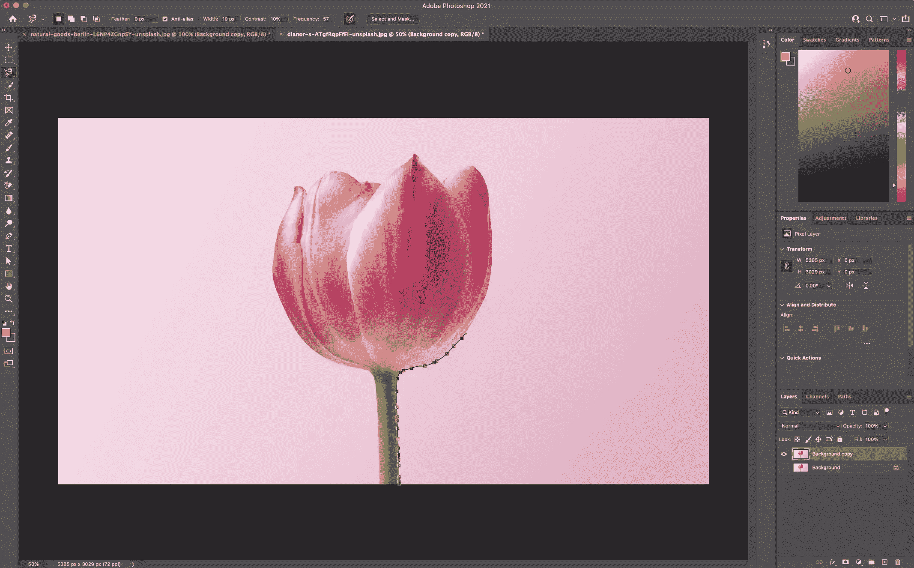
3.  Once you’ve started the tool, you’ll need to go around your subject completely and connect to your starting point. Once you’ve made it back around to the beginning, click the starting point. The selection will then turn into marching ants around your selection.
4.  转到**选择** > **保存选择**并给它命名，保存您的选择。
5.  要删除背景，到**选择** > **反转**反转行进中的蚂蚁(它们现在应该在图像和你的主体边缘跑来跑去)。点击`delete`。你现在应该看到白色/灰色方格背景，而不是你以前的背景。

如果您觉得需要对选择进行调整，您可以回溯几个步骤并重做它们以获得更好的结果，或者使用本文中列出的其他技术的组合来获得您想要的结果。

关于磁性套索工具如何工作的更多详细信息，请查看 Adobe 教程。

*图片来源:[德拉诺尔 S on Unsplash](https://unsplash.com/photos/ATgfRqpFfFI)*

## 6.使用快速选择工具移除 Photoshop 中的背景

最适合在以下情况下使用:拍摄对象反差较大和/或图像有“细微”或复杂的细节，或者当您想要节省时间并且需要相当的精确度和快速改进的能力时。

快速选择工具可能是我最喜欢的方法，因为它是选择主题最快的方法，并且允许更快的改进。与这里列出的其他方法相比，它还可以用于更广泛的可能照片，因为它通过检测颜色变化来确定选择应该在哪里。

### 快速选择工具步骤

**步骤:用快速选择工具去除背景图像**

1.  **Duplicate the image layer**

    在 Photoshop 中打开您的图像，右键单击您的背景层，然后单击**复制层**。在弹出的对话框中，给你的图层命名(随便你喜欢什么)，点击**确定**。单击原始层左侧的眼睛图标以关闭该层。

2.  **Select the Quick Selection tool**

    从左侧工具箱中选择快速选择工具(可能隐藏在对象选择工具下面)。

3.  **Paint the subject of the image**

    使用工具，开始画你的主题。你会看到行进中的蚂蚁在你画画的时候开始出现。要调整工具尺寸，使用`[`或`]`键减小或增大尺寸。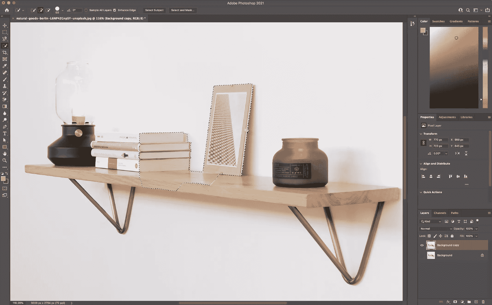

4.  **Clean up the selection path**

    如果你发现你已经画在了主体的外面，点击并按住`Option`键(macOS)或`Alt`键(Windows ),你会看到工具的中心从一个`+`符号变成了一个`-`符号，表示它现在将从选区中移走。按住`Option` / `Alt`键，在你想要移除的选区部分上绘画。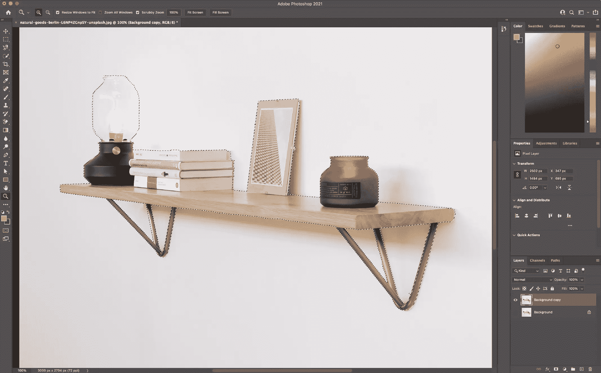

5.  **Save your selection**

    通过转到**选择** > **保存选择**并给其命名来保存选择。这是以防你想回来做调整。

6.  **Delete the background**

    要删除背景，去**选择** > **反转**反转行进中的蚂蚁(它们现在应该在图像和你的主体边缘跑来跑去)。点击`delete`。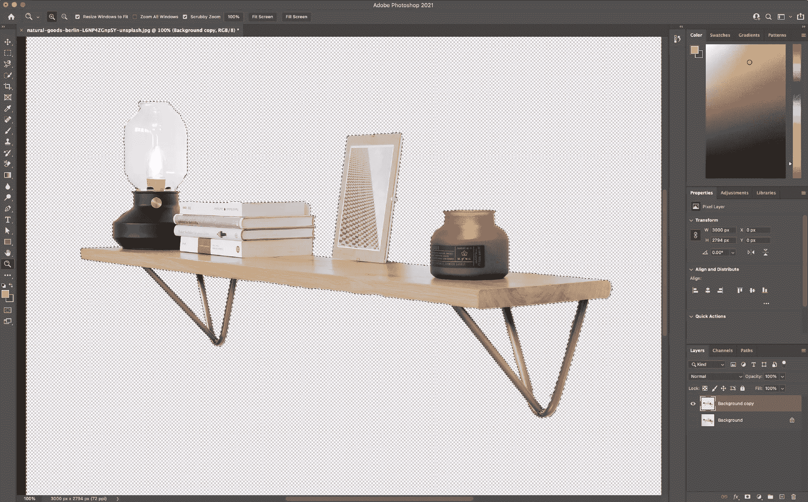

如果你发现你已经错过了一点或需要进一步完善，你可以回溯几个步骤来做完善，并重新保存您的选择，然后再试一次。

关于快速选择工具如何工作的更多详细信息，[请看一下这个 Adobe 教程](https://helpx.adobe.com/photoshop/using/making-quick-selections.html#select_with_the_quick_selection_tool)。

*图片来源:[Unsplash 上的自然商品柏林](https://unsplash.com/photos/L6NP4ZGnpSY)*

## 在 Photoshop 中移除背景从未如此简单

通过 Photoshop 中的这些方法，从图像中移除背景变得前所未有的简单。无论你是在寻找一种快速简单的方法来从照片中提取主题，还是需要一种方法来替换更详细图像的背景，以上方法将帮助你更快更好地获得最终结果。

知道使用哪种方法和何时使用不仅会使你的工作流程更快，而且你最终会得到更好的最终图像。

最后，根据您的最终使用情况，如果您需要保存没有背景的图像，不要忘记将其保存为透明 PNG，以便您可以在其他应用程序中使用它，并保持新的无背景图像。

## 分享这篇文章