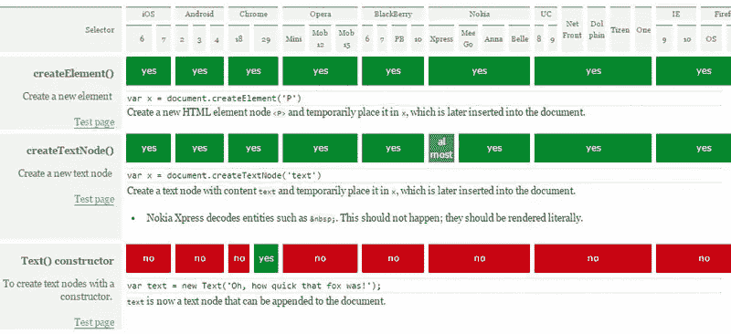
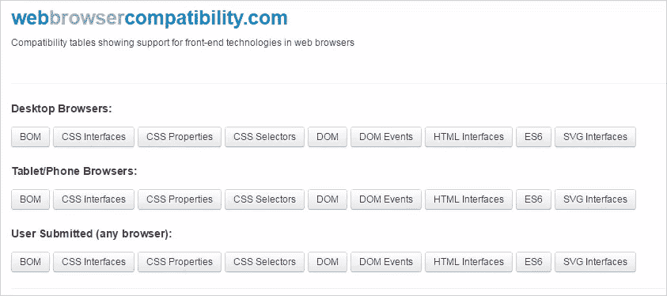
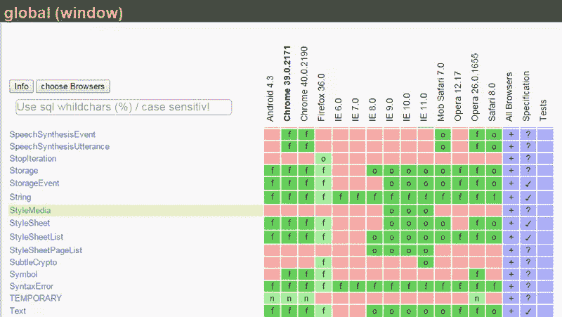
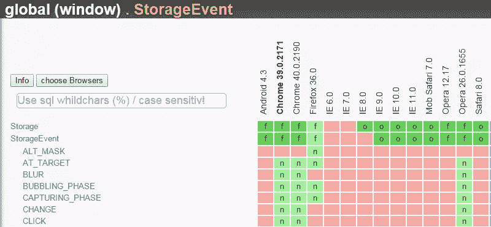
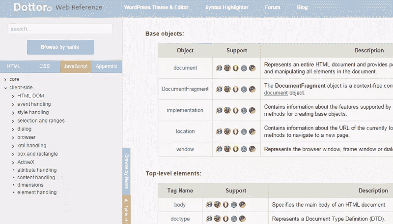
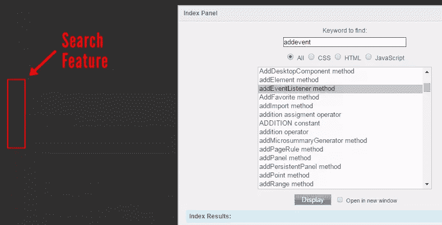
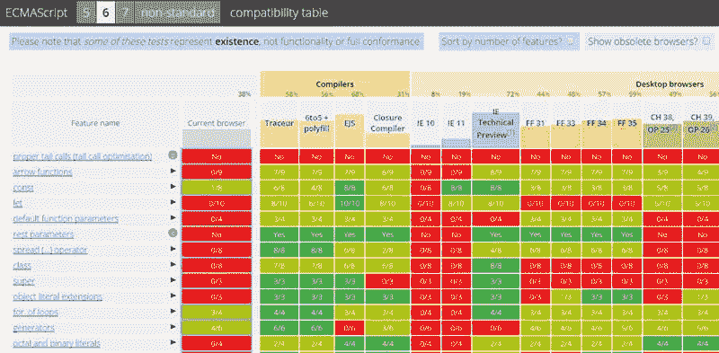
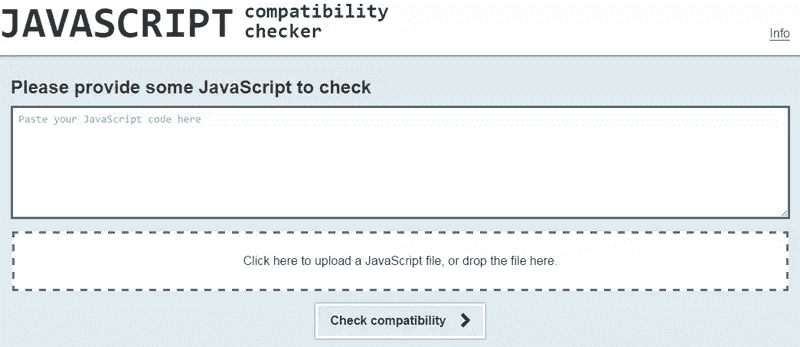
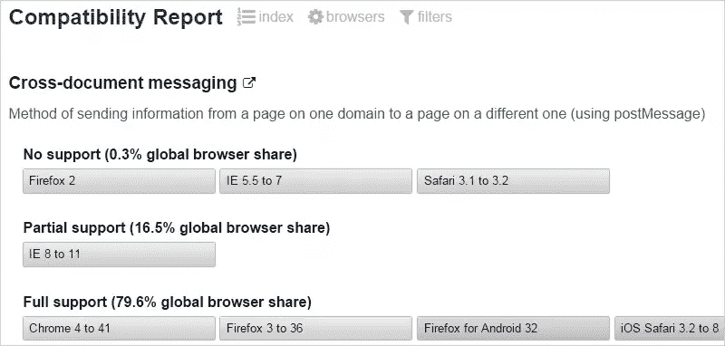

# JavaScript 和 DOM 兼容性表参考资料

> 原文：<https://www.sitepoint.com/resources-javascript-dom-compatibility-tables/>

近年来最好的信息应用之一是众所周知的超级实用的[我能使用](http://caniuse.com/)吗，作者是[亚历克西斯·德韦里亚](https://twitter.com/Fyrd)。

虽然*我能使用*对于许多前沿特性来说很棒，但是仍然有很多 JavaScript 和 DOM 的东西没有包含在里面。那么，还有什么其他的方法来查找浏览器对许多不同 JavaScript 和 DOM 特性的支持呢？

我一直在研究各种前端技术，但我还没有找到一个真正好的一站式资源，它列出了浏览器对 JavaScript 和 DOM 所有方面的支持，包括各种 HTML5 APIs。

虽然一个单独的资源实际上并不存在(至少据我所知没有)，但我遇到的几个资源加在一起，形成了一个很好的概述，说明了哪些浏览器支持哪些功能，尤其是您可能仍然需要支持的任何旧版本的 IE。

## 当然，实际测试胜过一切

在阅读参考资料之前，我认为不用说，在您必须支持的不同设备和浏览器上进行实际测试应该始终是确定支持的主要方法。

能够获得支持的二手概述很好。但是“支持”表并不总是包含任何可能使所讨论的特性不可用的相关错误。此外，有些资源可能就是错误的。

因此，请务必进行测试，并使用本文中描述的参考资料作为指南，而不是作为某些内容在特定设备的特定平台上的特定浏览器中是否有效的最终结论。

## [MDN 的参考](https://developer.mozilla.org/en-US/)

如果你在*上找不到我能使用*吗，你首先应该去 [Mozilla 的开发者网络](https://developer.mozilla.org/en-US/)看看。我相信你们大多数人都会这么做。在大多数情况下，这就是你所需要的，以获得对一个特定 JavaScript 特性支持的初步概述，你在*上找不到这个特性，我能使用*吗

例如，假设您想要查找`addEventListener()`和`removeEventListener()`。你在*上找不到那些，我能用*吗？但是你可以[在 MDN 上用浏览器信息找到](https://developer.mozilla.org/en-US/docs/Web/API/EventTarget.addEventListener#Browser_compatibility) [这两个](https://developer.mozilla.org/en-US/docs/Web/API/EventTarget.removeEventListener#Browser_Compatibility)。

正如您在上面的屏幕截图中所看到的，除了显示哪些浏览器具有“基本支持”的详细信息之外，该图表中通常还有关于 ECMAScript 后续版本中可能添加的功能的附加信息。

还要记住，MDN 的引用是任何人都可以编辑的，所以如果您发现某些地方不正确，请随时更新它。

## 彼得-保罗·科赫著

如果不提到 Peter-Paul Koch 和[他出色的参考表](http://www.quirksmode.org/dom/)，关于浏览器兼容性表的讨论将是不完整的，这些都是基于他自己的测试。

Koch 的表格包括桌面和移动浏览器的支持信息，在我看来，DOM 的内容是最新的，表明支持 IE11 和 iOS7。

## 科迪·林德利的网络浏览器兼容性表

这里有一个似乎不太出名的，由 Cody Lindley 编写，他写了一些关于 JavaScript 和 DOM 的很棒的书。它叫做[网络浏览器兼容性表](http://www.webbrowsercompatibility.com/) (WBCT)，是一个巨大的资源。

Cody 的网站包括可追溯到 IE6 的支持表，包括以下内容:

*   [桌面](http://www.webbrowsercompatibility.com/dom/desktop/)和[平板/手机浏览器的 DOM 支持](http://www.webbrowsercompatibility.com/dom/tablet-phone/)
*   [桌面](http://www.webbrowsercompatibility.com/dom-events/desktop/)和[平板/手机浏览器的 DOM 事件支持](http://www.webbrowsercompatibility.com/dom-events/tablet-phone/)
*   [ES6 支持桌面](http://www.webbrowsercompatibility.com/es6/desktop/)和[平板/手机浏览器](http://www.webbrowsercompatibility.com/es6/tablet-phone/)

这些是开发人员研究 JavaScript 支持信息的主要领域，但是 WBCT 还包括 CSS、BOM、SVG 等支持表。所以一定要把它收藏起来。它是对 MDN 的完美补充。

## Tobias Buschor 的大 JS 兼容性表

这一个肯定不是很出名，但是它可能有一些没有包括在 Cody Lindley 的表中的东西，或者一些在 MDN 上没有很好记录的东西。

这是由[托拜厄斯·布肖](https://twitter.com/tobiasbu)创建的[大 JS 兼容表](http://compatibility.shwups-cms.ch/en/home)。

这也是一个巨大的资源，我真的很喜欢它让你深入到一个特定的 JavaScript 或 DOM 特性。例如，如果你滚动初始列表(以`window`对象开始),你可以点击类似于[存储事件](http://compatibility.shwups-cms.ch/en/home?&property=StorageEvent)的东西，它会给你一个特定对象的方法和属性列表。

虽然这是一个真正全面的资源，但我注意到它有时会很慢，主站点似乎会出现一些错误，所以我不确定 Tobias 是否一直在维护该资源，就像它一样好。

如果我在寻找一个在其他地方没有很好记录的特定特性，我通常会把这个作为第三或第四种可能性。

## [多多罗 JavaScript Web 参考](http://help.dottoro.com/ljsdaoxj.php)

由 IT 服务公司 [Dottoro](http://www.dottoro.com/) 维护的[Dottoro JavaScript reference](http://help.dottoro.com/ljsdaoxj.php)，对于许多不同的 JavaScript 和 DOM 特性来说，是一个相当不错的资源。

在浏览器支持完全的情况下，在所有版本中，您会看到一个浏览器图标来指示这一点，或者一个褪色的图标来指示缺乏支持。此外，如果支持从特定版本开始，也会显示出来。你可以在下面的截图中看到这一点:

除了浏览器支持之外，它还会给出你正在查找的特性的简要描述，所以这是一点额外的好处。

我真正喜欢这个资源的是它漂亮的搜索功能，当你第一次访问这个网站时，这一点并不明显。它是在 lightbox 窗口中通过点击两个“按名称浏览”按钮之一来触发的。下面的屏幕截图中显示了侧面按钮:

你也可以直接在主页上搜索，但我喜欢 lightbox 中的搜索，因为它可以根据你输入的内容立即过滤结果，而不必先看到结果页面。

总的来说， [Dottoro reference](http://help.dottoro.com/llqwxqoe.php) 是一个很好的、有吸引力的资源，它还包含了 HTML 和 CSS 特性的浏览器支持信息。

## IE 开发中心 JavaScript 和 DOM 参考

通常当我们想知道浏览器支持时，这是因为我们想要关于旧版本 IE 的信息(现在包括 IE9 和 IE10，这两个版本按照今天的标准都被认为是“旧的”)。

微软的 Internet Explorer 开发中心有很多关于 JavaScript 和 DOM 特性的详细支持信息。

例如，您可以访问 [JavaScript 版本信息](http://msdn.microsoft.com/en-us/library/ie/s4esdbwz%28v=vs.94%29.aspx)页面，该页面在一个表格中列出了许多特性以及 IE6-11 的支持信息。您还可以深入了解每个功能，最终进入一个专门介绍单个功能的页面。

因此，如果您深入到 Map 对象的 [forEach 方法的页面，您将获得该特性的描述以及一个名为“需求”的部分，该部分概述了哪些版本的 IE 支持该特性。](http://msdn.microsoft.com/en-us/library/ie/dn280909%28v=vs.94%29.aspx)

这只是可供查找内容的一小部分。还有 [DOM 参考](http://msdn.microsoft.com/en-us/library/ie/hh772384)、 [Web 应用参考](http://msdn.microsoft.com/en-us/library/ie/hh772406)(涵盖了许多 HTML5 APIs)，以及[图形和媒体参考](http://msdn.microsoft.com/en-us/library/ie/hh772398)，涵盖了 Canvas、音频/视频 API、SVG 和 WebGL。

这些 IE 开发中心参考页面中唯一真正的缺陷是它们只包含了对 IE 浏览器的支持。但这没什么大不了的，因为 IE 通常是我们查找浏览器支持信息的主要原因。

## kangax/Arnott 的 ECMAScript 兼容性表

如果你正在寻找自 ES5 以来添加的 ECMAScript 特性，最好的资源之一是由尤里“坎加克斯”扎伊采夫和 T2 莱昂阿诺特编写的兼容性表。

该参考包括涵盖 [ES5](http://kangax.github.io/compat-table/es5/) 、 [ES6](http://kangax.github.io/compat-table/es6/) 、 [ES7](http://kangax.github.io/compat-table/es7/) 和[非标准特性](http://kangax.github.io/compat-table/non-standard/)的兼容性信息的表格。

## 奖励:[Thijs Busser 的 JavaScript 兼容性检查器](http://jscc.info/)

这是 Thijs Busser 开发的一个新工具，名为 [JavaScript 兼容性检查器](http://jscc.info/) (JSCC)，可以让你粘贴或上传一些 JavaScript，然后获得代码分析。

该工具使用来自 Kangax 表和*我可以使用*的信息，所以这里的重点似乎是新的 API 和 ES5 及以后版本中添加的东西。

为了向您展示它是如何工作的，我添加了来自这篇关于 Web Workers 的 MDN 文章的一些代码。请注意显示的结果:

在这里，您可以看到代码中使用的有兼容性问题的特性(也就是说，它们不到 100%的支持)，以及哪些浏览器导致了这些问题。

我要警告你，这个工具是新的，可能需要一些改进。例如，当我粘贴一些使用[数据集属性](https://developer.mozilla.org/en-US/docs/Web/API/HTMLElement.dataset)的代码时，JSCC 告诉我这些代码没有任何兼容性问题。但是 [MDN 说](https://developer.mozilla.org/en-US/docs/Web/API/HTMLElement.dataset#Browser_compatibility)IE10 或更低版本不支持。即使我可以使用上列出了`dataset` [也会发生这种情况，因此结果应该是准确的。](http://caniuse.com/#feat=dataset)

因此，虽然这不是一个完整且可靠的工具，但随着它的改进，它肯定是值得关注的。

## 最后

如前所述，实际测试应该始终是获取兼容性信息的主要手段。我不认为任何地方有一个单一的来源可以提供所有 JavaScript 和 DOM 特性的完整浏览器兼容性信息。但我认为我在这篇文章中列出的资源可以作为一个集体实体，你可以依靠它获得相当准确的信息。

当然，我可能漏掉了一些东西。因此，如果你知道另一个来源，请随意添加到评论中。

## 分享这篇文章