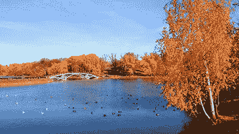

# 响应图像，第 1 部分:使用 srcset

> 原文：<https://www.sitepoint.com/responsive-images-part-1-using-srcset/>

今天，我会给你一些新的想法，关于现在非常流行的**响应式网页设计**()的一个方面:响应式图片。RWD 不是一个新话题，但它的方法并不总是容易和没有陷阱。尤其是当涉及到图像时，有许多未解决的问题。

## 介绍

在一个网站的开发过程中，我们会遇到一些图片管理的困难。考虑到它们在各种设备上平滑和正确显示的基本需求，这些困难可能包括:

1.  适当的优化和减重；
2.  注意不必要的带宽浪费(我们都知道一个网站的加载速度是我们自己网站成败的主要因素之一)；
3.  所用设备的适当分辨率。

对于第一个问题，像 [TinyPNG](http://tinypng.org/) 和 [JPEGmini](http://www.jpegmini.com/) 这样的工具可以帮助减轻图像的重量并优化它们。

对于第二个问题，我们已经多次有可能测试*媒体询问*的巨大潜力。感谢他们，我们有了一个简单的方法来面对背景图片的问题，那就是我们使用 CSS 规则`background-image`显示的那些图片。然而，考虑到该解决方案不能应用于使用``标签显示的图像，我们如何解决第三个也是最后一个问题，并为我们用来访问网站的设备设置正确的图像分辨率呢？

在这种情况下，有两个建议的解决方案:标签``的`<picture>`元素和`srcset`属性。

在本文中，我将对`srcset`属性进行概述，而`<picture>`元素将是下一篇文章的主题。

## srcset 属性

使用该属性的主要好处是什么？有了它，网络开发人员可以在高分辨率显示器上用高分辨率图像源或不同类型的屏幕上用其他版本的图像来锁定用户。在第一种情况下，使用较低像素密度显示器的用户不会背负下载无用的大规模高分辨率图像的浪费带宽成本，而后者可以享受他们屏幕的力量。在第二种情况下，我们可以为不同的屏幕尺寸指定不同的图像，以便在用户的设备上提供更集中的图像。

事实上,`srcset`属性允许我们为一个图像指定一个源列表，它将根据用户屏幕的像素密度或大小来交付。因此我们可以说，实现`srcset`属性是向浏览器提供一组“建议”的好方法，这些建议是关于浏览器对于某种类型的图像应该具有的正确行为。通过这样做，我们改善了页面的加载和用户体验。

现在，让我们来看看这个属性的基本特征，指定使它工作的条件以及在我们的代码中实现它的方法。

如 W3C 所述，<q cite="https://www.w3.org/html/wg/drafts/srcset/w3c-srcset/">srcset 属性允许作者以一种简洁的方式，以不同的分辨率或不同的视口尺寸提供同一图像的多个变体。用户代理可以在获取任何资源之前进行资源选择，从而避免在受限带宽环境中的多个资源负载和相关的性能问题。</q>

`srcset`属性包括一系列逗号分隔的值，一方面指定图像 URL，另一方面指定图像显示的条件。在这些条件中，我们可以找到像素密度、视口宽度或两者。非常有趣的一点是，浏览器可以根据一些启发或用户设置，在用户访问页面时解释什么对用户最好，并选择获取低分辨率图像还是高分辨率图像。

设想您的移动浏览器中的首选项允许请求高分辨率图像，例如，仅当连接到 WiFi 时，或者手动浏览器首选项允许您仅在连接弱时请求低分辨率图像。

代码语法如下:

``

这段简短的代码要求浏览器显示名为`small-photo.jpg`的图像，除非该设备具有高分辨率显示屏(像素密度为 2x，如视网膜)。请注意，只有在浏览器理解如何处理该属性的情况下，才会显示另一张照片。未能正确解释该属性的浏览器将简单地忽略它，并显示您先前在`src`属性中指定的回退图像。

如上所述，该属性不仅仅对密度有好处。在处理屏幕宽度的情况下，我们可以把它想象成媒体查询的`max-width`属性。为了从中受益，您必须指定像素数量，后跟一个 *w* (例如 *600w* )。为了更好地理解这个案例，让我们看另一个例子，取自网站 [Sxc.hv](http://www.sxc.hu/) 的一个名为“莫斯科的秋天”的[美拍](http://www.sxc.hu/browse.phtml?f=download&id=1433557)，其尺寸为 1368×700，重量(优化后)为 389Kb:

根据我们到目前为止所讨论的，让用户用智能手机上网时下载比他的设备所能显示的更大(然后更重)的图像有什么好处？此外，请记住移动连接的局限性，这是一个棘手的问题，因为图像会降低页面加载速度，这可能会导致用户退出您的网站(显然，这是要避免的第一件事)。说到这里，你可以想到的是使用相同的图像，但更小，大小(400×225)和重量(~40Kb)，如下所示。

令人难以置信的是，我们如何让用户节省带宽并改善他们的体验，只需以下小技巧:

``

该代码片段使用`low-density-photo.jpg`图像作为后备，并指示特定数量的不同条件的图像列表:`small-photo.jpg`将用于屏幕宽度小于或等于 480px 的设备，`big-photo.jpg`用于屏幕宽度小于或等于 1024p 的设备，最后一个`high-density-photo.jpg`用于屏幕宽度小于或等于 1024px 的设备和高分辨率显示器。

现在，我有一些不太好的消息要告诉你。唯一支持 srcset 的浏览器是 WebKit 浏览器，实际上，由于 Chrome 已经转移到 Blink 引擎，我们必须澄清 Chrome 不再支持它。

此外，您不能基于设备屏幕的最大宽度来设置图像，因为实施的提案没有指定这种可能性。这个问题有点复杂，所以请经常检查更新，阅读更多关于它的规范和在您的项目中实现该技术的方法。

12 月 2 日，W3C 针对 srcset 的规范的编辑草案刚刚发布。它包括了一些使用这个属性的很好的清晰的例子。

作为一个编辑的草稿，我们也可以说这使属性的采用更近了一步，给了所有浏览器接受和尊重使用 srcset 属性的动力。我们只能希望。

## 结论

在本文中，我们描述了`srcset`属性如何帮助开发者更好地管理他们网站的图像。然而，正如我们所看到的，浏览器之间的支持是缺乏的，但我们希望并相信这个问题将很快得到解决。

在下一篇文章中，我将比较`srcset`属性和`<picture>`元素，看看后者的效果如何。

## 分享这篇文章