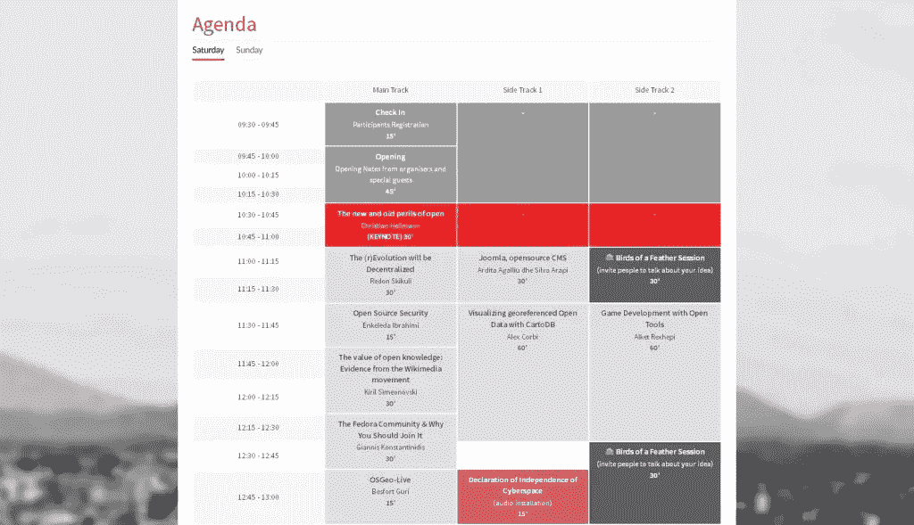
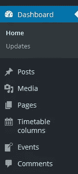
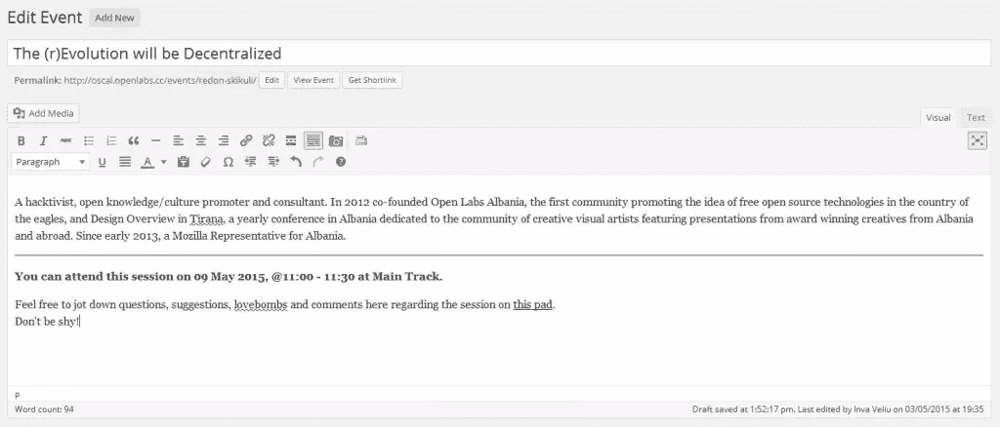
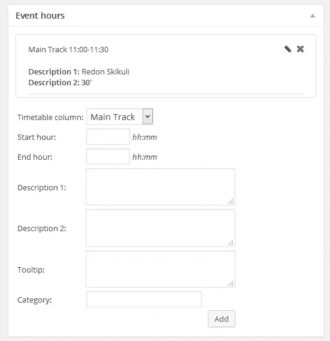
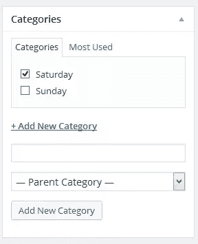
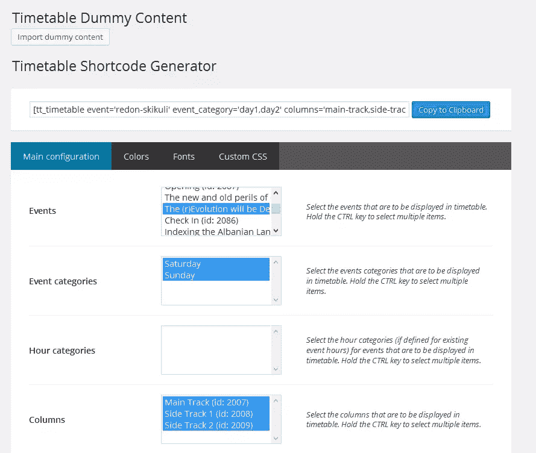
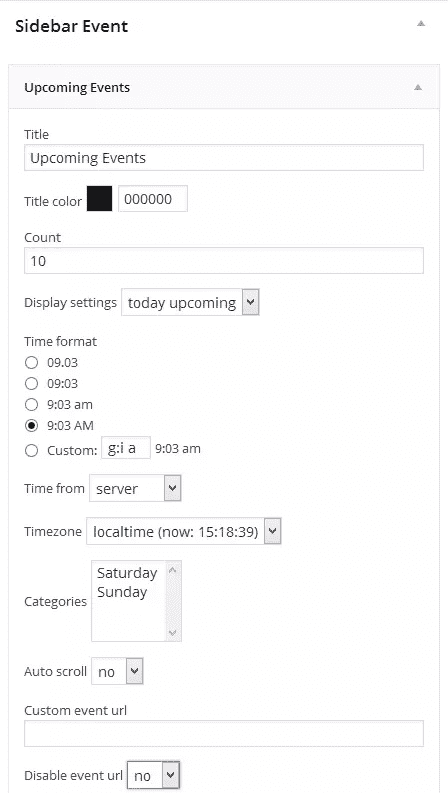

# 带有时间表插件的 WP 响应时间表

> 原文：<https://www.sitepoint.com/responsive-schedules-wordpress-timetable-plugin/>

在 WordPress 中，表格(以及所有涉及到单元格的东西)可能是一种痛苦。在这些情况下，提供良好的浏览体验通常是困难的，因为人们需要考虑各种分辨率和设备才能在一个响应迅速的网站上正常工作。我四月份在 SitePoint 上报道过 TablePress，它也有一个响应插件，是一对很好的搭档。然而，通常像 TablePress 创建的那些表格是不够的，需要一个更专业的替代品。我看到许多会议网站都在努力解决这个问题，有些网站最终只是把议程放在 Excel 电子表格中，这很遗憾。

在组织 [OSCAL 2015](http://oscal.openlabs.cc/) (同样由 SitePoint 赞助)时，我们的团队遇到了完全相同的问题。经过长时间的搜索，我们很幸运地在 CodeCanyon 上发现了 WordPress 的[时间表响应时间表插件，它看起来非常有前途，也没有辜负我们的期望。](http://codecanyon.net/item/timetable-responsive-schedule-for-wordpress/7010836)

我个人认为 Timetable 是 WordPress 中一个时尚且反应灵敏的日程创建旗舰插件。该插件还可以在移动设备上完美地显示表格，这让我们在组织会议时松了一口气。话虽如此，Timetable 是为“大多数网站和业务类型，如健身房、幼儿园、医疗保健或法律相关业务”而设计的*，然而它提供的巨大灵活性允许你将其应用于许多其他用例(就我而言，如技术会议)。*

 *我们将快速浏览一下这个插件的功能，这样你就可以看到这个插件是否能够满足你的需求。

## 入门指南

WordPress 的时间表可以在 CodeCanyon 上找到，会花掉你 20 美元。

然而，在你过度兴奋之前，你需要注意时间表不像电子表格那样工作，所以做简单的改变(尤其是切换单元格)会花费你几分钟时间，如果你持续不断地改变，这种情况可能会发生几次。为了避免这种情况，我建议在将你的日程表插入时间表插件之前，先在一个电子表格文档中起草一份初稿。我花了很多时间做这样的改变，这在会议上是可以预料的，但在其他情况下可能是可以避免的，所以要意识到这一点。

安装插件后，你可以在你的 WordPress 仪表盘上找到两个新标签，在你的仪表盘设置中找到一个新选项。

这些都是不言自明的。时间表栏在这里充当占位符，因此您可以将事件分配到右栏。您还可以更改列的顺序。通常，列用于确定日期，行用于确定事件的具体时间。你也可以混合使用这些，但是除非你有充分的理由，否则你不应该这样做。

Events 选项卡是所有神奇事情发生的地方，因为它存储了实际表将保存的所有数据。为了帮助你形象化，想象一下电子表格中的每个单元格都需要一个单独的自定义帖子。是的，很多。然而，好消息是，在不同日期和时间发生的类似事件可以在同一个事件元素中指定，因此，例如，您不需要为三个“体育课”指定三个事件元素，这三个“体育课”是在星期一、星期三和星期五，但在其他方面是完全相似的。您可以在同一个事件元素中指定这三个元素。

我们来看看活动定制贴。

## 活动自定义帖子

你可以像 WordPress 中的普通帖子一样格式化事件自定义帖子。在本例中，我们创建了一个事件，并添加了关于演讲者的一些个人简介(在本例中为 [Redon Skikuli](http://www.redon.skikuli.com) )和关于他的会话的一些细节。

**注意:**活动帖子的内容是可选的，如果您愿意，您可以在实际时间表上禁用活动帖子的链接。

现在事情开始变得有趣了。如果你继续往下看，你会发现一些选项，允许你设计时间表，给事件加一个副标题，以及启用/禁用事件 URL，我之前提到过。现在让我们将事件分配到正确的时间段:

这也是不言自明的。您可以添加该事件应该出现的时间段，以及一两个可选的描述和类别。在这里，您可以将您的事件分配到不同的时间段，因此请确保不要在不同的时间段重复相同的事件，而是首先在这里登记，将事件分配到其他时间段。

最后，将事件添加到它应该出现的时间表类别中(在编辑器的右侧)。

您可以对所有事件执行相同的操作，直到您填充了时间表。然而，您仍然希望在某些页面上呈现时间表，所以让我们转到仪表板设置>时间表。

## 短代码生成器

将所有数据放入事件和列部分后，我们可以继续通过短代码显示时间表。这可能看起来很不寻常，但允许您的事件有很大的灵活性和定制性，因为设置存储在短代码中，可以调整，而不必进入短代码生成器。你也可以直接导入[插件的演示内容](http://quanticalabs.com/script/timetable-responsive-schedule-for-wordpress/7010836)来检查和实验它的设置(强烈推荐)。

这里有许多其他的调整和定制，所以一定要检查所有的调整和定制，以充分利用你的时间表(在这里列出所有的调整和定制也太混乱了)。如果您想恢复生成器中的设置，只需将生成的短代码片段粘贴到生成器的输出字段中，所有设置都会相应地进行调整。

**注意:**时间表的颜色短码将被单个活动帖子的颜色设置覆盖。这有助于突出一些单元格或创建一些冷色调效果。

在确保正确设置了所有选项之后，您可以复制生成的短代码片段，并将其粘贴到您希望显示它的页面或帖子中。瞧啊。

## 额外:即将举行的活动小部件

该插件还附带了一个小部件，允许你在任何你希望的小部件区域包含即将到来的事件。这里还有各种各样的设置和调整，允许您完全控制这个小部件。

## 安排好了吗？

时间表响应时间表插件是一种先进的表格。它提供了很好的外观和专业的结果，以及大量的定制选项。尽管需要相当多的手动输入来获得正确的时间表，但插件以其大量的调整选项弥补了这一点。如此多的 WordPress 插件采用简单的方法而不是多功能的方法，看到一个优先考虑后者的插件令人耳目一新。

你对这个或其他时间表插件有什么体验？请在评论中告诉我！

## 分享这篇文章*