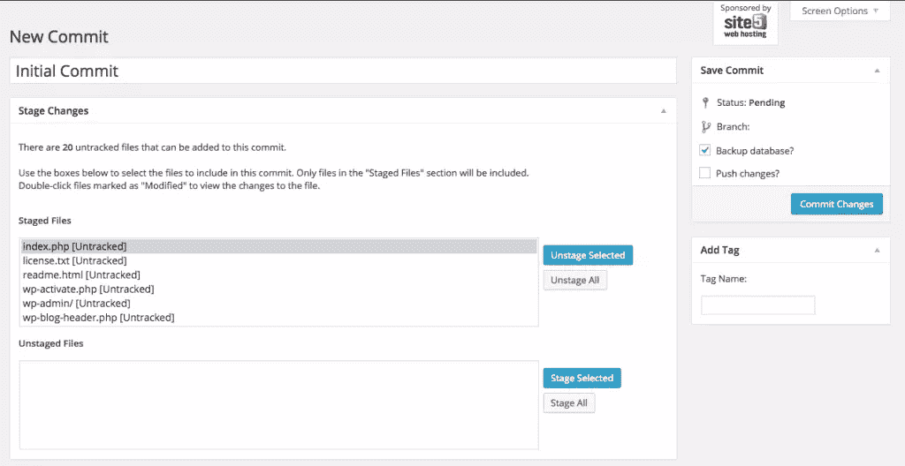
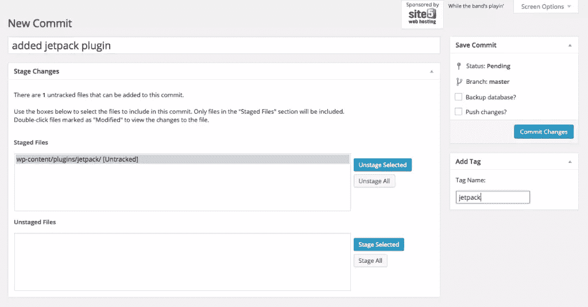
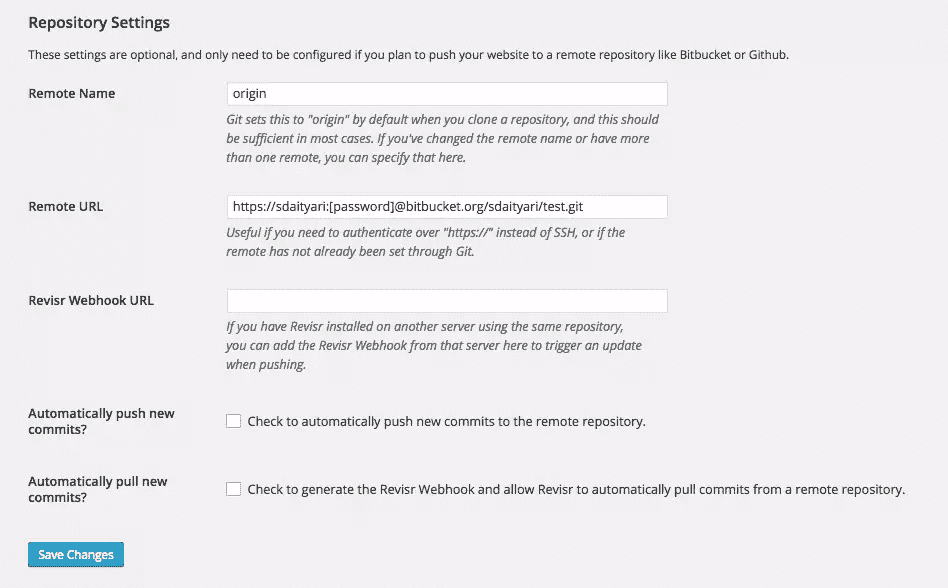
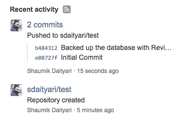
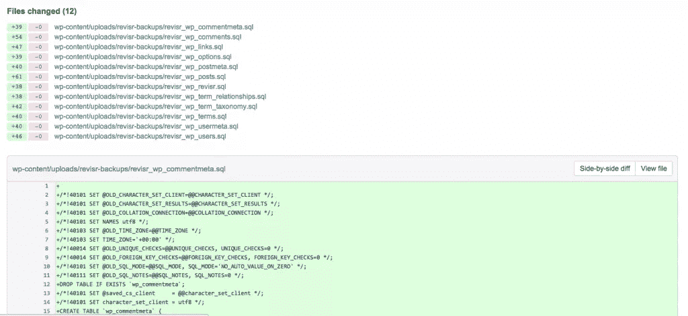
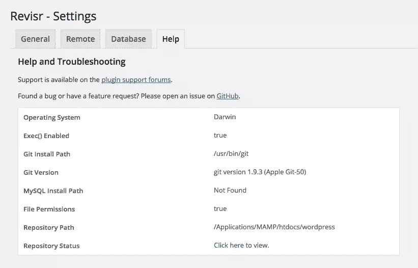
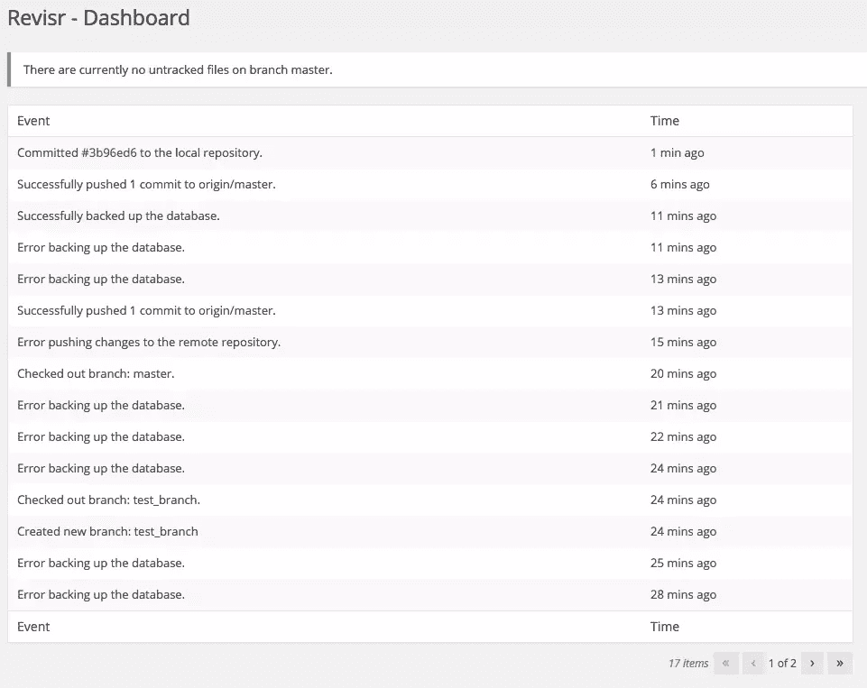

# 修订——git for WordPress

> 原文：<https://www.sitepoint.com/revisr-git-for-wordpress/>

如果你是一个使用 WordPress 的开发者，你可能会尝试在 WordPress 中实现你的开发工作流程。一个这样的过程是版本控制的使用。在最基本的层面上，版本控制本质上是在代码中创建检查点，允许您在出错时及时返回。可以说，今天最流行的版本控制软件是 Git。

在 WordPress 中实现这样一个系统并不困难。您可以创建一个 Git 存储库来管理您的 WordPress 源代码(这只能在自托管版本上实现)。此外，您可以创建一个数据库转储并将其添加到存储库中。一段时间内的提交将跟踪文件和数据库中的变化。

尽管 Git 库可以通过终端或 GUI 客户端上的一系列强大命令来管理，但我们将在本文中讨论[revisir](https://wordpress.org/plugins/revisr/)。Revisr 是一个插件，帮助你在 WordPress 管理面板中管理你的文件和数据库。

注意:我建议你浏览一篇关于 Git 基础知识的早期文章，以熟悉我将在本文中使用的 Git 相关术语。

## 入门指南

安装并激活 Revisr 后，您需要在插件工作之前执行某些步骤。在管理面板中，转到 revir→Dashboard 来初始化 git 存储库。初始化之后，它会要求您完成设置(比如与 Git 提交相关的名称和电子邮件)，然后才能返回到仪表板页面进行提交。

确认设置后，检查要提交的暂存文件(默认情况下，Revisr 会选择所有未暂存的文件)，并通过添加消息来提交它们。

一旦您在提交后做了更改(比如安装一个新的插件)，您就可以返回到仪表板并再次创建一个提交。

## 分支您的工作

Git 最强大的特性之一是处理分支的能力。理解一个分支的最简单的方法是把它想象成一个独立的工作流。Git 还允许你合并分支。

转到“修订”→“分支”,查看分支列表，在该部分中创建、合并或删除分支。

## 管理遥控器

因为 Git 是一个[分布式版本控制软件](http://en.wikipedia.org/wiki/Distributed_revision_control)，你可能在不同的系统上有你的存储库的拷贝，有时在云上。在 Git 中，这些副本被称为“远程”。

如果你在云(GitHub、BitBucket 或 GitLab)上有一个存储库的副本，你可以使用 Revisr 管理远程。只需转到远程标签的修订设置，并填写详细信息。在这个例子中，我在 BitBucket 上创建了一个存储库(用您的密码替换[password])。

一旦您输入了遥控器的详细信息，您可以在 Revisr 仪表板上的“快速操作”面板下选择“推送更改”。在我们的例子中，这是我们推送代码后存储库的样子。

### 警告

正如霍特林在评论中正确指出的，请注意你的。使用 Revisr 时，git 目录不会发布到生产环境中。这个目录包含一些重要的信息，你一定要确保公众无法访问它。有几种不同的方法可以做到这一点，一种简单的方法是创建一个。htaccess 文件，并指示 Apache 拒绝对该 URL 的所有请求。

## 备份和恢复数据库

在介绍中，我提到了获取数据库的转储并将其附加到常规提交中。这正是 Revisr 所做的。在我们继续之前，你可能想看看 WordPress 的数据库结构。

在 revisir 仪表板的“快速操作”面板上，您会发现一个“备份数据库”按钮，它可以根据 revisir 设置的“数据库”选项卡中设置的选项，通过创建转储文件并提交来即时备份您的数据库。或者，在创建提交时，您可以选择备份数据库。

如果在修订版设置中没有设置 MySQL 的正确路径，可能会出现错误。例如，在 MAMP，MySQL 的路径是`/Applications/MAMP/Library/bin/`。

Revisr 为从数据库备份的每个表创建一个文件。让我们推送并查看 BitBucket 上的变化。

## 解决纷争

正如您可能已经从上面的仪表板截图中观察到的，我在备份数据库时遇到了问题。我通过发现 MySQL 路径为空来调试错误。这在“修订设置”页面的“帮助”选项卡中可见。

“帮助”选项卡包含某些其他信息，可能有助于您调试问题。您还可以检查仪表板中的活动日志，找出可能导致问题的原因。

## 最后的想法

WordPress 有很多 Git 插件，另一个流行的选项是 [VersionPress](https://www.sitepoint.com/versionpress-version-control-comes-to-wordpress/) 。虽然 VersionPress 关注的是网站的变化，但 Revisr 更重视开发周期(这会让开发人员兴奋)。VersionPress 给[发了一篇详细的帖子，介绍这两者的不同之处](http://blog.versionpress.net/2015/01/versionpress-vs-revisr/)。

WordPress 的另一个版本控制管理系统是 [Gitium](http://www.presslabs.com/gitium/) 。

我想说的是，无论你是一名开发者还是另一个博客，通过版本控制来管理你的 WordPress 站点从来都不是一个坏主意。尽管习惯起来可能有点困难，但我向你保证，从长远来看，好处将是巨大的。至少，如果你不小心掉了数据库，你不会疯狂地搜索！

## 分享这篇文章