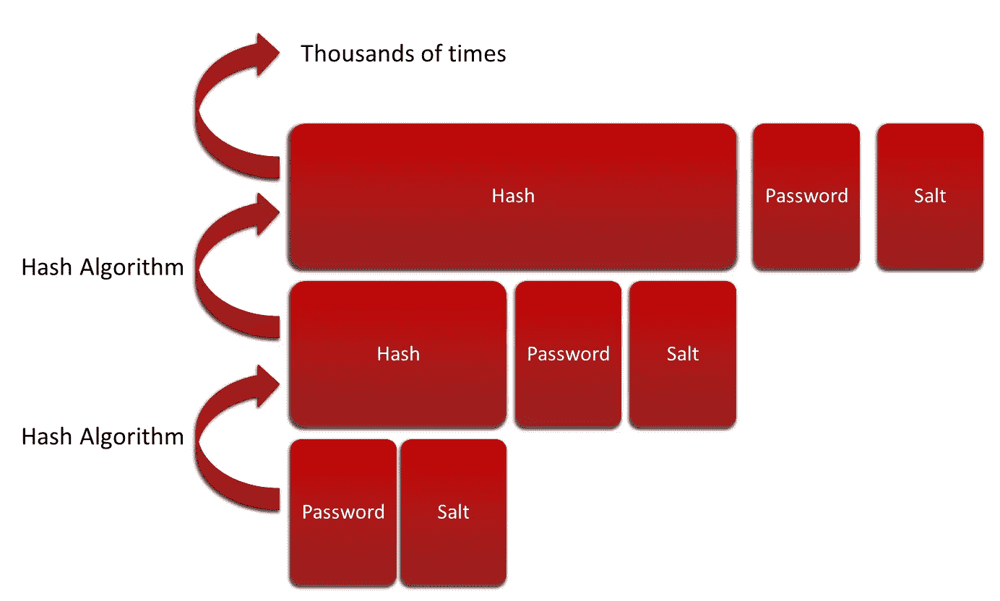
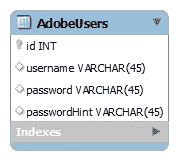
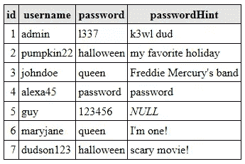
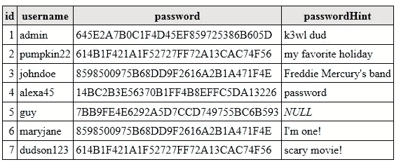
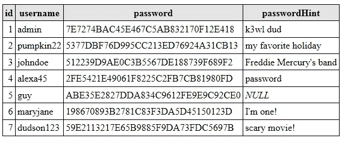

# 密码哈希的风险和挑战

> 原文：<https://www.sitepoint.com/risks-challenges-password-hashing/>

在过去的一篇文章中，密码散列被讨论为在应用程序中安全存储用户凭证的一种方式。安全总是一个非常有争议的话题，就像政治和宗教一样，存在许多观点，对某人来说“完美的解决方案”对其他人来说是不一样的。在我看来，破坏应用程序的安全措施只是时间问题。随着计算机能力和复杂性与日俱增，今天安全的应用程序明天将不再安全。

对于不熟悉哈希算法的读者来说，它只不过是一个单向函数，即**将可变长度的数据映射到固定长度的数据**。因此，如果我们分析上述定义，我们需要理解此类算法的以下要求和特征:

*   **单向函数**:使用高效算法无法反转输出。
*   **将可变长度的数据映射到固定长度的数据**:意味着输入消息空间可以是“无限的”，但输出空间不是。这意味着两个或更多的输入消息可以有相同的散列。输出空间越小，两个输入消息之间“冲突”的可能性就越大。

[md5](http://en.wikipedia.org/wiki/MD5) 已经确认了实际的碰撞， [sha1](http://en.wikipedia.org/wiki/SHA-1) 达到碰撞的概率每天都在增长(关于碰撞概率的更多信息可以通过分析经典的[生日问题](https://en.wikipedia.org/wiki/Birthday_paradox)找到)，所以如果我们需要应用哈希算法，我们应该使用那些具有更大输出空间(并且碰撞概率可以忽略不计)的算法，比如 [sha256、sha512](http://en.wikipedia.org/wiki/SHA-2) 、[漩涡](http://en.wikipedia.org/wiki/Whirlpool_%28cryptography%29)等…

它们也被称为**’[伪随机](http://en.wikipedia.org/wiki/Pseudorandomness)函数’**，这意味着散列函数的输出应该与**真随机数生成器**(或 TRNG)无法区分。

## 为什么简单散列法存储密码不安全

使用有效的算法不能将散列函数的输出还原为输入的事实并不意味着它不能被破解。通过简单的谷歌搜索，包含常用词和短字符串散列的数据库通常在我们的能力范围之内。同样，普通的字符串可以很容易很快地被暴力破解或者用字典攻击破解。

### 示范

这里有一个简短的视频介绍了像 [sqlmap](http://sqlmap.org/) 这样的工具如何通过 sql 注入在数据库中强行插入`md5`散列来破解密码。

此外，我们可以只做最简单的攻击…只需抓取散列并[谷歌一下](http://bit.ly/15O4SLN) …散列很可能存在于在线数据库中。哈希数据库的示例有:

*   [http://www.hash-database.net/](http://www.hash-database.net/)
*   [https://isc . San . edu/tools/hashsearch . html](https://isc.sans.edu/tools/hashsearch.html)
*   [http://md5online.net/](http://md5online.net/)
*   [https://crackstation.net/](https://crackstation.net/)

我们还必须考虑到，由于两个或更多相同的密码实际上具有相同的哈希值，破解一个哈希将自动为您提供使用相同密码的每个用户的密码。需要明确的是，假设您有成千上万的用户，很可能其中相当一部分人会使用(如果密码策略没有实施)臭名昭著的“123456”密码。该密码的 md5 哈希值是“e 10 ADC 3949 ba 59 abbe 56 e 057 f 20 f 883 e”，因此当您破解该哈希值(如果您必须这样做)并搜索所有在其密码字段中具有该值的用户时，您将知道他们每个人都使用了“123456”密码。

### 为什么加盐散列存储密码不安全

为了减轻这种攻击， [salts](http://en.wikipedia.org/wiki/Salt_%28cryptography%29) 变得很常见，但显然不足以满足今天的计算能力，特别是如果 salt 字符串很短，这使得它具有暴力破解能力。

基本密码/盐功能定义如下:

`f(password, salt) = hash(password + salt)`

为了减少暴力攻击，salt 应该长达 64 个字符，但是，为了以后对用户进行身份验证，salt 必须以纯文本形式存储在数据库中，因此:

```
if  (hash([provided password]  +  [stored salt])  ==  [stored hash])  then user is authenticated
```

由于每个用户都有完全不同的 salt，这也避免了简单散列的问题，在简单散列中，我们可以很容易地判断是否有两个或更多的用户使用相同的密码；现在散列将会不同。我们也不再能够直接获取密码散列并尝试谷歌它。此外，有了长盐，蛮力攻击是不可能的。但是，如果攻击者通过 sql 注入攻击或直接访问数据库来访问这个 salt，暴力攻击或字典攻击就有可能发生，特别是如果您的用户使用普通密码(同样，如“123456”):

```
Generate some string  or  get entry from dictionary Concatenate  with salt Apply hash algorithm If generated hash == hash in database then  Bingo  else  continue iterating
```

但是，即使一个密码被破解，也不会自动给你每个可能使用过它的用户的密码，因为没有用户应该有相同的存储散列。

### 随机性问题

为了生成一个好的 salt，我们应该有一个好的随机数生成器。如果你脑子里自动弹出 php 的`rand()`函数，那就立刻忘掉它。

在[random.org](http://www.random.org/randomness/)有一篇关于随机性的优秀文章。简单地说，计算机不能自己*思考*随机数据。人们说计算机是[确定性机器](https://en.wikipedia.org/wiki/Deterministic_algorithm)，这意味着计算机能够运行的每一个算法，给定完全相同的输入，将总是产生相同的输出。

当向计算机请求一个随机数时，它通常会从几个来源获得输入，如环境变量(日期、时间、读取/写入的字节数、正常运行时间……)，然后对它们进行一些计算，以产生*随机*数据。这就是算法给出的随机数据被称为**伪随机**的原因，因此区分来自**真随机**数据源是很重要的。如果我们能够以某种方式重现伪随机数发生器(或 PRNG)执行时的确切情况，我们将自动获得最初生成的数字。

此外，如果没有正确实施 PRNG，就有可能在生成的数据中发现模式。如果模式存在，我们可以预测结果…以 PHP 在 Windows 上的`rand()`功能为例，这里的[记录了](http://boallen.com/random-numbers.html)。虽然不清楚使用的是 PHP 还是 Windows 版本，但是通过查看使用`rand()`生成的位图，您可以立即看出有问题:


与 TRNG 的输出图像相比:


尽管这个问题已经在 PHP >= 5 上得到解决，`rand()`甚至`mt_rand()`仍然被认为是远远不够安全的。

如果您需要生成随机数据，请使用 PHP 5 > = 5.3.0 中可用的 [`openssl_random_pseudo_bytes()`](http://us3.php.net/openssl_random_pseudo_bytes) ，它甚至有一个`crypto_strong`标志，可以告诉您字节是否足够安全。

下面是一个使用`openssl_random_pseudo_bytes()`生成随机字符串的快速代码示例

```
<?php

function getRandomBytes ($byteLength)
{
    /*
     * Checks if openssl_random_pseudo_bytes is available 
     */
    if (function_exists('openssl_random_pseudo_bytes')) {
        $randomBytes = openssl_random_pseudo_bytes($byteLength, $cryptoStrong);
        if ($cryptoStrong)
            return $randomBytes;
    } 

    /*
     * if openssl_random_pseudo_bytes is not available or its result is not
     * strong, fallback to a less secure RNG
     */
    $hash = '';
    $randomBytes = '';

    /*
     * On linux/unix systems, /dev/urandom is an excellent entropy source, use
     * it to seed initial value of $hash
     */
    if (file_exists('/dev/urandom')) {
        $fp = fopen('/dev/urandom', 'rb');
        if ($fp) {
            if (function_exists('stream_set_read_buffer')) {
                stream_set_read_buffer($fp, 0);
            }
            $hash = fread($fp, $byteLength);
            fclose($fp);
        }
    }

    /*
     * Use the less secure mt_rand() function, but never rand()!
     */
    for ($i = 0; $i < $byteLength; $i ++) {
        $hash = hash('sha256', $hash . mt_rand());
        $char = mt_rand(0, 62);
        $randomBytes .= chr(hexdec($hash[$char] . $hash[$char + 1]));
    }
    return $randomBytes;
}
```

### 如果操作正确，密码扩展可能会很有效

为了进一步减少暴力攻击，我们可以实现密码拉伸技术。这只是一种迭代或递归算法，它本身会反复计算一个哈希值，通常会计算数万次(或更多)。



该算法应该足够迭代，以便在至少 1 秒内执行所有计算(较慢的散列也意味着攻击者必须等待)。

为了破解通过拉伸保护的密码，攻击者应该:

1.  知道确切的迭代次数，任何偏差都会产生完全不同的散列。
2.  每次尝试之间应至少等待 1 秒钟。

这使得攻击不太可能…但也不是不可能。为了克服 1 秒钟的延迟，攻击者应该拥有比算法所针对的计算机更高的硬件规格，这可能意味着高成本，因此攻击变得极其昂贵。

你也可以使用标准算法，比如 **PBKDF2** ，这是一个基于[密码的密钥派生函数](https://en.wikipedia.org/wiki/Key_derivation_function)

```
<?php

/*
 * PHP PBKDF2 implementation The number of rounds can be increased to keep ahead
 * of improvements in CPU/GPU performance. You should use a different salt for
 * each password (it's safe to store it alongside your generated password This
 * function is slow; that's intentional! For more information see: -
 * http://en.wikipedia.org/wiki/PBKDF2 - http://www.ietf.org/rfc/rfc2898.txt
 */
function pbkdf2 ($password, $salt, $rounds = 15000, $keyLength = 32, 
        $hashAlgorithm = 'sha256', $start = 0)
{
    // Key blocks to compute
    $keyBlocks = $start + $keyLength;

    // Derived key
    $derivedKey = '';

    // Create key
    for ($block = 1; $block <= $keyBlocks; $block ++) {
        // Initial hash for this block
        $iteratedBlock = $hash = hash_hmac($hashAlgorithm, 
                $salt . pack('N', $block), $password, true);

        // Perform block iterations
        for ($i = 1; $i < $rounds; $i ++) {
            // XOR each iteration
            $iteratedBlock ^= ($hash = hash_hmac($hashAlgorithm, $hash, 
                    $password, true));
        }

        // Append iterated block
        $derivedKey .= $iteratedBlock;
    }

    // Return derived key of correct length
    return base64_encode(substr($derivedKey, $start, $keyLength));
}
```

还有像 bcrypt(通过`crypt()`函数)和 scrypt 这样的时间和内存密集型算法

```
<?php
//bcrypt is implemented in php's crypt() function
$hash = crypt($pasword, '$2a$' . $cost . '$' . $salt);
```

其中`$cost`是工作因子，`$salt`是您可以使用上面的 secure_rand()函数生成的随机字符串。

工作负载因素完全取决于目标系统。您可以从系数“09”开始增加，直到操作在大约。1 秒钟。

从 PHP 5 >= 5.5.0 开始，您可以使用新的 [`password_hash()`](http://www.php.net/manual/en/function.password-hash.php) 函数，它使用 bcrypt 作为默认的散列方法。

PHP 中还没有 scrypt 支持，但是你可以查看一下 [Domblack 的 scrypt 实现](https://github.com/DomBlack/php-scrypt)。

### 应用加密技术怎么样？

哈希和**加密**(或*加密*)是经常混淆的术语。我之前提到过，hashing 是伪随机函数，而 cyphering 一般是*‘伪随机置换’*。这意味着输入消息被分割和更改，使得输出与 TRNG 无法区分，但是输出可以再次转换回原始输入。这种转换是使用加密密钥完成的，没有加密密钥，就不可能将输出再次转换为原始消息。

与哈希相比，加密还有一个很大的不同。虽然散列的输出消息空间是有限的，但是加密的输出消息空间是无限的，因为输入和输出之间的关系是 1∶1，因此不应该存在冲突。

人们必须非常小心如何正确应用加密技术，认为仅仅通过对敏感数据应用加密算法就足以保证其安全是错误的，因为存在许多可能导致数据泄露的问题。一般来说，您不应该考虑应用自己的加密实现

最近，Adobe 的用户数据库出现了大量数据泄露，因为他们错误地应用了加密技术，我将把他们作为不要做什么的例子。我会尽量直截了当，让事情变得非常简单。

考虑以下模式:



假设表格的纯文本内容如下:



现在，Adobe 的某人决定加密密码，但是犯了两个大错误:

1.  使用相同的密钥加密密码
2.  决定将密码提示字段保留为纯文本

例如，在对密码字段应用加密算法后，我们的数据如下所示:



虽然密码无法被简单地解密，而且我们无法知道以简单的方式使用的加密密钥，但是通过检查数据，我们可以注意到记录 2 和 7 以及 3 和 6 共享相同的密码…这就是密码提示字段发挥作用的地方。

记录 6 提示是*“我是一个！”*这并没有给我们太多的信息，但是记录 3 的提示给了我们太多的信息……我们可以有把握地猜测密码是**“女王”**。记录 2 和 7 提示单独给出的信息并不多，但是如果我们把它们放在一起看，有多少个假期和一部恐怖电影同名？现在我们可以进入每个使用**【万圣节】**作为密码的账户了。

为了减轻数据泄露的风险，最好切换到哈希技术，然而如果你必须使用加密技术来存储密码，我们可以使用 [**可调加密**](https://www.youtube.com/watch?v=cBT5QXBbXY0) 。这个术语看起来很花哨，但非常简单。

假设我们有成千上万的用户，我们想加密所有的密码。正如我们所看到的，我们不能对每个密码使用相同的加密密钥，因为数据将处于风险之中(并且其他复杂的攻击也成为可能)。然而，我们不能为每个用户使用一个唯一的密钥，因为存储这些密钥本身就有安全风险。我们要做的是生成一个单独的密钥，并使用一个对每个用户都是唯一的*‘tweak’*，密钥和 tweak 一起将成为每个记录的加密密钥。最简单的调整是主键，根据定义，主键对于表中的每条记录都是唯一的(虽然我不建议使用它，这只是为了演示这个概念):

`f(key, primaryKey) = key + primaryKey`

上面我只是将加密密钥和主密钥的值连接起来，生成最终的加密密钥，但是您可以(*和 should* )对它们应用散列算法或密钥派生函数。此外，不使用主键作为调整，您可能希望为每个记录生成一个 [nonce](https://en.wikipedia.org/wiki/Cryptographic_nonce) (类似于 salt)作为调整。

在对 users 表应用可调整的加密后，它现在看起来如下所示:



当然，我们仍然有密码提示的问题，但是现在每个记录都有一个唯一的值，所以看不出哪些用户使用了相同的密码。

我想强调的是，加密并不是最好的解决方案，如果可能的话，应该避免使用加密来存储密码，因为加密会注入很多弱点…您可以并且应该坚持使用经过验证的解决方案(如 bcrypt)来存储密码，但请记住，即使是经过验证的解决方案也有其弱点。

## 结论

没有完美的解决方案，有人破坏我们安全措施的风险与日俱增。然而，加密和数据安全研究仍在继续，随着相对较新的[海绵函数](https://en.wikipedia.org/wiki/Sponge_function)的定义，我们的工具包每天都在增长。

## 分享这篇文章