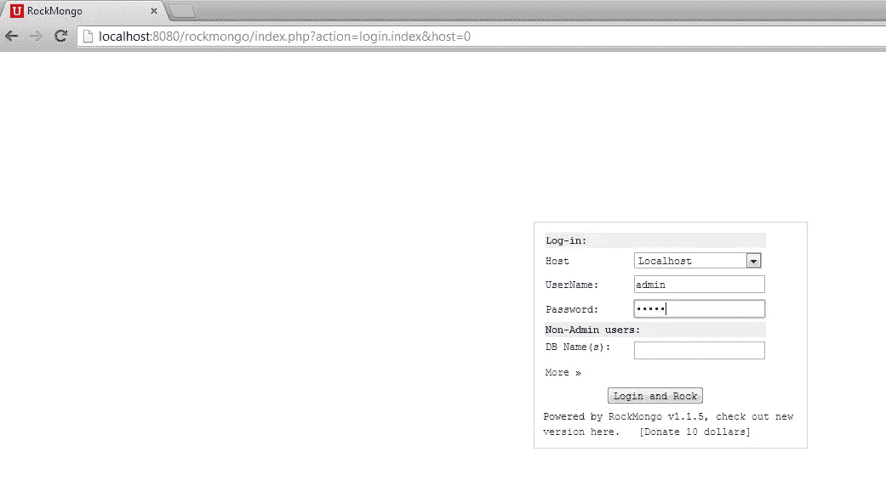
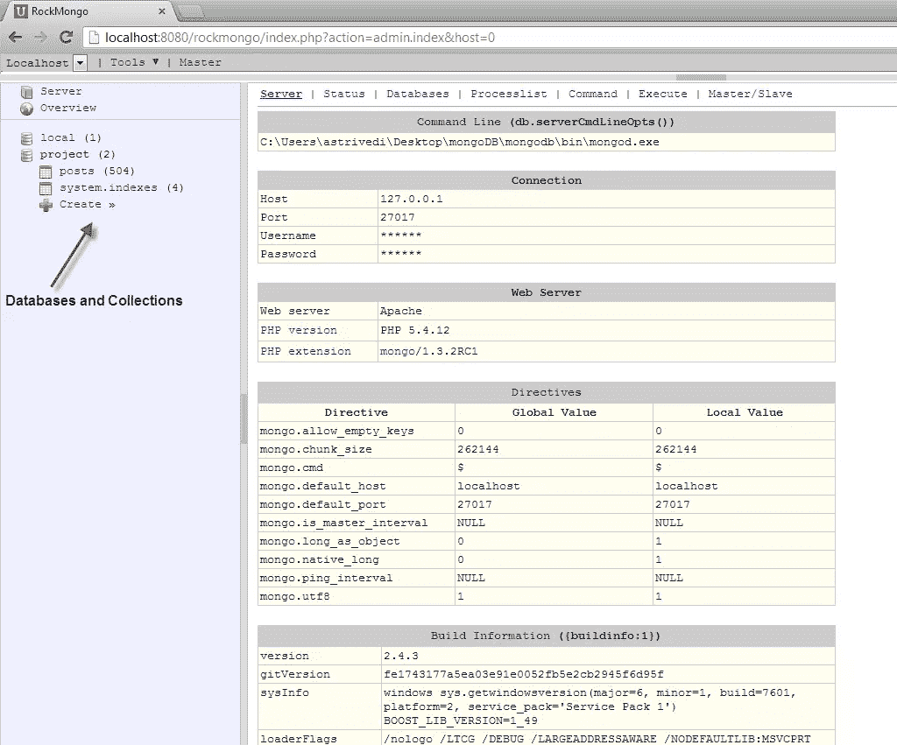
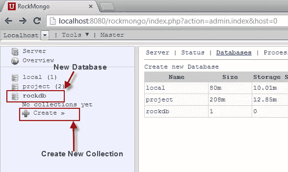
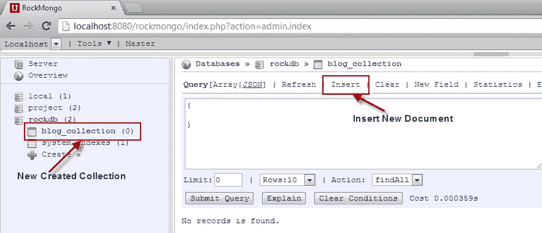
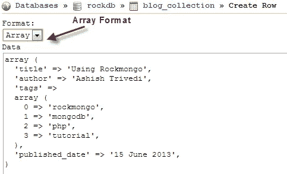
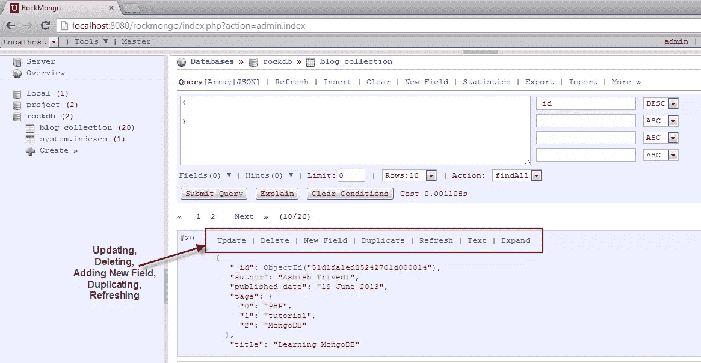
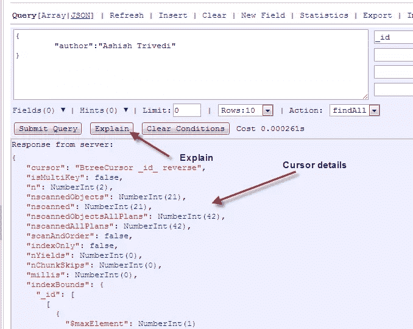
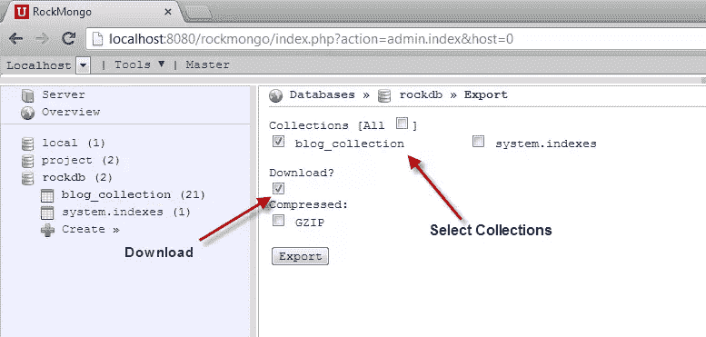

# 用于 PHP 驱动的 MongoDB 管理的 Rockmongo

> 原文：<https://www.sitepoint.com/rockmongo-for-php-powered-mongodb-administration/>

默认情况下，MongoDB 提供了基于 JavaScript 的交互式 mongo shell，可用于执行数据库操作。尽管这个 shell 可能是开始 MongoDB 查询的最佳方法，但是管理服务的 GUI 工具总是有用的。

有很多这样的 GUI 工具可用，比如 Rockmongo、PHPMoAdmin、Mango 的 Fang、UMongo、MongoExplorer 和 MongoVUE 等等。在基于 PHP 的项目中使用 MongoDB 时，Rockmongo 和 PHPMoAdmin 是很好的选择。在本文中，我们将了解一下 Rockmongo。

Rockmongo 是用 PHP5 编写的开源 MongoDB 管理工具。您将熟悉如何使用 Rockmongo 创建数据库、集合和文档、查询集合以及导入和导出数据。准备好了吗？

## 入门指南

运行 Rockmongo 的要求是:

1.  运行 PHP 的 web 服务器
2.  带有会话支持的 PHP 5.1.6 或更高版本
3.  MongoDB 的 php_mongo 扩展

一旦有了合适的环境，就可以从位于[rockmongo.com/downloads](http://rockmongo.com/downloads)的下载页面下载最新版本的 Rockmongo 了。

安装说明可以在 [Rockmongo Wiki](http://rockmongo.com/wiki/installation) 上找到，但是一般来说，你需要将下载的包解压到你站点的服务器根目录下的一个可访问的目录中，并将其重命名为 Rockmongo。打开 web 浏览器，从安装 Rockmongo 的位置访问 index.php 页面。

默认用户名和密码是“admin”和“admin”。如果您在安装过程中更改了密码，请输入适当的凭据。点击“登录和摇滚”，你将被重定向到 Rockmongo 应用程序的主页。

如您所见，主页列出了关于 MongoDB 服务器位置和连接、PHP Web 服务器和 MongoDB 设置的基本信息。左侧面板显示了数据库和集合的列表。

## 创建数据库和集合

Databases 选项卡列出了 MongoDB 服务器上所有可用的数据库。要创建新数据库，请在数据库选项卡上单击创建新数据库。

然后输入数据库的名称并单击 Create(我将把我的数据库命名为“rockdb”)。新创建的数据库将出现在左侧面板中。

要创建一个新的集合，单击左窗格中新数据库下的 create，并为该集合提供所需的名称(我将使用“blog_collection”)。

当您提供集合信息时，不要担心 Is Capped 字段。不检查它是安全的。

新的集合将出现在数据库下的左侧面板中。您可以单击集合来列出其中的所有文档。(注意，当您在数据库中创建第一个集合时，Mongo DB 会创建一个默认的 system.indexes 集合。)

## 插入文档

要插入文档，请单击插入选项卡，然后单击集合的名称。

我们可以将新的文档结构指定为 JSON 或 PHP 数组。选择哪种格式对形成的文档没有任何影响，这对开发人员来说只是一种安慰。

指定文档后，单击保存。同样，继续插入其他文档。

要查看集合中的文档，请单击左侧面板中的集合，您将在内容区域看到所有文档的列表。最近插入的记录将首先出现。

## 更新、删除和复制文档

您可以通过点击每个文档上提供的相应选项来更新、删除或复制任何文档。单击任何链接都会将文档带到编辑模式，您可以像前面一样在 JSON 或 PHP 中进行更改。

## 查询文档

查询数据库是任何数据库管理工具的重要功能之一。每当您单击一个集合时，您都会在页面顶部找到一个文本区域，用于对其运行查询。

像文档一样，查询表达式也可以指定为 JSON 或 PHP 数组。下拉列表中有三个可用的操作选项:查找全部、移除和修改。

*   **findAll:** 这是默认选项。指定查找条件，然后单击提交查询。匹配的文档将出现在搜索结果中。
*   **remove:** 这与 modify 类似，您只需指定选择文档的条件，但是该操作会从集合中删除匹配的文档。
*   **修改:**点击修改，会看到两个文本部分。第一部分是指定匹配文档的条件，另一部分是指定更新脚本。此功能可用于批量更新。

## 使用解释

这是 Rockmongo 最有用的特性之一，也可能是我最喜欢的一个。explain 查询经常用于分析查询及其索引用法。如下所示，您可以指定您的查找查询，然后单击解释按钮。这将给出查询的所有光标细节。

## 导入和导出数据库

当您想要备份数据库时，导入和导出功能非常有用。Rockmongo 中的导入/导出功能与 mongoimport 和 mongoexport 功能执行相同的任务。

若要导出数据库或集合，请单击“导出”选项卡。选中您想要导出的收藏的所有复选框。检查下载选项，然后点击导出。它将为您提供一个包含整个导出数据库的可下载 JavaScript 文件。

要在另一个数据库中导入数据，请转到该数据库并单击 import 选项卡。选择您刚刚下载的 JS 文件，整个数据集将被导入到数据库中。

## 结论

在 Rockmongo 中还有很多其他的特性，我相信一旦你开始使用它，你会想去探索的。在本文中，我只介绍了最常用的特性，以帮助您开始使用它。如果你有任何与文章相关的问题，欢迎发表你的评论！

<small>图片 via[Fotolia](http://us.fotolia.com/?utm_source=sitepoint&utm_medium=website_link&utm=campaign=sitepoint "Royalty Free Stock Photos at Fotolia.com")</small>

## 分享这篇文章